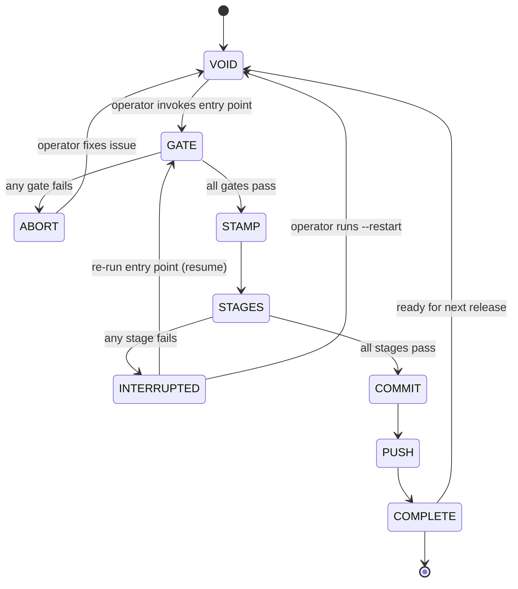
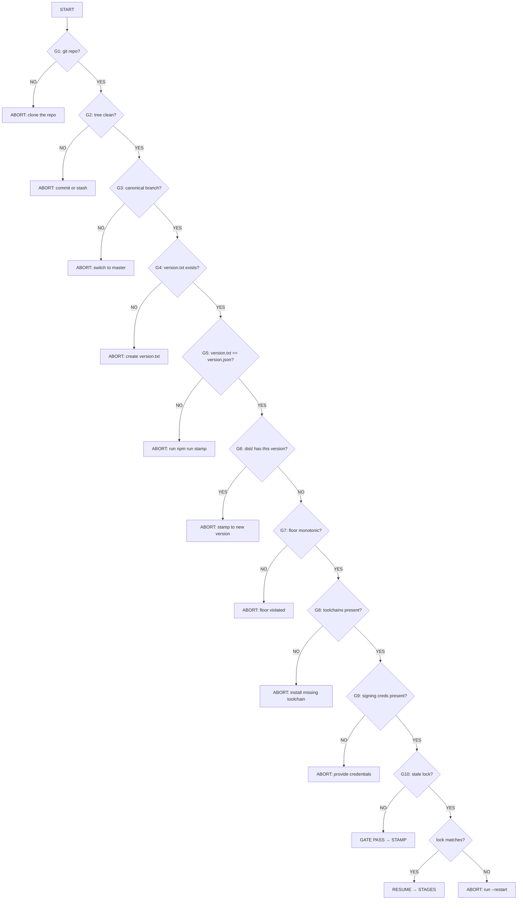
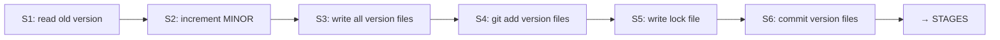
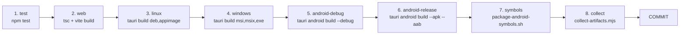
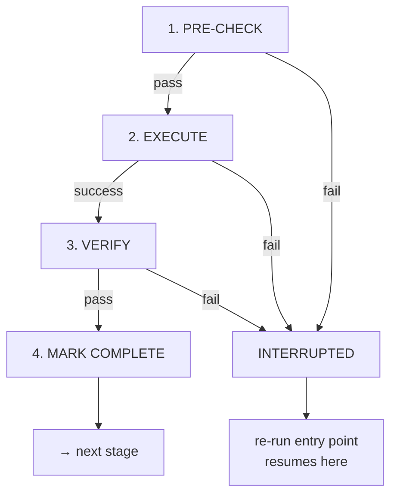
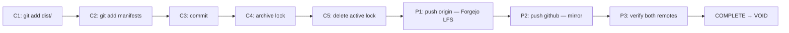
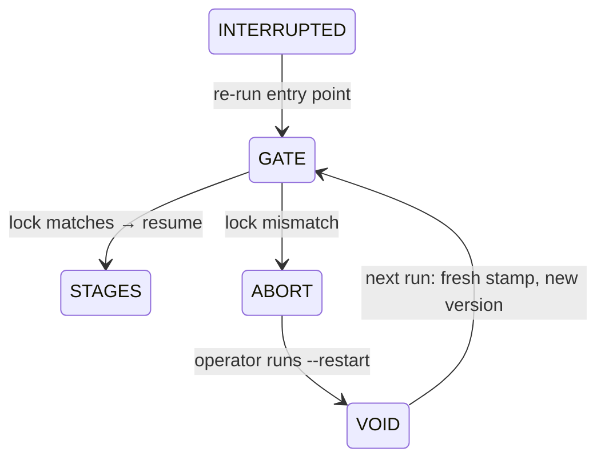
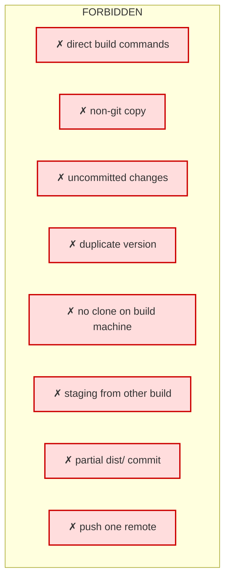
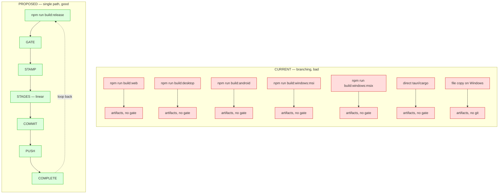

# Proposed Build Process — 1 Aug 2026

## Problem

The current build system has multiple entry points (`build:web`, `build:desktop`,
`build:android`, `build:windows:msi`, `build:windows:msix`, `build:windows:unstamped`,
`build:release`). Each is a fork point. An operator (or agent) can run any of them
independently, from any copy of the repo, at any version. This has caused:

- Building from a non-git file copy (no trace, no reproducibility)
- Rebuilding at the same version from a different copy (duplicate version.build)
- Editing source in a copy that doesn't get committed (divergent untracked state)
- Staging artifacts from a different build into an existing version's dist/
- Asking "which change belongs in the repo?" because the change was made in a copy

The root cause is structural: the build process branches. The fix is to make it
non-branching — one entry point, one path through, loop-back but never fork.

## Principle

> One entry point. One path through. Loop back, never fork.
>
> Language-agnostic: the entry point is whatever the project uses
> (`npm run build:release`, `make release`, `cargo xtask release`, `./build.sh`).
> The gate logic is the same regardless of language — it reads the repo, not the
> build system.

---

## ASCII: Release lifecycle (high level)

```
                         ┌─────────┐
                         │  VOID   │  no lock, no stamp, dist/ has no current artifacts
                         └────┬────┘  (may have older versions — floor is monotonic)
                              │
                              │ operator: "build a release"
                              ▼
                         ┌─────────┐
                         │  GATE   │  preconditions checked before anything runs
                         └────┬────┘
                              │ all gates pass
                              ▼
                         ┌─────────┐
                         │ STAMP   │  bump MINOR, write version to all files, write lock
                         └────┬────┘
                              │
                              ▼
                         ┌─────────┐
                         │ STAGES  │  test → web → linux → windows → android → symbols → collect
                         └────┬────┘
                              │ all stages pass
                              ▼
                         ┌─────────┐
                         │ COMMIT  │  git add dist/, commit, archive lock
                         └────┬────┘
                              │
                              ▼
                         ┌─────────┐
                         │  PUSH   │  origin (Forgejo LFS) + github (mirror)
                         └────┬────┘
                              │
                              ▼
                         ┌─────────┐
                         │ COMPLETE│  release done, repo clean, both remotes updated
                         └────┬────┘
                              │
                              └──→ back to VOID (ready for next release)
```

## Mermaid: Release lifecycle (high level)



---

## ASCII: Gate detail

```
  ┌─ GATE ──────────────────────────────────────────────┐
  │                                                      │
  │  G1  is this a git repo?              NO → ABORT     │
  │  G2  git working tree clean?          NO → ABORT     │
  │  G3  on the canonical branch?         NO → ABORT     │
  │  G4  version.txt exists?              NO → ABORT     │
  │  G5  version.txt == version.json?     NO → ABORT     │
  │  G6  dist/ has this version already?  YES → ABORT    │
  │  G7  dist/ floor monotonic?           NO → ABORT     │
  │  G8  required toolchains present?     NO → ABORT     │
  │  G9  signing credentials present?     NO → ABORT     │
  │  G10 stale lock from prior run?       YES → RESOLVE  │
  │                                                      │
  │  any ABORT → explain exactly what to fix, stop       │
  │  G10 RESOLVE → match? resume / mismatch? → VOID      │
  └──────────────────────────────────────────────────────┘
```

## Mermaid: Gate detail



---

## ASCII: Stamp detail

```
  ┌─ STAMP ─────────────────────────────────────────────┐
  │                                                      │
  │  Source: ~/Admin-Manual/Admin-Manual-Compendium.md   │
  │  § Build Conventions → § Versioning (subsection)    │
  │  Project copy: scripts/stamp-version.mjs (Node port  │
  │  of the compendium's update-version.sh — do not      │
  │  fork, do not modify)                                │
  │                                                      │
  │  S1  read old version from version.txt               │
  │  S2  increment MINOR, keep MAJOR                     │
  │  S3  write version to all version files:             │
  │        version.txt                                   │
  │        version.json                                  │
  │        package.json                                  │
  │        package-lock.json                             │
  │        src-tauri/tauri.conf.json                     │
  │        src-tauri/Cargo.toml                          │
  │        (versionCode = MAJOR * 100000 + MINOR)        │
  │  S4  git add version files (staged)                 │
  │  S5  write lock:                                     │
  │        { version, sourceHead, startedAt, [] }        │
  │  S6  commit version files                            │
  │                                                      │
  │  lock now exists → release is "in progress"          │
  └──────────────────────────────────────────────────────┘
```

## Mermaid: Stamp detail



---

## ASCII: Stages (linear pipeline)

```
  ┌─ STAGES (linear, ordered, no branching) ───────────────────────────────┐
  │                                                                       │
  │  each stage:                                                          │
  │    1. pre-check  (can this stage run here?)                          │
  │    2. execute    (the actual build command)                          │
  │    3. verify     (did it produce expected output?)                   │
  │    4. mark       (mark complete in lock)                             │
  │                                                                       │
  │  ┌────────┐  ┌──────┐  ┌───────┐  ┌────────┐  ┌────────────┐         │
  │  │ 1. test│→│2. web│→│3.linux│→│4.windows│→│5.android-d  │         │
  │  └────────┘  └──────┘  └───────┘  └────────┘  └─────┬──────┘         │
  │                                                      ▼               │
  │  ┌────────────┐  ┌─────────┐  ┌────────┐                            │
  │  │6.android-r│→│7.symbols│→│8.collect│→ COMMIT                     │
  │  └────────────┘  └─────────┘  └────────┘                            │
  │                                                                       │
  │  STAGE 1: test                                                        │
  │    pre:    tests exist                                                │
  │    exec:   npm test                                                  │
  │    verify: exit 0, all pass                                          │
  │                                                                       │
  │  STAGE 2: web                                                         │
  │    pre:    vite installed                                             │
  │    exec:   tsc -b && vite build                                      │
  │    verify: dist-web/ has index.html                                 │
  │                                                                       │
  │  STAGE 3: linux                                                       │
  │    pre:    on Linux, tauri installed                                  │
  │    exec:   tauri build --bundles deb,appimage                        │
  │    verify: .deb and .AppImage exist in target/                      │
  │                                                                       │
  │  STAGE 4: windows                                                     │
  │    pre:    on Windows, MSVC installed                                │
  │    exec:   tauri build (MSI + MSIX + standalone)                     │
  │    verify: .msi, .msix, .exe exist in target/                       │
  │                                                                       │
  │  STAGE 5: android-debug                                               │
  │    pre:    Android SDK + NDK installed                               │
  │    exec:   tauri android build --debug --apk                         │
  │    verify: debug APK exists                                          │
  │                                                                       │
  │  STAGE 6: android-release                                             │
  │    pre:    keystore.properties present                               │
  │    exec:   tauri android build --apk --aab                           │
  │           (CARGO_PROFILE_RELEASE_STRIP=false)                       │
  │    verify: release APK + AAB exist                                  │
  │                                                                       │
  │  STAGE 7: symbols                                                     │
  │    pre:    stage 6 complete, .so files unstripped                    │
  │    exec:   package-android-symbols.sh                               │
  │    verify: native-debug-symbols.zip exists                          │
  │                                                                       │
  │  STAGE 8: collect                                                     │
  │    pre:    all prior stages complete                                 │
  │    exec:   collect-artifacts.mjs                                     │
  │    verify: dist/ has full artifact set                              │
  │            manifest.json hashes match files                         │
  │                                                                       │
  │  any stage FAIL → release is INTERRUPTED                             │
  └───────────────────────────────────────────────────────────────────────┘
```

## Mermaid: Stages (linear pipeline)



---

## ASCII: Stage internals (every stage)

```
  ┌─ STAGE N ────────────────────────────────────────────┐
  │                                                      │
  │  1. PRE-CHECK                                        │
  │     ├─ platform correct? (Linux/Windows/Android)    │
  │     ├─ toolchain installed?                          │
  │     ├─ credentials present? (if signing)            │
  │     └─ prior stage marked complete?                  │
  │     FAIL → INTERRUPTED (stage not marked)            │
  │                                                      │
  │  2. EXECUTE                                          │
  │     └─ run the build command (inherited stdio)       │
  │     FAIL → INTERRUPTED (stage not marked)            │
  │                                                      │
  │  3. VERIFY                                           │
  │     └─ expected artifact exists + non-empty?        │
  │     FAIL → INTERRUPTED (stage not marked)            │
  │                                                      │
  │  4. MARK                                             │
  │     └─ append stage name to lock.completedStages    │
  │                                                      │
  └──────────────────────────────────────────────────────┘
```

## Mermaid: Stage internals



---

## ASCII: Commit + Push + Complete

```
  ┌─ COMMIT ────────────────────────────────────────────┐
  │  C1  git add dist/ (LFS artifacts)                  │
  │  C2  git add dist/manifest.json, dist/rubric-runs/   │
  │  C3  commit: "v<version>: release artifacts"        │
  │  C4  archive lock → dist/rubric-runs/                │
  │  C5  delete active lock                             │
  └──────────────────────────────────────────────────────┘
        │
        ▼
  ┌─ PUSH ──────────────────────────────────────────────┐
  │  P1  git push origin master (Forgejo — LFS)        │
  │  P2  git push github master (mirror — code only)    │
  │  P3  verify both remotes have the commit             │
  └──────────────────────────────────────────────────────┘
        │
        ▼
  ┌─ COMPLETE ──────────────────────────────────────────┐
  │  release is done. dist/ has the full set.            │
  │  repo is clean. both remotes updated.               │
  │  → back to VOID (ready for next release)             │
  └──────────────────────────────────────────────────────┘
```

## Mermaid: Commit + Push + Complete



---

## ASCII: Loop-back transitions (never fork)

```
  INTERRUPTED → re-run entry point
    │
    ├─ G10: lock exists, matches current version+HEAD?
    │   ├─ YES → resume at first incomplete stage (LOOP BACK)
    │   └─ NO  → ABORT: "lock mismatch — run --restart"
    │
  INTERRUPTED → operator runs --restart
    │
    ├─ lock moved to ~/outbox/
    ├─ back to VOID
    └─ next run: fresh stamp → new version
    │
  any ABORT → operator fixes the issue → re-run entry point
    │
    ├─ gates re-checked from scratch
    └─ no partial state survives
```

## Mermaid: Loop-back transitions



---

## ASCII: Forbidden paths (do not exist)

```
  ✗ direct tauri/cargo/cmake/npm build commands
  ✗ building from a non-git copy
  ✗ building with uncommitted changes
  ✗ building at a version that already has dist/ artifacts
  ✗ building on a different machine without cloning
  ✗ staging artifacts from a different build
  ✗ committing dist/ without the full set
  ✗ pushing without both remotes
```

## Mermaid: Forbidden paths (what NOT to do)



---

## ASCII: Current vs Proposed

```
  CURRENT (branching — bad):

    npm run build:web ──────────────→ vite build
    npm run build:desktop ──────────→ tauri build
    npm run build:android ──────────→ tauri android build
    npm run build:windows:msi ──────→ tauri build --bundles msi
    npm run build:windows:msix ────→ build-windows-msix.sh
    npm run build:windows:unstamped→ build-windows.sh
    npm run build:release ─────────→ release-state.mjs (stages)
    tauri android build (direct) ─→ bypasses everything
    copy files to Windows, build ──→ no git, no gate, no trace

    Each path produces artifacts.
    No shared gate. No shared version check.
    Same version can be built N times from N paths.
    Copies diverge. Duplicates accumulate.


  PROPOSED (single path — non-branching):

    npm run build:release  ← the ONLY entry point
      │
      ▼
    GATE → STAMP → STAGES (linear) → COMMIT → PUSH → COMPLETE
      │                                            │
      └── loop back (resume or restart) ──────────┘

    No other build scripts exist.
    No direct compiler/cmake/cargo/npm bypass.
    One repo, one path, one version per build.
```

## Mermaid: Current vs Proposed



---

## Current state (1 Aug 2026) and immediate next action

v1.25.59353 already exists in dist/ (web, Linux, Windows MSI/MSIX/standalone).
It was committed and pushed to both remotes. The Android APK/AAB were then built
separately from a non-git file copy at the same version — a duplicate build event.

The Android artifacts cannot be staged as v1.25.59353. The gate (G6) would
catch this: dist/ already has v1.25.59353 artifacts.

### What must happen

1. The duplicate Android APK/AAB in dist/ must be moved to ~/outbox/ (not deleted)
2. The next build stamps to a new version (MINOR 26 → v1.26.xxxxx)
3. The full release set is built at the new version through the single pipeline
4. v1.25.59353 remains in dist/ as a partial release (no Android) — it is the floor

### Why v1.25.59353 stays as-is

- It was committed and pushed. Rewriting it would break both remotes.
- It is a valid partial release (web + Linux + Windows). Android was missing.
- The floor must be monotonic: v1.18.35665 < v1.24.37311 < v1.25.59353 < v1.26.xxxxx
- The next release supersedes it with the complete set including Android.

## Implementation plan for StAndroidsMissal

### 0. Versioning — use the existing stamper, do not fork

Stamping is already solved: `~/Admin-Manual/Admin-Manual-Compendium.md` § Build Conventions → § Versioning defines the SOP,
`scripts/stamp-version.mjs` is the project's Node port. The pipeline calls it.
That's it. No new stamper, no modified logic, no re-explanation needed here.

### 1. Single entry point

`npm run build:release` is the only build command. It calls `release-state.mjs`,
which runs the gate, stamps (via the existing `stamp-version.mjs`), executes
stages linearly, collects, commits, pushes.

### 2. Remove fork points

Delete from `package.json`:
- `build:web`
- `build:desktop`
- `build:android`
- `build:windows:unstamped`
- `build:windows:msi`
- `build:windows:msix`

Keep:
- `build:vite` (internal, called by the web stage — not a user entry point)
- `build:release` (the single entry point)
- `build:all` (alias for `build:release`)

### 3. Gate inside the pipeline

The gate (`pre-build-gate.mjs`) runs inside `release-state.mjs` before the stamp
step. It is not a separate npm script — there is no way to run the gate without
running the full pipeline, and no way to run the pipeline without the gate.

### 4. Stage pre-checks and verification

Each stage in `release-state.mjs` gains:
- A pre-check (can this stage run on this platform with these tools?)
- A post-verify (did it produce the expected artifact?)

If a stage's pre-check fails, the release is INTERRUPTED with a clear message.
If a stage's verify fails, the release is INTERRUPTED — the stage is not marked
complete, and re-running resumes here.

### 5. Commit and push as stages

After `collect`, the pipeline commits dist/ and pushes to both remotes.
These are stages, not manual steps — the release is not complete until both
remotes have the commit.

### 6. No file copies

Windows builds run from a git clone on Windows, not from a file copy. The clone
has the same remotes (origin=Forgejo, github=GitHub). Source changes made on
Windows are committed and pushed from there. There is one repo, accessed from
multiple platforms, not multiple copies.

### 7. Language-agnostic note

For a C/C++ project, the entry point would be `make release` or
`cmake --build --preset release`. The gate logic is identical — it reads the
repo, checks git state, checks dist/. Only the stages change (cmake/make instead
of npm/tauri). The single-path principle is the same.
