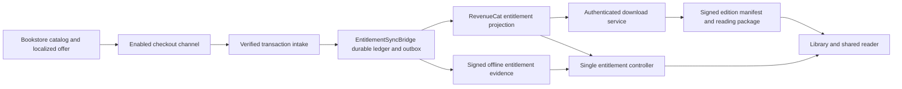

# Bookstore commerce and entitlements — research proposal

Date: 2026-09-13. Status: **proposed architecture, not an implemented purchase service or a live catalog**. Scope: public-domain Catholic editions and prayer collections used inside SanctissiMissa's shared reader. No checkout, products, payment accounts, or entitlements were created by this research.

This proposal preserves the supplied global requirements: RevenueCat is the runtime entitlement authority; feature gates consult one entitlement controller; direct commerce adapters feed a production-grade `EntitlementSyncBridge`. The donor `~/.claude/BILLING_CONVENTIONS.md` is absent on this host, and a targeted search of Admin-Manual's DOCS and PROJECTS did not find a promoted replacement. This report therefore does not invent additional central billing policy.

## Recommended product model

Keep **Library** as the user's acquired and imported reading collection, and **Bookstore** as discovery, previews, purchasing, and downloads. A book must open in the same reader whether it was bundled, bought individually, acquired free, or imported by the user. Highlighting, bookmarks, personal written annotations, and local voice annotations must not disappear when a cloud subscription ends.

Sell permanent curated **editions**, and permanent versioned **bundles of editions**, with optional recurring services sold separately. The value proposition is proofreading, reliable navigation and references, typography, integrated study aids, synchronized media, and convenient delivery. Product descriptions should identify the public-domain source and the added editorial work. Public-domain status itself is not an exclusive right being sold. An edition's territorial rights review must be complete before it can become purchasable; the age of its author is insufficient evidence for a modern translation, score engraving, or recording.

| Proposed purchase | What the buyer receives | Expiration rule |
|---|---|---|
| Free starter collection | Selected editions/prayers; no paid unlock required | No expiry |
| Individual edition | A named edition, its supplied files, reader integration, and documented corrections | Permanent unless that transaction is reversed; no cloud subscription dependency |
| Versioned author/category bundle | The exact edition IDs and revisions listed at purchase | Permanent; later books are not silently added to the original commercial promise |
| Optional cloud service | Cross-device hosted storage, transcription allowance, or parish collaboration, if separately approved | Ends at the paid-through date, with an explicit grace policy |
| Parish purchase | Explicit covered account/seat count and editions or services | Permanent content and recurring services remain separate; no assumed unlimited congregation license |
| Support contribution | Support without making the same content payable twice | Must not be disguised as an entitlement purchase or vice versa |

RevenueCat supports non-consumable purchases and permanent entitlements. Its current Android note requires SDK 7.11.0 or later for actual non-consumable behavior; older SDKs consume one-time purchases. Platform server notifications are needed to receive one-time refunds on most stores. [RevenueCat non-subscription purchases](https://www.revenuecat.com/docs/platform-resources/non-subscriptions).

Prices should remain **unpublished proposal data** until edition quality, delivery costs, taxes, and the selected merchant channel are known. Do not present placeholder prices as an operating store. All prices shown by the shipping app must come from the enabled channel's localized offer, with permanent-versus-recurring terms visible before payment.

## What the named services actually do

| Option | Role | Fit for SanctissiMissa | Recommendation |
|---|---|---|---|
| RevenueCat + native store billing | Receipt validation, purchase tracking, products/offerings, customer entitlements | Good for native non-consumable editions and service subscriptions; does not supply the complete book catalog, reader, file store, or parish planner | Required entitlement layer; default mobile route |
| RevenueCat Billing + Stripe gateway | Web billing engine and checkout integrated with RevenueCat | Smallest proposed web purchase path; the app still owns catalog/editorial metadata and download delivery | First web/desktop integration unless an existing storefront dictates otherwise |
| WooCommerce + chosen payment gateway | Self-hosted storefront, categories/authors represented in product taxonomy, orders, coupons, downloadable files | Strong catalog and operator control; requires WordPress operations and a bridge from verified orders/refunds into RevenueCat | Preferred separate storefront if Robin wants an independently operated bookshop |
| Gumroad | Hosted digital storefront, sales, file delivery, optional license keys | Easy separate sales channel; account linking, verification, refunds, and entitlements still need the bridge | Optional later channel, not the app's runtime gate |
| Bidlr | **Unidentified from current public evidence** | Searches did not establish the exact product intended. An unrelated similarly spelled auction marketplace is not evidence about Bidlr | Adapter remains disabled until its exact URL or project identity and transaction/refund API are established |
| Stripe Checkout directly | Payment checkout; additional service billing available through Stripe Billing | Flexible direct route, but requires verified payment events and commerce operations | Use when a direct payment adapter is justified; avoid adding it in parallel with equivalent RC Billing work without a need |
| Paddle Billing through RevenueCat | Supported web billing engine with Paddle as merchant of record | A possible alternative when merchant-of-record handling is desired; catalog eligibility must be confirmed | Evaluate after catalog/merchant acceptance; do not assume all public-domain ebook products are eligible |
| BTCPay Server | Optional direct payment route under the global convention | Could support a later alternative payment channel; must preserve the same edition entitlements | Deferred; requires an independently specified, verified adapter |

RevenueCat's current web documentation distinguishes RevenueCat Billing, Stripe Billing, and Paddle Billing. RevenueCat Billing uses Stripe as its gateway, while Paddle is a merchant of record. Its Web SDK is `@revenuecat/purchases-js`. These are payment options under the same entitlement model, not substitutes for the bookstore's editorial catalog. [RevenueCat web engines](https://www.revenuecat.com/docs/web/payment-integrations), [Web SDK](https://www.revenuecat.com/docs/getting-started/installation/web-sdk).

RevenueCat Billing explicitly supports auto-renewing subscriptions, consumable one-time purchases, and non-consumable one-time purchases. Choose **non-consumable** for a permanent book or bundle. [RevenueCat Billing product setup](https://www.revenuecat.com/docs/web/web-billing/product-setup).

WooCommerce supports protected delivery, post-payment access, download permissions, and customer download lists. Direct public URL redirects remain shareable; nginx requires actual protected-file configuration rather than relying on an Apache `.htaccess` file. For application reading packages, prefer one app-controlled delivery service to avoid Woo and the app disagreeing about which revision was supplied. Woo can deliver standalone export files if desired. [WooCommerce downloadable products](https://woocommerce.com/document/digital-downloadable-product-handling/).

Gumroad license verification returns purchase/refund/dispute state; checking `success` alone is insufficient. Repeated status checks should avoid incrementing the key's use count. Keys are a recovery/claim input, not an offline entitlement format for every app screen. [Gumroad license keys](https://gumroad.com/help/article/76-license-keys).

## One authority, several adapters

The following is a proposed logical flow; its names are domain vocabulary, not permission to code without a complete entity table and checklist.

Native purchases already processed by RevenueCat do not need a duplicate promotional grant. The bridge records and reconciles their lifecycle, then reads the resulting RevenueCat state. For a direct WooCommerce/Gumroad/other purchase, the bridge verifies the source transaction, records it, projects the derived access into RevenueCat, and reads back that projection before fulfilling access. A redirect return page or a client-supplied receipt string is never authority for a paid download.

The ledger preserves **why access is owed** and the durable transaction history. RevenueCat supplies the resolved **runtime access state**. A pending or failed projection must be visible as processing; a client must not bypass RevenueCat by interpreting its own order row as a license.

Use a stable, non-guessable account subject mapped to RevenueCat's App User ID across devices and channels. Do not use an email address or an arbitrary checkout URL parameter as the authority for account binding. Use the project's approved identity/recovery mechanism; this proposal does not introduce project-owned magic-link authentication. RevenueCat explicitly recommends opaque IDs and supports the same ID across platforms. [RevenueCat customer identity](https://www.revenuecat.com/docs/customers/identifying-customers).

For guest channel purchases, claim into an authenticated account through a short-lived, single-use claim produced by the server after verifying the sale. A gift has a distinct recipient claim. A license key already claimed by one account cannot silently transfer ownership to another; recovery/transfer policy must be explicit before launch. Restore purchases and order recovery must be reachable from Library and settings.

## Entitlement granularity and overlapping ownership

Use one stable entitlement per independently sellable edition, plus separate entitlements for recurring services. A versioned bundle maps to its fixed set of edition entitlements. RevenueCat products identify channel-specific offers; editorial work IDs, edition IDs, content revision IDs, and commercial product IDs are distinct fields. Product codes and prices must not leak into text anchors or annotation identity.

Do not create a single `bookstore_pro` entitlement that turns every purchase into access to the entire catalog. Do not gate the reader's annotation tools by payment processor. Confirm catalog scale, entitlement/product mapping limits, and SDK response size against the intended launch catalog before fixing the final mapping in architecture; this research did not verify a large live RevenueCat project.

The bridge stores each grant source separately, with account subject, provider, provider account, environment, sale/order and line-item IDs, edition/bundle revision, purchase state, effective period, refund amounts/state, and a unique idempotency key. Effective edition access is the union of its valid grant sources.

Example: a customer buys Haydock individually, then buys a Scripture bundle containing the same edition. Refunding the individual sale must not remove the bundle's coverage. Refunding one item in a multi-item order must not revoke unrelated items. A price-adjustment refund need not revoke access; provider-specific partial refund semantics must distinguish that from a canceled item.

RevenueCat's promotional revocation endpoint removes **all promotional grants for an entitlement and user**, not just one external sale. Therefore the bridge must recompute remaining direct grants before revoking and must serialize updates for each account/entitlement. Native store transactions remain separately managed. The API currently marks `duration` deprecated and documents explicit `end_time_ms`; the exact durable lifetime representation must be confirmed in a sandbox before a direct permanent grant implementation is committed. [RevenueCat grant/revoke API](https://www.revenuecat.com/docs/api-v1/entitlements).

Do not briefly revoke and regrant when a second valid grant already covers the same edition. An outbox with projection revisions, retries, and readback makes provider events recoverable when RevenueCat is unavailable. When a short-lived grant must be shortened, serialize replacement and suppress stale readback publication until reconciliation completes.

## Verification and reconciliation

Provider-specific verification matters:

- **RevenueCat:** enable HMAC signing, validate its timestamp and signature against the original raw body, and deduplicate by event ID. After a notification, fetch current subscriber state rather than deriving final access from arrival order. Current documentation also states that webhook retries eventually stop. [RevenueCat webhooks](https://www.revenuecat.com/docs/integrations/webhooks).
- **WooCommerce:** validate `X-WC-Webhook-Signature`, a base64 HMAC-SHA256 of the payload, with the configured secret; verify the expected store identity, then re-read order/line-item/refund state through the authenticated API. Do not grant on order creation or merely on payment authorization. Monitor disabled webhooks as well as failed deliveries. [WooCommerce webhook headers](https://developer.woocommerce.com/docs/apis/rest-api/v2/webhooks/), [WooCommerce webhook operations](https://woocommerce.com/document/webhooks/).
- **Gumroad:** the current first-party Ping documentation says the payload is **unsigned**, and directs consumers to read the sale back through the API. Treat a Ping as an untrusted wake-up hint; never grant from its fields directly. Subscribe to `refund`, `dispute`, `dispute_won`, and relevant subscription resources as well as sales. Verify seller, product, transaction status, and account claim server-side. The public pages did not render useful text in the retrieval tool, so their current first-party documentation source was consulted. [Gumroad Ping](https://gumroad.com/ping), [first-party Ping documentation source](https://github.com/antiwork/gumroad/blob/main/app/javascript/pages/Public/Ping.tsx), [resource-subscription documentation source](https://github.com/antiwork/gumroad/blob/main/app/javascript/components/ApiDocumentation/Endpoints/ResourceSubscriptions.tsx).
- **Other direct adapters:** specify their real signature scheme, settled-payment rules, refund/dispute lifecycle, API re-read, and reconciliation before enabling them. Do not assume an HMAC header exists merely because the common bridge supports HMAC.

Persist a verified event to durable storage before acknowledging it, then process asynchronously. Unsigned hints can be queued with rate limits, but must reach authenticated provider verification before entering the entitlement ledger. Handle duplicate deliveries, stale/out-of-order events, API timeouts, sandbox/production isolation, replay, and missed webhooks. Reconcile changed purchases routinely and periodically audit active ownership against each provider's authenticated records. Do not reapply an older sale event after a verified refund.

Required operating surfaces: service supervision, structured redacted logs, health/readiness endpoints, metrics for event lag and reconciliation drift, retry/dead-letter handling, a human-readable order/entitlement audit trail, and a documented repair operation that reprojects current verified state without inventing a purchase. Payment secrets, licenses, buyer email addresses, and raw confidential payloads must not be copied into ordinary logs.

## Offline delivery and personal data

Payment validation and file delivery are separate operations. The authenticated delivery endpoint checks current RevenueCat access, then issues a short-lived URL for a versioned artifact. Each package has a signed manifest with edition ID, revision, file sizes/hashes, rights metadata, text-anchor scheme version, and minimum reader compatibility. Installation verifies hashes/signature and completes atomically; an interrupted download does not replace the previous working edition.

Signed offline evidence is issued only from server-verified RevenueCat state. The app verifies it with a public key; signing keys stay on the server. Include account subject, edition/service entitlement, issue time, evidence revision, signing key ID, and expiry only where the underlying right expires. Keep owned edition evidence durable; service leases have a defined refresh horizon and cannot exceed the effective paid-through date except for an explicitly specified grace period. Raw SDK cache serialization is not a portable, signed license format. RevenueCat's SDK does cache entitlement information, but updates require an outbound request; a backend change is not pushed instantly into an offline device. [RevenueCat CustomerInfo and caching](https://www.revenuecat.com/docs/customers/customer-info).

There is an unavoidable product tradeoff: a permanently usable offline copy cannot simultaneously offer immediate remote revocation while disconnected. Proposed policy: keep downloaded owned books usable offline; apply verified refund revocation to future downloads and managed access at the next successful reconciliation. Do not claim remote deletion of exported files. Keep the customer's annotations and recordings recoverable/exportable even if the corresponding commercial entitlement is revoked. A network outage must not look like a refund.

Book text and personal reading data use separate stores and lifecycles. Content corrections preserve stable anchors or ship an explicit migration map. A package replacement, refund, logout, or subscription expiry must not delete personal highlights, comments, bookmarks, and voice recordings. Public-domain imports use the same reader capabilities, with rights/source provenance retained.

## Distribution-channel gate

The enabled checkout is chosen by distribution channel and storefront eligibility, not merely by operating system or language. The default Play build uses Play Billing via RevenueCat; direct/sideload builds can expose approved direct commerce adapters under a build flag. Google currently provides country/program-specific alternatives, so a universal external checkout button is not a valid default. [Google Play Payments policy](https://support.google.com/googleplay/android-developer/answer/9858738?hl=en).

If an App Store build is added, default to Apple's in-app purchase path through RevenueCat. Apple's current rules contain reader-app, multiplatform, storefront, and external-link distinctions; the presence of books does not prove this broader missal/recording/planning app qualifies for every reader-app exception. Decide its actual channel configuration before exposing an external call to action. [Apple App Review Guidelines, 3.1](https://developer.apple.com/app-store/review/guidelines/#payments).

These are current design constraints, not an assertion that an unsubmitted app has store approval. Recheck them at submission time.

## Required architecture decisions before coder dispatch

1. Commit exact edition, bundle, commercial offer, account/claim, ledger, projection, license, and manifest schemas into the project entity table, with exact target paths and signatures. This proposal is not a substitute for that contract.
2. Choose the first web checkout route and identify Bidlr precisely if it is to be included. Catalog navigation can be complete before payment accounts go live.
3. Resolve permanent grant representation and restore/account-transfer behavior in RevenueCat, including overlapping direct/native grants and bundles. Bind one central entitlement controller across every reader surface.
4. Set signed manifest/license format, key rotation, content update/annotation-anchor policy, refund/partial-refund policy, and documented offline behavior.
5. Complete rights and editorial quality review per sellable edition, prayer collection, score, and recording. Set actual territories, currency/localized offers, and permanent-versus-recurring sales terms.
6. Turn the contract into idempotent tests: authenticated versus spoofed intake; duplicate/out-of-order sale/refund; partial refunds; two valid sources for one book; subscription expiry preserving owned books; failed projection/reconciliation recovery; cross-device restore; corrupt/interrupted package rejection; annotation preservation; and offline behavior with a controlled clock. Live merchant/device checks belong in an operator verification protocol, not repeatable checklist acceptance clauses.

Research outcome: **RevenueCat plus one initial web checkout channel is sufficient for the proposed ownership model. WooCommerce and Gumroad can be added as adapters; they should never create separate feature-gating paths.** The edition catalog, shared reader, rights evidence, delivery service, and practical parish features remain SanctissiMissa responsibilities.
