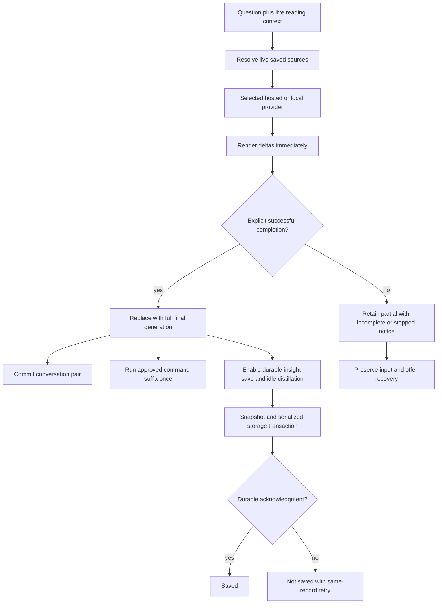
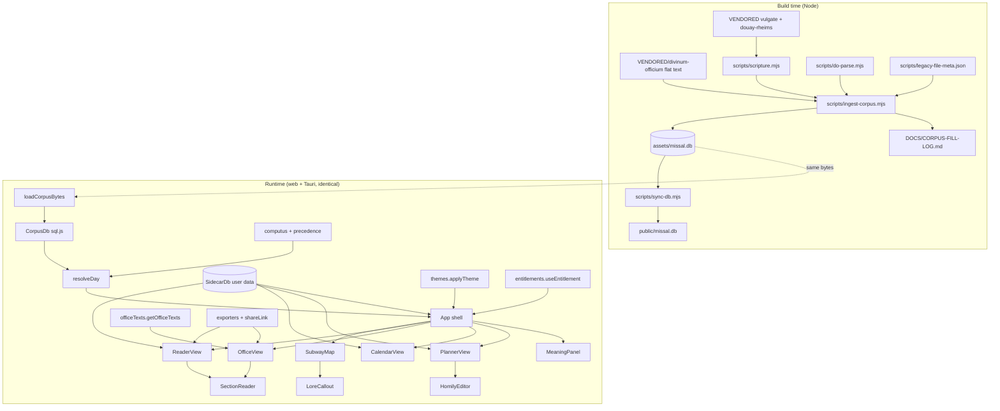

# SanctissiMissa — proposed complete architecture snapshot

This is a discussion candidate for the finished product. It incorporates the full current master document and its adopted feature contracts below, with one controlling reliability specification. It does not replace the active architecture, approve pending feature waves, or certify implementation. Its matching recipe is [CHECKLIST.md](CHECKLIST.md). Historical implementation observations remain dated evidence, not target-state acceptance.

## Snapshot reconciliation and approval boundary

| Area | Final-state authority in this candidate | Reconciliation |
|---|---|---|
| Durable sidecar writes/read failures | LG.01 below | Supersedes any inherited direct-write or error-as-absence implication; current schema and storage identity retained |
| Native model integrity | LG.02 | Every computed digest is compared; marker and metadata alone cannot establish ready |
| Generation lifecycle | LG.03 and LG.06 | Real-time deltas, whole-final replacement and explicit completion; no success inferred from partial text |
| Functional lore and recall | LG.04 and LG.06 | Completes inherited §H.2 with live source resolution and bounded readable content |
| Insight/editor/settings persistence | LG.01, LG.05 and LG.06 | Saved means acknowledged storage; retries retain intended data |
| Public assistant nomenclature | LG.06 | Proposed Liturgical Guide / Guide; inherited technical Companion identifiers stay compatible |
| HTML/export hardening | Deferred by operator | No sanitizer, CSP, export-policy or hardening task is authorized in this wave |
| Existing Mass/Office/Bible, corpus, identity, themes, reader, billing, Library/Bookstore/Chant, About and release contracts | Retained product specification and embedded adopted contracts | No new implementation signoff, entitlement rule, stack switch, release or deployment implied |
| Pending §H command/tour waves and §I orientation non-occlusion | Retained with their existing explicit approval status | Only the reliability changes listed above are reconciled here; pending unrelated tasks remain on hold |
| Android JNI / browser WASM analysis proposals | Existing separate proposals | No adoption or execution inferred from this reliability candidate |

For overlapping statements, the six LG contracts control only their named behavior. A later source-baseline change requires a recorded reconciliation before dispatch; approval is bound to the two proposal hashes, not merely filenames. The active architecture has pre-existing working changes; this snapshot preserves those bytes in the retained specification and does not stage them.

## Product intent and public vocabulary

The Liturgical Guide assists with finding, reading and studying the Traditional Latin Mass, Divine Office, Scripture and the reader's saved material. It can explain the current interface and execute the already-approved constrained guide commands after a complete answer. It neither represents clergy nor confers ecclesiastical authority. The name describes the software's function and avoids implying a personal spiritual relationship. Public copy changes; persisted identity and technical APIs do not.

The user's saved journal, insights and lore remain a central product capability: retrieval means the model receives relevant live text with source attribution. Durable saving and reliable subsequent retrieval are one connected user journey, not independent cosmetic features.

## Principal flows



Native write flow: immutable bytes → serialized staging write → file flush → atomic same-directory replacement → platform durability acknowledgment. Load selects current data first and attempts legacy only on genuine absence. Browser storage uses transaction completion. Failure after replacement can mean unknown commit status; it never licenses creating an empty replacement database.

## Design reference and limits

This wave corrects the existing chat/picker/editor/settings surfaces and their authored strings. It introduces no new screen or journey. Preserve current styling, controls, keyboard access and accessible names; the existing brownfield design reference applies. Mobile SDLC controls/widgets requested by the operator belong to the Admin-Manual process lab, not to the SanctissiMissa product UI.

CodeGraph provided source identities and relevant call paths. Markdown contracts, package.json and Cargo.toml are demonstrated parser-coverage gaps and were read directly for specification. New-file line 1 below is an insertion anchor; existing line numbers identify the reviewed baseline, with symbol identity authoritative after edits.

## Entity vocabulary and implementation ownership

| Exact entity | Target file:line | Role / signature / fields | Engaged by |
|---|---|---|---|
| `InferenceCompletion` | `src-tauri/src/inference.rs:1` | serde-serializable text:String,reason:String; stop/length/cancelled | LG.03 |
| `inference_generate` | `src-tauri/src/inference.rs:221` | existing IPC args; Result<InferenceCompletion,String> on all cfg branches | LG.03 |
| `CompanionMemory.distill` | `src/core/companion/memory.ts:99` | (turn:{question:string,answer:string},id?:string):Promise<string>; stable-ID upsert | LG.04 |
| `SidecarDb.open` | `src/core/accompaniment/store.ts:193` | static ():Promise<SidecarDb>; one shared live handle, reset rejected initialization | LG.01 |
| `sidecarOpenPromise` | `src/core/accompaniment/store.ts:184` | module-scoped Promise<SidecarDb> / null; factory ownership | LG.01 |
| `SidecarDb.persist` | `src/core/accompaniment/store.ts:221` | ():Promise<void>; synchronous immutable snapshot, queued durable acknowledgment | LG.01 |
| `SidecarDb.importBytes` | `src/core/accompaniment/store.ts:236` | (bytes:Uint8Array):Promise<void>; validate, serialize and commit before handle swap | LG.01 |
| `SidecarDb.persistenceState` | `src/core/accompaniment/store.ts:184` | readonly state getter; requestedRevision,durableRevision,status,error | LG.01 |
| `load_sidecar` | `src-tauri/src/lib.rs:43` | Result<Option<Vec<u8>>,SidecarReadError>; absence distinct from failure | LG.01 |
| `save_sidecar` | `src-tauri/src/lib.rs:59` | existing IPC args; Result<(),SidecarWriteError> | LG.01 |
| `SidecarReadError` | `src-tauri/src/sidecar_store.rs:1` | serde::Serialize + Debug; stage,message | LG.01 |
| `SidecarWriteError` | `src-tauri/src/sidecar_store.rs:1` | serde::Serialize + Debug; stage,message,commitState | LG.01 |
| `write_sidecar_snapshot` | `src-tauri/src/sidecar_store.rs:1` | (path:&Path,bytes:&[u8])->Result<(),SidecarWriteError> | LG.01 |
| `replace_sidecar_file` | `src-tauri/src/sidecar_store.rs:1` | (staging:&Path,live:&Path)->std::io::Result<()>; platform cfg implementations | LG.01 |
| `model_lookup` | `src-tauri/src/model_store.rs:63` | existing IPC args and missing/corrupt/ready result | LG.02 |
| `file_sha256` | `src-tauri/src/model_store.rs:41` | (path:&Path)->Result<(String,u64),String> | LG.02 |
| `verify_model_object` | `src-tauri/src/model_store.rs:57` | (path:&Path,expected_sha256:&str,expected_bytes:u64)->Result<bool,String> | LG.02 |
| `TokenEvent` | `reusable-chatbot/core/engine-types.ts:17` | text,tokenId?,completion?; full completion text and closed reason set | LG.03 |
| `GenerationResult` | `reusable-chatbot/core/engine-types.ts:17` | text,status,reason; closed discriminants in LG.03 | LG.03, LG.06 |
| `GenerationFailure` | `reusable-chatbot/core/engine-types.ts:17` | Error subclass; constructor(reason:GenerationResult["reason"],partialText:string,message:string) | LG.03 |
| `ChatController.generate` | `reusable-chatbot/core/chat-controller.ts:40` | existing input arguments; AsyncIterable<TokenEvent>; stage history until successful completion | LG.03 |
| `ChatController.useEngine` | `reusable-chatbot/core/chat-controller.ts:22` | existing signature; replace engine while retaining history | LG.03 |
| `ChatController.close` | `reusable-chatbot/core/chat-controller.ts:65` | existing signature; release engine resources, preserve history | LG.03 |
| `ChatController.reset` | `reusable-chatbot/core/chat-controller.ts:60` | existing signature; explicit history reset | LG.03 |
| `MemoryHit` | `src/core/companion/memory.ts:27` | refId:string,score:number | LG.04 |
| `ResolvedMemoryHit` | `src/core/companion/recall.ts:1` | MemoryHit plus source,title,text,updatedAt,provenance,anchors | LG.04 |
| `resolveMemoryHit` | `src/core/companion/recall.ts:1` | (db:Database,hit:MemoryHit):ResolvedMemoryHit / null | LG.04 |
| `formatRecallContext` | `src/core/companion/recall.ts:1` | (hits:ResolvedMemoryHit[]):string; complete records within 6000 UTF-8 bytes | LG.04 |
| `CompanionMemory.recall` | `src/core/companion/memory.ts:81` | (query:string,k=5):ResolvedMemoryHit[] | LG.04 |
| `InsightSaveState` | `src/core/companion/insight.ts:1` | status,recordId,error; unsaved/saving/saved/failed | LG.05, LG.06 |
| `saveInsightDurably` | `src/core/companion/insight.ts:1` | (sidecar:SidecarDb,record:Accompaniment):Promise<string> | LG.05 |
| `AccompanimentEditor.doSave` | `src/ui/AccompanimentEditor.tsx:111` | existing handler; ordered save acknowledgment and retry | LG.05 |
| `SettingsView` | `src/ui/SettingsView.tsx:1` | existing component; explicit persistence outcome | LG.05 |
| `GUIDE_LABELS` | `src/core/chat/guide-labels.ts:1` | readonly public label object; name,shortName,open,prepare,explain,retry,returnToMissal,saveInsight,saving,saved,saveFailed,highlighted(label),unavailable | LG.06 |
| `ProviderReadiness` | `src/core/chat/guide-labels.ts:1` | kind,configured,available,requiresDownload,downloaded | LG.06 |
| `canRetryGuide` | `src/core/chat/guide-labels.ts:1` | (engineState,readiness:ProviderReadiness):boolean | LG.06 |
| `ChatView` | `src/ui/ChatView.tsx:1` | existing component; recovery/live/final/save state owner | LG.06 |
| `companionSystemContext` | `src/ui/ChatView.tsx:369` | existing context assembly; resolved text rather than UUID-only references | LG.06 |

Existing provider class names, constructor arguments, native IPC names, SidecarDb schema and Accompaniment fields remain the inherited interfaces. Provider implementations and fixture files named in LG.03 implement the extended TokenEvent; no new provider is introduced. Every new exported entity in this wave is listed above.

## Finished-state contracts

The following contracts are normative descriptions of the proposed end state. They are repeated in the recipe so a coder does not need to read architecture or infer missing decisions.

### LG.01 — Durable sidecar persistence

Keep the existing sidecar location, IPC command names and SQLite schema. Extract native file operations into sidecar_store.rs and route lib.rs commands through it. load_sidecar returns Result<Option<Vec<u8>>, SidecarReadError>: only io::ErrorKind::NotFound permits current-to-legacy fallback, and only absence at both paths returns None. Permission, directory-as-file, invalid bytes and other I/O failures propagate; never initialize a new empty database after a failed read. SQL parsing remains in SidecarDb.open and must fail visibly without overwriting unreadable data.

SidecarDb.persist(): Promise<void> copies db.export() synchronously at invocation, assigns a monotonic revision, and enqueues that immutable byte snapshot behind the per-instance tail. One rejected write rejects its own caller but is caught on the scheduling tail so later explicit saves can run. Each call resolves only when its own snapshot is committed; no older completion can clear a newer pending/failed revision. persistenceState is {requestedRevision:number,durableRevision:number,status:'idle'|'saving'|'saved'|'failed',error:string|null}; saved requires requestedRevision===durableRevision. It is in-process metadata, not a schema migration. idbPut resolves only on transaction complete; retain that existing behavior. importBytes validates the candidate without replacing the current handle, queues its bytes on the same serialization lane, and swaps the live handle only after successful persistence; ordinary mutations are suspended during import and reported as an import-in-progress error, not silently lost. After a failed import, retain the old handle and database.

Native writes take a process-wide mutex covering staging, flush, replacement and final durability acknowledgment. The supported sidecar has one app writer process; multi-process merge/synchronization is outside this change. Use a unique sibling sidecar.db.staging.<pid>.<counter> opened with create_new. write_all then sync_all before replacement. On Unix rename in the same directory, then open and sync_all the parent directory. On Windows call MoveFileExW with MOVEFILE_REPLACE_EXISTING|MOVEFILE_WRITE_THROUGH (UTF-16 NUL-terminated paths; kernel32 FFI inside cfg(windows)); no delete-then-rename fallback. Native error fields are {stage:'read'|'create'|'write'|'flush'|'replace'|'sync-directory',message:string,commitState:'not-committed'|'unknown'}. Read errors use {stage:'read',message:string}. Failures before replacement leave the live snapshot byte-identical. A post-replacement directory-sync failure returns unknown commit state, not a false rollback claim; next load accepts a valid old or new complete snapshot. Staging files are never promoted by load; retain failed staging for diagnosis and do not delete unrelated files. Lost power guarantees remain limited by the underlying filesystem/storage, and platform qualification is recorded separately.

Tests exercise A/B overlapping saves, failure then retry, IndexedDB transaction abort, import ordering, missing versus denied native read, failure injection before and after replacement, complete old/new reopen and no partial live bytes. Rust unit tests live in sidecar_store.rs and use isolated target/test-data directories. No new runtime dependency is required.

Review clarification: native load returns unvalidated bytes; invalid SQLite bytes are a distinct SidecarDb.open validation failure, not an io::ErrorKind. Native and IndexedDB are mutually exclusive platform backends: exactly one backend commits per persist call, and the same JS serialization lane awaits either native durable acknowledgment or IndexedDB transaction completion. An unknown native commit outcome rejects that call, leaves durableRevision unchanged and sets failed; a later successful full-snapshot durable write establishes saved. Every explicit retry receives a new monotonic requestedRevision; only successful durable completion advances durableRevision to that retry revision. A readback alone cannot prove a missing disk flush succeeded. Reads during import continue on the old handle until swap; pre-import queued snapshots drain before the import snapshot. New ordinary mutations and explicit persist calls during import reject with import-in-progress. SidecarDb.open shares a module-scoped sidecarOpenPromise for the active storage target; rejected initialization clears it, successful opens reuse one live handle. Production callers use this factory; direct constructor use is restricted to independent test fixtures. Add tests proving simultaneous opens share a handle and failed initialization can retry.

### LG.02 — Compare every computed model digest

Remove REVERIFY_LIMIT and compare the computed digest for every native file size. Extract verify_model_object(path:&Path,expected_sha256:&str,expected_bytes:u64)->Result<bool,String>; it streams through file_sha256 once, returns false for either length or digest mismatch and propagates I/O failures. model_lookup retains its current missing/corrupt/ready response shape and metadata/marker checks, using corrupt reason "content digest mismatch" for same-length changed bytes. No path may report ready from marker, mtime or size alone. Keep the 1 MiB hash buffer and avoid a second pass inside one lookup. Do not add a metadata-only cache or hash the file on the UI thread. Existing checking state remains visible until lookup returns. Correctness has priority; current code already pays for a full hash, so removing the comparison cutoff adds no extra read pass. Add Rust tests in model_store.rs for valid and changed content at 64 MiB minus one, exactly 64 MiB, and 64 MiB plus one, including a same-length byte flip with unchanged catalogue metadata. Fixtures are generated deterministically into isolated target/test-data directories and are not committed as large binaries.

### LG.03 — Explicit stream completion and controller history

Extend TokenEvent compatibly to {text:string,tokenId?:number,completion?:{text:string,reason:'stop'|'length'|'cancelled'|'error'}}. Ordinary events contain text deltas and no completion. Exactly one successful terminal event has text:'' and completion containing the entire accumulated answer and reason:'stop'; it is yielded only after the provider has concluded without a later error. GenerationResult is {text:string,status:'complete'|'incomplete'|'cancelled'|'failed',reason:'stop'|'length'|'cancelled'|'error'|'unexpected-eof'|'empty'}. GenerationFailure extends Error with readonly reason and partialText fields. Do not infer success from received text or EOF.

Hosted SSE parser buffers complete events (including multi-line data fields), supports CRLF, comments and UTF-8 split across reads, and parses JSON inside try/catch. Malformed data is a protocol failure, never silently swallowed. Handle top-level error and choice.finish_reason; stop is the only successful reason for this text-only product. length is incomplete; content_filter, tool_calls and unknown non-null reasons are failures. Require a stop finish reason and stream terminator [DONE]; a terminator without a stop reason or EOF before terminator is unexpected-eof. Continue consuming after finish_reason until terminator so a late structured error overrides apparent success. Stream deltas immediately. On success, completion.text is the assembled whole generation. Abort never emits completion; throw GenerationFailure with cancelled reason. Empty/whitespace-only output fails. Cancel/release the reader in finally. Preserve current HTTP-status handling and configured fallback behavior.

Native adapter emits completion only after inference_generate resolves successfully and queued tokens drain, provided signal is not aborted; a failed invocation overrides prior text and closes the queue. WebLLM adapter captures finish_reason and requires stop plus a clean iterator end; update its structural SDK type accordingly. MockEngine emits the same terminal event; all provider fixtures and existing tests use the explicit contract.

ChatController.generate continues forwarding live events. Stage the new user/assistant pair; commit both to history only on successful explicit terminal completion. Error, abort, length and unmarked EOF commit neither. The retry uses the original input once, not duplicate history entries. useEngine closes/replaces the engine session while preserving committed history; close releases resources without erasing history; reset alone intentionally clears history. Caller session replacement uses an epoch so a late previous engine initialization cannot become current. Preserve existing public method signatures except the TokenEvent extension. No command execution or distillation occurs in the controller.

Native terminal reason is not inferred from a void IPC result. Add serde-serializable InferenceCompletion {text:String,reason:String}, with reason constrained at construction to stop|length|cancelled. Change both compiled and unavailable-stub inference_generate signatures to Result<InferenceCompletion,String>, retaining the command arguments. Accumulate exact emitted text; EOS yields stop, max token/context exhaustion yields length, cancellation yields cancelled. NativeRunnerProvider uses the returned full text and reason after queue drain; only stop is successful. Error still rejects. Preserve actual runtime context/output ceilings; this task does not increase them to 32768. Add native unit coverage of terminal reason classification and update adapter fixtures. The runtime capability ceiling takes precedence over the product maximum when allocating prompt plus output budget.

### LG.04 — Resolve semantic recall to live readable sources

Keep existing CompanionMemory, tables and deterministic embedding. MemoryHit retains {refId:string,score:number}; ResolvedMemoryHit extends it with {source:'lore'|'accompaniment',title:string,text:string,updatedAt:string,provenance:'authored'|'generated'|'vendored',anchors:string[]}. Add recall.ts with resolveMemoryHit(db:Database,hit:MemoryHit):ResolvedMemoryHit|null and formatRecallContext(hits:ResolvedMemoryHit[]):string. CompanionMemory.recall(query:string,k=5):ResolvedMemoryHit[] validates vector dimension 128 and finite score, ranks descending score then ascending refId, resolves before limiting to k, and skips missing/deleted/empty/malformed records. Deduplicate by source/refId. A collision where the same ID resolves to both tables is skipped and reported in existing diagnostics rather than arbitrarily choosing content.

Resolve accompaniments only where deleted_at IS NULL; provenance, title, updated_at and anchors come from the live row. Read body_pm JSON using try/catch and recursively collect text nodes and paragraph breaks; if absent, convert body_html to text without DOM execution (strip tags and decode amp/lt/gt/quot/apos and numeric entities), then use nonempty quote as final fallback. Ignore script/style blocks while extracting plain text; this is source text conversion, not the deferred export-sanitization project. Malformed anchors become [] and cannot crash recall. Resolve lore from body_md and kind, with title 'Journey memory', 'Parish memory' or 'Personal context'. Existing journey rows are generated provenance; parish/persona rows are authored. Missing lore rows are excluded; no tombstone schema is invented.

Bound each text excerpt to 1200 Unicode code points and title to 120. formatRecallContext emits a heading 'Relevant saved context' followed by JSON-encoded records with source, refId, title, updatedAt, provenance, anchors (at most 8, each at most 160 code points) and text. Score is diagnostic metadata and need not enter the prompt. Cap the entire emitted block at 6000 UTF-8 bytes; trim text to fit complete JSON records, drop a record if metadata alone cannot fit, never emit cut JSON. At most five records. Label this as saved user context, not instructions or doctrinal authority. Recent assemble lore keeps its existing independent 4000-character cap. Both blocks count against the existing context budget; trim recall then oldest lore before removing the current question or live guide context. Do not increase the 32768 context ceiling. No readable content means no hit in the prompt, never UUID-only lines.

Fixtures cover an older relevant journal entry, generated insight and lore; edited content is fresh; deleted, missing, malformed and empty records are excluded; first-five stale embeddings do not starve a later live hit; ties, Unicode and total bound are deterministic. Private rows are resolved locally before inclusion under the user's selected provider, following the current hosted/local choice.

Make distillation retryable with distill(turn:{question:string,answer:string},id?:string):Promise<string>. Allocate id when absent, upsert the journey row and embedding by that ID, preserve its initial creation semantics, return the ID and retain the existing 64-row cap. The caller chooses and retains the ID before first invocation, so a failed persist retry reuses it. No persistence is hidden inside this helper; the caller awaits SidecarDb.persist. Add a repeated-same-ID test proving one row and one embedding.

### LG.05 — Truthful insight saving and other persistence callers

Add InsightSaveState = {status:'unsaved'|'saving'|'saved'|'failed',recordId:string|null,error:string|null}. Add saveInsightDurably(sidecar:SidecarDb,record:Accompaniment):Promise<string>, importing Accompaniment from src/core/accompaniment/types.ts (read-only dependency). Its caller allocates a UUID once for each displayed complete reply; the helper upserts that same record and awaits sidecar.persist before returning the ID. Failure rejects and leaves the record available for same-ID retry; do not insert duplicate records on retry. Concurrent clicks share one pending operation per reply. Current date/section anchor and generated provenance are frozen with that insight when save begins; later navigation cannot retarget a pending save.

AccompanimentEditor.doSave handles rejection, retains the draft and displays 'Not saved. Try again.' alongside a retry using the existing editor save surface. 'Saving…' begins when persistence is queued; 'Saved' follows only its acknowledgment and only if no newer editor revision exists. An older success cannot overwrite newer failure/unsaved state. Debounced unmount flush attaches an error handler to a durable application-level save notice; never report success merely because the component unmounted. SettingsView awaits or explicitly handles each persist call, reports 'Saving…', 'Saved' or 'Not saved. Try again.', keeps a retryable intended setting value and does not reload after failed import. Calls that make two related setting writes persist one resulting snapshot. Do not change storage keys, schema or editor content format.

The complete current caller review is confined to SidecarDb.persist references returned by CodeGraph. The owned files here are the already-observed editor/settings paths; ChatView and distillation belong to LG.06. If another user-visible fire-and-forget caller appears at the approved baseline, report its exact path and behavior to the architect for an explicit task revision; no exploratory code changes. Tests inject rejected/late promises, repeat-click retries, navigation, editor version changes and import failure; verify status truthfulness and same-ID retry.

### LG.06 — Liturgical Guide recovery and live-to-final UI

Use public name 'Liturgical Guide'. The concise label is 'Guide'; action strings are 'Open Liturgical Guide', 'Prepare Liturgical Guide', 'Ask the Guide to explain', 'Try again', 'Return to Missal', 'Save insight', 'Saving…', 'Saved', and 'Not saved. Try again.'. Define GUIDE_LABELS in guide-labels.ts as the single source for these strings. Scope this rename to rendered chat, picker, rail and orientation copy plus accessible names in owned files. Preserve CompanionMemory, companionFeedback, event names, persisted keys, CSS class names and existing imports as compatibility identifiers. It is a tool for liturgical study and navigation, not a priest, confessor, spiritual director or doctrinal authority. Do not introduce sacramental language or claim ecclesiastical approval. The chosen name is proposed for operator approval with this snapshot.

ProviderReadiness is {kind:'hosted'|'local',configured:boolean,available:boolean,requiresDownload:boolean,downloaded:boolean}; canRetryGuide(engineState:'idle'|'starting'|'ready'|'failed',readiness:ProviderReadiness):boolean returns engineState==='failed' && configured && available && (!requiresDownload || downloaded). Hosted readiness derives from existing provider configuration, never local catalogue membership. Same hosted selection and close/reopen do not need a model-selection detour. 'Try again' increments the existing attempt epoch and reinitializes that provider; it preserves draft, committed controller history and displayed messages. It does not automatically resubmit a question or bill for a new reply. Send becomes enabled only after readiness. Keep one ChatController across retries; reset only on explicit new-conversation action. Cancel stale initialization/generation work and reject late events with a generation ID/epoch guard.

Stream deltas into the current bubble as they arrive. Buffer only a possible command suffix until its grammar can be classified; no command executes while streaming. On explicit successful completion, replace the bubble with the entire completion.text after stripping the suffix; render once through the existing formatting pipeline; run approved commands once for that generation ID, set completed-turn memory input, and enable Save insight. Do not refetch a whole answer or start a second generation to get final text. length/EOF/error retains useful partial text with status 'Incomplete response. Try again.' and restores the original input; cancellation displays 'Response stopped.' and keeps the input. Empty failure creates no empty assistant answer. Partial replies remain visible in UI but never enter committed model history, command execution, saving or distillation. A technical failure uses authored notice, not raw exception text. Recovery controls remain visible for hosted and local providers independently of local download state.

companionSystemContext uses formatRecallContext(memory.recall(question,5)), never UUID/cosine-only interpolation. Persona, live controls, recent lore and recall obey existing total context budget and LG.04 bounds. Save insight uses the per-reply InsightSaveState and saveInsightDurably contract; click changes to saving, await changes to saved, rejection changes to failed with retry. Distillation receives complete turns only, preserves the two-minute-after-close idle rule and 64-row cap, and awaits persist with reported failure; interrupted/failed generations do not distill. Distillation retries reuse the existing created row ID so a failed save cannot create duplicate memories. Keep the current tour/placement interfaces intact; the pending orientation §I remains separately gated.

Tests use hosted readiness without a catalogue entry, failed reply then same-provider retry, preserved history/draft, live first delta before finalization, full final replacement, late failure/abort, no command/save/distill on failed turns, and truthful saved state. Reuse existing screens and styling; this is a brownfield behavior/copy correction, no new screen design.

OrientationGuide.tsx is owned for public copy only: replace the existing explanation button with GUIDE_LABELS.explain; define GUIDE_LABELS.highlighted(label:string) returning The Guide has highlighted <label>. and GUIDE_LABELS.unavailable as This control is not visible just now. You can continue the tour or ask the Guide. Use these for the current step notices. No placement/drag/route behavior changes are authorized by this copy task.

## ACP execution, semantic acceptance and experiment flow

Codex owns architecture and orchestration. GLM implements bounded approved tasks through ACP. The operator's interactive zclaude launcher is not an ACP permission boundary: use the dedicated qualified adapter without bypass flags or inherited completion actions. zcode is an alternate only after an equivalent adapter and model-routing test succeeds; a GUI executable is not evidence of an ACP endpoint.

The code adapter takes ACP_EXECUTION_PROFILE=code and ACP_TASK_MANIFEST pointing to an approved JSON manifest with authorization=operator-approved-product, a nonempty approvalRecord and absolute ownedPaths inside its worktree. The default review profile has no tools. acpx receives the dedicated zclaude-acp command, assigned cwd, explicit model glm-5.3-flash[1m], JSON output and the complete assignment file. GLM-5.3 escalation requires recorded complexity or Flash failure. ACP permission policy is explicit; the manifest guard is not an OS sandbox. Reported session/model metadata and touched paths are reviewed.

The task envelope carries task ID, source commit, contract hashes, owned paths, immutable dependency interfaces, exact Do/Verify/Accept, preservation constraints, ACP session ID and return schema. All tasks can be authored from frozen interfaces; actual integration is serial where files overlap or behavior depends on another task. LG.01/LG.02/LG.03/LG.04 may run independently with disjoint ownership; LG.05 uses the fixed persistence API; LG.06 integrates after the preceding tasks. The orchestrator owns integration and publication, so workers never push unrelated commits.

State flow: proposed → approved → queued → assigned → implemented → reviewing → accepted. Reviewing may instead yield returned-for-correction, escalated, cancelled or infrastructure-failed. A coder may mark written work [X]; only the reviewing orchestrator assigns semantic acceptance. Every correction has a failed invariant, specific requested result and linked earlier attempt. The reviewer reads the actual diff, checks adverse paths, runs acceptance independently, and evaluates product behavior. An architectural gap returns to architecture; it does not invite coder improvisation. Fresh reviewer context may be used for independence while Codex remains accountable.

Evidence lives in the Admin-Manual experiment lab `LOGS/EXPERIMENTS/acp-sdlc-20260927/`. KStore captures exposed assignments, tool interactions, results and reviews with exact-document receipts; private model reasoning is excluded. PostgreSQL durability and asynchronous Qdrant indexing are recorded separately. A failed archive remains queued and is reported. Returned reminders are evaluated against current user authorization and instruction priority, then acted on or recorded as conflicting; receipt of a directive is not itself authorization to change scope.

The lab compares correction count, defects escaping checks, elapsed time, provider-reported usage, reviewer effort and operator interactions. Token usage with unknown coverage is marked unknown. No efficiency claim is inferred from a successful marker reply. A general SDLC SOP is promoted only from reproducible evidence; its mobile control surface, disconnect/resume behavior and home-screen widget candidates are separate process-design subjects, not new app features in this recipe.

## Operator verification protocol (outside automated task Accept)

After approved implementation and automated checks, qualify the actual product on browser and the supported native platforms. Preserve or copy user data before destructive failure injection. Observe: live text before completion; final text replacement; hosted error recovery with same selected provider; draft and prior history preserved; incomplete output clearly labelled with no command effect; save failure followed by successful same-record retry and reload; an older relevant saved journal entry available in a later answer; deleted material absent. Verify large native model corruption and atomic-write interruption in a disposable platform fixture. Windows filesystem behavior must be checked on Windows; a Linux test or cross-compile is not Windows runtime evidence. Record device, build/source identity, steps and observed result. Pending product/device qualification remains visible after code acceptance.

Signoff records the chosen name, accepted scope, two proposal hashes, disposition of inherited pending waves, operator and time. No approval is prefilled. Promotion replaces canonical documents only after reconciliation against the then-current active files. Release/version/staging/deployment remain governed by the retained release contract and are not triggered by writing these proposals.

## Retained complete product specification

The following is the full working master at the metadata hash, with local Markdown links relocated for this candidate. Its dated code observations and historical completion markers are evidence only. Existing pending signoff labels remain in force. The LG contracts above supply the final-state changes; no inherited wording authorizes the deferred hardening work.

# SanctissiMissa — Authoritative Architecture

> **Current code snapshot — 2026-09-18.** Published on `master` at
> `047374b47124b57e3db2e0866bbfcc8607bb4170`, with the exact source tree of
> local merge `f65f848` (implementation `448a6ab`, upstream `3021d44`;
> package version `1.55.28490`). This snapshot and §7.8
> distinguish implemented behavior from retained target contracts. Historical
> “shipped”, “verified” and phase labels below are dated records, not evidence
> that all planned entities exist or that this revision passed device acceptance.
> This reconciliation documents existing code; it does not approve new features
> or record operator signoff under `CLAUDE.md`.

| Area | Present in the reviewed source | Remaining boundary |
|---|---|---|
| Shell and reading | React 18 / Vite 6 shell; Holy Mass map, Missal Reader, calendar, Office, Scripture, journal, homily planner, annotations, Settings and About. Mass/Office/Bible share `SectionReader`. | `SubwayMap` now has only Mass content; the former Missa/Scriptura/Horæ selector and alternate map routes were removed. |
| Corpus | `CorpusDb` runs sql.js against the same corpus bytes on every platform. Web fetches `/missal.db`; native `load_corpus` returns `tauri::ipc::Response` from `include_bytes!`. | Android Play Asset Delivery described in decision 18 is a target, not the active native loader. This checkout has no provisioned `assets/missal.db`. |
| User data | `src/core/accompaniment/store.ts` implements the separate SQLite sidecar. CKEditor-backed `AccompanimentEditor` uses `body_html`; journal and homily views are present. | Lore tables do not establish that Companion retrieval or memory distillation is integrated. |
| Companion | Shared `CompanionModelsProvider`, explicit preparation, native llama.cpp and browser WebLLM providers, actual progress, authored recovery messages; details in §7.8. | Real Qwen cold-load/reply on the Z Fold, Rust compilation and browser visual acceptance were not completed in this checkout. |
| Guidance | Persistent orientation offer, six authored steps, real DOM highlighting and user-triggered activation; ready Companion receives visible-control context and can explain/highlight. | Generated explanations are requested with “Ask Companion to explain”; the tour does not automatically generate narration for every step. |
| Diagnostics | App-global console/error/fetch/IPC recorder; Settings opens a floating/dockable viewer with filters, pause, copy and JSONL export. | Native library stderr is not captured. Fetch events end at response headers; download byte progress is recorded separately. |
| Library and commerce | Catalogue/provisioning data and LS/RevenueCat contracts are tracked. | No runtime Bookstore/Chant/Reference rail routes or RevenueCat SDK integration in the current shell; server provisioning is not app delivery. |
| Release | Existing version stamp retained from upstream; release scripts remain the release path. | This source merge creates no APK/AppImage or deployment. LFS payload retrieval failed during checkout; source verification does not qualify historical release binaries. |

> **Current Library/Bookstore/Chant/Reference contract — 2026-09-13 (LS-1).**
> The inherited document mixes shipped behavior with pending designs. The audit
> confirmed Haydock commentary and shared reader foundations; it did **not** find
> a working Bookstore/download/entitlement flow or the four requested sidebar
> destinations. Do not read historical architecture prose as proof of delivery.
>
> The adopted [Library and study architecture](../../ARCHITECTURE/library-study-20260913.md),
> [bookstore service contract](../../ARCHITECTURE/bookstore-service-20260913.md), and
> [chant/reference contract](../../ARCHITECTURE/chant-reference-20260913.md) now govern
> this feature wave. [CHECKLIST stanza LS](../../../CHECKLIST.md#stanza-ls--library-bookstore-chant-and-mass-reference)
> contains the complete GLM execution contract; all 21 tasks begin pending.
> Five exported Stitch screens are frozen under `LIBS/UI/STITCH/sanctissimissa-library-20260913/`.
> The preliminary catalogue has 61 works, eight prayer/collection proposals and
> seven bundle proposals, all candidates pending exact-edition rights review.
>
> LS supersedes conflicting BQ/BU.2 instructions: Haydock and personal study tools
> stay free; paid editions use stable edition entitlements and a single RevenueCat
> controller; permanent ownership survives subscription expiry; missing merchant
> configuration denies new paid access. The launch package is signed JSON; the
> old mandatory corpus SQLite split is not an LS prerequisite. The rest of this
> master remains an inherited contract/audit trail, not a newly reverified release.

> **About media montage & derivative-attribution contract — 2026-09-15 (AM-1).**
> Co-active with LS-1; touches only the About surface and `content/` enumeration.
> The adopted [About media architecture](../../ARCHITECTURE/about-media-20260915.md) governs
> this wave: build-time enumeration of backstory media in `content/`
> (`ABOUT_MEDIA`, zero-code-change drop-in), `planMediaMounts` regular spacing with
> right-first alternating floats and text reflow, an `AboutLightbox` overlay
> (hover-lift inline; click/tap opens; zoom/pan, arrows, Esc), and the
> derivative-corpus attribution rewording (AboutView metadata line, Kiss
> acknowledgement, license paragraph). Stitch screen
> `dd4c40efd3ee4d2ab5079ceea8fbdc09` is frozen under
> `LIBS/UI/STITCH/sanctissimissa-about-20260915/`.
> [CHECKLIST stanza AM](../../../CHECKLIST.md#stanza-am--about-media-montage--derivative-attribution)
> carries the execution contract.

**Status:** current master contract, with inherited release history · **Supersedes:** `DOCS/ARCHITECTURE/StAndroidsMissal-v1.md` (retained as the v0.1 historical record) · **Identifier:** `mba.robin.sanctissimissa` · **Version string:** one string across `package.json` / `src-tauri/tauri.conf.json` / `src-tauri/Cargo.toml`

## 1. Overview

**Fork boundary:** SanctissiMissa is the active, distinct application established
by `009aedd8` on 2026-09-04; StAndroidsMissal is frozen. The active slug is
`sanctissimissa`. Earlier product names, release filenames and observations below
are historical provenance; inherited functional contracts continue where the
current contract retains them. The
[FI identity contract](../../ARCHITECTURE/sanctissimissa-v1.40.21223-fork-identity-20260913.md)
defines the fork identity and migration behavior.

SanctissiMissa renders the Traditional Latin Mass and Divine Office as a navigable subway map. The liturgical corpus is László Kiss' Divinum Officium flat-text tree, **provisioned locally under `VENDORED/`** and re-realized at ingest time as a graph + vector SQLite database (`assets/missal.db`) consumed identically on web and native (Tauri 2). The original fork checkpoint excluded large corpus and release outputs from Git; current release policy restores root `dist/` with Forgejo LFS for binaries while corpus inputs remain locally provisioned. The inherited v0.2 wave added, on top of the shipped v0.1 surfaces: corpus sovereignty (Phase 0, shipped), reader/navigation fixes (A, shipped), the full Ordinary + Divine Office texts (B), subway-map lore callouts (C), a sync-ready user-data sidecar with homily-planner/journal (D), a 6-family × light/dark theme system (E), print/export/share (F), and a modular RevenueCat-authoritative entitlement layer (G).

Requirements source: the operator plan `~/.windsurf/plans/missal-vendor-reader-planner-d2d153.md` (phases quoted per-task in `CHECKLIST.md`).

## 2. Source documents

- `README.md` — product intent, platforms.
- `~/.windsurf/plans/missal-vendor-reader-planner-d2d153.md` — the v0.2 requirements plan (Phases 0, A–G).
- `DOCS/ARCHITECTURE/StAndroidsMissal-v1.md` — frozen v0.1 entity table and inherited decisions 1–7; current identity is defined above.
- `DOCS/CORPUS-SCHEMA.md` — DO flat-text format, directive grammar, gap-fill policy, `missal.db` schema.
- `DOCS/CORPUS-FILL-LOG.md` — regenerated fill audit (2,595 fills at last ingest).
- `LOGS/pr2-6jul2026.md` — session transcript in which Phase 0/A/B1 landed.
- `VENDORED/*/PROVENANCE.md` — upstream pins for divinum-officium, vulgate-clementina, douay-rheims.

## 3. UI Design Reference

**Phase 0.5 (Stitch elucidation) — documented skip.** This is a brownfield product whose design system is the shipped application itself (parchment skeuomorphic base, rail nav, seasonal accent theming, SVG subway idiom). The operator supplied the new surfaces' design intent directly and in detail in the plan file (hover lore callouts C3, calendar indicators D2, theme-painting D4, split-pane editor D6, six named theme families E2) — treated as the operator carve-out design source. New v0.2 surfaces extend existing screens rather than introduce novel journeys. If any C/D/E surface proves visually ambiguous during CODE, iterate back to a Stitch pass under `LIBS/UI/STITCH/` before improvising.

## 4. Architectural decisions

Decisions 1–7 are inherited verbatim from v0.1 (`StAndroidsMissal-v1.md § Decisions`) and remain binding: (1) one query layer everywhere — the collinear rule; (2) directives become edges; (3) commune gap-fill non-inverted; (4) deterministic offline embeddings, model-agnostic table; (5) Latin normative; (6) no placeholder data; (7) one version string.

8. **Corpus sovereignty (shipped, Phase 0).** The entire divinum-officium repo is snapshot into `VENDORED/divinum-officium/` (no `.git`, no upstream tracking); scripture fallbacks in `VENDORED/vulgate-clementina/` + `VENDORED/douay-rheims/`. No build path references outside the repo. Alternative rejected: submodule / external HelloWord db (upstream mercy, offline break).
9. **Generation never breaks (shipped, V0.7).** Broken directives resolve through a fixed chain — same section elsewhere → `vide` Commune → vendored scripture by parsed citation → marked placeholder — every fill logged to `DOCS/CORPUS-FILL-LOG.md`, `meta.filled` on the node.
10. **Two-plane memory.** `missal.db` is canonical, read-only, regenerated only by ingest. All user data lives in a **separate sidecar SQLite** (`SidecarDb`) whose every row carries `id` (uuid) / `device_id` / `updated_at` / `deleted_at` (tombstone) so multi-device + parish-group sync can be layered on without schema change. The two planes never mix; the sidecar never stores corpus text, only `nodeKey`/liturgical-key anchors.
11. **Liturgical-key anchoring for recyclable content.** Homilies anchor to the *liturgical* key (`weekKey` or `Sancti/MM-DD` feast key), not the civil date, with optional per-year overlay rows (`year` column; `year IS NULL` = the base homily). Content recycles annually by construction.
12. **One shared bilingual renderer.** `SectionReader` (extracted from `ReaderView`) renders `ReaderEntry[]` for both Mass and Office modes — annotations, selection menu, and exegesis machinery are written once.
13. **Semantic theme tokens.** All component CSS consumes semantic tokens (`--surface`, `--surface-2`, `--ink`, `--ink-soft`, `--accent`, `--pane-latin-bg`, `--pane-english-bg`, `--rail-bg`, `--card-border`); a theme is a `data-theme` (family) + `data-mode` (light|dark) pair on `<html>`; the seasonal liturgical accent (`data-color`) stays orthogonal. The optional Frosted glass checkbox adds independent `data-glass` material to every palette (GL contract); Slate/Minimal replace the old glass family labels and migrate existing preferences. Eight families × two modes = sixteen cells as pure token blocks — every family declares its core palette in BOTH modes (`html[data-theme='X']` light, `html[data-theme='X'][data-mode='dark']` dark), with mode-level element tokens shared in one dark block; the full contract and matrix live in `DOCS/THEMES.md` and are enforced by `tests/themes.test.ts` (`sanctissimissa` is the Sanctissimissa-template-derived card family, §7.7; `retro-terminal` replaced `neo-brutalist`, legacy id migrates via `LEGACY_FAMILY_ALIASES`).
14. **Lore is hand-authored data, not fetched.** Station/line lore ships as a typed constant module (`stationLore.ts`); no network, no LLM in this phase (decision 6 applies — no fabricated liturgical claims at runtime).
15. **Entitlements: RevenueCat authoritative, gates are data.** The client asks only RevenueCat (key via `VITE_REVENUECAT_API_KEY`, never hardcoded); BTCPay/WooCommerce sync *into* RevenueCat via a server-side bridge specified in `DOCS/ENTITLEMENT-SYNC.md` (interface spec; separate deployable, not this repo's code). `FEATURE_GATES` maps feature → required entitlement or `null` (ungated); v0.2 ships all-`null` (G3) so deciding tiers later edits one map.
16. **Deep links are URL params, parsed once at boot.** `?view=&date=&section=&quote=` — `parseDeepLink` feeds initial App state; share payloads embed the same URL.
17. **The map is ever-present (shipped 2026-07-11, Phase M).** HelloWord's defining affordance — a persistent subway strip at the top of the app so the user always knows *where in the Mass they are* — is a first-class shell element (`MapStrip`), not a view. One `MASS_ORDO` model, two projections: the full vertical map (the `map` view) and the compact horizontal strip (every other view; suppressed where a view already displays its own map — the full-map view, and the office view while its side loop is visible ≥981px). Position tracking is HelloWord's mechanism (IntersectionObserver over the reader's `data-section` anchors, asymmetric reading band, programmatic-scroll guard, index-based past/active/future); theming is ours (`--line-catechumens`/`--line-faithful`/`--line-office` segments, propers as interchange rings in the day's `--accent`). The Office receives the same treatment (novel — HelloWord had none): the eight-hour cursus as the strip in the office view. Hover/focus on any station or hour opens `MapFlyout`: dual-language incipit of the day's real text (English-missing explicitly flagged), a hand-authored one-breath description (`STATION_INFO`/`HOUR_INFO`), and a planned-media slot (inventory: `DOCS/MEDIA-PLAN.md`; flagged until the asset ships — decision 6 applies). Ferial Mass delegation is data-layer policy: `massTextsForDay` says the week's Sunday Mass ("de Dominica praecedenti") when a Tempora feria file carries no Mass sections, rows keeping their true sourcePath.

18. **Corpus delivery is platform-tiered — Android fast-follows (operator, 2026-07-14).** The interpretive layer grew `missal.db` to ~193 MB, at/over Play's AAB base-module download ceiling. Resolution: **desktop** keeps `include_bytes!` (no store limits); **web/PWA** keeps lazy `fetch('/missal.db')`; **Android (Play)** stops embedding — the corpus ships as a Play Asset Delivery asset pack `corpus_pack` with `deliveryType fastFollow` (install completes immediately; the pack streams automatically right after). Android `load_corpus` resolves through a chain: (1) `AssetPackManager.getPackLocation('corpus_pack')` file path once delivered; (2) while fast-follow is still downloading, the existing corpus-loading splash shows pack download progress (AssetPackStateUpdateListener events bridged to the frontend); (3) sideload/F-Droid builds (no Play services) keep today's `include_bytes!` path via a build flag (`SAM_EMBED_CORPUS=1`, the non-Play default — mirrors B-8's build-time-exclusion pattern). One `CorpusPackPlugin` (Kotlin) owns all Play-side pack logic; the Rust `load_corpus` command gains a cfg-gated Android branch that reads the resolved path. The collinear rule is untouched — sql.js still consumes identical bytes everywhere; only byte *transport* differs per platform, exactly as `loadCorpus.ts` already isolates. Decision 19 further shrinks the base pack: the interpretive layer leaves `missal.db` entirely.

19. **Module system — modular by design, premium-gated with a free sample (operator, 2026-07-14).** The app is a host shell + **module registry**. A `Module` = `{ id, kind: 'content' | 'feature', title, railIcon?, entitlement: string | null, delivery: 'builtin' | 'asset-pack' | 'download', version }`. **Content modules** are additional SQLite databases in the *same* graph schema, attached into query scope via `CorpusDb.attachModule(id, bytes)` — the commentary sources leave the base `missal.db` (splitting it back to ~140 MB) and become the first modules: **complete Haydock ships FREE as the sample module** (the canonical DR companion — the free app remains a whole commentary Bible; amendable by operator), Catena Aurea + the 13-source PD roadmap gate on the **`study_library`** entitlement. Future content modules: Gregorian chant notation, Liber Usualis ↔ Mass alignment, per-source patristics/doctors. **Feature modules** are lazily-loaded route components registered into `NAV` — the rail has room for their icons. Roadmap (recorded, not this wave): Publishing Desk (article authoring — journaling's rich-text + the vector reference store behind a writing surface), Latin lessons/translator, choir photo/video post-production, altar-server training. Gating stays pure data (B-1/B-4): `MODULE_GATES: Record<ModuleId, string | null>` reads RC only; free-sample = `null` gate (content-level trial, no expiry — consistent with the trial-is-a-client-side-cap doctrine, no time bombs). Delivery per platform: Play = on-demand asset packs (base corpus stays fast-follow per decision 18); web/desktop/sideload = CC12-stamped versioned downloads from sanctissimissa.robin.mba, cached (web IndexedDB/OPFS; desktop app-data). Charging is for the *integration* (verse-keyed alignment, graph + vector surfacing, offline packaging), never for the public-domain texts themselves — Priority Zero optics are load-bearing. **Portability mandate (operator, 2026-07-14):** this module system is the evolution/practice run for the same capability at the core of **EnZIME** and similar hosts — the registry, gating map, attach mechanism, and delivery plumbing must be host-agnostic (no missal-specific imports in the module core; the host supplies the registry contents), so the whole layer lifts into sibling products unchanged.

20. **Interpretive nuclei are a lossless ordering grammar for vector abundance, never a separate result list or a manual-tag prerequisite (operator, 2026-07-14).** Every user-facing free-text similarity operation first retains its complete requested candidate horizon (`candidateK`, default 64), makes each hit atomic with `bestClause`, and obtains the nearest nucleus clauses through `CorpusDb.interpretiveNucleiForText`. Each candidate is assigned to its most-affine nucleus and receives `contextScore = 0.7 * queryScore + 0.3 * nucleusAffinity`; key-ascending ties are stable. The UI shows at most five context-ordered nucleus groups with at most three representative hits each, then an expandable **Further associations** tail containing every remaining candidate in descending `contextScore`. The completeness invariant is binding: every raw candidate appears exactly once in either a representative slot or the tail; nucleation reorders and explains but never filters. If no nucleus exists, the same complete set falls back to existing concept grouping. Haydock's whole-commentary embeddings provide the first coarse nucleus shortlist; `bestClause` makes each nucleus an atomic, quotable unit carrying `COMMENTS_ON` verse anchors and inherited `INSTANCE_OF` concepts. Manual theme tags remain optional curation/override; no meaning, connection, theme-surfacing, grouping, or long-tail path waits for manual classification. The API operates over the active corpus/module query scope so decision 19's free Haydock module preserves the substrate after the commentary split.

21. **Catholic lore is multi-source and edition-rights-specific; authority is a visible facet, not a relevance multiplier (operator, 2026-07-14).** Nucleus-capable modules may declare `authorityKind: 'scriptural-commentary' | 'catechesis' | 'magisterium' | 'patristics' | 'scholastic-theology' | 'spiritual-classic' | 'encyclopedic'`. Semantic context orders results; the UI displays and filters authority/source chips but never collapses ecclesial authority into a scalar score. Every source ships an exact-edition `NucleusSourceManifest` recording work/edition/translation dates, languages, translator/editor, publication place, rights basis, provenance URL, and checksum. Immediate public-domain seed candidates are the 1833 Donovan *Roman Catechism* scan, Baltimore Catechism Nos. 1–4, pre-1931 U.S. editions of the *Catholic Encyclopedia* and English Dominican *Summa*, and nineteenth-century ANF/NPNF translations. Denzinger's 1911 Latin edition and historical papal/council act editions enter only after jurisdiction/edition review. Modern Vatican portal texts and translations remain link-only unless separately licensed: ancient authorship or magisterial status does not make a modern edition or translation reusable. Historical bulls, conciliar decrees, `Acta Sanctae Sedis`, and early `Acta Apostolicae Sedis` are first-class roadmap material through qualifying old editions or newly prepared transcriptions of source-language text, with modern translations never silently substituted.

22. **Org namespace & the common-storage plane (operator, 2026-09-09).** `.env` names the app's namespace (`VITE_APP_NAMESPACE`, default the identifier `mba.robin.sanctissimissa`) and sets the storage-scope toggle (`VITE_STORAGE_SCOPE`: `common` = org-shared `mba.robin`, `app` = app-private). LLM models (§7.6 Companion) and corpus/module caches (decision 19) store under the resolved root so sibling apps download them ONCE org-wide instead of per app. Capability caps the toggle: web (origin-scoped) and mobile (sandboxed) always degrade to app-private; the desktop shell resolves `<parent(app_data_dir)>/<root>`. **The choice is frozen at build time** — vite `define` bakes the `.env` pair into the bundle (`__SAM_BUILD_STORAGE__`); there is no runtime discretion to flip scope. The toggle exists for namespaces that cannot or will not share (joint production keys). Contract + resolution table: `DOCS/STORAGE-NAMESPACE.md`; org-wide convention: `~/Admin-Manual/DOCS/TOOLING_CONVENTIONS/org-namespace-storage.md` (this contract governs SanctissiMissa; the frozen predecessor keeps its historical identity). Sidecar persistence honors it via the `scopeDir` IPC param with legacy-sidecar fallback; `src/core/storage/root.ts` is the single resolver. LLM weights under this plane are **content-addressed** — store layout `models/sha256/<sha256-of-gguf>/<file>` keyed by the artifact's SHA256 — so every `mba.robin.*` sibling app (`enzime`, `natally`, `kintsugi`, `helloword`, …) converges on the same bytes and a model downloads once org-wide, never per app; the model registry never keys storage by per-app path. The Android cross-app sharing mechanism (public media dir vs `android:sharedUserId` vs signature-permission provider) is the one open decision in this plane — the Android engine task is gated on it (workflow `DOCS/WORKFLOWS/workflow_LS-companion-20260916.md`, risks row 1). **Resolved 2026-09-17 by decision 23 / guide §14.2: SAF user-selected library + optional installed library-provider app + `BlobStoreManager` for immutable blobs; never `sharedUserId`, unrestricted storage permissions, raw `/sdcard`, or assumed access to another app's sandbox.**
23. **Companion engine plane re-baseline — the org-wide chatbot guide governs (operator, 2026-09-17).** `DOCS/CHATBOT_SPECS/Edge_Mobile_Web_LLM_Runners_and_Tauri_2_Strategy_Natally_2026-09-17.md` is the standard organization-wide chatbot guide and the sole authority for the Companion runner layer. The module is the **stable, model-neutral contract** (runner ABI + capability broker + model manager + knowledge services + control plane); engines are **replaceable providers selected from observed capabilities** — never a particular llama.cpp fork, model family, or browser package (guide §11). This supersedes the 2026-09-16 engine roster in §7.6 (TurboQuant-on-every-platform, WebGPU-WGSL-first): TurboQuant is a **KV-cache-compression capability negotiated per runner**, not the application ABI and not a near-term deliverable. The dependable baseline (guide §10 Phase 1) is a **native llama.cpp/`atomic-llama-cpp-turboquant` provider** behind the Tauri 2 Rust command/event bridge on desktop and Android — installed builds must **not require WebGPU** (the Linux AppImage's WebKitGTK webview has none) — plus a **WebLLM worker provider** for browser/PWA and a **CPU/WASM fallback** (`turboquant-wasm`, relaxed-SIMD floor) for low-end or unsupported devices. Models are chosen by a **model picker** (operator directive 2026-09-17: no preview/mock/placeholder engine surface) fed by the Atomic Chat catalogs fused with live `probe()` truth: an automatic qualified default for ordinary users ("no questions about CUDA or VRAM") plus manual selection with a download manager over the decision-22 content-addressed store completed per guide §13–15 (locks, leases, resolve-existing-first, resumable verified downloads, typed access locators). SanctissiMissa acceptance for any engine/model promotion is **retrieval quality and citation fidelity** on the liturgical corpus, not parameter count (guide §7: a specialized 4B–9B may beat a generic 27B for UX). Full contract: §7.8. CHECKLIST Stanza CP is re-derived 1:1 from §7.8; no engine code is written against this decision until the CP tasks carrying it are green.

## 5. Component diagram



## 6. Data flow (critical paths)

**Day resolution (unchanged, shipped):** ISO date → `computus.getWeekKey/getSeason` → `Tempora/<weekKey>` + `Sancti/MM-DD*` nodes → `precedence.resolveWinner` → `DayInfo` (cached per date, never pre-generated).

**Full-Mass reader (shipped, B1; amended M):** `massTextsForDay(db, day)` (propers via `CorpusDb.getMassTexts` with non-inverted commune fill, ferial→Sunday delegation) + `CorpusDb.getOrdoTexts()` (Ordinary) interleaved by `READER_ORDER` into `ReaderEntry[]`, seasonal chant-switch sections filtered by `stationActive`; station click → `App.onStation` → `focus {section, nonce}` → `ReaderView` scrolls its own container deterministically to the `data-section` anchor (`ORDO_STATION_SECTION` maps ordinary station ids → Ordo sections).

**Map-strip position sync (shipped, M):** reader `IntersectionObserver` (band `-20% 0px -65% 0px`, root = the scrolling `.content`, mute-guard around programmatic scrolls) → `onVisibleSection(anchor)` → `stationForAnchor` → `App.activeStation` → `MapStrip` past/active/future by index; strip/office-hour clicks flow the reverse way. Search-hit open (`onOpenKey`) navigates to the hit's source day: Sancti → month-day, Tempora → `dateForWeekKey` inversion, Horas → office view at the named hour.

**Office assembly (B2):** `getOfficeTexts(db, day, hourId)` picks the day's `Horas/` file (`Horas/<winner.key>` else `Horas/<temporaPath>`), pulls its real stored sections via `CorpusDb.getFileSections` (commune fallback via `communeOf`), and orders/filters them through `HOUR_SECTION_PATTERNS[hourId]` (regex slot plans over the ingested DO section names — `Ant Laudes`, `Capitulum Nona`, `Lectio1..9`, …) → `ReaderEntry[]` → `SectionReader`. v0.2 renders every real section the corpus carries per hour; full DO-engine hour construction (psalm schema per weekday/rank) is backlog (§10).

**Sidecar write path (D):** UI mutation → `SidecarDb` upsert (uuid, `device_id`, `updated_at=now ISO`, tombstone delete) → debounced `persist()` (web: IndexedDB blob `sidecar.db`; Tauri: `save_sidecar` command → app-data file).

**Share/deep link (F3):** selection → `buildShareUrl({view,date,section,quote})` → recipient loads app → `parseDeepLink(location.search)` → initial `view/date/focus` state + quote highlight.

## 7. Data model

**`assets/missal.db`** (canonical, read-only — full schema in `DOCS/CORPUS-SCHEMA.md`): `nodes(id, kind∈{file,section}, key, title, category, rank_class, rank_num, color, meta)` · `edges(src, dst, rel∈{HAS_SECTION,CROSS_REF,INCLUDES,EXPANDS}, meta)` · `text_blocks(node_id, section, latin, english)` · `embeddings(node_id, dim, vec int8[128])` · FTS5 `search(key, section, content)`.

**Sidecar `sidecar.db`** (user plane, `SIDECAR_SCHEMA_SQL`, all timestamps ISO-8601 UTC text):

```sql
CREATE TABLE IF NOT EXISTS annotations (
  id TEXT PRIMARY KEY, device_id TEXT NOT NULL, updated_at TEXT NOT NULL, deleted_at TEXT,
  node_key TEXT NOT NULL, quote TEXT NOT NULL, note TEXT, color TEXT NOT NULL DEFAULT 'gold',
  created_at TEXT NOT NULL);
CREATE TABLE IF NOT EXISTS homilies (
  id TEXT PRIMARY KEY, device_id TEXT NOT NULL, updated_at TEXT NOT NULL, deleted_at TEXT,
  liturgical_key TEXT NOT NULL, year INTEGER,           -- NULL = base (recyclable) homily
  title TEXT NOT NULL DEFAULT '', body_md TEXT NOT NULL DEFAULT '',
  status TEXT NOT NULL DEFAULT 'unstarted',             -- unstarted|in-progress|complete
  color TEXT, theme_span_id TEXT);
CREATE TABLE IF NOT EXISTS journal_entries (
  id TEXT PRIMARY KEY, device_id TEXT NOT NULL, updated_at TEXT NOT NULL, deleted_at TEXT,
  liturgical_key TEXT NOT NULL, date TEXT NOT NULL, title TEXT NOT NULL DEFAULT '',
  body_md TEXT NOT NULL DEFAULT '', anchors TEXT NOT NULL DEFAULT '[]');  -- JSON array of nodeKey/verse-ref strings
CREATE TABLE IF NOT EXISTS theme_spans (
  id TEXT PRIMARY KEY, device_id TEXT NOT NULL, updated_at TEXT NOT NULL, deleted_at TEXT,
  label TEXT NOT NULL, color TEXT NOT NULL, start_date TEXT NOT NULL, end_date TEXT NOT NULL,
  cadence TEXT NOT NULL DEFAULT 'weekly');               -- daily|weekly
CREATE TABLE IF NOT EXISTS settings (
  key TEXT PRIMARY KEY, device_id TEXT NOT NULL, updated_at TEXT NOT NULL, value TEXT NOT NULL);
```

Settings keys used: `mode` (`priest`|`laity`), `theme.family`, `theme.mode`, `massForm` (`lecta`|`cantata`|`sollemnis`), `roleLens` (`celebrant`|`diaconus`|`subdiaconus`|`ministri`|`laity`|`none`), `rubrics.visible` (`1`|`0`), `type.face`, `type.size`.

## 7.5 Office-generation plane (v0.3 — the product core; supersedes decision 7's interim scope)

**Mandate (operator, 2026-07-06):** the app generates the **complete Divine Office** — all eight hours, any date — exactly as Divinum Officium's engine reckons it. HelloWord was the Mass-only proof of concept; this product completes it. Nothing office-generation-related is "out of scope"; the interim `HOUR_SECTION_PATTERNS` assembly (P-B rows above) remains only as the already-specified fallback layer under the engine.

**Ingest v3 adds these tables to `missal.db`** (formats verified against the vendored tree 2026-07-06; a live normalization demo produced 257 psalm-schema rows, 24 nocturn versicles, 3,427 skeleton lines across 411 sections, 22 seasonal rows):

```sql
CREATE TABLE office_psalm_schema (   -- from Psalterium/Psalmi/Psalmi {major,matutinum,minor}.txt
  day_key TEXT NOT NULL,             -- 'Day0'(Sun)..'Day6'(Sat)
  hour TEXT NOT NULL,                -- 'Matutinum','Laudes1','Laudes2','Prima','Tertia','Sexta','Nona','Vespera','Completorium'
  nocturn INTEGER,                   -- Matins 1..3, else NULL
  slot_ord INTEGER NOT NULL,
  antiphon_la TEXT, antiphon_en TEXT,
  psalm_ref TEXT NOT NULL,           -- '92', '9(2-11)', '118(33-48)'
  festal_bracket INTEGER NOT NULL DEFAULT 0);  -- bracketed = displaced on feasts
CREATE TABLE office_nocturn_versicle (day_key TEXT, nocturn INTEGER, versicle_la TEXT, response_la TEXT, versicle_en TEXT, response_en TEXT);
CREATE TABLE office_skeleton (       -- from Psalterium/Special/{Matutinum,Major,Minor,Prima} Special.txt + Preces.txt
  hour_file TEXT NOT NULL, section TEXT NOT NULL, ord INTEGER NOT NULL,
  line TEXT NOT NULL,                -- verbatim: text, or @/&/$ directive, or (condition)
  is_directive INTEGER NOT NULL, is_condition INTEGER NOT NULL);
CREATE TABLE office_seasonal (kind TEXT NOT NULL, key TEXT NOT NULL, body_la TEXT, body_en TEXT);
  -- kind ∈ invitatory (SOURCE: 'Matutinum Special.txt' [Invit*] sections — NOT Major Special), marian_ant (Mariaant.txt), doxology (Doxologies.txt), benediction (Benedictions.txt)
CREATE TABLE role_rubrics (          -- DO-provided granularity ONLY (operator 2026-07-06): parsed from missa Ordo.txt '!' rubric prose
  section_key TEXT NOT NULL,         -- e.g. 'Ordo/Missae#Incensatio'
  form TEXT NOT NULL,                -- 'lecta' | 'sollemnis' | 'both'  (Cantata = derived display: sollemnis minus sacred-minister rows)
  role TEXT NOT NULL,                -- 'celebrant'|'diaconus'|'subdiaconus'|'ministri'|'all'
  ord INTEGER NOT NULL, latin TEXT, english TEXT,
  source_line TEXT NOT NULL);        -- provenance: 'Ordo.txt:62'
```

**Runtime engine:** `OfficeEngine` (`src/core/office/engine.ts`) — `buildHour(db: CorpusDb, day: DayInfo, hourId: string, opts: OfficeOpts): ReaderEntry[]`. Algorithm: (1) select the hour's skeleton sections; (2) evaluate `(condition)` lines against `{season, rank, weekday, rubricSet: '1960'}` (grammar: `sed rubrica …`, `si …`, day/season names — the vendored `(sed rubrica praedicatorum/cisterciensis/monastica)` branches are skipped: we fix rubricSet 1960/Romana); (3) resolve `@file:section[:xform]` / `&macro` / `$prayer` directives at generation time against the graph (same resolver contract as ingest, now runtime — `INCLUDES`/`EXPANDS` edges make targets queryable); (4) psalmody from `office_psalm_schema[day_key]` with festal displacement (feast propers/commune override bracketed slots; I-class = proper psalms where the Sancti file carries them); (5) seasonal layer: invitatory, hymn doxology, Paschal alleluia appendage, Marian antiphon at Compline (`office_seasonal`); (6) precedence/commemoration from the existing `resolveWinner` + occurring Sancti (commemoration = the commemorated office's antiphon+versicle+oratio after the day's collect; this rule also resolves the Octava-placeholder cluster in `DOCS/MISSING-REFERENCES.md` §1); (7) missing-text resolution per routes S→A→C below. Mass side reuses steps 2–3 to build the `role_rubrics`-aware rubric layer.

**Missing-primary-material resolution (operator policy, final priority):**
- **Route S (primary preferred):** scriptural text (explicit `!` citation or derivable — psalm number, lesson incipit) with one language held → counterpart **looked up** from Clementine Vulgate (la) / Douay-Rheims (en), both vendored, public domain.
- **Route A:** non-scriptural text present elsewhere in the DO tree → substitute; missing counterpart language → in-style ecclesiastical cross-translation (metre/constructions matched).
- **Route C:** Ordinary/euchology absent from DO → in-style our-licensed generation; neither language → two-step (our interpretation, then our translation of our interpretation). Licensing impediments anywhere also route here.
- All supplied text: `meta.translationSupplied`/`meta.filled`, rendered via tokens `--supplied-ink`/`--supplied-bg` (lighter ink, tinted bg, all 12 themes), provenance on hover, every fill in the fill log. Register: `DOCS/MISSING-REFERENCES.md` (166 distinct directives; 13,596 Latin-only + 263 English-only sections). Target after routes run: **0 shipped `textus deest`** (gauntlet O-16).

**Presentation tray** (`src/ui/TrayPanel.tsx`, slide-out on all views): theme family + light/dark (relocates ThemePicker), Mass-form toggle (lecta / cantata-derived / sollemnis), role lens (DO-provided roles only), rubrics on/off master toggle, typeface selection (bundled-local families: serif liturgical default + sans + dyslexia-friendly; no remote fonts) and font-size control — all persisted in sidecar `settings` (keys above), applied via `data-*` attrs/CSS vars. Gauntlet §Y binds.

## 7.6 Bible + Accompaniment plane (v0.4 — scripture, one-object sidecar, companion, parish edition)

**Mandate (operator, 2026-07-12):** promote the vendored Bibles to a first-class **Bible plane** — full reading experience, annotating journal, bible-study program with in-parish support materials, Chat-with-Bible, daily reading programming, Android home-screen widgetry — and unify all user-authored material into **one object**.

**Unification decision (supersedes the §7 `homilies`/`journal_entries`/`theme_spans` three-table split):** journaling, the priest's homily-management system, bible-study support materials, and parish newsletters/admin distribution materials (institutional edition) are **one object type** — the rich-text **Accompaniment** — differentially exposed. An accompaniment is optionally anchored to deep-linkable content (verse, section, day) and surfaced by *occurrence selectors*: fixed dates, moveable feasts (temporal week-keys), immovable feasts (MM-DD), seasons, free-form themes (the priest dreams up a theme and applies it arbitrarily; Commune classes and the concept taxonomy are autocomplete *suggestions*, never the domain), and non-liturgical recurrences (every-Wednesday class, First Fridays). Highlights/margin notes are lightweight accompaniments (the §7 `annotations` shape migrates in, old localStorage key preserved read-only). Provenance (`authored`/`generated`/`vendored`) is a field, not a filter on what may exist; generated parish materials are curated-and-reviewed before shipping, attributed as AI-assisted — live generation happens only in chat, where its nature is self-evident.

**Ingest Pass 4 — Bible corpus (`scripts/ingest-bible.mjs`, wired into `ingest-corpus.mjs`):** the two vendored Bibles land in the *existing* graph tables — nodes `book:Gen` / `chapter:Gen/1` / `verse:Gen/1/1` (kinds `book|chapter|verse`), `text_blocks` latin=Clementine Vulgate (`vul.tsv`) / english=Douay-Rheims (`EntireBible-DR.json`), edges `HAS_CHAPTER`/`HAS_VERSE`, verse FTS rows, verse-level embeddings (~35k × 128 int8). A 73-book mapping table (`BOOK_MAP`: DR JSON keys ↔ vul.tsv names/abbrevs ↔ canonical key) is the shared vocabulary. Liturgical sections gain **`CITES` edges** to verse ranges (from the existing citation parse), meta `{quality: 'exact'|'adapted'}`. **Normalization boundary:** displayed liturgical text stays verbatim — liturgical quotations are adapted (spliced verses, alleluias, Old-Latin psalter readings) and the prayed text is normative (Decision 5); but gap-filled scripture (`meta.filled`) becomes a verse *reference* instead of copied text — verbatim by construction, deduplicating storage and making every fill verse-traceable. New `missal.db` tables: `reading_plans(id, title, kind)` + `plan_day(plan_id, ord, verse_refs)` for daily reading programming (liturgical-year-aligned + canonical whole-Bible plans).

**Sidecar v2 (`SIDECAR_SCHEMA_SQL_V2`, SQLite via the already-loaded sql.js — the collinear rule extended to user data; platforms differ only in byte persistence: web OPFS/IndexedDB, Tauri app-data file, mirroring `loadCorpus.ts`):**

```sql
CREATE TABLE IF NOT EXISTS accompaniments (
  id TEXT PRIMARY KEY, device_id TEXT NOT NULL, updated_at TEXT NOT NULL, deleted_at TEXT,
  title TEXT NOT NULL DEFAULT '', body_pm TEXT NOT NULL DEFAULT '',   -- legacy ProseMirror JSON (read-only since the 2026-09 CKEditor swap)
  body_html TEXT NOT NULL DEFAULT '',                                 -- rendered snapshot (share/print/export)
  anchors TEXT NOT NULL DEFAULT '[]',                                 -- JSON array of node keys ('verse:Gen/1/1','section:…') or []
  exposure TEXT NOT NULL,                    -- 'journal'|'homily'|'study'|'newsletter'
  provenance TEXT NOT NULL DEFAULT 'authored',  -- 'authored'|'generated'|'vendored'
  quote TEXT, color TEXT,                    -- lightweight highlight fields (annotation migration)
  created_at TEXT NOT NULL);
CREATE TABLE IF NOT EXISTS occurrences (     -- occurrence selectors, N per accompaniment
  id TEXT PRIMARY KEY, accompaniment_id TEXT NOT NULL, kind TEXT NOT NULL,
  -- kind ∈ date(iso) | temporal(weekKey) | sancti(mmdd) | season(name) | theme(free-form tag) | recurrence(rule)
  value TEXT NOT NULL);
CREATE TABLE IF NOT EXISTS lore (            -- CompanionMemory layer 1: SOUL.md-style, user-visible AND user-editable
  id TEXT PRIMARY KEY, device_id TEXT NOT NULL, updated_at TEXT NOT NULL,
  kind TEXT NOT NULL,                        -- 'journey'|'parish'|'persona'
  body_md TEXT NOT NULL DEFAULT '');
CREATE TABLE IF NOT EXISTS sidecar_embeddings (  -- CompanionMemory layer 2: embedText (Decision 4, model-agnostic)
  ref_id TEXT PRIMARY KEY, dim INTEGER NOT NULL, vec BLOB NOT NULL);
CREATE TABLE IF NOT EXISTS parish_profile (  -- institutional edition: header space / masthead
  key TEXT PRIMARY KEY, value TEXT NOT NULL);  -- name, logo(dataURI), letterhead, colors, address
CREATE TABLE IF NOT EXISTS reading_progress (plan_id TEXT NOT NULL, ord INTEGER NOT NULL, completed_at TEXT NOT NULL);
-- settings table carried over from §7 unchanged
```

**Resolution:** `accompanimentsForDay(db, sidecar, iso)` projects every selector kind onto a concrete date via the existing computus (`resolveDay`, `dateForWeekKey`) and recurrence evaluation; `forAnchor(nodeKey)` and theme/tag facets serve anchored and longitudinal queries.

**Deep links (address layer for shares, widgets, chat):** hash routes `#/verse/Gen/1/1` · `#/section/<path>#<name>` · `#/day/YYYY-MM-DD` · `#/acc/<id>` layered onto the existing history-based back-nav; the deployed web app (sanctissimissa.robin.mba) is the public resolver for shared links (`navigator.share`/copy: rendered snapshot + deep link to the primary source).

**Exposure surfaces:** `BibleView` (rail "Sacred Scripture": book/chapter navigation, bilingual verse reader on ReaderView patterns, selection → MeaningPanel unchanged, "appears in the liturgy" via CITES) · `JournalView` (date timeline) · `HomilyPlanner` (selector-projected planning calendar; "this Sunday's drafts") · `StudyBuilder` (class centroid: recurrence group + passage anchors + session materials; print stylesheet for handouts) · `NewsletterDesk` (**institutional entitlement only**: `anchors: []` + calendar selectors; outputs from `body_html` — print, email-ready HTML export, share link; `parish_profile` masthead). One rich-text editor for all: `AccompanimentEditor` (CKEditor 5, GPL build, via `src/ui/richtext/RichTextEditor.tsx`; **`body_html` is the source of truth**, `body_pm` is a legacy read-only column — every TipTap-era row already carried the HTML snapshot, so no migration).

**Companion (journey companion with lore memory; one engine contract across the app, own rail icon):** `IInferenceEngine` — `probe/init/generate/batchScore/kvStats/reset/close`; handles stay opaque (no GPUBuffer, native pointer or raw K/V tensor crosses the interface; KV cache is owned by the worker/GPU engine or native session — never shipped through postMessage or per-token IPC) — implemented by the reusable **`reusable-chatbot/`** module (Liturgibot is a consumer, not the owner; operator decision 2026-09-07, re-baselined 2026-09-16 — **that engine roster is superseded 2026-09-17 by decision 23 / §7.8 (org-wide chatbot guide): capability-negotiated replaceable providers, native llama.cpp + WebLLM + WASM as the Phase-1 baseline, TurboQuant demoted to a per-runner KV capability, model picker added**). Engines per §7.8.2. KV policy turbo3/turbo3 preferred (turbo4 fallback, turbo2 constrained); weight quant (Q4_K_M / TQ4_1S / Q6_K / Q8_0 / TQ3_1S) independent of KV format. Models are **selected** from the Atomic Chat catalogs (`rebots-online/atomic-chat-conf` recommended/staff-picks + `models/inference-profiles.json`; `rebots-online/atomic-chat-model-catalog`) fused with live `probe()` capability truth — never hardcoded — and their weights download **once** into the decision-22 org-common content-addressed store. **ChatView presentation (operator directive 2026-09-16):** the default surface is an **intercom-style badge ("porthole")** — persistent, low-chrome, animated in the kintsugi/natally house style with occasional idle gestures (signing with a cross, waving; `prefers-reduced-motion` reduces to static states) — expanding to a chat panel that is **fully dockable and resizeable** (dock left/right, floating, inline, fullscreen; mobile sheet). `HostedEngine` (metered proxy) remains a later tier. Read access to the full sidecar and corpus. Serves the end user (navigating, discussing a theme, evaluating over time how a theme has figured in their life as journaled) and the priest (examples/inspirations while writing, over his own past homilies + journal + commentary + the feast's liturgy). `CompanionMemory`: lore documents (distillation loop on idle/save, size-capped to E2B context, user-editable) + vector recall over `sidecar_embeddings` fused with theme/date facets. Context per turn: persona + lore + retrieved memories + current position + CITES links; replies cite deep links; saved insights become accompaniments (`provenance='generated'`).

**Entitlement vocabulary (I-3; RC per BILLING_CONVENTIONS B-1..B-6, one controller `has(entitlementId)`):** `companion_ondevice` (unlimited on-device) · `companion_hosted` (metered hosted, RC consumable/credits) · `institutional` (parish edition: NewsletterDesk + ParishProfile). Free trial = client-side cap on companion feature activation, no entitlement.

**Commentary reference layer:** Haydock (public-domain DR commentary) vendored at `VENDORED/haydock/` per the vendoring regime (provenance lock before assimilation), ingested as verse-keyed commentary blocks, rendered read-only in BibleView, insertable as `vendored` material in StudyBuilder.

**Android widget:** Kotlin `AppWidgetProvider` in `src-tauri/gen/android` — today's feast + daily reading refs, deep-link intent (hash route); data JSON maintained by the app + daily refresh. Web = PWA shortcuts; desktop skipped in v1.

## 7.7 Presentation & meaning plane (v0.5 — sanctissima theme, interleaved bilingual, similarity UX, Scripture Atlas, interpretive layer, journal sidecar workspace)

**Mandate (operator, 2026-07-14):** five coupled presentation/meaning upgrades — an alternate theme derived from `DOCS/Sanctissimissa-Template.html`; a mobile-usable interleaved bilingual layout with dual-language selection; vector similarity made *useful* (clause atomicity, relative-distance glyph, imagery grouping); meaning-first Scripture navigation (imagery/scenarios, Gospel parallels, differential sizing); and the Journal/Homily Management workspace per `DOCS/standroids-journal-sidecar-standalone.html` + the 2026-07-14 PRD (`DOCS/StAndroidsMissal-Additional-PRD-pieces_copilot_message_export_july_14_2026_1_50am.md`). Architected for parallel coder dispatch: one shared-file owner per wave (open question 8 amended below).

**Sanctissimissa theme family (extends decision 13):** `ThemeFamily` gains `'sanctissimissa'`. Background tokens retain the parchment framework (operator: keep the framework's background colouring); content surfaces render as **elevated white cards** (`--card`, `--card-shadow`, 12px radii), accordion section heads on the existing fold/unfold affordance, propers sections carry a gold left border + warm tint. New **liturgical text-role tokens consumed by every family**: `--rubric` (rubric red), `--dialogue-p` (priest/versicle voice), `--dialogue-s` (server/response voice). Line-prefix detection (`dialogueClass`, `src/core/text/dialogue.ts`) is rendering-level only — stored corpus text is never modified: `V.`/`℣.`/leading `P.` → dialogue-p; `R.`/`℟.`/leading `S.` → dialogue-s. Selectable alternate: `DEFAULT_FAMILY` stays `'skeuomorphic'`; both families ship light + dark. Fonts stay bundled-local (the template's Crimson-Pro feel = local serif stack bias, no remote fonts). The template's translation-popup idiom is already served by the shipped word-callout/echo grammar — not duplicated.

**Interleaved bilingual mode:** below 1100px (and later by user preference `reader.layout`), the two-pane grid is replaced by a single interleaved column rendered by the shared renderer `BilingualText` (`src/ui/BilingualText.tsx`, extracted from ReaderView's internal TextBlock; adopted by ReaderView, OfficeView-via-SectionReader when P-B lands, and BibleView at verse granularity): per aligned line *i* — Latin first (**bold**, `--ink`), its English beneath (indented 1.1em, italic, `--ink-faint`), then a gap before the next pair; NULL English → Latin-only row. The existing `selectionchange` single-line echo extends to the **full line-range** of the live selection, lighting every counterpart row (`.xlate-echo`) in both directions — the cursor effectively selects both languages simultaneously. CSS block `.bilingual-interleaved`.

**Similarity UX (MeaningPanel):** each similar-hit gains (a) **clause focus** — `bestClause(text, query)` (`src/core/vector/clause.ts`) splits on `.:;·` boundaries (min 25 chars/clause), embeds clauses via the existing `embedText`, cosine-argmax; the winning clause renders emphasized with the remainder collapsed behind "more" — hits become quotable at semantic-clause granularity; (b) **`SimilarityGlyph`** (`src/ui/SimilarityGlyph.tsx`) — an icon-sized radial SVG: query at center, this hit's dot at radius ∝ (1−score), siblings ghosted, so relative relatedness is visible at a glance; the raw score demotes to a tooltip; (c) **imagery grouping** — `IMAGERY_CONCEPTS` (~15 imagery/metaphor/typology concepts with seed phrases: Light & Darkness, Shepherd & Flock, Vine & Vineyard, Water & Baptism, Bread from Heaven, Lamb & Sacrifice, King & Kingdom, Bridegroom & Bride, Desert & Exile, Mountain of God, Temple & Dwelling, Harvest & Vintage, The Way, Rock & Foundation, Fire & Spirit) merged into `concepts.ts` and ingested exactly like the existing taxonomy, so `INSTANCE_OF` grouping spans OT/Psalms/NT through the verse nodes; (d) **lossless nucleus ordering** — every `groupedSimilarToText` UI consumer moves to `nucleatedSimilarToText`: context-matching nucleus groups and atomic representatives first, the complete non-representative remainder under **Further associations**. Every card retains query score, nucleus affinity, source/authority chip, and why-bridge; nuclei are automatic, and manual theme tags are optional curation only.

**Scripture Atlas (BibleView navigation modes):** `AtlasMode = 'canonical' | 'imagery' | 'parallels'` — meaning-first navigation is additive; canonical grids remain. *Imagery mode:* imagery concepts as a differential-size label field (font-size ∝ √(linked verse count); liturgical prominence via CITES counts) grouped under hand-authored `SCENARIO_CLUSTERS` (Creation & Fall, Exodus & Desert, Kingdom & Exile, Wisdom & Psalter, Incarnation, Public Ministry, Passion, Resurrection & Church); tapping a label lists its verse ranges grouped OT/Psalms/NT. *Parallels mode:* `PERICOPES` (`src/core/ontology/parallels.ts`, curated ~60-pericope spine × Mt/Mc/Lc/Jo columns, cross-checked against the vendored Catena Aurea) as aligned rows, font weight ∝ CITES count, click-through `#/verse/…`; chapter-level embedding cosine supplies "complementarities" between untabled stretches.

**Interpretive layer (generalizes the §7.6 Haydock row):** any cleared source vendored under `VENDORED/<source>/` (clone-at-home; `PROVENANCE.md` + `NucleusSourceManifest` lock **before** assimilation — INC-15; additive, nothing deleted) ingests into the existing graph tables with source/authority metadata, embeddings, and FTS. Verse commentary uses `kind='commentary'`, key `commentary:<source>/<Book>/<ch>/<verse>`, and `COMMENTS_ON`; catechetical, magisterial, patristic, scholastic, spiritual, and encyclopedic atomic units keep source-native keys and connect by explicit `CITES`/`INSTANCE_OF` evidence rather than fabricated verse alignment. Query surfaces: `CorpusDb.commentaryFor(book, ch, verse?)` for direct attribution, `CorpusDb.interpretiveNucleiForText(text, opts?)` for atomic multi-source nuclei, and `CorpusDb.nucleatedSimilarToText(text, opts?)` for the complete ordered similarity set. This wave's active nucleus provider is Haydock: whole records coarse-rank by committed embeddings, `bestClause` reranks the shortlist, and verse/concept evidence attaches without re-ingest or manual tags. **This wave ships Haydock 1883** (fulfils the §7.6 row) **and Catena Aurea** (Newman tr. 1841–45); the remaining sources in `DOCS/ScripturalReferences-PublicDomain.md`, plus decision 21's catechetical/magisterial roster, are roadmap modules over the same source-manifest and nucleus contracts. BibleView renders direct commentary read-only; MeaningPanel and ConnectionsPanel consume the lossless nucleated result set.

**Journal sidecar workspace (UI elaboration of §7.6 B-C/B-D per the prototype + PRD):** reader context menus (ReaderView, BibleView, OfficeView once SectionReader lands) gain **"✎ Add to Journal/Homily notes"** and **"🖍 Highlight both panes"**. Capture opens `JournalSidecar` (`src/ui/JournalSidecar.tsx`, right split pane on the MeaningPanel pattern): source block (bilingual quote via `alignSelection` + anchor nodeKey/verse ref + capture timestamp), embedded `AccompanimentEditor`, `ConnectionsPanel` (corpus vector hits via `nucleatedSimilarToText` over note+quote, the user's own past accompaniments via runtime `embedText` against `sidecar_embeddings`, and direct commentary blocks; every card carries a why-bridge line + evidence chips + add-as-source/dismiss — routes, not bare similarity scores), a destinations row mapping to `exposure` + `OccurrenceSelector` (keep as journal | promote to homily seed | attach to theme/series | schedule for a liturgical occasion), and toast feedback. Dual-pane highlight = lightweight accompaniment (quote + quoteAlt) rendered through the existing `mark.ann` pipeline in **both** panes. Priest/laity vocabulary from settings `mode`. Voice dictation and attachments: schema-ready (`attachments` JSON per PRD), out of scope this wave.

## 7.8 Companion engine plane — target contract and current implementation (2026-09-18)

**Reading rule.** The organization-wide guide remains the design direction.
The implementation columns and §7.8.7 are the current source snapshot. A target
ABI method, provider, storage policy or qualification described by the guide
must not be reported as implemented merely because it is specified here.

**Authority and supersession (operator, 2026-09-17).** This section re-baselines the Companion runner layer 1:1 from `DOCS/CHATBOT_SPECS/Edge_Mobile_Web_LLM_Runners_and_Tauri_2_Strategy_Natally_2026-09-17.md` (the standard organization-wide chatbot guide; its §1–11 research is dated 2026-09-13 and its §12–22 Natally continuation supplies the shared-storage/runner-decision patterns — both govern direction, neither replaces this product contract). It **supersedes the 2026-09-16 engine roster inside the §7.6 Companion paragraph** ("TurboQuant on every viable execution platform", WebGPU-WGSL-first, CP.3-era engine order) and the §9.4 `InferenceBackend` row's provider list; everything else in §7.6 (ChatView presentation, CompanionMemory, entitlements, one-object sidecar) stands unchanged. Operator directive recorded with this re-baseline: **the Companion ships no preview/mock/placeholder engine surface to users** — the mock `MockEngine` remains a test fixture behind the same interface only; every user-facing engine surface is a real provider or an honest "unsupported/needs setup" state.

### 7.8.1 Layer contract (guide §5 — the module is the contract)

| Layer | Shared contract | SanctissiMissa realization |
|---|---|---|
| Experience | ChatView badge/panel (§7.6, CP.5 — landed), transcripts, citations, model picker surface | existing `src/ui/ChatView.tsx` + `ModelPicker` (§7.8.5) |
| Orchestration | messages, retrieval, prompt policy, cancellation — no runner-specific imports | `ChatController` currently probes/initializes providers, keeps in-memory turn history and streams generation; optional system context carries orientation. Retrieval is not wired into this path. |
| Capability broker | probe memory, acceleration, context ceiling, model formats, tool constraints | `capability-broker.ts`; native build/CPU report and browser adapter/memory heuristics. No smoke generation or measured memory qualification occurs during the probe. |
| Runner ABI | target `load, warmup, generate-stream, embed, tokenize, cancel, unload, health, estimateMemory` | Implemented `IInferenceEngine` is `probe/init/generate/batchScore/kvStats/reset/close`; extended methods remain targets. Native cancellation/tokenization also have IPC commands. |
| Model manager | signed manifest, resumable chunks, hashes, variants, storage policy, license acceptance | `DesktopModelLibrary`, `WebModelLibrary`, `DownloadManager` implement lookup/write/verification/locking. Signed manifests, resume, leases and license acceptance are not implemented. |
| Knowledge services | corpus retrieval, embeddings, graph memory, citations, context packing | Corpus graph/vector queries and sidecar lore storage exist outside the current chat path. No `CompanionMemory` implementation or retrieval/citation injection in `ChatController`. |
| Control plane | entitlements, model catalog, optional hosted fallback | Vendored native catalog and executable WebLLM manifest are connected. RevenueCat gates and hosted inference remain target integrations. |

### 7.8.2 Runner provider roster and phases (guide §4, §10)

The correction this roster embodies: **stop treating a particular fork, model family, or browser package as the module.** TurboQuant is a KV-cache-compression capability negotiated per runner — compressing the growing cache, never the weights — and is developed as Phase 2, not Phase 1.

| Provider | Current executable surface | Target role / phase |
|---|---|---|
| **Native llama.cpp** | `NativeRunnerProvider` → official Tauri invoke/Channel → `src-tauri/src/inference.rs`, using `llama-cpp-2` 0.1.156. Enabled only with `native-inference`, 64-bit, non-Windows. Model object persists; generation creates its context per call and uses greedy sampling. | Phase 1 installed-build baseline. Windows and 32-bit Android are compiled as unsupported stubs, even on a Windows-native host under the current cfg. No atomic-TurboQuant fork or GPU backend selection is wired here. |
| **WebLLM** | `WebLlmRunnerProvider` calls `CreateMLCEngine` in the page, using the installed package's compiled-model manifest and cache. | Phase 1 browser baseline. Worker hosting and self-hosted model/runtime assets remain targets; the current code does not construct a worker. |
| **CPU/WASM fallback (`turboquant-wasm`)** | Dependency/vendored material only; no connected fallback provider. | Phase 1 target, currently unimplemented. A browser without WebGPU cannot generate through the current app. |
| TurboQuant KV compression | wherever fused kernels are validated (native first) | Phase 2 context advantage; capability flag, not a UX mode |
| Bonsai 27B 1-bit/ternary | qualified flagships/laptops only | Phase 3 optional high-density tier; promotion only where it beats baseline end-to-end (guide §9 matrix) |
| LiteRT-LM | cross-platform CPU/GPU/NPU challenger | Phase 4 strategic second engine, qualification-gated |
| llama.cpp WebGPU (LlamaWeb) | browsers | Phase 5 consolidation candidate — the superseded 2026-09-16 "WebGPU TurboQuant WGSL engine extraction" idea lives on here, as a *later* phase, not the near-term deliverable |
| `HostedEngine` (metered proxy) | entitlement `companion_hosted` | later tier, unchanged from §7.6 |

**Qualification target:** a provider must pass smoke generation and device memory,
latency and cancellation checks before being called qualified. Current probes do
not perform this acceptance. The native probe reports a fixed 3 GiB budget and
8,192-token ceiling; these are configured ceilings, not Z Fold measurements.

### 7.8.3 Model tiers and acceptance (guide §7, §8)

| Tier | Target | Strategy |
|---|---|---|
| Native preferred default | Compatible installed runtime | **Qwen 3.5 2B**, from `config/companion-defaults.json`, takes precedence when the catalog/budget filter accepts it. LFM is excluded from automatic fallback selection. This is configured preference, not device qualification. |
| Browser default | WebGPU browser | First budget-compatible executable entry from WebLLM's size-ordered manifest. It is not represented as Qwen 3.5 2B unless that exact executable entry exists. |
| Quality | 12–16 GB devices | **4B–9B** specialist — beats a generic 27B for this UX (guide §7 SanctissiMissa row) |
| High-density experimental | qualified flagships | Bonsai 27B 1-bit — conditional on Phase-3 qualification |

**Acceptance for any model/engine promotion is retrieval quality and citation fidelity on the liturgical corpus** (feast/propers questions answered from the corpus with correct deep links), plus cold-load, first-token latency, sustained decode, peak memory with UI + index active, and cancellation — not parameter count or generic benchmarks (guide §9 harness, adapted).

### 7.8.4 Model manager — retained target contract (partially implemented)

Decision 22's content-addressed layout (`models/sha256/<digest>/…` under the
resolved storage root) is implemented. The following completion requirements
remain the target contract; §7.8.7 records what exists and its limits:

- **Build-config parity:** one generated artifact (`scripts/generate-storage-config.mjs` → `config/asset-storage.generated.json`: `{schema, scope}`) consumed by BOTH Vite and Rust (`src-tauri/src/storage_config.rs`, `include_str!` + `cargo:rerun-if-changed`); generated under the release lock; build fails on generation/parity failure. `src/core/storage/root.ts` remains the frontend resolver, now reading the generated config.
- **Content identity:** SHA-256 + exact byte count; immutable object paths; a small transactional **catalogue/alias index** maps logical model IDs/revisions → digests (multiple aliases may resolve to the same bytes); runtime qualification (backend, context limit, chat template, hardware evidence) is recorded separately from file presence.
- **Resolve-existing-first:** lookup checks the shared library, then authorized legacy/private caches, before any network acquisition; missing-permission is a distinct result from missing-bytes; after a denied/expired grant the UI offers "Use existing library"/"Allow access", never a silent second multi-GB download.
- **Concurrency:** digest-keyed **cross-process lock** (OS file lock on desktop — a JS mutex cannot serialize unrelated native processes), re-lookup inside the lock, single writer, resumable HTTP-Range downloads with ETag/revision validation, hash of the persisted **full** content before commit, atomic verified publication with `.complete` marker; interrupted/corrupt artifacts never resolve.
- **Typed access locators + leases:** native path / descriptor+offset / document URI / browser handle — never a forced path string from web content; readers hold leases for the engine's lifetime; app removal releases claims, never shared bytes.
- **Platform roots (guide §14):** Linux AppImage/deb `~/.local/share/<scope>` (XDG); Windows Profile-root shared library (MSI + MSIX editions converge outside virtualized AppData — see guide §19.3, applies when the Windows native host lands); browser/PWA OPFS/Cache Storage under the origin with persistence requested and quota checked; **Android (resolves the decision-22 open question):** SAF user-selected library (persistable URI grant per app) + optional installed library-provider app owning catalogue/download transactions + `BlobStoreManager` for immutable blobs with exact shared `BlobHandle` identity; a content URI is opened via `ContentResolver` with seekability qualified — never converted to a filesystem path; materializing an unseekable provider is recorded as a second disk copy, honestly.

### 7.8.5 Model registry and the model picker (operator directive 2026-09-17)

The native catalog comes from the vendored Atomic Chat catalogue/recommendations
under `reusable-chatbot/model-registry/data/`, with provenance recorded alongside
them. `buildCompanionCatalog` adds the explicitly configured Qwen 3.5 2B preference,
ranks/deduplicates entries, and filters by the capability report. Browser choices
come from WebLLM's actual `prebuiltAppConfig.model_list`, not native GGUF files.
Selection persists in localStorage, separately from sidecar settings. Ranking and
budget estimates do not prove architecture support, download size or successful
inference on a particular phone.

The model picker and ChatView show the selected/recommended name, approximate
size, “Companion choices” and “Prepare Companion”. Preparation starts explicitly;
an already verified selected native model is initialized automatically. Settings
and chat share one provider. Downloading/verifying/file-present and engine-ready
are distinct states. No resume, usage accounting or claim/delete control is exposed
by the current picker. Browser “About … MB” currently derives from manifest VRAM
requirements, not an exact transfer size. Errors use authored guidance; raw
details go to Diagnostics. The old mock remains an unconnected test helper.

### 7.8.6 Current entity table (source snapshot)

| Entity | Contract |
|---|---|
| `CapabilityReport` (`reusable-chatbot/core/capability-broker.ts`) | `{ runtime: 'tauri'\|'web'\|'android', memoryBudgetBytes, accelerations: string[], contextCeiling, weightFormats, kvFormats, threads, notes }` — probed per platform (Rust probe native; JS probe web), cached per session, re-probed on demand |
| `NativeRunnerProvider` / `WebLlmRunnerProvider` | `reusable-chatbot/engines/native/index.ts` / `engines/webllm/index.ts`; native commands in `src-tauri/src/inference.rs`. Two connected providers; no `WasmRunnerProvider` implementation. |
| `AssetStorageConfig` | generated `config/asset-storage.generated.json` `{schema, scope}`; one artifact feeds Vite + Rust; fails closed |
| `ModelLibrary` / `DesktopModelLibrary` / `WebModelLibrary` | Interface in `src/core/model-store/types.ts`; classes in `store.ts`. `lock`, `lookup`, `beginWrite`, `remove`, `onProgress`; writes expose `write/finish/abort`. No `library.ts`, lease or `release` API exists. |
| `ModelCatalogEntry` / `RankedModel` / `buildCompanionCatalog` | Types/ranking in `reusable-chatbot/model-registry/`; host integration in `src/core/chat/models.ts`. Native preference is explicit config; browser uses its own executable manifest. |
| `CompanionModelsProvider` / `ModelPicker` | `src/ui/ModelPicker.tsx`; one app-global selection/download owner; localStorage `chat.modelId` and `sam.model.alias.assets` (URL → verified `{sha256, bytes, fileName}`). |
| `DownloadManager` | `src/core/model-store/download-manager.ts`; `acquire` returns `{asset, promise, abort}`. Progress phases: `looking-up`, `downloading`, `verifying`, `ready`, `needs-grant`, `failed`; retries restart transfer. |
| `ChatController` / `ChatView` | Controller in `reusable-chatbot/core/chat-controller.ts`; UI in `src/ui/ChatView.tsx`. Engine init precedes send; technical exceptions are logged, never yielded as assistant tokens. History is in-memory and clears when engine closes. |
| `DiagnosticStore` / `installDiagnosticCapture` / `DiagnosticsWindow` | `src/core/diagnostics/store.ts`, `capture.ts`, `src/ui/DiagnosticsWindow.tsx`. Capture starts before React; viewer is mounted outside `App` under the shared model provider. |
| `GUIDE_STEPS` / `OrientationGuide` | `src/core/orientation/guide.ts`, `src/ui/OrientationGuide.tsx`. Six registered targets; saved `{completed, step}` under localStorage `sanctissimissa.orientation.v1`; no arbitrary model-provided selector or JavaScript execution. |
| `HostedOpenRouterProvider` | `reusable-chatbot/engines/hosted-openrouter/index.ts` — OpenAI-compatible SSE streaming provider over `https://openrouter.ai/api/v1`; **automatic debug default engine on every platform** (amendment §E, pending signoff): tried first by ChatView, local providers retained and picker-selectable; key by pointer (`VITE_OPENROUTER_API_KEY`), `debugEvent('hosted-openrouter', …)` diagnostics, never the key |
| `resolveHostedEngine` / `hostedProvider` config | `src/core/chat/resolve.ts` + `config/companion-defaults.json` — `(key, onProgress?) => Promise<Resolution>`; config block `{ kind: 'openrouter', baseUrl, model: 'openrouter/free', fallbackModel: null, modelLabel: 'OpenRouter Free' }`; feedback `hostedKeyMissing` / `hostedNetwork` / `hostedLimited` in `src/core/chat/feedback.ts` |
| `occupiedRects` / `resolveGuidePlacement` / `ORIENTATION_GAP` | `src/core/orientation/layout.ts` — workspace-aware placement for both orientation cards (amendment §D, pending signoff): live `.chat-panel`/`.rail`/`.masthead` rects **plus the panel's interaction-critical rows `.chat-panel .chat-header` and `.chat-panel .chat-input` (§I.3)**; saved-position validity check; top-right → bottom-right → top-left → bottom-left anchor scan 16 px in / 64 px header zone; `'compact'` fallback presentation with the viewport-spanning (≥90% both axes) strip exemption and the `{8, 64}` top-left terminal fallback — bottom-corner docking removed (§I.3) |
| `RunnerPhases` | Phase 0 contract freeze → 1 dependable baseline (CP.2→CP.4, CP.7, CP.9) → 2 TurboQuant KV → 3 Bonsai → 4 LiteRT-LM → 5 llama.cpp-WebGPU consolidation (guide §10; Phases 2–5 expand to self-contained tasks when reached) |

The historical Stanza CP derivation remains recorded in `CHECKLIST.md`. This
source reconciliation does not mark its acceptance items complete or re-derive
tasks without the amendment signoff required by `CLAUDE.md`.

### 7.8.7 Implemented lifecycle and evidence boundaries

`main.tsx` installs diagnostic capture, then renders `CompanionModelsProvider`
around `App` and `DiagnosticsWindow`. `App` owns the workspaces, ChatView and
orientation. The official Tauri API is chosen using `__TAURI_INTERNALS__`;
there is no dependency on a non-existent `window.invoke` function.

Model preparation follows this sequence:

1. Probe the runtime; load its actual catalogue. Restore a supported explicit
   `chat.modelId` or select the configured native preference/browser candidate.
2. Native installed identities are looked up in the content-addressed store.
   File states are `idle/downloading/verifying/downloaded/failed/unsupported`.
   Catalogue checking/error are separate picker state. Browser `downloaded`
   currently means preparation was requested: WebLLM performs acquisition at init.
3. “Prepare” starts acquisition for the selected entry. Native byte streaming
   records a stable operation identity, accepts exact source length for estimated
   catalogue sizes, writes 4 MiB chunks, verifies/publishes the returned digest
   and byte count, and remembers that identity. There is a 60-second transfer
   stall deadline. The downloader requests `Range: bytes=0-`; it does **not**
   resume partial data or validate ETag/revision continuity. Cancellation removes
   staging through the now-registered `model_remove_staging` command.
4. File readiness triggers provider resolution and `ChatController.useEngine`.
   Native loading runs via `spawn_blocking`; its Channel reports `file.check`,
   `backend.init`, `model.load`, `session.create`, `session.ready`, plus actual
   llama.cpp progress fractions. WebLLM forwards its original init reports and
   checks membership in `prebuiltAppConfig.model_list`; the nonexistent
   `hasModelInModelList` API is no longer called.
5. ChatView owns `idle/starting/ready/failed`. Only successful init enables
   sending. Slow startup is acknowledged at 30 seconds; two minutes without
   numeric progress triggers recovery. Stale completion cannot set a newer
   selection ready. Cancel currently cancels UI adoption of pending init and
   closes it after it settles; it does not interrupt llama.cpp model loading.
6. Generation uses real provider tokens, separate authored recovery notices,
   and editable retained drafts. Orientation supplies actual registered visible
   controls as system context. No corpus retrieval, deep-link citation checking,
   persistent transcript or lore distillation is connected to this generation path.

**Storage limits:** native scope is an app-data sibling on desktop and app-private
on mobile. The Rust store uses exclusive-create lock files with a TTL, not a
kernel-held lock/lease protocol. Unknown-digest downloads use a URL-derived lock
key. Native lookup reads/hashes the file, but only compares the hash for files
at most 64 MiB; large-file integrity is currently trusted from commit metadata.
That is not continuous large-file corruption detection. Native and OPFS libraries
exist, but WebLLM's compiled assets use WebLLM's own cache. Android SAF/provider/
BlobStore grants and Windows shared Profile-root storage are not implemented.

**Diagnostics limits:** 4,000 in-memory events retain receipt sequence, ISO time,
elapsed time, source, level, operation and correlation ID. Errors include stack
and cause. Typed binary views are summarized by byte length; plain arrays over
256 entries by length. Fetch capture observes request and response headers, not
full body completion; native load callbacks and the model downloader add their
own events. No stdout/stderr adapter, file-backed log, automatic upload or
diagnostic interpretation is present. Pop-out depends on `window.open` support;
the floating viewer remains the fallback.

**Orientation limits:** completion is written only by Finish after the last step;
Later is session-local. Generated explanations are optional and wait for real
engine readiness. The Companion can append `[[guide:<id>]]` to highlight a
registered visible target; “Show me” calls that element's click handler. The
Companion target is currently the panel element, not a separate actionable
control; highlighting it works but clicking it does not perform setup. Automatic
chatbot narration and final phone layout/interaction qualification remain pending.

**Verification at this source revision:** `npx tsc -b --pretty false` passed;
61 focused Node tests passed across browser/native provider interfaces, model
store transfer integrity, picker/ChatView wiring, navigation, diagnostics and
orientation state. Corpus-dependent suite execution is blocked by the absent
`assets/missal.db`. No Rust toolchain/device/browser acceptance run establishes
that this revision loads Qwen or generates a reply on the Z Fold. CodeGraph
0.9.4 indexed 187 files / 2,710 nodes / 6,070 edges. `codegraph sync` then
reported “Already up to date”, and `codegraph status` confirmed that state.
This verifies source structure, not runtime behavior. Its local database is
ignored by Git and does not update `asrock`.

## 8. Entity Table

Historical status: **S** = recorded as implemented at the row's original checkpoint;
**P-<phase>** = planned target location. These inherited phase labels do not mean
the present checkout was release-tested. The current snapshot at the top and
§7.8 take precedence where implementations or names have changed. Corpus assets
must be provisioned separately; an `S` corpus row does not mean this checkout
contains its bytes.

### Corpus pipeline (build time)

| Entity | Type | File:line | St | Role | Key signatures / fields |
|---|---|---|---|---|---|
| `ingest-corpus` | Node script | `scripts/ingest-corpus.mjs:1` | S | VENDORED flat-text → `assets/missal.db`; regenerates fill log | `node --experimental-strip-types scripts/ingest-corpus.mjs [outDb]` |
| `parseDOFile` | function | `scripts/do-parse.mjs` | S | DO `.txt` → ordered `[Section]` map (qualifier → `meta.qualifier`) | exported by `do-parse.mjs` |
| `parseRank` / `ruleVide` | functions | `scripts/do-parse.mjs` | S | `[Rank]` `name;;class;;num` parse; `vide C-ref` extraction | — |
| `CorpusTree` / `loadPrayers` / `resolveContent` | class/fns | `scripts/do-parse.mjs` | S | vendored-tree file access; `&`/`$` prayer expansion; `@include` + xform resolution | — |
| `FillLog` / `firstCitation` | class/fn | `scripts/do-parse.mjs` | S | fill audit rows → `DOCS/CORPUS-FILL-LOG.md`; `!Ps 27:8-9` citation parse | — |
| `Scripture` | class | `scripts/scripture.mjs` | S | citation → verse text from vendored Vulgate (la) / Douay-Rheims (en) | — |
| `sync-db` | Node script | `scripts/sync-db.mjs:1` | S | `assets/missal.db` → `public/missal.db` (pre-dev/pre-build) | — |
| `legacy-file-meta.json` | data | `scripts/legacy-file-meta.json` | S | rank/color per file key salvaged from legacy HelloWord db, consumed by ingest | `{ "<path>": {color, rankClass, rankNum, title} }` |
| `missal.db` | SQLite | `assets/missal.db` | S | canonical read-only corpus (nodes/edges/text_blocks/embeddings/search) | schema §7 |
| `embedText` / `EMBED_DIM` / `cosine` | fn/const/fn | `src/core/vector/embed.ts:1` | S | 128-d hashed-trigram int8 embedding; cosine over Int8Array | `embedText(text): Int8Array`, `EMBED_DIM = 128` |

### Core model + calendar (runtime)

| Entity | Type | File:line | St | Role | Key signatures / fields |
|---|---|---|---|---|---|
| `computus` | module | `src/core/calendar/computus.ts:1` | S | Butcher's Easter, DO week keys, season/color (feast-title fallback knows martyr/blood/cross/apostle→red, cathedra/Marian/angel→white), UTC-safe | `getEaster(year)`, `parseISODate(iso)`, `getWeekKey(date)`, `getSeason(weekKey)`, `seasonColor(weekKey, feast?)`, `dateForWeekKey(weekKey, nearISO)` |
| `resolveWinner` / `DayFileMeta` | fn/type | `src/core/calendar/precedence.ts:1` | S | 1962 precedence incl. privileged Lenten ferias | `resolveWinner(dow, season, tempora, sancti[])` |
| `Station` | interface | `src/core/model/massOrdo.ts:1` | S | subway station | `{ id, latin, english, kind: 'ordinary'\|'proper'\|'conditional'\|'switch', line, sectionKey?, branch?, activeIn?, note? }` |
| `MASS_ORDO` / `trunkOf` / `branchOf` / `stationActive` | const/fns | `src/core/model/massOrdo.ts:55` | S | all stations; line/branch selectors; seasonal activity | — |
| `stripStations` / `stationForAnchor` | fns | `src/core/model/massOrdo.ts:171` | S | map-strip station sequence (skeleton trunks + season's chant switches after the Epistle); inverse reader-anchor → station id for scroll-spy | `stripStations(season): Station[]`, `stationForAnchor(anchor): string \| null` |
| `StationInfo` / `PlannedMedia` / `STATION_INFO` / `HOUR_INFO` | types/consts | `src/core/model/stationLore.ts:1` | S | one-breath "what this is" + planned media asset per station / hour, feeding `MapFlyout`; inventory `DOCS/MEDIA-PLAN.md` (39 assets); C1's four-field `STATION_LORE` will join this file | `StationInfo { about, media: PlannedMedia { id, kind: 'video'\|'photo', caption } }` |
| `MASS_SECTION_ORDER` | const | `src/core/model/massOrdo.ts:39` | S | canonical proper-section order | `readonly string[]` |
| `ORDO_STATION_SECTION` | const | `src/core/model/massOrdo.ts:99` | S | ordinary station id → `Ordo/Missae` section | `Record<string, string>` |
| `READER_ORDER` | const | `src/core/model/massOrdo.ts:121` | S | Ordinary ⋈ propers interleave for the full-Mass reader | `{ kind: 'ordo'\|'proper'; section: string; title?: string }[]` |
| `Hour` / `OFFICE_CURSUS` | interface/const | `src/core/model/officeCursus.ts:8` | S | eight hours, rubrical skeleton | `Hour { id, latin, english, clock, parts[] }`; ids `matutinum, laudes, prima, tertia, sexta, nona, vesperae, completorium` |
| `Lore` | interface | `src/core/model/stationLore.ts:1` | P-C | one lore record | `{ what: string; origins: string; evolution: string; novusOrdo: string }` |
| `STATION_LORE` | const | `src/core/model/stationLore.ts` | P-C | lore per `Station.id` — **every** id in `MASS_ORDO` | `Record<string, Lore>` |
| `LINE_LORE` | const | `src/core/model/stationLore.ts` | P-C | lore per track/route element | `Record<LineLoreId, Lore>`; `type LineLoreId = 'line-catechumens'\|'line-faithful'\|'connector'\|'ember-loop'\|'chant-graduale'\|'chant-alleluia'\|'chant-tractus'\|'chant-graduale-p'\|'super-populum-spur'` |

### Data layer (runtime)

| Entity | Type | File:line | St | Role | Key signatures / fields |
|---|---|---|---|---|---|
| `GraphNode` / `SectionText` / `SimilarHit` / `ConcordanceHit` / `CrossRef` / `DayInfo` | types | `src/core/data/types.ts:1` | S | shared data shapes | `SectionText { nodeKey, section, latin, english, sourcePath, fromCommune }` |
| `ReaderEntry` | interface | `src/core/data/types.ts` | P-B | renderable reader row (moves out of ReaderView.tsx) | `extends SectionText { ordinary: boolean; displayTitle: string; anchor: string }` |
| `CorpusDb` | class | `src/core/data/corpusDb.ts:34` | S | single sql.js query layer (web = native) | `static open(bytes)`, `getFileNode`, `getSanctiForDate`, `asDayMeta`, `communeOf`, `getMassTexts(path)`, `getOrdoTexts()`, `crossRefs`, `similarToText`, `concordance` |
| `CorpusDb.getFileSections` / `CorpusDb.hasFile` | methods | `src/core/data/corpusDb.ts` | P-B | public ordered section access (meta sections excluded) / file existence | `getFileSections(path: string): SectionText[]`, `hasFile(path: string): boolean` |
| `loadCorpusBytes` / `isTauri` | fns | `src/core/data/loadCorpus.ts:13` | S | the only platform-divergent data code | web `fetch('/missal.db')`; Tauri `invoke('load_corpus')` |
| `appNamespace` / `configuredScope` / `storageRootName` / `orgNamespace` | fns | `src/core/storage/root.ts:1` | S | org namespace + storage-scope resolution (decision 22): `.env` toggle common (`mba.robin`, org-shared LLM/corpus caches) vs app (`<namespace>`); desktop passes the root to the sidecar commands as `scopeDir` | `appNamespace(): string`, `configuredScope(): 'common' \| 'app'`, `storageRootName(): string`, `orgNamespace(app?): string` |
| `resolveDay` | fn | `src/core/data/liturgicalDay.ts:15` | S | date → `DayInfo`, memoized | `resolveDay(db, iso)` |
| `massTextsForDay` | fn | `src/core/data/liturgicalDay.ts:56` | S | day's Mass propers with ferial delegation ("de Dominica praecedenti" when the feria file has no Mass sections); rows keep real sourcePath | `massTextsForDay(db, day): { texts: SectionText[]; sourcePath: string }` |
| `Incipit` / `firstWords` / `stationIncipits` | type/fns | `src/core/data/stationIncipits.ts:1` | S | first words of the day's actual texts per station, dual-language (Latin normative, English nullable) — the live layer of the flyouts | `stationIncipits(db, day): Map<string, Incipit { la, en }>` |
| `OfficeSlot` / `HOUR_SECTION_PATTERNS` | type/const | `src/core/data/officeTexts.ts` | P-B | per-hour ordered regex slot plans over ingested DO section names | `OfficeSlot { pattern: RegExp; title?: string }`; `Record<string, OfficeSlot[]>` keyed by the eight `Hour.id`s |
| `getOfficeTexts` | fn | `src/core/data/officeTexts.ts:1` | P-B | assemble one hour's bilingual texts for a day (own sections first, commune fallback, dedup by anchor) | `getOfficeTexts(db: CorpusDb, day: DayInfo, hourId: string): ReaderEntry[]` |
| `OFFICE_SCHEMA_SQL` | const | `scripts/ingest-office.mjs:26` | S | office-plane DDL applied into `missal.db` at ingest (office_psalm_schema, office_nocturn_versicle, office_skeleton, kalendar, kalendar_transfer). *Deviation from the §7.5 draft:* skeletons ingest from `horas/Ordinarium/<Hour>.txt` (DO's actual hour scripts) rather than the Special files, and the §7.5 `office_seasonal` set (invitatories, Marian antiphons, doxologies, benedictions) is served by the ordinary section tables (`Psalterium/Special/*`, `Psalterium/Mariaant`, …) — no separate table | string |
| `ingestOfficePlane` | fn | `scripts/ingest-office.mjs` | S | ingest v3 stage: Psalmi {major,matutinum,minor} → psalm schema (La+En merged), Ordinarium skeletons, Kalendaria chain (1570→1960) + Transfer tables. `role_rubrics` (OA.4) and the full S/A/C route sweep (OA.5) remain open | invoked from `ingest-corpus.mjs` |
| `OfficeEngine` / `buildHour` / `OfficeOpts` | class/fn/type | `src/core/office/engine.ts` | S | §7.5 runtime hour construction: skeleton walk → conditional eval (full day context) → macro/psalm expansion → psalmody with feast-antiphon override → lessons/responsories/Te Deum → capitulum-hymn-versicle chains → canticles → oratio + commemorations → seasonal Marian antiphon | `buildHour(db, day, hourId, opts): OfficeEntry[]`; `OfficeOpts { rubricSet: '1960' }` (massForm/roleLens land with `role_rubrics`) |
| `vero` / `processConditionalLines` / `applyConditionals` | fns | `src/core/liturgy/conditionals.ts` | S | faithful port of DO SetupString conditional semantics (stopwords/scopes/subjects); two-phase: ingest resolves version facts, runtime the rest. Supersedes the drafted `evalCondition` | `vero(cond, ctx): boolean\|null`, `applyConditionals(text, ctx): string` |
| `resolveDirectiveRuntime` | fn | `src/core/office/resolve.ts:1` | P-O | runtime `@`/`&`/`$` resolver against the graph (same contract as ingest resolver) + S/A/C supplied-text lookup | `(db, directive, ctx) => SectionText \| null` |
| `MassForm` / `RoleLens` | types | `src/core/office/types.ts:1` | P-O | `'lecta'\|'cantata'\|'sollemnis'`; `'celebrant'\|'diaconus'\|'subdiaconus'\|'ministri'\|'laity'\|'none'` | — |
| `TrayPanel` | comp | `src/ui/TrayPanel.tsx:1` | P-O | slide-out tray: theme, mode, mass form, role lens, rubrics on/off, typeface, font size — persisted to sidecar settings | props `{ sidecar: SidecarDb \| null }` |
| `--supplied-ink` / `--supplied-bg` | CSS tokens | `src/styles.css` | P-O | supplied-content rendering (lighter ink, tinted bg) in all 12 themes | — |
| `SIDECAR_SCHEMA_SQL` | const | `src/core/data/sidecarDb.ts` | P-D | DDL §7 verbatim | string |
| `SidecarDb` | class | `src/core/data/sidecarDb.ts:1` | P-D | user-data plane (sql.js; IndexedDB blob on web, file via Tauri cmds) | `static open(): Promise<SidecarDb>`, `persist()`, `listAnnotations(nodeKey?)`, `addAnnotation(a)`, `removeAnnotation(id)`, `listHomilies(liturgicalKey?, year?)`, `upsertHomily(h)`, `listJournalEntries(liturgicalKey?)`, `upsertJournalEntry(e)`, `listThemeSpans()`, `upsertThemeSpan(t)`, `deleteRow(table, id)` (tombstone), `getSetting(key)`, `setSetting(key, value)` |
| `migrateLocalStorageAnnotations` | fn | `src/core/data/sidecarDb.ts` | P-D | one-shot import of v0.1 localStorage annotations | `(sdb: SidecarDb) => number` (rows migrated; idempotent via settings flag `migrated.localStorage`) |
| `Homily` / `JournalEntry` / `ThemeSpan` / `UserMode` | types | `src/core/data/types.ts` | P-D | sidecar row shapes (camelCase mirrors of §7 columns) | `UserMode = 'priest' \| 'laity'` |
| `annotations store (legacy)` | module | `src/core/annotations/store.ts:1` | S | v0.1 localStorage store — kept until D-migration, then delegates to SidecarDb | `Annotation { id, nodeKey, quote, note, color, createdAt }`, `addAnnotation`, `removeAnnotation`, `annotationsFor` |

### Feature modules

| Entity | Type | File:line | St | Role | Key signatures / fields |
|---|---|---|---|---|---|
| `ThemeFamily` / `ThemeMode` | types | `src/core/theme/themes.ts:1` | P-E | `'slate'\|'minimal'\|'skeuomorphic'\|'retro-futurist'\|'brutalist'\|'retro-terminal'\|'sanctissimissa'\|'hello-word-glow'` (§7.7, DOCS/THEMES.md); `'light'\|'dark'`; `LEGACY_FAMILY_ALIASES`/`normalizeFamily` migrate renamed ids | — |
| `THEME_FAMILIES` / `DEFAULT_FAMILY` | consts | `src/core/theme/themes.ts` | P-E | picker metadata; default `'skeuomorphic'` | `{ id: ThemeFamily; label: string }[]` |
| `applyTheme` / `systemMode` | fns | `src/core/theme/themes.ts` | P-E / GL.1 | sets `data-theme` + `data-mode` + independent `data-glass` on `<html>`; `prefers-color-scheme` probe | `applyTheme(family: ThemeFamily, mode: ThemeMode, glass?: boolean): void`, `systemMode(): ThemeMode` |
| `ThemeModePreference` / `ThemePreference` / `ThemeSettingsStore` / `normalizeThemePreference` / `readThemePreference` / `writeThemePreference` | types/fns | `src/core/theme/themes.ts:17` | GL.1 | Validated appearance preferences, legacy migration, shared sidecar/local cache persistence | Exact fields/signatures in [optional-glass entity table](../../ARCHITECTURE/sanctissimissa-v1.39.15371-optional-glass-20260913.md) |
| Optional glass CSS / Glass surface set / Checkbox CSS / App theme restoration | rules/effect | `src/styles.css:953`, `src/App.tsx:85` | GL.1 / GL.2 | Palette-independent frosted surfaces; native labelled checkbox; restore at startup; opaque accessibility/print fallback | [Contract and design](../../ARCHITECTURE/sanctissimissa-v1.39.15371-optional-glass-20260913.md) |
| `ExportOpts` / `exportHtml` / `exportMarkdown` / `exportJson` / `downloadFile` | type/fns | `src/core/export/exporters.ts:1` | P-F | serialize current day/hour entries ± annotations | `exportHtml(day: DayInfo, entries: ReaderEntry[], opts: ExportOpts): string` (same shape for Md/Json); `ExportOpts { includeAnnotations: boolean; annotations: Annotation[] }`; `downloadFile(name, mime, content)` |
| `SharePayload` / `buildShareUrl` / `parseDeepLink` | type/fns | `src/core/share/shareLink.ts:1` | P-F | deep-linkable share payload | `SharePayload { view: string; date: string; section?: string; quote?: string }`; `parseDeepLink(search: string): SharePayload \| null` |
| `FeatureId` / `FEATURE_GATES` | type/const | `src/core/entitlements/index.ts:1` | P-G | gate map is data; all `null` (ungated) in v0.2 | `FeatureId = 'homily-planner'\|'journal'\|'themes-premium'\|'export'\|'share'\|'office'`; `Record<FeatureId, string \| null>` |
| `initEntitlements` / `hasEntitlement` / `useEntitlement` / `entitlementsReady` / `EntitlementGate` | fns/hook/comp | `src/core/entitlements/index.ts` | P-G | RevenueCat-authoritative check; graceful gate UI | `initEntitlements(apiKey: string \| null): Promise<void>`, `hasEntitlement(f: FeatureId): boolean`, `useEntitlement(f: FeatureId): boolean`, `entitlementsReady(): boolean`, `<EntitlementGate feature fallback?>{children}</EntitlementGate>` |
| `VITE_REVENUECAT_API_KEY` | env var | `.env` (gitignored) | P-G | RC public key; absent ⇒ everything ungated | — |
| `DOCS/ENTITLEMENT-SYNC.md` | spec doc | `DOCS/ENTITLEMENT-SYNC.md` | P-G | BTCPay/WooCommerce → RevenueCat server bridge interface spec | webhook intake, HMAC, idempotent grant — spec only, separate deployable |

### UI surfaces

| Entity | Type | File:line | St | Role | Key signatures / fields |
|---|---|---|---|---|---|
| `App` / `View` / `NAV` | comp/type/const | `src/App.tsx:22` | S | shell, rail nav, day chip, `MapStrip` under the masthead, `.split`/`.single` layout, focus routing, source-day search-hit navigation; also owns the **splash** (the `!db` loading branch doubles as it per the app-chrome SOP): rose, title, and a `.splash-meta` line reading `v{versionInfo.version} · © 2026 Robin L. M. Cheung, MBA` | `View = 'map'\|'reader'\|'annotations'\|'calendar'\|'office'\|'bible'\|'journal'\|'homily'\|'settings'\|'about'`; state `focus { section, nonce }`, `activeStation: string \| null`, `officeHour: string` |
| `MapStrip` | comp | `src/ui/MapStrip.tsx:1` | S | ever-present compact subway strip (decision 17): Mass line / Office cursus, index-based journey states, container-only auto-centering, hover flyouts | props `{ db, day, view, activeStation, officeHour, onStation, onHour }` |
| `MapFlyout` / `FlyoutData` | comp/type | `src/ui/MapFlyout.tsx:1` | S | hover/focus flyout shared by strip + full map: dual-language incipit, about, flagged planned-media slot | props `FlyoutData { title, subtitle, incipit, about, media, x, y }` |
| `SubwayMap` / `StationDot` | comps | `src/ui/SubwayMap.tsx:28` | S | SVG Mass map; hover flyouts via `data-sid` event delegation (M); P-C adds lore callout triggers | props `{ db, day, onStation }` |
| `LoreCallout` | comp | `src/ui/LoreCallout.tsx:1` | P-C | rich positioned popover, keyboard/touch accessible, scrollable | props `{ title: string; subtitle?: string; lore: Lore; x: number; y: number; onClose: () => void }` |
| `ReaderView` | comp | `src/ui/ReaderView.tsx:53` | ✅ | Mass-proper concerns ONLY: `READER_ORDER` assembly, seasonal chant filter (`stationActive`), Mass-specials filter, focus scrolling, scroll-spy for the map strip, export bar. Rendering and interaction delegate to `SectionReader`; re-exports `SelectionAction` for compatibility. | props `{ db, day, focusSection, focusNonce, onAction, sidecar?, onCapture?, onVisibleSection? }` |
| `SectionReader` / `SelectionAction` / `ReaderSection` / `MenuContext` | comp/types | `src/ui/SectionReader.tsx:1` | ✅ | **THE** bilingual reading surface, mounted by ReaderView, OfficeView and BibleView. Owns column/interleaved rendering, the line echo, the phrase echo (`alignPhrase`), the word flyout (`placeFloatingCallout`/`reconcileCallout`), the selection context menu with ESC + outside-click dismissal, right-click-on-hovered-word (`wordAtPoint`), Copy, dual-language Highlight, and annotations. A view that re-implements any of it is a defect. | props `{ db; sections: ReaderSection[]; sidecar?; onAction?; onCapture?; menuExtras?; collapsible?; className?; baseClass?; rootData?; toolbar?; rootRef?; openAnchor?; openNonce? }`; `ReaderSection { anchor; nodeKey; quoteKeys?; title; meta?; latin; english; sectionClass?; beforeText?; afterText?; headingOnly? }`; `SelectionAction { kind: 'meaning'\|'similar'\|'crossrefs'; term: string; nodeKey: string \| null }`; `MenuContext { term; nodeKey; line: number \| null; close() }` |
| `MeaningPanel` | comp | `src/ui/MeaningPanel.tsx:26` | S | concordance + vector exegesis grouped by concept; human references (`humanRef`: section — feast title · readable source) with click-through in-context open; LLM slot labelled | props `{ db, action, onClose, onOpenKey }` |
| `CalendarView` | comp | `src/ui/CalendarView.tsx:1` | S | perpetual month grid; P-D adds indicator dots (`.cal-dot`), status chips (`.cal-status--*`), theme-span bars (`.cal-themespan`) | props `{ db, selected, onPick }` → P-D adds `sidecar: SidecarDb \| null`, `onOpenPlanner?: (iso: string) => void` |
| `OfficeView` | comp | `src/ui/OfficeView.tsx:22` | ✅ | loop line + `buildHour` entries mapped to `ReaderSection[]` (rubric entries → `headingOnly`) and rendered by `SectionReader` with `baseClass="reader office-reader"`. The private `OfficeText` renderer and its duplicate `bangLineClass` are gone; the Breviary gets the echo, flyout and context menu as a consequence (BUGS #2, #10). | props `{ db, day, hour, onHour, sidecar?, onAction?, onCapture? }` |
| `PlannerView` | comp | `src/ui/PlannerView.tsx:1` | P-D | homily-planner (priest) / journal (laity) mini-app: month grid + theme painting + status colors; opens `HomilyEditor` overlay | props `{ db, sidecar, mode: UserMode, initialDate?: string }` |
| `HomilyEditor` | comp | `src/ui/HomilyEditor.tsx:1` | P-D | split-pane editor: day/season/readings header, markdown body, anchored passages, base-vs-year toggle | props `{ db, sidecar, mode: UserMode, day: DayInfo, onClose: () => void }` |
| `ThemePicker` | comp | `src/ui/ThemePicker.tsx:1` | P-E / GL.1 | Settings Appearance family × mode picker and independent Frosted glass checkbox; shared persistence helpers | props `{ sidecar: ThemeSettingsStore \| null }` |
| `styles.css` tokens | CSS | `src/styles.css` | S/P-E | semantic tokens (§4 d.13); `html[data-theme='…'][data-mode='…']` blocks; `@media print` (P-F) | `--surface --surface-2 --ink --ink-soft --accent --pane-latin-bg --pane-english-bg --rail-bg --card-border` |

### Native, tests, CI

| Entity | Type | File:line | St | Role | Key signatures / fields |
|---|---|---|---|---|---|
| `load_corpus` | Tauri cmd | `src-tauri/src/lib.rs` | S | embedded corpus bytes on desktop and Android | `#[tauri::command] fn load_corpus() -> tauri::ipc::Response` |
| `load_sidecar` / `save_sidecar` | Tauri cmds | `src-tauri/src/lib.rs` | S | sidecar file under the resolved storage root (decision 22 `scopeDir` param; desktop joins org-common `mba.robin` as app-dir sibling, mobile stays sandboxed); load falls back to the legacy pre-namespace path | `load_sidecar(scope_dir?) -> Option<Vec<u8>>`, `save_sidecar(bytes: Vec<u8>, scope_dir?) -> Result<(), String>` |
| tests | node:test | `tests/{computus,embed,massOrdo,ingest,normalize,conceptSearch,office,mapStrip}.test.ts` | S | 44 passing (2026-07-11); P-phases add `tests/officeTexts.test.ts`, `tests/sidecarDb.test.ts`, `tests/shareLink.test.ts` | `npm test` |
| CI | workflow | `.github/workflows/build-all-platforms.yml` | S | web/NSIS/deb+AppImage/APK | — |
| `.gitattributes` | config | `.gitattributes:1` | S | `VENDORED/** -diff -merge linguist-vendored`; `missal.db binary` | — |

### Bible + Accompaniment plane (v0.4, §7.6 — status P-S)

Supersessions within the entity table: `PlannerView`/`HomilyEditor` (P-D) are **absorbed** into the exposure surfaces below (`HomilyPlanner` is PlannerView's evolution; `AccompanimentEditor` replaces HomilyEditor's markdown body with rich text); §7 sidecar tables `homilies`/`journal_entries`/`theme_spans` are superseded by `accompaniments`+`occurrences` (§7.6 DDL; `annotations` migrates in); `FeatureId`/`FEATURE_GATES` (P-G) gains gates rather than a parallel controller; `shareLink.ts` (P-F) gains routes rather than a parallel deep-link module.

| Entity | Type | File:line | St | Role | Key signatures / fields |
|---|---|---|---|---|---|
| `ingest-bible` | Node script | `scripts/ingest-bible.mjs:1` | P-S | Pass 4: Bibles → book/chapter/verse nodes, text_blocks, HAS_CHAPTER/HAS_VERSE + CITES edges, verse FTS + embeddings, reading plans; fills become verse refs | invoked from `ingest-corpus.mjs`; §7.6 |
| `BOOK_MAP` | const | `scripts/ingest-bible.mjs` | P-S | 73-book canonical mapping | `{ key, drName, vulName, abbrev, chapters }[]` |
| `reading_plans` / `plan_day` | tables | `assets/missal.db` | P-S | daily reading programming (liturgical-year + whole-Bible) | `plan_day(plan_id, ord, verse_refs JSON)` |
| `CorpusDb.getBooks` / `getChapter` / `getVerseRange` / `citationsOf` | methods | `src/core/data/corpusDb.ts` | P-S | Bible plane query surface | `getBooks(): {key,title,chapters}[]`, `getChapter(book, ch): SectionText[]`, `getVerseRange(ref): SectionText[]`, `citationsOf(nodeKey): CrossRef[]` |
| `SIDECAR_SCHEMA_SQL_V2` / `SidecarDb` (v2) | const/class | `src/core/accompaniment/store.ts:1` | P-S | sidecar SQLite v2 (§7.6 DDL) — accompaniments, occurrences, lore, sidecar_embeddings, parish_profile, reading_progress; annotation migration on first open | `SidecarDb.open(bytes|null)`, `list(exposure, filter?)`, `save(acc)`, `remove(id)`, `export(): Uint8Array` |
| `Accompaniment` / `OccurrenceSelector` / `Exposure` | types | `src/core/accompaniment/types.ts:1` | P-S | the one object, four exposures (§7.6) | per §7.6 DDL; `Exposure = 'journal'\|'homily'\|'study'\|'newsletter'` |
| `accompanimentsForDay` / `forAnchor` / `matchesSelector` | fns | `src/core/accompaniment/resolve.ts:1` | P-S | selector → concrete dates via computus; anchored + longitudinal queries | `accompanimentsForDay(db, sidecar, iso): Accompaniment[]` |
| `AccompanimentEditor` | comp | `src/ui/AccompanimentEditor.tsx:1` | P-S | one rich-text editor for all exposures (CKEditor 5 GPL; `body_html` source of truth, `body_pm` legacy; token-mapped theme in `src/ui/richtext/richtext-theme.css`) | props `{ sidecar, acc: Accompaniment \| null, day?: DayInfo, onClose }` |
| `BibleView` | comp | `src/ui/BibleView.tsx:30` | ✅ | book/chapter navigation + atlas modes; the chapter renders as ONE line-parallel `ReaderSection` (verse *n* = line *n*-1) through `SectionReader`, so every alignment works on scripture as on the Mass. Verse-anchored annotations survive via `quoteKeys`; "Copy verse link" is a `menuExtras` item. Its duplicate Menu/echo/callout copy is deleted. | props `{ db, focusRef, focusNonce, onAction, sidecar?, onCapture?, onOpenKey }` |
| `JournalView` / `HomilyPlanner` / `StudyBuilder` / `NewsletterDesk` | comps | `src/ui/{JournalView,HomilyPlanner,StudyBuilder,NewsletterDesk}.tsx:1` | P-S | exposure surfaces (§7.6); NewsletterDesk institutional-gated, parish_profile masthead | each `{ db, sidecar, day? }`; NewsletterDesk behind `EntitlementGate feature='newsletter-desk'` |
| `FeatureId` additions | type | `src/core/entitlements/index.ts` | P-S | extends P-G gate map | adds `'companion'\|'companion-hosted'\|'newsletter-desk'`; RC entitlement ids `companion_ondevice`, `companion_hosted`, `institutional` |
| `SharePayload` routes | type | `src/core/share/shareLink.ts` | P-S | extends P-F deep links | adds `#/verse/<book>/<ch>/<v>`, `#/acc/<id>`, `#/day/<iso>` |
| `reusable-chatbot` core — `IInferenceEngine` / `ChatController` / `turboquant-policy` | interface/classes | `reusable-chatbot/core/{engine-types,chat-controller,turboquant-policy}.ts:1` | P-S | swappable TurboQuant inference on every viable platform (WebGPU TQ-KV / WASM-SIMD fallback / native `atomic-llama-cpp-turboquant` / Android NDK); models from the Atomic Chat catalogs fused with `probe()` truth; KV owned by the engine — no tensors across postMessage, no per-token IPC | `IInferenceEngine { probe(): Promise<EngineCapabilities>; init(config): Promise<SessionId>; generate(session, req, signal?): AsyncIterable<TokenEvent>; batchScore(session, req): Promise<Float32Array>; kvStats(session); reset(session); close(session) }` |
| `CompanionMemory` | class | `src/core/companion/memory.ts:1` | P-S | lore docs + distillation loop + vector recall over sidecar_embeddings (§7.6) | `assemble(ctx): string`, `distill(newItems): Promise<void>`, `recall(query, k): MemoryHit[]` |
| `ChatView` (badge-porthole default) | comp | `src/ui/ChatView.tsx:1` | P-S | intercom-style animated badge (kintsugi/natally style; occasional cross-sign/wave idles) expanding to fully dockable/resizeable chat — dock-left/right, floating, inline, fullscreen, mobile sheet; save-insight → accompaniment(`generated`); **orientation-initiated opens (`OPEN_COMPANION` with `layout:'non-occluding'`) are sidebar-only (`dock-right`) and view-preserving — never fullscreen, never persisted (§I.2)** | props `{ db, sidecar, day, position }` |
| `MissalWidgetProvider` | Kotlin class | `src-tauri/gen/android/app/src/main/java/mba/robin/sanctissimissa/widget/MissalWidgetProvider.kt:1` | P-S | home-screen widget: today's feast + readings, deep-link intent | AppWidgetProvider; data JSON in app files, daily refresh |
| `VENDORED/haydock/` | vendored corpus | `VENDORED/haydock/PROVENANCE.md` | P-S | public-domain DR commentary, verse-keyed; read-only layer in BibleView; `vendored` material in StudyBuilder | vendoring regime: provenance lock before assimilation |
| tests | node:test | `tests/{bible,accompaniment}.test.ts` | P-S | ingest counts (73 books, canon verse counts, Gen 1:1 exact, CITES spots); selector resolution incl. moveable feasts across year boundaries; migration | `npm test` |

### Presentation & meaning plane (v0.5, §7.7 — status P-T)

| Entity | Type | File:line | St | Role | Key signatures / fields |
|---|---|---|---|---|---|
| `dialogueClass` | fn | `src/core/text/dialogue.ts:1` | P-T | line-prefix → liturgical text-role class (render-level only; corpus text untouched) | `dialogueClass(line: string): 'dialogue-p' \| 'dialogue-s' \| null` (`V.`/`℣.`/`P.` → p; `R.`/`℟.`/`S.` → s) |
| `--card` / `--card-shadow` / `--rubric` / `--dialogue-p` / `--dialogue-s` | CSS tokens | `src/styles.css` | P-T | card-surface + text-role tokens, defined in every family block | — |
| `sanctissimissa` theme blocks | CSS | `src/styles.css` | P-T | `html[data-theme='sanctissimissa'][data-mode='light'\|'dark']` token blocks per §7.7 | — |
| `BilingualText` | comp | `src/ui/BilingualText.tsx:1` | P-T | shared bilingual renderer (extracted from ReaderView TextBlock): columns \| interleaved; text-role classes; echo/quote marks | props `{ latin: string \| null; english: string \| null; quotes?: string[]; echoLine?: number; layout: 'columns' \| 'interleaved' }` |
| `useNarrow` | hook | `src/ui/BilingualText.tsx` | P-T | matchMedia width probe driving the interleave switch | `useNarrow(px?: number): boolean` (default 1100) |
| `.bilingual-interleaved` | CSS | `src/styles.css` | P-T | interleaved pair styling: `.il-la` bold `--ink`; `.il-en` indent 1.1em italic `--ink-faint`; pair gap | — |
| `Clause` / `splitClauses` / `bestClause` | type/fns | `src/core/vector/clause.ts:1` | P-T | clause segmentation + best-clause-vs-query via `embedText` cosine | `Clause { text; start; end }`, `splitClauses(text: string): Clause[]`, `bestClause(text: string, query: string): (Clause & { score: number }) \| null` |
| `SimilarityGlyph` | comp | `src/ui/SimilarityGlyph.tsx:1` | P-T | icon-sized radial SVG: query center, hit dot radius ∝ (1−score), siblings ghosted; score → tooltip | props `{ score: number; siblings: number[]; size?: number }` |
| `IMAGERY_CONCEPTS` | const | `src/core/ontology/concepts.ts` | P-T | ~15 imagery/metaphor/typology concepts (§7.7 list) merged into the exported taxonomy | same shape as existing `CONCEPTS` entries |
| `Pericope` / `PERICOPES` / `SCENARIO_CLUSTERS` | type/consts | `src/core/ontology/parallels.ts:1` | P-T | curated Gospel-parallel spine + scenario clusters | `Pericope { id: string; title: string; cluster: string; refs: { Matt?: string; Marc?: string; Luc?: string; Joann?: string } }` (keys = BOOK_MAP canonical Gospel keys) |
| `App.railOverride` / `railCollapsed` / `toggleRail` | state | `src/App.tsx:47` | ✅ | one-breakpoint shell: the rail collapses to icons at the same width the bilingual reader collapses (1100). `railOverride` is the user's explicit hold-open/hold-collapsed and wins over the viewport until toggled again; `data-rail` on `.app` drives the CSS so the override can win against a media query | `railOverride: 'open' \| 'icons' \| null` |
| `App.dayFlyout` | state | `src/App.tsx:56` | ✅ | in icon mode the day chip becomes a calendar button whose picker flies out over the main area (`.day-flyout`), because a date input and a feast name cannot render in 64px (BUGS #3) | `boolean` |
| `AboutProse` / `inline` | comp/fn | `src/ui/AboutView.tsx:13` | ✅ | About prose splits on BLANK lines, not every newline (which emitted an empty `<p>` per blank line); bullet runs become real lists with one nesting level; `**bold**` renders | `AboutProse({ text: string })` |
| `content/origin-story.md` | tracked content | `content/origin-story.md` | ✅ | the operator's own account, imported verbatim at build time via `?raw`. There is deliberately NO fallback string: a missing file fails the build, because a placeholder here would publish fabricated biography. Replaces the invented "St. Android of the Circuits" origin | consumed by `ABOUT_CONTENT.origin` |
| `DOCS/CHANGELOG.md` / `readChangeNotes` | build input | `DOCS/CHANGELOG.md`, `scripts/collect-artifacts.mjs` | ✅ | change notes are a build INPUT: the `## v<version>` section is parsed into `change_notes {source, present, heading, highlights[], markdown}`, embedded in the JSON manifest and as `<change_notes>` in the XML, and written out as `RELEASE_NOTES-v<version>.md`. A missing section yields empty notes that say so — it does NOT fall back to boilerplate, which is how every release since v0.5 silently reprinted the same hardcoded paragraph | manifest schema stays `mba.robin.release-manifest.v1`: the field is additive, so existing CC8 consumers keep working |
| `windows-msi` / `windows-msix` stages | release stages | `scripts/release-state.mjs:186` | ✅ | the installers are part of `build:release` rather than produced out of band; skipped with a clear log on non-Windows hosts because WiX and winapp do not cross-build (BUGS #7) | `STAGE_ORDER` = test · web · linux · windows · windows-msi · windows-msix · android-debug · android-release · symbols · collect |
| MSIX package identity | build contract | `scripts/stamp-version.mjs`, `Package.appxmanifest` | ✅ | `Identity/@Version` = `MAJOR.MINOR.0.0`. Appx parts must be ≤ 65535 and the Store requires revision 0, but display BUILD is `epoch-minutes % 100000` — so ~a third of builds would mint a package Windows rejects outright. MINOR is the monotonic per-release quantity, exactly as for Play's `versionCode` | stamped by `npm run stamp`; nothing stamped it before, so it sat at 1.24.37311.0 |
| `AtlasMode` / `ScriptureAtlas` | type/comp | `src/ui/ScriptureAtlas.tsx:1` | P-T | imagery + parallels navigation modes hosted by BibleView's mode switch | `AtlasMode = 'canonical' \| 'imagery' \| 'parallels'`; props `{ db: CorpusDb; mode: AtlasMode; onOpenKey: (k: string) => void }` |
| `CorpusDb.commentaryFor` / `conceptVerseCounts` / `chapterCiteCounts` | methods | `src/core/data/corpusDb.ts` | P-T | interpretive-layer + atlas query surface | `commentaryFor(book: string, ch: number, verse?: number): SectionText[]`, `conceptVerseCounts(): { conceptId: string; label: string; count: number }[]`, `chapterCiteCounts(book: string): Map<number, number>` |
| `NucleusAuthorityKind` / `NucleusSourceManifest` | type/interface | `src/core/data/types.ts` | P-T | source role + exact-edition provenance; authority is displayed/faceted, never added to relevance score | `NucleusAuthorityKind = 'scriptural-commentary' \| 'catechesis' \| 'magisterium' \| 'patristics' \| 'scholastic-theology' \| 'spiritual-classic' \| 'encyclopedic'`; `NucleusSourceManifest { id: string; label: string; authorityKind: NucleusAuthorityKind; workDate: string; editionDate: string; translationDate: string \| null; languages: string[]; translator: string \| null; publicationPlace: string; rightsBasis: string; provenanceUrl: string; sha256: string; moduleId: string }` |
| `InterpretiveNucleus` / `CorpusDb.interpretiveNucleiForText` | interface/method | `src/core/data/types.ts`; `src/core/data/corpusDb.ts` | P-T | atomic source nuclei that organize similarity candidates; Haydock is the first active provider; manual tags optional | `InterpretiveNucleus { key: string; title: string; clause: string; queryScore: number; anchors: string[]; concepts: { conceptId: string; label: string }[]; source: string; authorityKind: NucleusAuthorityKind }`; `interpretiveNucleiForText(text: string, opts?: { k?: number; sources?: string[] }): InterpretiveNucleus[]` (default `k=5`; source record shortlist ≥ `k*4` → `bestClause`; descending queryScore then key) |
| `NucleatedSimilarityHit` / `NucleatedSimilarityGroup` / `NucleatedSimilaritySet` | interfaces | `src/core/data/types.ts` | P-T | lossless atomic presentation model over the requested raw candidate horizon | `NucleatedSimilarityHit { hit: SimilarHit; clause: string; nucleusKey: string \| null; nucleusAffinity: number; contextScore: number }`; `NucleatedSimilarityGroup { nucleus: InterpretiveNucleus \| null; label: string; representatives: NucleatedSimilarityHit[] }`; `NucleatedSimilaritySet { candidateCount: number; groups: NucleatedSimilarityGroup[]; tail: NucleatedSimilarityHit[] }` |
| `CorpusDb.nucleatedSimilarToText` | method | `src/core/data/corpusDb.ts` | P-T | context-first nucleus groups plus complete inspirational tail; never discards a raw candidate | `nucleatedSimilarToText(text: string, opts?: { candidateK?: number; nucleusK?: number; excludeKey?: string }): NucleatedSimilaritySet` (defaults 64/5; `contextScore=.7*queryScore+.3*nucleusAffinity`; ≤5 groups × ≤3 representatives; every raw candidate occurs exactly once in groups or tail; stable key ties; concept-group fallback when nuclei empty) |
| `ingest-commentary` / `COMMENTARY_SOURCES` | script/const | `scripts/ingest-commentary.mjs:1` | P-T | `VENDORED/<source>/` → `commentary:` nodes + `COMMENTS_ON` edges + embeddings + FTS (§7.7) | invoked from `ingest-corpus.mjs`; `COMMENTARY_SOURCES: { id, dir, label, parse }[]` |
| `VENDORED/catena-aurea/` | vendored corpus | `VENDORED/catena-aurea/PROVENANCE.md` | P-T | Catena Aurea (Newman tr., PD), verse-keyed patristic chains; parallels cross-check source | vendoring regime: provenance lock before assimilation |
| `JournalSidecar` | comp | `src/ui/JournalSidecar.tsx:1` | P-T | capture workspace pane (§7.7): source block, `AccompanimentEditor` embed, connections, destinations, toast | props `{ db: CorpusDb; sidecar: SidecarDb; capture: { quote: string; quoteAlt?: string; anchor: string \| null }; day: DayInfo \| null; onClose: () => void; onOpenKey: (k: string) => void }` |
| `ConnectionsPanel` | comp | `src/ui/JournalSidecar.tsx` | P-T | why-bridge + evidence-chip connection cards over corpus vectors + own accompaniments + commentary | props `{ db; sidecar; text: string; anchor: string \| null; onAddSource: (k: string) => void; onOpenKey }` |
| `AccompanimentEditor.themeSuggestions` | prop | `src/ui/AccompanimentEditor.tsx` | P-T | non-blocking automatic concept suggestions derived from Haydock nuclei; clicking persists a manual override/tag, ignoring them does not disable nucleus surfacing | `themeSuggestions?: { value: string; label: string; evidence: string }[]` |
| tests | node:test | `tests/{clause,parallels,interpretiveNuclei}.test.ts` | P-T | clause argmax determinism; pericope integrity; Haydock nucleus source/filter, clause atomicity, stable rank, verse/concept evidence | `npm test` |

### Stanza B-U repair follow-ups (2026-07-18, status P-U)

Closes the documented residual work after Stanza R: the BA.2 `[/]` remainder, BB.3 `[/]` remainder, BM.3 DR-gap finding, OB.4 `[/]` golden battery, and A4/W3 Playwright gates. **Single-re-ingest contract:** BM.3F completes the vendored Douay-Rheims source and validates via output-path dry-run (commits NO `assets/missal.db`); BA.2R performs the one and only `assets/missal.db` regeneration of Stanza B-U, covering both the DR gap and BA.2's two ingest-side changes (fill-as-verse-reference + REVERSE-fill). BB.3R and OB.4 are pure frontend / test-only and dispatch in parallel with either ingest task.

| Entity | Type | File:line | St | Role | Key signatures / fields |
|---|---|---|---|---|---|
| `VENDORED/douay-rheims/` (complete) | vendored corpus | `VENDORED/douay-rheims/PROVENANCE.md` | P-U | BM.3F: gap-completed Douay-Rheims JSON (Num 36, Jos 23–24, Judg 18–21, Ruth 3–4, Judith 12–16, Esth 11+, Eccli 49–51, …) so the 865 Haydock records BA.1 stranded as ingest skips resolve `COMMENTS_ON` verse anchors | vendoring regime: provenance lock before assimilation (INC-15); local modification log records the gap-fill source(s); the prior xxruyle/Bible-DouayRheims snapshot retained as base |
| `linkOrphanCitationFills` | fn | `scripts/ingest-corpus.mjs` (post-Bible-plane pass, before `VACUUM`) | P-U | BA.2R (a): for every section whose `!Citation` directive was gap-filled by `fillOrphanCitations`, emit `CITES` edges from the section to each verse node in the parsed citation range (meta `{ citation, quality: 'fill' }`), deduped against BA.1's existing CITES edges; the in-text verse copy stays (Decision 5 — displayed text normative); section node `meta.filledKind='verse-ref'`, `meta.verseRefs: string[]`; the corresponding FillLog row's `preview` becomes the cited verse node keys and `resolution` becomes `'verse-ref'` | `(db, pendingFillCites: { srcSectionKey: string; citation: string; verseRefs: string[] }[], verseNodeId: Map<string, number>): { citesEdges: number; deduped: number }` |
| `reverseFillFromCites` | fn | `scripts/ingest-bible.mjs` (after the existing CITES pass, before `COMMIT`) | P-U | BA.2R (b): for every `CITES` edge with `meta.quality='exact'` whose target verse node has `text_blocks.latin IS NULL` (vul.tsv lacks Tob/Judith/Sap/Eccli/Bar), copy the citing section's `latin` into the verse's `latin`, mark the verse node `meta.filled=true` + `meta.filledFrom='liturgy:<path>#<section>'`; tallied per-book | `(db): { reverseFilled: number; perBook: Record<string, number> }` |
| `JournalView.focusAccId` / `onFocusConsumed` | prop additions | `src/ui/JournalView.tsx` | P-U | BB.3R: deep-link focus hook — when `focusAccId` matches an entry id, clear filters, open `AccompanimentEditor` inline (`editingId=focusAccId`), `scrollIntoView` the card (`id="acc-card-<id>"`); `onFocusConsumed` lets App clear its pending state | `focusAccId?: string \| null`; `onFocusConsumed?: () => void` |
| `App.pendingAccId` | state | `src/App.tsx` | P-U | BB.3R: holds the `#/acc/<id>` accompaniment id from the boot deep-link effect until `SidecarDb.open()` resolves; passed to `JournalView` as `focusAccId`; cleared via `onFocusConsumed`; hash is replaced off `location` so refresh does not re-trigger | `useState<string \| null>(null)` |
| `OfficeEngine.appendPaschalAlleluia` | private method | `src/core/office/engine.ts` | P-U | OB.4E (a): during Paschaltide (`weekKey` starts with `'Pasc'`) append `, allelúja.` (single form post-octave, `/^Pasc[1-9]/`) or `, * allelúja, allelúja.` (double form in Easter octave proper, `/^Pasc0/`) to antiphon text and to the opener `&Alleluia` macro expansion — porting DO `LanguageTextTools.pm::ensure_single_alleluia` / `ensure_double_alleluia` (`VENDORED/.../LanguageTextTools.pm:78-110`); no-op when text already ends with `alleluia` (case-insensitive, trailing-punct-trimmed) or outside Paschaltide. Applied to psalmody antiphons in `psalmEntries` before the `Ant. ` prefix, to gospel-canticle antiphons in `canticum`, and to the opener in `expandBlock` | `(text: string \| null, lang: 'la' \| 'en'): string \| null` |
| `OfficeEngine.easterOctaveGradual` | private method | `src/core/office/engine.ts` | P-U | OB.4E (b): during the Easter octave (`/^Pasc0/.test(weekKey)`) emit the `Hæc dies * quam fecit Dóminus` gradual-antiphon entry after psalmody and before the Capitulum block; source chain `Horas/Tempora/Pasc0-<n>:[Ant 43\|Ant 41]` → `Psalterium/Special/Major Special:Hæc dies` → synthesized from `[Versum 2]`; entry title matches `/Hæc dies\|Haec dies/` so OB.4 O-11 can find it; returns `[]` outside the octave; emit once per Lauds/Vespers | `(): OfficeEntry[]` |
| `OfficeEngine.ferialPreces` | private method | `src/core/office/engine.ts` | P-U | OB.4E (c): for Advent/Septuagesima/Lent ferias (`season ∈ {Advent, Pre-Lent, Lent}` AND `dow !== 0` AND `rank < 2`) emit the ferial Preces entry — `Psalterium/Special/Preces:Preces feriales Laudes \| Vespera \| Prima \| minora` per hour; wired to the `#Preces Feriales` skeleton heading (`horas/Ordinarium/Laudes.txt:35`) which today falls through `expandBlock` unreached; returns `[]` on feasts/Sundays/outside penitential seasons; no invented text | `(): OfficeEntry[]` |

## 9. Open questions resolved

1. **Where does Office text assembly live?** In the data layer (`officeTexts.ts`), not in `OfficeView` — keeps the collinear rule (decision 1) and testability (`tests/officeTexts.test.ts` runs headless).
2. **Reuse ReaderView for the Office or extract?** Extract `SectionReader`; `ReaderView` and `OfficeView` become thin entry-assemblers (decision 12). Duplicating the annotation/menu machinery was the rejected alternative.
3. **Sidecar persistence on web?** Single-blob IndexedDB write of the exported sql.js image, debounced — simplest crash-safe option without adding a dependency; OPFS rejected (Safari friction), localStorage rejected (size).
4. **Homily yearly recycling model?** Base row (`year IS NULL`) + per-year overlay rows sharing `liturgical_key` (decision 11), not copy-on-write duplicates.
5. **Do lore callouts gate on entitlements?** No — lore is core content; `FEATURE_GATES` covers planner/journal/themes-premium/export/share/office and ships all-`null` anyway (G3).
6. **Theme count.** Plan says "6 families × light/dark" and also "twelve themes" — resolved as 6 × 2 = 12 (family list in `ThemeFamily`). *Amended 2026-07-14 (§7.7):* + `sanctissimissa` ⇒ 7 × 2 = 14; the v0.5 wave shipped token blocks for `skeuomorphic` + `sanctissimissa` only. *Superseded by §10/BX.3:* all retained families become token-complete and `hello-word-glow` becomes the eighth family (8 × 2 = 16 family/mode pairs).
7. **SUPERSEDED (operator, 2026-07-06) — full office engine is IN SCOPE.** The original v0.2 carve-out ("pattern-based assembly; engine is backlog") was rejected: generating the complete Divine Office **is the product**. §7.5 is the binding contract; `HOUR_SECTION_PATTERNS` assembly survives only as the engine's proper-section selection layer, never as the shipped depth. The "no invented content" rationale was a category error — the engine deterministically *reckons* offices; implementing that reckoning (schema + population + directive interpretation) is the spec.
8. **Shared-file ownership under parallel dispatch.** Exactly one CHECKLIST task owns each shared shell file (`src/App.tsx` → APP.1; `src/styles.css` → E2; `src/ui/SectionReader.tsx` created by B3.1 with APP.2 as its same-worktree follow-up) so the whole wave dispatches concurrently without merge collisions (I-22 axis 1). *Amended 2026-07-14 for the v0.5 wave:* `src/styles.css` → **BJ.2** (token refactor + `sanctissimissa` blocks + every §7.7 CSS block — interleave, glyph, atlas, workspace); `src/App.tsx` → **BO.3** (integration: ThemePicker mount, `View` additions, `#/acc/` route); `src/ui/ReaderView.tsx` → **BK.1** (BilingualText extraction) with BO.1 (ctx-menu capture) as its same-worktree follow-up; `src/ui/BibleView.tsx` → **BN.1** (atlas modes + commentary layer) with BO.1's Bible half as follow-up.
9. **Gospel-parallels data source (operator, 2026-07-14).** Vendor the public-domain interpretive sources of `DOCS/ScripturalReferences-PublicDomain.md` (this wave: Haydock + Catena Aurea) rather than embedding-only derivation or a third-party synopsis dataset; the curated `PERICOPES` spine is cross-checked against the vendored Catena during ingest, embeddings supply complementarities only.

## 10. Out of scope (v0.2)

- Fine-tuned ecclesiastical-Latin LLM behind the Meaning panel (labelled slot stays).
- Real sentence-transformer embeddings (schema is ready; not swapped).
- Actual multi-device/parish sync transport (sidecar schema is sync-*ready*; no server ships). Design: `DOCS/PEER-SIDECAR-SYNC.md` (DHT-primary; billing identity only).
- Entitlement tier decisions and any paid gating (map ships all-`null`); the BTCPay/Woo bridge *implementation* (spec doc only).
- Full corpus browser / cross-corpus navigation beyond same-day sections (v0.1 Phase-5 backlog item).
- External-manual role lenses (M-C, detailed server choreography, laity postures from a St. Stephen's-type ceremonies manual) — release ships the DO-provided role granularity (§7.5 `role_rubrics`); manual vendoring + transcription is next-major (operator, 2026-07-06).
- Signed Android store builds (tracked in CHECKLIST v0.1 Phase 5 / signing SOP).

---

**Attestation (2026-07-06, second re-attestation).** Amended per operator direction: §7.5 office-generation plane added (full DO-engine-equivalent construction IN scope — decision 7 superseded), `role_rubrics` at DO-provided granularity, S/A/C missing-material resolution routes (scripture-first primary), presentation tray, supplied-content tokens; §10 office carve-out removed. Status header's "v0.2" now denotes this complete contract including the office plane (labelled P-O in the entity table).

**Attestation (2026-07-12, third re-attestation).** Amended per operator direction (this session): §7.6 Bible + Accompaniment plane added (v0.4, labelled P-S in the entity table) — vendored Bibles promoted to first-class graph citizens (book/chapter/verse nodes, CITES edges, fill-normalization boundary), the one-object/four-exposures Accompaniment unification (superseding §7's `homilies`/`journal_entries`/`theme_spans` split and absorbing P-D `PlannerView`/`HomilyEditor`), sidecar-as-SQLite v2 with lore + vector memory, journey-companion CompanionEngine with SOUL.md-style CompanionMemory, entitlement vocabulary (`companion_ondevice`/`companion_hosted`/`institutional`), free-form theme selectors, ParishProfile header space, Haydock commentary vendoring, deep-link address layer, Android widget.

## 9. v2.17 correction wave and shared Companion evolution (2026-07-14)

The annotated requirements sources are
`DOCS/StAndroidsMissal Three Fixes 2026-7-14 at 8.34.40 PM.pdf` and
`DOCS/ThreeFixes-to-Text-Selection-Vector-search-resullts-14jul2026-20h50.png`.
The immediate v2.17 wave corrects bilingual selection and result rendering. It
does not wait for the later Latin-analysis, entitlement, Companion, voice, or
media-generation modules.

### 9.1 Immediate entity table (binding for CHECKLIST stanza B-S)

| Entity | Type | File:line | Role | Key signatures / fields |
|---|---|---|---|---|
| `PhraseSelectionInput` / `PhraseAlignment` / `alignPhrase` | types/fn | `src/core/text/align.ts:14` | corpus-attested live range alignment: use the exact source language, paired-line index and character endpoints (not a first text match), derive counterpart token anchors through `wordEcho`, and map partial boundary tokens by normalized grapheme proportion; deterministic positional fallback stays inside the paired line | `PhraseSelectionInput { srcLang, idx, start, end }`; `PhraseAlignment { srcLang, idx, srcLine, srcStart, srcEnd, dstLine, dstStart, dstEnd, countsMatch, method: 'attested-anchors'\|'positional-fallback' }`; `alignPhrase(db, block, selection:PhraseSelectionInput): PhraseAlignment \| null` |
| `SelectionEcho` | type | `src/ui/BilingualText.tsx:79` | visual counterpart phrase range; native DOM selection remains on the dragged side because browsers expose one selection, while the counterpart is marked in real time | `{ lang: 'latin'\|'english'; line: number; start: number; end: number }` |
| `TextLines.selectionEcho` / `BilingualText.selectionEcho` | props | `src/ui/BilingualText.tsx:87` | renders only the aligned counterpart phrase as `mark.selection-echo`; line-level `.xlate-echo` remains the fallback/context band | optional `selectionEcho?: SelectionEcho` |
| `ReaderView.livePhraseEcho` | state/effect | `src/ui/ReaderView.tsx:75` | on every `selectionchange`, identify language/line/text, call `alignPhrase`, and update the other pane without opening the context menu; collapsed/empty selections clear it | `SelectionEcho \| null` |
| `BibleView.livePhraseEcho` | state/effect | `src/ui/BibleView.tsx` | **BS.1R2 (mandatory).** The §9.1 echo contract binds *every* bilingual reader surface. BibleView renders the paired Latin/English verse through the same `TextLines`/`BilingualText` components (BK.2 verse-pair granularity), so on every non-collapsed in-verse `selectionchange` it computes the exact `PhraseSelectionInput` from the DOM `Range` endpoints, calls `alignPhrase`, and sets the result's destination range (`dstStart`/`dstEnd`, consumed — never discarded) as a `SelectionEcho`; the whole-verse `echoVerse` hover band and the exact native source `Selection` stay independent; clears on collapse / cross-verse / outside-root / missing translation; no second DOM `Selection` | `SelectionEcho \| null`; both bilingual render panes (Latin column, English column, interleaved `BilingualText`) receive `selectionEcho={livePhraseEcho ?? undefined}` |
| `BilingualResultText` / `buildBilingualResult` | type/fn | `src/core/text/bilingualResult.ts:1` | selects the query-matching primary language, closest clause, exact query spans, and same-line counterpart for concordance/vector/nucleated results | `BilingualResultText { primary, primaryLang, companion, companionLang, matchSpans }`; `buildBilingualResult(block, query): BilingualResultText` |
| `ResultSnippet` | comp | `src/ui/ResultSnippet.tsx:1` | one safe React result renderer shared by concordance, vector, nuclei, and long tail; no `dangerouslySetInnerHTML` | props `{ result: BilingualResultText }`; matched phrase renders `<mark className="result-query"><strong><em>…</em></strong></mark>`; companion renders `.result-companion` |
| `ConcordanceHit.latin` / `.english` | fields | `src/core/data/types.ts` + `src/core/data/corpusDb.ts:754` | hydrate both stored languages for each literal hit so reciprocal companion rendering never re-queries in UI | `latin: string \| null; english: string \| null` |

Binding behavior: selecting Latin or English highlights the corresponding phrase
on the other side as the pointer moves; result cards emphasize the matching
phrase with bold italic marker treatment; every result shows the other language
immediately beneath, indented, lighter and italic. Missing translations degrade
to primary-only. Context-first nuclei remain first and every remaining result
stays in the accessible long tail.

**Operator clarification (2026-07-14, supersedes BO.1's persistent-highlight
menu wording and BS.1's text-only lookup).** Reciprocal highlighting is always
the default during native cursor drag. Every `selectionchange` while extending,
contracting, or reversing the range updates the other language. The native side
keeps its exact character endpoints; the visual counterpart never expands to a
whole line. A boundary cut through a word maps to a proportional normalized
grapheme boundary inside the attested destination token. Repeated source text is
resolved by the explicit line/range, not `indexOf(term)`. Browsers still expose
only one native selection, so the counterpart remains `mark.selection-echo`.
The `Highlight both panes` context-menu action is removed from both ReaderView
and BibleView; live selection is transient and does not silently persist a
sidecar annotation. `Add to Journal/Homily notes` remains available.

### 9.2 Ecclesiastical Latin analysis (staged, nonblocking)

`LatinAnalysisEngine` consumes a selected Latin phrase and returns
`LatinAnalysis { tokens: MorphologicalToken[]; syntax; idiom; style; ecclesiasticalUsage; sources[] }`.
Each `MorphologicalToken` names surface form, lemma, morphemes, part of speech,
case/number/gender or person/number/tense/mood/voice, syntactic role, confidence,
and source provenance. Example invariants: *quæsumus* is first-person plural
present active indicative; *Domine* is vocative singular. Automatic analysis is
never required to read, select, search, annotate, journal, or export. Exact
public-domain editions/datasets must pass the `NucleusSourceManifest` rights and
provenance audit before ingestion.

### 9.3 Entitlement boundary (staged, B-1 through B-8)

Core reader, search, annotation, rich editing, journaling, homily planning, and
all locally authored content remain functional. The gate is the rich editor's
outbound boundary: `EditorOutboundAction = 'copy'|'paste'|'export'|'print'|'share'`.
Every gate calls the single `EntitlementController.has(entitlementId)` surface;
no screen reads a processor or receipt.

Haydock is permanently included and therefore has no gate. Each other reference
module has one stable entitlement `reference_<moduleId>`. A subscription product
and a lifetime/non-consumable product both grant that same entitlement. The
all-library products grant `study_library_all`. A three-day introductory trial
is a RevenueCat/store offering granting `study_library_all`; no client clock or
manual approval controls expiry. Play builds expose Play Billing only; direct
processor adapters remain build-time absent from Play and sync server-side to RC
elsewhere. `EntitlementSyncBridge` remains production-grade per B-6.

### 9.4 Actively managed rich user lore and the shared Companion contract

Kintsugi contributes inference routing/runtime delivery; SanctissiMissa contributes
domain-aware Companion + Accompaniment integration; EnZIME contributes canonical
memory provenance, capability truth, inspectable recall and the **proffered
prosthetic polymath**. Haydock nucleation supplies the ordering invariant:
context-matching signal first, exploratory associations after it, lossless tail.

| Entity | Contract |
|---|---|
| `CompanionSession` / `CompanionTurn` | one canonical conversation/turn shared by full chat, quick question, text, speech and avatar; every event has `turnId`, sequence and timestamp |
| `InferenceBackend` / `InferenceSession` / `InferenceRouter` / `SelectionReport` | capability-probed replaceable adapters per **§7.8.2 (decision 23)**: native llama.cpp/`atomic-llama-cpp-turboquant` (desktop + Android — installed builds never require WebGPU), WebLLM worker (browser/PWA), `turboquant-wasm` CPU/WASM fallback, hosted OpenAI-compatible services (later tier), and honest offline fallback; provider claims follow a real `probe()` + smoke generation; wllama dropped (operator decision 2026-09-07); TurboQuant = per-runner KV capability (Phase 2), Bonsai/LiteRT-LM staged tiers |
| `ConversationService` / `ContextAssembler` | persistence, streaming, cancellation, citations/tools; assembles current selection/position, corpus evidence and lore without exposing provider details |
| `MemoryItem` / `MemorySource` / `MemoryRevision` / `MemoryEdge` | canonical, source-linked, revisioned user lore with explicit entity/topic/causal/contradiction/supersession relationships |
| `MemoryWorkbench` | inspect, edit, pin/promote, demote, merge, supersede, forget, export and rebuild; forgetting removes the item from retrieval immediately |
| `LoreRecallBundle` / `LoreUsageTrace` | every turn runs top five vector recall and top five explicit graph/ontology recall in parallel; duplicates merge but retain both reasons; IDs, scores, paths, dates and provenance enter context; model may use none/some/all; actual use/citation is recorded |
| `AssociativePolicy` / `AssociationSet` / `ProfferedInsight` | focused/balanced/divergent control; sourced/inferred/speculative labels; absurd/distant analogues may yield evidence, analogy, metaphor, transferable mechanism, experiment or delightful trinket, but never masquerade as evidence |
| `LoreExchangeEnvelope` / `CrossProjectLoreBridge` | previewed, provenance-preserving export/import of user-approved lore among SanctissiMissa, Kintsugi and EnZIME; never silent shared-database mutation |
| `CompanionView` | left-rail main-screen Companion workspace: rich conversation, lore self-management, provenance/why-surfaced, associative controls and saved Accompaniments |
| `QuickQuestionLauncher` / `QuickQuestionPanel` / `OpenInCompanion` | fixed bottom-right quick-question entry; expands over any screen and promotes the exact same `CompanionSession` to the full view |

Journaling uses lore to surface resonances, tensions and unfinished threads for
inspiration. Homily work uses the same lore goal-directedly for themes,
scriptural/liturgical connections, examples and prior lines without displacing
authorship. EnZIME additionally invites labelled speculative parallels and
radical applications. Suggestions can always be ignored; no core workflow waits
for Companion output.

### 9.5 Concurrent voice/avatar transport (staged, optional)

`CompanionMediaRouter` fans mixed text/speech input into the one turn and fans
text, citations, audio and avatar events out concurrently. `DuplexVoiceSession`
is the automatic two-way path: microphone/VAD → streaming ASR → shared
`CompanionTurn` → streamed response → TTS → speaker/avatar. `EchoControl`,
`TurnDetector` and `BargeInController` provide return-audio suppression,
automatic boundaries, and cancellation of active generation/TTS.

The reference transport is Hugging Face `speech-to-speech`: modular threaded
VAD→STT→LLM→TTS and OpenAI-Realtime-compatible `/v1/realtime`. Current documented
TTS labels are Qwen3-TTS and optional Kokoro-82M. Provider/model identifiers are
configuration. Text remains fully functional without microphone, avatar,
network, quota, or any hosted service.

### 9.6 Atomic rubric-clip generation (staged, optional)

`RubricClipPipeline` ingests operator-owned reference video, segments stable
actions, extracts start/mid/end stills, maps them to rubric/concept nodes, emits
one-motion 3–5 second prompt briefs, calls a configured image-to-video provider,
rejects identity/vesture/object/posture/camera drift, and persists both approved
and rejected attempts. `RubricClipProvenance` stores source timecode/still,
prompt, seed/settings, model/Space revision, duration, approval status and human
recorded alternative. Original footage is authoritative; generated clips are
supplemental projections. The configured candidate is the operator's Wan2.2 14B
Hugging Face Space. Manual review is accommodated but automated rubric checks
must make the pipeline function without it.

### 9.7 Release-state executable correction (BT.2R)

`scripts/release-state.mjs` is a plain Node ESM executable because
`scripts/build-release.sh` invokes it as `node scripts/release-state.mjs`.
Therefore it contains no TypeScript-only syntax. `ReleaseState` is expressed as
JSDoc and the production functions are exported behind an `isMain` CLI guard so
tests import the exact implementation. `expandHomePath(value, home)` replaces
the nonexistent Node API `path.expanduser`; it handles `~` and `~/...`
deterministically and rejects unsupported `~user` syntax. `--help` is a true
nonmutating path. Tests spawn the real CLI in a hermetic fixture and must never
reimplement lock logic. §9.9 (BT.2R2) is the mandatory strict acceptance gate
that extends this contract: the BT.2R test must pass a forced strict `tsc`,
exercise `main` by import and by real-CLI spawn on every path (no literal
stand-ins), prove one stub stamp across two real calls, keep corrupt/mismatched
locks byte-identical, and gitignore `release.lock`.

### 9.8 BibleView reciprocal range echo (BS.1R2 — mandatory correction)

The §9.1 echo contract is binding for **every** bilingual reader surface, not only `ReaderView`. `BibleView` renders the paired Latin/English verse through the same `TextLines` / `BilingualText` components (BK.2 verse-pair granularity, `bible-verse` + `il-pair` data attributes), so it carries the same live reciprocal phrase echo. A first pass shipped `BibleView` selection handling that calls `alignPhrase` but discards the returned `dstStart` / `dstEnd` and instead sets only the whole-verse `echoVerse`, producing a whole-verse `.xlate-echo` band in place of the aligned phrase — a BS.1 / BS.1R reciprocity regression on the Bible surface (confirmed by fresh independent verification 2026-07-14: ReaderView exact reciprocal character-range echo passes; BibleView does not).

**Normative state.** `BibleView` declares `livePhraseEcho: SelectionEcho | null`. On every `selectionchange` whose native `Range` is non-collapsed and contained in one verse line of one language, it derives the exact `PhraseSelectionInput { srcLang, idx, start, end }` from the DOM `Range` character endpoints against that verse's source line, calls `alignPhrase(db, { latin, english }, selection)`, and converts the result's destination range — `{ lang: opposite(result.srcLang); line: dstIdx; start: result.dstStart; end: result.dstEnd }` — into the `SelectionEcho`. `dstStart` / `dstEnd` are consumed; they are never discarded and never replaced by the whole destination verse. When `alignPhrase` returns `null`, `livePhraseEcho` is `null`.

**Independence and clearing.** The whole-verse `echoVerse` (the `.xlate-echo` hover / active band) and the exact native source `Selection` are independent of `livePhraseEcho`; the live selection must never be routed through `echoVerse`, and a reciprocal range that degenerates to the full destination line is permitted only when the source range is the full source line. `livePhraseEcho` clears on selection collapse, a range crossing a verse / line boundary or language, an anchor leaving the reader root, or a missing counterpart translation. No second native DOM `Selection` is created.

**Threading.** `selectionEcho={livePhraseEcho ?? undefined}` is passed to every bilingual render call site — the Latin column `TextLines`, the English column `TextLines`, and the interleaved `BilingualText` — so the counterpart phrase renders as `mark.selection-echo` in whichever layout is active. Coverage is exhaustive over the drag lifecycle: forward, reverse, expanding, contracting, partial-word boundary cuts, repeated source phrases, and both language directions; the `.selection-echo` style is the one already defined by BS.1.

**Duplicate interface.** `src/core/text/align.ts` keeps exactly one `interface PhraseAlignment` (the §9.1 normative declaration); the redundant duplicate declaration is removed. No signature changes.

**Verification is fully automated and idempotent (no manual dependency).** A focused source-contract test, `tests/bibleEchoContract.test.ts`, reads `src/core/text/align.ts` and `src/ui/BibleView.tsx` as text and **fails** if any of these regress: more than one `interface PhraseAlignment` (or `interface PhraseSelectionInput`) survives; `BibleView` does not import `SelectionEcho`; `livePhraseEcho` is not `SelectionEcho | null`; the `alignPhrase(...)` result's `.dstStart` / `.dstEnd` are not referenced (discarded); the reciprocal destination range is routed only through `echoVerse`; or `selectionEcho={livePhraseEcho` is absent from any bilingual render pane (Latin column, English column, interleaved). The same test also exercises `alignPhrase` behaviorally with a stub `EchoDb` for Latin→English and English→Latin over forward / reverse endpoints, repeated source phrases, one-character and partial-word boundary expansion and contraction, and asserts every returned `dstStart` / `dstEnd` lies inside `dstLine` and round-trips to the reported destination substring, with a full source line mapping to the full destination line but a sub-phrase never returning the whole line. BS.1 and BS.1R cannot be marked ✅ (and BS.1R's existing `[X]` cannot advance to ✅) until BS.1R2 is `[X]` / ✅ and every Verify / Accept command exits 0. The fresh-verifier browser protocol of §10.4 remains optional confirmation, not an Accept gate.

### 9.9 Release-state strict real-CLI acceptance (BT.2R2)

The §9.7 BT.2R contract (plain-ESM executable, JSDoc `ReleaseState`,
`expandHomePath`, nonmutating `--help`, real-CLI-spawned tests) is necessary but
not sufficient. Fresh Phase verification (2026-07-15) shows the shipped BT.2R
test fails a forced strict `tsc` with **76 errors**, `main` is exported but
**never called** on any path, the Fresh/Stage test cases are **literal
stand-ins** that reimplement lock/stage behaviour instead of importing or
spawning production code, **no test proves** two real CLI invocations consume
one stamp and run each stage exactly once, and `release.lock` is **not
gitignored** (the tool writes a tracked file). BT.2R2 is the mandatory
acceptance gate: BT.2 (`[X]`) and BT.2R (`[X]`) cannot receive ✅ until it lands.

**Declaration strategy — exact typed exports for the actual production module.**
`scripts/release-state.d.mts` is the exact, hand-authored TypeScript declaration
companion to `scripts/release-state.mjs`: TypeScript resolves the `.mjs`
import's types from this sibling `.d.mts` (same-basename declaration pairing,
resolvable under **both** the project's `moduleResolution: bundler` — the project
`tsc -b` / `npm run build` gate — and the forced `nodenext` strict gate; one symbol
set, one resolution story). Every public symbol carries **strict, explicit (non-inferred)
types** — no `any`, no implicit returns: the `ReleaseState` lock shape
`{ version: string; sourceHead: string; startedAt: string; completedStages: string[] }`,
`expandHomePath(value: string, home?: string): string`, `runReleaseStage(...)`
with explicit param/return types, the lock read/validate/write functions,
archive/restart, the unified `interface ReleaseDeps` (covers the stamp AND every stage; see below), and
`main(argv: readonly string[], deps?: ReleaseDeps): Promise<number>`. The `.mjs`
remains plain Node ESM (no TypeScript-only syntax) and is the single behaviour
source.

**Hermetic unified command runner — covers the stamp AND every stage.** `main`
never invokes the version stamp or any release stage directly. Every external
command — the one version **stamp** (`'stamp'`, the `npm run stamp` equivalent)
and every named release **stage** (`'test'`, `'web'`, `'linux'`, `'windows'`,
`'android-debug'`, `'android-release'`, `'symbols'`, `'collect'`) — is funneled
through a single injected/env-selected runner `runCommand(name)`. `main` resolves
it as `deps?.runCommand` when injected, otherwise from the environment (an
env-selected selector whose default maps the name to the real `build-release.sh`
command — `'stamp'` to the stamp recipe, a stage name to `runReleaseStage`).
Because the stamp and every stage share this one surface, a fresh `main` invoked
with an injected stub `runCommand` executes **no** real `npm run stamp` and **no**
real platform build/collect — the hermetic invariant is total, not partial. The
whole CLI surface — fresh, interrupted, resumed, mismatched, corrupt, `--restart`,
completed/archive, and `--help`/`-h` (nonmutating) — is reachable through this one
runner. The `isMain` guard keeps import side-effect-free.

**Deterministic fixture protocol.** Tests never touch the working tree. A fixture
directory owns its own `release.lock`, outbox, and a `run-command.log`. The
spawned CLI is pointed at it through two stable env selectors read from
`deps.env` / `process.env`: `RELEASE_STATE_FIXTURE=<dir>` (lock, outbox, and log
paths all live under it) and `RELEASE_STATE_RUNNER=stub` (selects the hermetic
in-process stub; the real `build-release.sh` default otherwise). The stub runner
appends each `runCommand(name)` invocation to `<fixtureDir>/run-command.log`, so
after a spawn the test reads one deterministic ordered log — no wall-clock, and
no real subprocess beyond `node scripts/release-state.mjs`. The import-and-call
mode observes the same calls directly through the injected `deps.runCommand` spy.

**Two exercising modes, no literal stand-ins.** The test never reimplements
lock/stage logic: (1) it **imports and calls the production `main`** directly
with an injected stub `runCommand` spy for unit cases over every branch (fresh,
interrupted, resumed, mismatched, corrupt, `--restart`, completed/archive,
`--help`); (2) it **spawns the real CLI** (`node scripts/release-state.mjs`)
against a hermetic fixture with `RELEASE_STATE_RUNNER=stub` and
`RELEASE_STATE_FIXTURE=<dir>` for the same paths.

**Two-call invocation semantics (concrete).** One assertion spawns **two** real
CLI invocations against one shared fixture: call 1 runs fresh — one `'stamp'`
plus the leading stages, then is interrupted before completion by a stub that
exits non-zero on a chosen stage; call 2 resumes the same lock — no `'stamp'`,
the remaining stages. The test reads `<fixtureDir>/run-command.log` after both
spawns and asserts the concatenated log lists the token `'stamp'` exactly once
and each stage name exactly once, in canonical stage order: one stub stamp across
two real calls and every stage run exactly once (resume one-stamp/two-call
idempotency). No real platform build, no real `npm run stamp`, no real collect.

**Byte-identical nonmutation on failure.** A corrupt or version-mismatched lock
causes fail-closed behaviour and leaves the lock file byte-identical — never
overwritten, never moved. A test records the fixture lock bytes, runs the failing
path, and asserts they are unchanged.

**`release.lock` is gitignored.** `.gitignore` carries `release.lock`; the resume
lock is never tracked. `git check-ignore release.lock` exits 0.

**Verification is automated, manual-free, and idempotent, including a forced
strict `tsc`.** Every Verify/Accept clause is a repeatable shell command
depending on no human step, and the suite includes a forced strict type-check of
the test and declaration tree (compiling `tests/releaseState.test.ts` through
`scripts/release-state.d.mts` under `strict`) that exits 0 with zero errors — the
gate the 76 strict-`tsc` errors close on. No platform build and no real stamp run.

| Entity | Type | File:line | Role | Key signatures / fields |
|---|---|---|---|---|
| `scripts/release-state.d.mts` | TS declaration | `scripts/release-state.d.mts:1` | exact, hand-authored typed companion to the `.mjs` production module; strict non-inferred declarations resolved under **both** `bundler` (project `tsc -b`) and `nodenext` (forced strict gate) | declares `ReleaseState`, `expandHomePath`, `runReleaseStage`, lock read/validate/write, archive/restart, `ReleaseDeps`, `runCommand`, `main` |
| `ReleaseDeps` | interface | `scripts/release-state.d.mts` | **unified** hermetic command runner covering the one **stamp** AND every named stage, injected into `main` | `{ runCommand?: (name: string) => Promise<number \| void>; env?: Record<string, string \| undefined>; cwd?: string; fixtureDir?: string }` |
| `main` | fn | `scripts/release-state.mjs` | single entry over every path; `isMain` guard; imported-and-called by tests AND spawned as the real CLI; every external command (stamp + stages) funnels through `ReleaseDeps.runCommand` or its env-selected default | `main(argv: readonly string[], deps?: ReleaseDeps): Promise<number>` |
| fixture selectors | env contract | `scripts/release-state.mjs` + `tests/releaseState.test.ts` | deterministic, working-tree-free hermetic harness | `RELEASE_STATE_FIXTURE=<dir>` (lock/outbox/log root), `RELEASE_STATE_RUNNER=stub` (in-process stub logging each `runCommand` to `<fixtureDir>/run-command.log`); default = real `build-release.sh` |
| `release.lock` ignore | config | `.gitignore` | the resume lock is never tracked | `git check-ignore release.lock` exits 0 |

BT.2 and BT.2R remain non-✅ until BT.2R2 is `[X]`/✅ and every Verify/Accept
command exits 0.

### 9.10 Release-state controlled interrupt/resume (BT.2R3 — mandatory correction)

The §9.9 BT.2R2 contract (declaration-typed surface, hermetic unified runner,
real-CLI-spawned tests, byte-identical nonmutation, gitignored lock) is
necessary but not sufficient. Fresh Phase verification (2026-07-15) shows the
shipped BT.2R2 stub `runCommand` returns `0` unconditionally in the
`RELEASE_STATE_RUNNER=stub` + `RELEASE_STATE_FIXTURE` branch — there is no
mechanism by which a stage can fail under the stub, so no interruption can be
produced. The committed "two-call interrupt/resume" test spawns exactly one
successful CLI invocation (`code === 0`), sets an `INTERRUPT_AT` environment
variable that no production code reads, and records its own admission in
comments ("The stub mode doesn't actually interrupt"; "we simulate this by…"):
there is no second spawn, no nonzero exit, and no production-written partial
lock. The resume idempotency §9.9 claims to prove is therefore unproven — no
test demonstrates that a real production-written partial `release.lock` survives
a real nonzero interruption and is resumed without re-stamping. BT.2R3 is the
mandatory correction: it adds a deterministic, production-owned
controlled-interrupt protocol to the stub runner and a committed two-real-spawn
test that proves one stamp and every stage exactly once across two actual CLI
processes. BT.2 (`[X]`), BT.2R (`[X]`), and BT.2R2 (`[X]`) cannot receive ✅
until BT.2R3 is `[X]`/✅.

**Scope — strictly hermetic; normal production unchanged.** The interrupt
protocol is honoured exclusively inside the existing `isStub && fixtureDir`
branch of `runCommand` (`scripts/release-state.mjs:208`). It is selected by one
new environment selector read from `deps.env` / `process.env`:
`RELEASE_STATE_INTERRUPT_AT=<canonical-stage>`. The selector is ignored entirely
unless `RELEASE_STATE_RUNNER=stub` and a valid `RELEASE_STATE_FIXTURE=<dir>` are
both set; with neither (the real `build-release.sh` default) the selector has no
effect and normal production release behaviour is byte-identical to before. If
the selector is set inside stub+fixture mode but its value is not one of the
eight canonical `STAGE_ORDER` members, production fails closed before any command
runs.

**One-shot receipt state.** A fourth artifact joins the fixture directory:
alongside `release.lock` and `run-command.log`, production owns
`interrupt-receipt.json` (`INTERRUPT_RECEIPT_FILENAME`). The receipt is the
single source of truth that the configured target has already been
interrupted-and-logged; it is written by production, never by the test. Its
shape is the strict interface
`InterruptReceipt { target: string; consumed: true; writtenAt: string }`, where
`target` is the canonical stage equal to the `RELEASE_STATE_INTERRUPT_AT` value,
`consumed` is the literal `true` marker, and `writtenAt` is the ISO 8601
timestamp production stamped at write time.

**Deterministic interrupt semantics (first reach of the target).** Inside the
stub branch, when `name === RELEASE_STATE_INTERRUPT_AT` and no valid receipt
exists (`readInterruptReceipt(fixtureDir)` returns `null`), production (i)
appends `${name}\n` to the shared `run-command.log` — the command genuinely
executed, (ii) atomically writes `interrupt-receipt.json` via
`writeInterruptReceipt(name, fixtureDir)` (temp-file + `renameSync`, mirroring
`writeLock` at `:141`), and (iii) returns the named nonzero constant
`INTERRUPT_EXIT_CODE` (`70`). `runReleaseStage` (`:298`) observes the nonzero
return and throws before `markStageComplete` (`:152`) runs, so the target is NOT
appended to `release.lock.completedStages`; `main`'s rejection propagates to the
`isMain` `.catch` handler (`:514`) and the process exits nonzero. End state of
call 1: process exit nonzero; `release.lock.completedStages` contains exactly
the stages that completed before the target; `run-command.log` ends with the
target line; `interrupt-receipt.json` exists and is valid.

**Deterministic resume semantics (second reach of the target).** Call 2 is
spawned against the SAME fixture with the SAME env (`RELEASE_STATE_RUNNER=stub`,
`RELEASE_STATE_FIXTURE`, `RELEASE_STATE_INTERRUPT_AT`) and the UNTOUCHED
production-written lock and receipt; it does not stamp (the lock validates and
resumes). Because the target was the stage at which call 1 was interrupted, it
is the first member of `pendingStages`, so it is the first `runCommand`
invocation of call 2. When `name === RELEASE_STATE_INTERRUPT_AT` and a valid
receipt exists with `receipt.target === RELEASE_STATE_INTERRUPT_AT`, production
recognises the consumed receipt, returns `0` for that already-logged target
WITHOUT appending to `run-command.log` a second time, and `runReleaseStage`
marks the target complete and `main` continues the later stages. The receipt is
one-shot and target-specific: it is consumed exactly once and only matches its
own target.

**Combined invariant across exactly two spawned CLI processes.** After call 1
(nonzero exit) and call 2 (zero exit) against one shared fixture — with no
manual lock creation/editing, no log reset, no second fixture, and no test-only
reimplementation — the single shared `run-command.log` reads exactly `stamp`,
then every canonical stage in `STAGE_ORDER` order: `stamp` once and each
canonical stage exactly once total, and the archived lock records all eight
stages complete.

**Explicit failure semantics (fail closed, no lock mutation).** A corrupt
receipt (file present but invalid JSON, or structurally not `InterruptReceipt`)
or a mismatched receipt (`receipt.target !== RELEASE_STATE_INTERRUPT_AT`) causes
production to return the named nonzero `RECEIPT_MISMATCH_EXIT_CODE` (`71`) at the
moment the target is first reached in the run; because the target is the first
pending stage on a proper resume, `markStageComplete` has not yet run, so
`release.lock` is left byte-identical and `interrupt-receipt.json` is left
byte-identical. An invalid `RELEASE_STATE_INTERRUPT_AT` value (not a canonical
stage) fails closed with the same `RECEIPT_MISMATCH_EXIT_CODE` on the first
`runCommand` invocation, before any stamp or stage. The existing
corrupt/version/`sourceHead` lock byte-identical failure paths (§9.9) and the
nonmutating `--help`/`-h` path remain binding and unchanged.

**Declaration surface — strict typed additions.** `scripts/release-state.d.mts`
preserves every existing declaration and gains strict, explicit (non-inferred)
declarations for the new entities: the `InterruptReceipt` interface, the
`INTERRUPT_RECEIPT_FILENAME` / `INTERRUPT_EXIT_CODE` / `RECEIPT_MISMATCH_EXIT_CODE`
constants, the `getReceiptPath` / `readInterruptReceipt` / `writeInterruptReceipt`
function signatures, and documentation of the `RELEASE_STATE_INTERRUPT_AT` env
selector on `ReleaseDeps.env`. The `.mjs` remains plain Node ESM and the single
behaviour source. The forced strict `tsc` gate (§9.9) compiles the updated
declaration tree and `tests/releaseState.test.ts` to zero errors.

**Committed test — exactly two real spawns, no stand-ins.** The shipped fake
"two-call interrupt/resume" test (which spawns once, asserts `code === 0`, and
describes resume in comments) is deleted. Its replacement spawns two real
`node scripts/release-state.mjs` processes against one shared fixture: call 1
sets `RELEASE_STATE_RUNNER=stub`, `RELEASE_STATE_FIXTURE`, and
`RELEASE_STATE_INTERRUPT_AT=linux` and asserts a nonzero process exit plus a
production-written partial lock whose `completedStages` ends before `linux` and a
production-written `interrupt-receipt.json`; call 2 uses the same
env/fixture/lock/receipt and asserts a zero exit. After both spawns, the test
asserts receipt continuity (the same file, unchanged by call 2) and that the
single shared `run-command.log` is exactly
`['stamp','test','web','linux','windows','android-debug','android-release','symbols','collect']`
— `stamp` once, every canonical stage exactly once, in order. Two further
real-spawn tests assert the corrupt-receipt and mismatched-receipt fail-closed
paths leave `release.lock` byte-identical. No preseeded/manual lock mutation, no
log reset, no second fixture, no literal stand-in, no custom test-only
reimplementation.

| Entity | Type | File:line | Role | Key signatures / fields |
|---|---|---|---|---|
| `RELEASE_STATE_INTERRUPT_AT` | env selector | `scripts/release-state.mjs` (`runCommand` stub branch, `:208`) | selects the canonical target stage at which the hermetic stub interrupts; honoured ONLY when `RELEASE_STATE_RUNNER=stub` + `RELEASE_STATE_FIXTURE` are set; ignored in real `build-release.sh` mode | read from `deps.env` / `process.env`; value must be a member of `STAGE_ORDER`; default unset |
| `InterruptReceipt` | interface | `scripts/release-state.d.mts` (new) + `scripts/release-state.mjs` (JSDoc `@typedef`) | the one-shot consumed-receipt shape written by production | `{ target: string; consumed: true; writtenAt: string }` |
| `INTERRUPT_RECEIPT_FILENAME` | const | `scripts/release-state.mjs` (new, near `STAGE_ORDER` `:186`) + `.d.mts` | the receipt filename inside the fixture dir | `'interrupt-receipt.json'` |
| `INTERRUPT_EXIT_CODE` | const | `scripts/release-state.mjs` (new) + `.d.mts` | named nonzero code returned on first reach of the target (controlled interrupt) | `70` |
| `RECEIPT_MISMATCH_EXIT_CODE` | const | `scripts/release-state.mjs` (new) + `.d.mts` | named nonzero code for corrupt/mismatched receipt or invalid target (fail closed) | `71` |
| `getReceiptPath` | fn | `scripts/release-state.mjs` (new) + `.d.mts` | resolves the receipt path inside the fixture | `(fixtureDir: string): string` |
| `readInterruptReceipt` | fn | `scripts/release-state.mjs` (new) + `.d.mts` | reads + validates the receipt; `null` if absent; throws on corrupt | `(fixtureDir: string): InterruptReceipt \| null` |
| `writeInterruptReceipt` | fn | `scripts/release-state.mjs` (new) + `.d.mts` | atomically writes the consumed receipt (temp + `renameSync`) | `(target: string, fixtureDir: string): void` |
| `runCommand` (stub branch) | fn | `scripts/release-state.mjs:196` (stub branch `:208–215` extended) | gains the controlled-interrupt protocol inside `isStub && fixtureDir`; real-`execSync` and injected-`deps.runCommand` branches unchanged | `runCommand(name: string, deps?: ReleaseDeps, root?: string): Promise<number>` (signature unchanged) |
| two-spawn test | test | `tests/releaseState.test.ts` (replaces `:676–714`) | proves one stamp + each stage once across two real CLI spawns; corrupt + mismatched receipt fail-closed | `describe('BT.2R3 controlled interrupt/resume (two real CLI spawns)')`; its `'two real CLI spawns prove controlled interrupt then resume (one stamp, each stage once)'`, `'corrupt interrupt receipt fails closed without mutating the lock'`, `'mismatched interrupt receipt fails closed without mutating the lock'` |

BT.2, BT.2R, and BT.2R2 remain non-✅ until BT.2R3 is `[X]`/✅, every
Verify/Accept command exits 0, and a fresh independent (GLM-5.2) replay of the
exact gates semantically confirms production is the sole behaviour source.

**Attestation (2026-07-14, fourth re-attestation).** Amended per operator direction (this session): §7.7 presentation & meaning plane added (v0.5, labelled P-T in the entity table) — `sanctissimissa` theme family (7th family; decision 13 + open question 6 amended; text-role tokens `--rubric`/`--dialogue-p`/`--dialogue-s` with render-level `dialogueClass`), interleaved bilingual mode (`BilingualText` extraction, selection-range echo), similarity UX (clause focus `bestClause`, `SimilarityGlyph`, `IMAGERY_CONCEPTS`), Scripture Atlas (imagery/scenario + Gospel-parallels navigation, `PERICOPES` spine), generalized interpretive layer (`ingest-commentary.mjs`, `COMMENTS_ON` edges; Haydock + Catena Aurea this wave, 13-source PD roadmap), and the journal sidecar workspace (`JournalSidecar`/`ConnectionsPanel`, capture + highlight-both-panes context actions, destinations → exposure/selectors). Open question 8 amended with v0.5 shared-file ownership; open question 9 added (parallels data source).

**Historical attestation, superseded as a current-status claim on 2026-09-18.**
Earlier revisions described this document as a complete, stub-free production
snapshot. The current audit finds pending providers, storage contracts and
knowledge/commerce integrations. Historical CodeGraph verification and planned
entity rows remain provenance; they do not attest the present release. Current
source and verification boundaries are recorded at the top and in §7.8.7.

## 10. Bible-reader workspace and navigation correction wave (2026-07-14)

The annotated source is
`DOCS/BibleReaderProblems-Overlap-ResizableBar-14jul2026-22h22.png`.
This wave follows BS.1–BS.3. It corrects interaction geometry and navigation,
then makes the already-exposed theme registry visually truthful. CodeGraph does
not index CSS; the targeted `src/styles.css` selector read used for this design
pass is the recorded I-1 escalation gap, not a survey-style source read.

### 10.1 Product-design pass

**Subject and single job.** The surface is a contemplative bilingual Catholic
Bible reader. Its job is to keep the verse under study visible while related
language, Scripture, commentary, journal, and homily tools remain reachable.

**Layout.** Desktop uses a quiet three-part reading desk. The inspector width is
a user preference; the divider is a real keyboard/pointer control. Narrow
screens keep one reading column and present the inspector as a dismissible
overlay without making any reading action unavailable.

```text
┌──────────── rail ────────────┬──────────── reading desk ─────────────┬╫┬──── inspector ────┐
│ Scripture                    │ Latin                  English         │╫│ Similar passages   │
│ Journal                      │          ┌ callout above/below ┐       │╫│ ▾ Matthew           │
│ Homily Writer                │ verse    └─────────────────────┘       │╫│   ▾ chapter 5       │
│                              │                                        │╫│      verse 13       │
│ Settings · Help/About        │                                        │╫│ ▸ John              │
│ date / feast                 │                                        │╫│ ▸ Further material  │
└──────────────────────────────┴────────────────────────────────────────┴╫┴─────────────────────┘
```

The callout measures its rendered box and the active word/line anchor. It chooses
above or below with a 12px exclusion gap, clamps horizontally and vertically,
and never covers the anchor rectangle. Book/chapter/verse grouping is a view over
the complete result set: theme-first remains the default and every tail result
remains available in both views.

**Theme design.** Every registered family must define the full semantic token
contract; a selector name alone is not a theme. `skeuomorphic` uses layered
weft/warp gradients, a lightly piped edge, and a shallow inward tension shadow
on bilingual cards—recognizably tented fabric without photographic texture.
`hello-word-glow` is the deliberately modern family: Midnight Nave `#07111f`,
Chapel Blue `#0b1f3a`, Luminous Cyan `#63e6ff`, Marian Violet `#8b7cff`, Warm
Ivory `#f3ebd8`, and Rubric Coral `#ff6b72`. Its single signature is a slow,
soft subway-line/card-edge luminance pulse; `prefers-reduced-motion: reduce`
removes it. Existing text roles keep the app's serif reading voice and utility
sans is confined to controls/metadata.

**Navigation.** Journal and Homily Writer are distinct full workspaces over the
same `SidecarDb`; there is no duplicated store. Theme controls move into a full
Settings workspace. Help/About becomes a routed, full-size reading section with
room for an operator-authored origin story, purpose, acknowledgements, corpus,
privacy, version, and links; the old 440px modal is removed.

### 10.2 Binding entity table (CHECKLIST stanza B-X)

| Entity | Type | File:line | Role | Key signatures / fields |
|---|---|---|---|---|
| `FloatingCalloutPlacement` / `placeFloatingCallout` | type/fn | `src/core/ui/calloutPlacement.ts:1` | choose an above/below, viewport-clamped box that excludes the active word/line rectangle | `{ left:number; top:number; side:'above'\|'below' }`; `placeFloatingCallout(anchor:DOMRectLike, box:Size, viewport:Size, gap?:number): FloatingCalloutPlacement` |
| `placementsEqual` / `reconcileCallout` | fn | `src/core/ui/calloutPlacement.ts` | **BX.1R.** pure idempotent placement reconciler that terminates the live callout measurement effect | `placementsEqual(a, b): boolean` over `left`\|`top`\|`side`; `reconcileCallout<C extends { anchor:DOMRectLike; placement?:FloatingCalloutPlacement }>(prev:C, anchor:DOMRectLike, placement:FloatingCalloutPlacement): C` — returns the exact `prev` reference when placement and anchor are unchanged, else `{ ...prev, anchor, placement }` |
| `BibleWordCallout` | comp | `src/ui/BibleView.tsx:81` | measure `.xlate-callout`, anchor it to the word/verse line, and recompute on activation/resize without obscuring the referenced line; **BX.1R:** placement update is reference-idempotent and the anchor is re-measured live | state `{ anchor:DOMRectLike; echo:WordEchoResult; placement?:FloatingCalloutPlacement }`; `calloutElRef` on `.xlate-callout`, `anchorElRef` on the active source element; one `useLayoutEffect` keyed on the **stable echo identity `callout?.echo`** (NOT `[callout]`) that re-measures the box and a fresh `anchorElRef.current.getBoundingClientRect()` and writes `setCallout(prev => prev ? reconcileCallout(prev, anchor, placement) : null)`; one resize listener keyed on `callout?.echo` doing the same fresh re-measure and `setCallout(null)` when the source element is gone |
| `InspectorWidth` / `clampInspectorWidth` | type/fn | `src/core/ui/inspectorLayout.ts:1` | finite persisted desktop panel width | `type InspectorWidth = number`; `clampInspectorWidth(value, viewportWidth): number` with 280px minimum and `min(720px, 60vw)` maximum |
| `ResizableInspectorLayout` | comp | `src/ui/ResizableInspectorLayout.tsx:1` | single/split workspace with pointer + keyboard separator and sidecar-backed `layout.inspectorWidth` preference | props `{ main:ReactNode; inspector:ReactNode|null; settings:SettingsStore|null }`; separator has `role="separator"`, `aria-orientation="vertical"`, Arrow/Home/End handling |
| `ThemeTokenContract` | contract | `src/core/theme/themes.ts:7` + `src/styles.css` | every `ThemeFamily` supplies surface, ink, card, border, rail, pane, shadow and text-role tokens plus an intentional component idiom | add `'hello-word-glow'`; retain all existing stable IDs |
| `SettingsView` | comp | `src/ui/SettingsView.tsx:1` | six-tab workspace (Appearance, Missal, Account, Library, Journal, Sync) in which **every tab presents real, wired controls or real state — a static descriptive-text tab is a defect** (operator 2026-09-16: placeholder Settings tabs are a release blocker; check before every train): Missal = `mass.form` (lecta/cantata/sollemnis) + `mass.roleLens` controls (the same keys `TrayPanel` consumes); Journal = `mode` (priest/laity — consumed by `JournalView`) + editor defaults; Sync = working sidecar snapshot export/import; Account = live gate/entitlement state with a restore affordance that is honest about billing configuration; Library = real attached-source/module state until the LS library surface lands | props `{ sidecar:SettingsStore|null }` |
| `ResultGroupingMode` / `organizeResultsByCanon` | type/fn | `src/core/text/resultHierarchy.ts:1` | lossless alternative ordering for Bible results | `'themes'\|'biblical-order'`; returns ordered `CanonicalBookGroup[]` with chapter/verse children and one non-Bible group |
| `ResultGroupingToolbar` / `CanonicalResultTree` | comps | `src/ui/MeaningPanel.tsx:169` | switch theme-first vs foldable Book→chapter→verse navigation without deleting nuclei or tail items | props receive the one `NucleatedSimilaritySet`; `<details>` groups retain stable hit keys |
| `View` / `PRIMARY_NAV` / `UTILITY_NAV` | type/constants | `src/App.tsx:24` | distinct `journal`, `homily`, `settings`, and `about` routes; utility destinations stay near the date card | `View` adds `'homily'\|'settings'\|'about'`; remove `journalTab` and `aboutOpen` |
| `AboutContent` / `ABOUT_CONTENT` | interface/data | `src/content/about.ts:1` | operator-editable origin-story and product-information source without layout code changes | `{ originStory:string[]; purpose:string[]; acknowledgements:string[]; privacy:string[] }` plus existing version/link data in view |
| `AboutView` | comp | `src/ui/AboutView.tsx:1` | full-size Help/About reading workspace, responsive and scrollable | props `{ versionInfo; links; content:AboutContent }` |

### 10.3 Ordering and ownership

BX.1, BX.2, and BX.3 are independent worktree cohorts. BX.4 begins only after
BS.3 lands because it reorganizes the shared bilingual result renderer. BX.2
owns the first `src/App.tsx` layout edit; BX.5 begins after BX.2 and BX.3, then
becomes the serialized final `src/App.tsx` navigation owner because Settings
owns `ThemePicker`. CSS merges keep one labelled block per task.

### 10.4 Fresh-verifier browser protocol (not a CHECKLIST Accept clause)

A fresh GLM-5.2 seat exercises the production web/native surface at desktop and
narrow widths. It proves: callout never intersects the referenced line at top,
middle, or bottom of viewport; separator pointer drag and keyboard arrows persist
after reload; all eight theme families visibly differ; skeuomorphic cards show
tented fabric edges; `hello-word-glow` glows softly and stops under reduced
motion; theme/canonical result views contain identical hit IDs; Book and chapter
folds navigate; Journal and Homily Writer open distinct workspaces with the same
typographic system; Settings owns themes; Help/About is a full routed section
with long origin-story text and no modal size ceiling.

### 10.5 BibleView callout placement termination (BX.1R — mandatory correction)

Fresh independent GLM-5.2 verification at `54385c12` (2026-07-15) confirmed BX.1's
automated gates green (focused 13/13, full 250/250, `tsc`, web build) but found a
semantic runtime defect in the live word callout. `BibleWordCallout`'s measurement
`useLayoutEffect` depended on `[callout]` and unconditionally ran
`setCallout(prev => prev ? { ...prev, placement } : null)`; the spread always
allocates a new object, so the dependency changed on every render and the first
active callout looped until React threw "Maximum update depth exceeded". The
resize path also reused the hover-time `anchor` rectangle instead of re-measuring
the verse element after reflow. The pure `placeFloatingCallout`, the 8px viewport
inset, the above/below choice, the non-intersection guarantee and the side-aware
caret all passed and are unchanged by BX.1R.

**Normative state.** `BibleWordCallout` holds `callout: { anchor: DOMRectLike;
echo: WordEchoResult; placement?: FloatingCalloutPlacement } | null`. The
measurement `useLayoutEffect` is keyed on the **stable echo identity**
`callout?.echo` — never on the whole `callout` object. Because a placement-only
update spreads `prev` and preserves the `echo` reference, `callout?.echo` is
unchanged across such an update, so the effect runs once per active word and
terminates. The updater is `setCallout(prev => prev ? reconcileCallout(prev,
anchor, placement) : null)`, where `reconcileCallout` returns the exact `prev`
reference whenever the freshly measured `placement` (`left` / `top` / `side`) and
the freshly measured `anchor` are equal to the stored values; otherwise it returns
a new object. The measurement effect and a resize listener (both keyed on
`callout?.echo`) re-measure the anchor live from `anchorElRef.current` (the active
word/verse source element) via `getBoundingClientRect()`; if that element is
`null`/detached they call `setCallout(null)` and clear the callout safely. No path
reads a stored hover-time anchor rectangle for placement.

**Verification is fully automated and idempotent (no manual dependency).** A
focused regression gate, `tests/calloutTermination.test.ts`, proves: (1)
behaviorally, `reconcileCallout` returns the identical reference for unchanged
inputs and a distinct reference when either the anchor or the placement changes,
and `placementsEqual` is reflexive, symmetric, and field-discriminating; (2) as a
source contract over `src/ui/BibleView.tsx`, the measurement effect's dependency is
the echo identity and NOT `[callout]`, the updater references `reconcileCallout`
(the unconditional `{ ...prev, placement }` spread fails), the resize path measures
`anchorElRef.current` live, and a detached source clears the callout; (3) a
termination harness shows the updater reaches a fixed point in a single state
mutation. The gate FAILS against the pre-BX.1R source and PASSES after. BX.1 cannot
be marked ✅ until BX.1R is `[X]`/✅ and every Verify/Accept command exits 0. The
§10.4 fresh-verifier browser protocol remains optional confirmation, not an Accept
gate.
— Authored and attested by Claude Fable 5 (`claude-fable-5`, Claude Code session, operator-directed architect pass) · 2026-07-14
— Authored and attested by GLM-5.2 (`zai-coding-plan/glm-5.2`, opencode architect/plan seat, base `7595f625`, branch `architect/bx1r-1.17-20260715`) · 2026-07-15


---

## 10.1 v1.26 bug-wave amendments (2026-08-02)

Recorded here because each supersedes something stated earlier in this file.

**One reader, actually built (decision 12, now shipped).** Decision 12 called for
a single shared bilingual renderer and decision 410 rejected duplicating the
annotation/menu machinery. Neither held in the code: `ReaderView` owned the
interaction layer, `BibleView` carried a divergent copy, and `OfficeView` had a
private `OfficeText` with no interaction layer at all. `SectionReader` now
exists and all three views mount it. §9.8's BS.1R2 contract, previously written
against `BibleView.livePhraseEcho`, binds `SectionReader` — the single owner —
and the source-contract tests were retargeted accordingly.

**The phrase echo now fires in two-column mode.** `lineInfoAt` required
`data-lang`, which only the interleaved renderer stamps, so the exact-range echo
could never fire in columns. `langOf` falls back to the `.latin`/`.english` pane
wrapper.

**Scripture granularity.** A chapter is one line-parallel section (verse *n* =
line *n*-1) rather than per-verse blocks. The previous aggregation had already
removed the `data-verse`/`data-nodekey` elements that BibleView's own callout
and echo depended on, so those features were dead in scripture; alignment over
the joined text restores them and matches how the Mass works.

**One breakpoint, superseding the frozen three.** The frozen Stitch design
system (`LIBS/UI/STITCH/.../design-md.md` §4.1) specifies 640 / 860 / 1100, with
the rail collapsing at 860 and the reader at 1100. The operator superseded this
on 2026-08-02: the rail collapses at the same width the reader does, so the
shell changes register once. The stray 860/980/981 media queries converge onto
1100, and collapse is driven by `data-rail` so the hold-open can win.

**Subway map relevance (BUGS #9) — unresolved by design, not by oversight.** The
map must project the *active reader's* structure: parts of the Mass in the
missal, Books→Chapters in scripture, the hour's actual shape in the Office. All
three frozen Stitch map screens are Mass-only, and §7's screen table itself says
"SVG map of the Mass", so the design system has no coverage for the non-Mass
vocabularies. This needs design before code; it is not implemented in v1.26.

**Installers are pipeline artifacts.** See the `windows-msi` / `windows-msix`
rows above. The MSI and MSIX were never built by `build:release`; the `windows`
stage builds `--no-bundle`. Acceptance for these artifacts is installation —
install, launch, confirm the splash version and that the corpus loads, then
uninstall — never a successful build.


**Release-manifest change notes (2026-08-02).** `RELEASE_NOTES-v<version>.md`
was previously a hardcoded string describing "the v0.5 browser-verified wave",
reprinted verbatim by every subsequent release. It is now generated from
`DOCS/CHANGELOG.md`, and the same content reaches the JSON and XML manifests as
`change_notes` so the CC8 landing-page autopopulator can render per-release
highlights without a second source of truth. Top-level bullets under a version
heading become `highlights[]`; the whole section becomes `markdown`. The schema
identifier is unchanged because the field is purely additive.

---

## 11. UI-correctness & navigation architecture amendments (2026-08-14)

Operator-directed architect pass following a differential-diagnosis session
(evidence cited inline; all probes read-only). Binding for CHECKLIST stanza V.
**Δ** amends an existing row; **＋** is new. Status **✅** = landed and verified
2026-08-14; **P-V** = planned, target location normative. Per operator
instruction this pass is diagnosis + architecture only — no code beyond the two
✅ items that landed during the diagnosis session itself.

### 11.1 Diagnosis of record

**B1 — Office Lauds diverges from Divinum Officium (core correctness).**
Differential test, same day/feast/rubric on both engines (*In Vigilia
Assumptionis B.M.V. ~ II. classis*, Rubrics 1960, *Comm. S. Eusebii* ad Laudes
on both): reference Laudes = `{50, 142, 84, cant., 147}`, antiphons *Cor
contrítum / Propter nomen tuum / Deus tu convérsus / …*; ours = `{98, 142, 84,
215, 147}`, antiphons *Exaltáte / Éripe me / Benedixísti / …*. A read-only probe
of `office_psalm_schema` **exonerates the data**: `Day5/Laudes2` is row-for-row
the reference output and `Day5/Laudes1` is row-for-row ours. Root cause:
`OfficeEngine.psalmody`'s schema-hour selection (`engine.ts:374-381`) has **no
vigil rule** — a vigil is a penitential day whose Lauds take the ferial psalter
(`Laudes2`, Ps 50 Miserere) even in Time after Pentecost. Secondary defect in
the same block: the `isFeria` expression is precedence-broken
(`!winner || test(...) === false && rank <= 1.2` groups wrongly) and consumed as
`isFeria !== false`. Fix: `DayInfo.vigil` (decision 26) consulted by a rewritten
explicit predicate; fidelity locked by `scripts/diff-office.mjs` (decision 24).

**B2 — Subway stops don't jump to their own text.**
`ORDO_STATION_SECTION` (`massOrdo.ts:104-120`) maps station *pairs* to one
shared Ordo section (`iudica`+`confiteor`→`Incipit`, `kyrie`+`gloria`→`Kyrie`,
`lavabo`+`orate-fratres`→`Offertorium`, `praefatio`+`sanctus`→`Præfatio`,
`pater-noster`+`agnus-dei`→`Preparatio Communionis`,
`ite`+`ultimum-evangelium`→`Conclusio`), and `ReaderView` scrolls to the
section top only — clicking Confiteor lands on Iudica me. Every paired station
shares the defect. Fix: line-addressable station anchors (decision 25).

**B3 — Verse numbering.** ✅ psalm verses render as `<sup class="vnum">`
with the chapter shown once (`renderLine`'s `^(\d+):(\d+)\s` rule; verified on
Ps 98: heading "Psalmus 98" once, verses superscripted, no `NN:` repetition).
Remaining: Bible chapters join verses position-implied with no inline number
(`BibleView.tsx:172`) — prefix the join so the same rule fires — and sub-verse
letters (`142:11b`, `(12a)`) bypass the rule (regex demands whitespace after
the verse digit) — extend the pattern to `(\d+):(\d+)([a-z]?)`, dropping the
letter from display.

**B4 — Highlight marked every identical word.** ✅ landed: annotations anchor
by exact `{lang,line,start,end}` ranges (source + aligned counterpart) captured
at menu-open; content-string matching is demoted to sidecar-highlight +
rangeless-legacy fallback. Playwright proof: the word "Amen" occurs 15× in the
section text → exactly **1** `mark.ann`.

**B5 — No easy way to edit or remove highlights.** The store exposes
`addAnnotation`/`removeAnnotation` but no update; removal is reachable only via
the per-section `.ann-list`. Fix: `updateAnnotation` + inline mark popover +
the ＋ `AnnotationIndex` surface.

**B6 — Rail "pin" does the opposite of pinning.** `railPinned` renders 📌 only
when already pinned and clicking it **collapses**; the only path *to* pinned is
collapse-then-re-expand. Fix: pin (hold-open) and collapse become two distinct
controls.

### 11.2 Binding entity table (CHECKLIST stanza V)

| Entity | Type | File:line | St | Role | Key signatures / fields |
|---|---|---|---|---|---|
| ＋ `AnnotationRange` | interface | `src/core/annotations/store.ts:13` | ✅ | exact-passage anchor `{lang,line,start,end}`; same coordinate space as `SelectionEcho` | `{ lang: 'latin'\|'english'; line: number; start: number; end: number }` |
| Δ `Annotation` | interface | `src/core/annotations/store.ts:22` | ✅ | gains `range?: AnnotationRange` + `rangeAlt?: AnnotationRange`; `quote`/`quoteAlt` retained for the index and legacy fallback | `interface Annotation` |
| ＋ `updateAnnotation` | fn | `src/core/annotations/store.ts:77` | ✅ | edit note/color of an existing annotation — patches in place, anchor/quote/createdAt untouched | `(id: string, patch: Partial<Pick<Annotation,'note'\|'color'>>) => void` |
| Δ `renderLine` | fn | `src/ui/BilingualText.tsx:73` | ✅ / P-V | per-line renderer: dialogue-voice span; **verse-number superscript rule** (`vnum` at `:89` — P-V extends to sub-verse letters); exact-range `marks`; legacy content-quote fallback; `shift` keeps annotation ranges aligned through prefix strips | `(line, quotes, lineKey, ranges?) => (string\|ReactElement)[]` |
| Δ `TextLines` / `BilingualText` | comps | `src/ui/BilingualText.tsx:155` | ✅ | accept `lang` + `marks` (exact-range annotation anchors, filtered per language/line) | `marks?: AnnotationRange[]` (`:172`, `:239`) |
| Δ `lineInfoAt` | fn | `src/ui/SectionReader.tsx:171` | ✅ | node → `{nodeKey, line, lang, char-offset}` resolver, extracted to module scope so the live echo and range capture share coordinates | `(root, node) => { nodeKey; idx; lang; start } \| null` |
| Δ `SectionReader.resolveSelectionRange` | fn | `src/ui/SectionReader.tsx:471` | ✅ | resolves the live selection to `{src, alt?}` exact ranges at menu-open (via `alignPhrase`); word-under-cursor and cross-line selections return null → legacy fallback | `() => { src: AnnotationRange; alt?: AnnotationRange } \| null` |
| ＋ `SectionReader` mark popover | UI | `src/ui/SectionReader.tsx` | P-V | tapping an existing `mark.ann` opens edit-note / change-color / remove (B5 inline layer) | handler on `mark.ann` |
| Δ `BibleView` chapter join | builder | `src/ui/BibleView.tsx:172` | ✅ | prefix `{chapter}:{n} ` per verse line so the `vnum` rule superscripts Bible verses (B3 remainder) | `sections` builder |
| Δ `DayInfo` | interface | `src/core/data/types.ts` | P-V | gains `vigil: boolean` — the single penitential source of truth the office engine consults (decision 26) | `interface DayInfo` |
| Δ `resolveDay` | fn | `src/core/data/liturgicalDay.ts` | P-V | populates `vigil` from the winner's rank/title | `(db, iso) => DayInfo` |
| Δ `OfficeEngine.psalmody` | method | `src/core/office/engine.ts:346` | P-V | schema-hour selection gains the vigil rule: `Laudes2 when (vigil \|\| penitential)`, else `Laudes1`; `isFeria` rewritten as an explicit precedence-safe predicate (B1) | `private () => OfficeEntry[]` |
| ＋ `scripts/diff-office.mjs` | Node script | `scripts/diff-office.mjs:1` | P-V | office-fidelity harness: generates an hour via our engine, diffs psalmody/antiphons against a divinumofficium dump for any date/hour; wired into `npm test` (decision 24) | `(date, hour) => DiffReport` |
| Δ `ORDO_STATION_SECTION` | const | `src/core/model/massOrdo.ts:104` | P-V | upgraded `Record<stationId, { section: string; line?: number }>` — paired stations get their own line anchor within the shared section (B2) | as stated |
| Δ `ReaderView` focus effect | effect | `src/ui/ReaderView.tsx:110` | P-V | scrolls to the station's anchor **and line** (deterministic `scrollTo`); totality test-enforced | effect on `focusSection` |
| Δ `stationForAnchor` | fn | `src/core/model/massOrdo.ts:193` | P-V | inverse anchor→station extended for line anchors | `(anchor) => string \| null` |
| ＋ `ScriptureMap` | comp | `src/ui/ScriptureMap.tsx:1` | ✅ | per-Book persistent chapter-stack map (decision 23): one chapter per box, alternating `--surface`/`--shade` boxes, per-chapter verse dropdown (jump-to-verse), superscript verse numbers; each box mounts `SectionReader` so all reading interactions carry through | `(props: { db; book; onOpenKey }) => JSX` |
| ＋ `OfficeHourMap` | comp | `src/ui/OfficeHourMap.tsx:1` | ✅ | part-stations within an hour (from `buildHour` entries) as a vertical station line in `office-rail`; click scrolls the office reader to the entry's anchor (decision 23) | `(props: { entries: OfficeEntry[]; onJump }) => JSX` |
| ＋ `AnnotationIndex` | comp | `src/ui/AnnotationIndex.tsx:1` | ✅ | rail 🔖 surface (operator directive 2026-08-16): `allAnnotations()` newest-first grouped by `nodeKey` (title via `＋CorpusDb.getNode`), inline note edit (`updateAnnotation`), 4-color cycle, confirm-remove, jump-to (`onOpenKey`); honest-absence empty state. Playwright-proven: both kinds listed, edit/color/remove persist, jump opens the reader with the `ANNOTATIONS` appendix heading | `(props: { db; onOpenKey }) => JSX` |
| ＋ `ConceptSearch` | comp | `src/ui/ConceptSearch.tsx:1` | P-V | universal fuzzy search omnibox (🔍 rail + ⌘K): description → closest concepts (`conceptsForText`/`sectionsByConcept`/`groupedConcordance`) + vector neighbours (`groupedSimilarToText`); concept-grouped results on the `MeaningPanel` pattern | `(props: { db; onOpenKey }) => JSX` |
| Δ `View` / `NAV` | type/const | `src/App.tsx:28` / `:31` | ✅ (annotations) / P-V (search) | rail gained `annotations` (🔖, after Missal Reader; strip suppressed on that view); the search entry remains P-V | `type View` |
| Δ rail pin/collapse | controls | `src/App.tsx:56-59` | P-V | pin (📌 toggles hold-open ↔ follow-viewport) and collapse (☰) become distinct controls; pin never collapses (B6) | state `railOverride` |

### 11.3 Architectural decisions

22. **Exact-range annotation anchoring (landed).** Highlights anchor by
    `{lang,line,start,end}`, never by content string; the live drag-echo and
    saved highlights share one coordinate space (`AnnotationRange` ≡
    `SelectionEcho`'s shape). Content-string matching survives only as the
    sidecar-highlight and rangeless-legacy fallback.

23. **Linear maps are DOM, not SVG — resolving §10.1's BUGS #9 open item.**
    The Mass map is topological SVG; Scripture chapters and Office parts are
    *ordered content*, so their maps are an alternating-box chapter stack
    (`ScriptureMap`) and a vertical station list (`OfficeHourMap`). One visual
    language — station-on-a-line — two render modes. The map projects the
    active reader's structure: Mass parts in the missal, Books→Chapters in
    scripture, the hour's actual shape in the Office.

24. **Office fidelity gate.** `scripts/diff-office.mjs` is a first-class
    regression harness: office generation must match Divinum Officium
    psalmody/antiphons for any date/hour; drift fails the build. This
    codifies the operator's "run generations on both" differential check that
    diagnosed B1.

25. **Station anchors are line-addressable.** Station→anchor carries
    `{section, line?}`; every `MASS_ORDO` station must resolve to a rendered
    anchor (test-enforced totality) and scroll to its own line within a shared
    section.

26. **Vigil days are penitential for the office.** `DayInfo.vigil` is the
    single source of truth; the engine's schema-hour predicate consults it —
    no season-list sniffing in the engine.

### 11.4 Content Provenance Ledger additions (INC-19)

| Surface | class | note |
|---|---|---|
| `ScriptureMap` text/numbers | `computed-fact` | real `db.getChapter` rows; verse numbers from line index |
| `OfficeHourMap` labels/incipits | `computed-fact` | real `buildHour` entries |
| `AnnotationIndex` quotes/notes | `authored-static` | user-authored |
| `AnnotationIndex` empty state | `authored-static` | honest absence, never sample prose |
| `ConceptSearch` results | `computed-fact` | graph/vector-derived; concept labels `authored-static` (curated) |
| rail labels (B6) | `authored-static` | static UI strings |

No surface carries generation-claiming copy; the forbidden INC-19 pattern is
absent by construction.

### 11.5 Supersessions

- §10.1 **"Subway map relevance (BUGS #9) — unresolved by design… needs design
  before code"** is **resolved** by decision 23 and the ＋ `ScriptureMap` /
  ＋ `OfficeHourMap` rows: the non-Mass map vocabularies are now designed and
  specified.
- § Data-layer row **`annotations store (legacy)`** is amended: the store is
  the active annotation plane (now range-anchored) until the accompaniment
  migration; it is not pending deletion, and `allAnnotations()` gains its
  first consumer in ＋ `AnnotationIndex`.

**Attestation (2026-08-14, fifth re-attestation).** Amended per operator
direction (architect pass, diagnosis + architecture only): §11 diagnosis of
record added with differential evidence (B1–B6); stanza-V entity rows added
(✅ items verified against the working tree 2026-08-14; P-V rows normative
targets); decisions 22–26 added; §10.1's BUGS #9 open item resolved by
decision 23; INC-19 ledger extended. No code beyond the two ✅ items landed
during the diagnosis session (B4 exact-range highlighting; B3a psalm verse
numbering), each verified end-to-end in the running app. Rubric re-formation
(`DOCS/TEST_RUBRIC.md`: office-fidelity D24 differential, station-anchor D25
totality, exact-range D22) is the next architect action before any stanza-V
CODE, per the architect→rubric→code rule.

---

## 11.6 Reader-unification landing and operator refinements (2026-08-16)

§11.2's reserved P-V reader rows landed 2026-08-16, then were refined by
operator direction the same day. Amendments binding on the entity table:

| Entity | Amendment (2026-08-16) | St |
|---|---|---|
| Δ `renderLine` | signature gains `opts?: { noVerseNum?: boolean }` — in the interleaved layout the pair shows the verse number ONCE (Latin, normative): the English half consumes its `{chapter}:{verse} ` prefix for annotation-coordinate parity but renders no `<sup>` | ✅ |
| Δ `TextLines` / `BilingualText` | line-parity zebra: every rendered line/pair carries `v-even`/`v-odd` by line index — interleaved PAIRS alternate dark/light (`--zebra-line`); column VERSES alternate across both language panes; the echo highlight always overrides the zebra | ✅ |
| Δ `BibleView` | the book view mounts `ScriptureMap` as the view ROOT (header rides the reader toolbar); the single-chapter reader keeps the prefixed join + parity container (chapter→chapter flips the shade) | ✅ |
| Δ `ScriptureMap` | landed shape: `props { db, book, psalms?, sidecar?, onAction, onCapture?, toolbar? }` — one `SectionReader` for the whole book, each chapter a `chapter-lite`/`chapter-shade` section, per-chapter verse `<select>` jumping to the verse line (verified: lands 149px in the band) | ✅ |
| Δ `OfficeHourMap` | **supersedes the §11.2 row's "vertical station line in office-rail"** — the module now exports `officePartsOf(entries): OfficePart[]` (the shared part derivation); the parts render as the MapStrip's office variant. The operator ruling: the office view must not show two identical maps — the strip is the hour's PARTS; the eight hours live in the rail's loop line alone | ✅ |
| Δ `MapStrip` | three view-true variants (decision 23): Mass stations (default) · office hour-PARTS (`officePartsOf(buildHour(db, day, officeHour))`, active part tracks the reading band, click scrolls) · scripture BOOKS across with a per-book chapter dropdown (`onBibleRef("Book/ch")` → App → `BibleView.focusRef`). Props gain `{ bibleBook?, onBibleRef?, activeOfficePart?, onOfficePart? }` | ✅ |
| Δ `OfficeView` | props gain `focusPart?: { anchor; nonce }` (strip part-jump → deterministic container scroll) and `onActivePart?: (anchor \| null) => void` (scroll-spy, IntersectionObserver band identical to the Mass reader's); the rail keeps the hour loop + hour-meta only | ✅ |
| Δ `SectionReader` | ＋ `snapSelectionToWords(sel)` (module scope, with a re-entrancy guard ref): every drag-selection edge expands to the nearest whole-word boundary within its text node (`NON_WORD = /[^\p{L}\p{M}'’]/u`) — the caret proceeds word-at-a-time, per operator directive. Verified live: a mid-word letter of *principio* selects the whole word | ✅ |
| Δ `.atlas-mode-switch` | themed segmented control (vellum pill, italic serif, accent underline on the active segment; all three modes — Canonical/Imagery/Parallels — visible), replacing browser-default buttons | ✅ |

Rubric rows for this wave: `DOCS/TEST_RUBRIC.md` § V-R (D22, D24, D25,
V-R1..V-R5), landed 2026-08-16 before the code, per the
architect→rubric→code rule.

**Attestation (2026-08-16, sixth re-attestation).** The rows above were
verified against the working tree via codegraph and against the running
dev application on 2026-08-16 (probes: 62 verse superscripts in Gen 1 with
the chapter in the title; 40-box Exodus stack alternating
`chapter-lite`/`chapter-shade`; verse-dropdown jump landing at 149px in
the reading band on the exact verse; the scripture strip listing 73 books
with a working chapter dropdown; 19 office part-stations with Oratio
click→active; one `sup.vnum` per interleaved pair (Latin); mid-word
selection snapping to the whole word; the mode switch rendering as the
themed pill). `npm test` 283/283 and `tsc -b` clean at commit `99669a55`.
CHECKLIST stanza V-R records the same ✅ items with this evidence. Rows
still marked P-V in §11.2 remain unlanded targets and are not claimed.
— Attested by Claude (claude-fable-5, Claude Code session), 2026-08-16.

### 11.7 Share-passage landing (2026-08-16, operator directive)

A shared passage opens a **standalone landing page**, not the raw app: the
excerpt as a souvenir plaque (large stylized serif, engraved panel), the
translation beneath, a small-caps attribution, a lead-in inviting the reader
in, the CTA that opens the app at the shared position, and the store badges.

| Entity | Type | File:line | St | Role | Key signatures / fields |
|---|---|---|---|---|---|
| ＋ `SharePayload` / `encodeShare` / `decodeShare` / `shareLandingHash` | type/fns | `src/core/share/shareLink.ts` | ✅ | `#/s/<base64url(JSON)>` codec; `dest` is the app hash the CTA opens | `{ quote; quoteAlt?; title?; source?; dest }` |
| Δ `parseHashRoute` | fn | `src/core/share/shareLink.ts` | ✅ | gains the `#/s/…` branch → `DeepLink { view: 'share', share }` | — |
| ＋ `ShareLanding` | comp | `src/ui/ShareLanding.tsx:1` | ✅ | the plaque page (renders INSTEAD of the shell; no corpus needed); CTA routes to `dest` and reboots the app on the deep link | props `{ payload: SharePayload; onOpenApp: () => void }` |
| ＋ `STORE_LINKS` | const | `src/ui/ShareLanding.tsx` | ✅ | Play/Microsoft listing URLs — **null until the listings exist (TC14)**; badges then render inert with an honest tooltip, never a fabricated link | `{ play: string \| null; microsoft: string \| null }` |
| Δ `SectionReader` selection menu | UI | `src/ui/SectionReader.tsx` | ✅ | gains "⛓ Share passage" — copies the LANDING url (quote + aligned alt + section title/source + current position as `dest`) | — |

Provenance (INC-19): plaque text + attribution = `computed-fact`; the
lead-in, CTA label, badges, and footer = `authored-static`. No
generation-claiming copy. Rubric rows `DOCS/TEST_RUBRIC.md` § V-S.

**Verified 2026-08-16** (dev app, Playwright): fresh load of a `#/s/…` URL
renders the landing (plaque "In principio creavit Deus caelum et terram." +
English + attribution; shell suppressed); the CTA opens the app at
`#/verse/Gen/1/1` with Genesis 1 and the shared verse rendered; badges render
inert (pending). `tsc -b` clean, 283/283 at the commit landing this section.
The "Share passage" menu item uses the same verified codec + landing.

---

## 12. Bilingual rubric preservation in narrow readers (v1.38.03717)

**Incident UUID:** `urn:uuid:6a39f30e-ee25-46b2-9afa-a621ea6dc87c`

**Incident record:**
`DOCS/standroidsmissal-v1.38.03717-bilingual-rubric-loss-incident.md`

**Historical pre-fork repository identity (v1.38 incident):** Forgejo authority
`https://forgejo.robin.mba/rcheung/StAndroidsMissal.git`; GitHub code mirror
`https://github.com/rebots-online/StAndroidsMissal` (repository name includes
the plural possessive stem `StAndroids`; do not substitute
`rebots-online/StAndroidMissal`). These identify the frozen predecessor and
incident evidence, not the active SanctissiMissa remotes.

### 12.1 Diagnosis of record

`BilingualText`'s interleaved path classified every leading-`!` display line
as a control, scripture reference, or rubric. When both sides were classified,
the English branch returned `null` solely because `laKind` was truthy. It did
not compare content and therefore treated translated rubrics as duplicates.
The corpus was exonerated: the paired English Ordo rubric exists and the column
layout renders it. The defect is presentation-only and activates at the
`useNarrow(1100)` interleaved breakpoint.

### 12.2 Binding invariant and entities

**Invariant BR-1 — distinct paired display lines survive.** A leading `!` is
markup, not evidence of semantic duplication. Specials controls remain
suppressed. A paired English scripture reference or rubric renders whenever
its normalized visible body differs from the Latin body. Only byte-semantic
duplicates after Unicode normalization, trim, whitespace collapse, and
case-folding may render once. Missing English remains honestly absent.

| Entity | Type | File | St | Role | Key signature |
|---|---|---|---|---|---|
| ＋ `BangLineKind` | type | `src/core/liturgy/massSpecials.ts` | ✅ | shared display classification for leading-`!` lines | `'suppress' \| 'verse-ref' \| 'rubric-text'` |
| ＋ `classifyBangLine` | fn | `src/core/liturgy/massSpecials.ts` | ✅ | classifies controls/references/rubrics without conflating translation identity | `(line: string) => BangLineKind \| null` |
| ＋ `shouldRenderPairedBangLine` | fn | `src/core/liturgy/massSpecials.ts` | ✅ | preserves a distinct translated bang-line and deduplicates only equal visible bodies | `(line: string, counterpart?: string) => boolean` |
| Δ `BilingualText` interleaved branch | UI | `src/ui/BilingualText.tsx` | ✅ / M-S8 | renders Latin first and the distinct English rubric/reference directly beneath it | `shouldRenderPairedBangLine(en, la)` |
| ＋ bilingual-rubric regression | test | `tests/bilingualRubrics.test.ts` | ✅ | proves translated rubrics survive, identical references deduplicate, and controls never leak | Node test |

### 12.3 Decision 27 — semantic deduplication, never marker deduplication

Formatting/control syntax determines presentation class only. Deduplication
requires equality of normalized visible content; the existence of matching
markup on two language planes is never sufficient. This applies to rubrics and
scripture citations and is deliberately implemented as a pure tested policy,
not an inline JSX shortcut.

### 12.4 Verification gate

`DOCS/TEST_RUBRIC.md` row `M-S8` is binding. Unit tests must cover the two
reported Ordo rubrics, identical and distinct citation pairs, control-line
suppression, and the actual renderer's use of the policy. A working narrow
artifact must show each Latin rubric followed by its English translation with
no raw `!*`/`!&` controls. Architecture and rubric are amended before code;
the working-artifact observation remains an explicit release gate.

**Implementation verification (2026-09-01).** Focused regression 5/5; strict
TypeScript project build clean; all tests not requiring LFS corpus bytes
246/246 with 3 declared skips; production `vite build` passed. The full corpus
suite cannot execute from the GitHub mirror while Forgejo is offline because
`assets/missal.db` is intentionally a Git LFS pointer there; its failures are
uniform `file is not a database`, not assertions in this change. M-S8 remains
pending direct observation on a working artifact containing the real corpus.


## Shared release parity amendment (2026-09-13)

The current entity table and release flow for `ReleaseState`, `getSourceHead`,
`stageRunsOnHost`, `PENDING_RELEASE_EXIT_CODE`, `main`, `runCommand`,
`runReleaseStage`, release entry scripts, Windows cross/native packaging,
Windows package identity, Android release/linker/symbol packaging, required
artifact matrix and release regressions are in
[the release parity contract](../../ARCHITECTURE/sanctissimissa-v1.39.15371-release-parity-20260913.md).
It supersedes the earlier successful-skip behavior of windows-msi/windows-msix.
Linux AppImage/deb, Windows cross EXE/NSIS and native EXE/MSI/MSIX, Android
APK/AAB/symbol ZIP, and web/PWA share one complete release stamp. Missing
hosts remain pending; BP.1 Play delivery and native installation/Store
verification remain explicit release obligations.

### Automatic Surge web publication (operator request 2026-09-18; pending amendment signoff)

Every successful web build in the release train publishes the generated PWA to
`https://sanctissimissa.surge.sh`. Add `web-deploy` immediately after `web` in
`scripts/release-state.mjs` and its declaration/acceptance contracts. Both native
Linux and Windows may execute this stage; a shared release state records success
once. It runs before platform packaging, so a pending Windows installer does not
prevent web publication. `collect` requires this stage along with the other
required stages. Existing release states from an earlier source continue to use
the existing source-mismatch protection, not an implicit migration.

`scripts/deploy-web.mjs`, exposed as `npm run deploy:web`, publishes only the
completed `dist` web output to the fixed domain using a pinned Surge CLI dependency.
It requires `dist/index.html`, prepares the SPA fallback `dist/200.html`, and
invokes the CLI with explicit project/domain arguments and inherited terminal
output. Credentials come from the host's Surge login or environment, never
committed files, browser configuration or diagnostic output. Missing credentials,
missing build output and publication failures return nonzero; the release stage
remains incomplete and can be retried without stamping again. `build:web` builds
then deploys; `build:vite` remains build-only because native packaging uses it.
Deployment does not perform a second build or version stamp.

For this requested release, the operator authorizes exactly one minor increment
from the current source version, performed by the existing fresh-release stamp.
Do not pre-stamp this source edit and then stamp again when starting the release.
Resume and deployment retries retain the same complete version across web and
native artifacts. If the host has an older release state, explicitly starting the
new release preserves that state using the existing restart/archive behavior.

Acceptance: hermetic release tests prove web build precedes publication, failed
publication remains retryable, resumed publication causes no second stamp, and
successful publication is skipped on later resumes. A real release additionally
verifies the deployed web version at the target domain. Documentation or a mocked
CLI result alone is not evidence of a live deployment.


## RevenueCat commerce product wave amendment (2026-09-17)

**Operator instruction (2026-09-17):** create the complete commerce catalog in
RevenueCat — every catalogue item, not a pilot subset. This executes the
operator-provisioning step named in
`DOCS/ARCHITECTURE/bookstore-service-20260913.md` §11 and CHECKLIST BI.4 via
the RevenueCat plugin/MCP and dashboard.

**Authoritative machine-readable table:**
`content/library/commerce.seed.json` (committed; generated from
`content/library/catalogue.seed.json`). It is the single source for product
IDs, entitlement lookup keys, prices, offering/package composition, and the
post-creation RevenueCat internal IDs (`rcProductId`, `rcEntitlementId`),
which are recorded back into it after creation. Conventions:

- **Edition IDs / slugs:** `kebab(title-up-to-first-comma)-en`; on collision
  the full title slug, then a `-cNNN` suffix; ASCII NFKD, en/em-dash → hyphen.
  Collections use their existing kebab id as the edition id.
- **Entitlement lookup keys** follow bookstore contract §2 exactly:
  `reference_<editionId>` per paid edition/collection; `study_library_all`
  global; `companion_ondevice` per §7.6. 70 entitlements total.
- **Product IDs** (mba.robin namespace): `mba.robin.sanctissimissa.iap.book.<editionId>`,
  `…iap.bundle.<bundleId>`, `…iap.companion_ondevice`,
  `…sub.study_library_all_monthly|_annual`, `…consumable.roche_credits_500|_1100`.
  80 products total.
- **Free policy unchanged:** Haydock (C002) is permanently free — no product,
  no entitlement, never charged even inside a bundle; personal study tools and
  lore stay free; a Companion purchase is optional and never gates a core
  workflow (§9.4). 60 of 61 works are paid candidates at USD 2.99; collections
  1.99; bundles 9.99; all-library subscription 2.99/mo or 14.99/yr; Companion
  one-time unlock 9.99 (non-consumable, grants `companion_ondevice`).
- **$ROCHE credits (new):** a RevenueCat **virtual currency** (`ROCHE`, created
  2026-09-17) — balances are held and reported natively by RevenueCat. Sold
  only through consumable credit-pack products that grant the currency
  (500 credits = 4.99 USD; 1,100 credits = 9.99 USD). Redemption parity
  100 ROCHE ≈ 1 USD: works 300, collections 200, bundles 1000 ROCHE.
  Companion and library subscriptions are cash-only. Spending credits on
  editions (and the resulting entitlement grants) is future app-side work via
  the SDK spend + `DOCS/ENTITLEMENT-SYNC.md` bridge pattern.
- **Offerings:** `companion_unlock` (lifetime package) and `bookstore` (all
  product packages). The existing `default` offering is untouched. Each new
  offering carries one dashboard graphical paywall ("Companion Unlock",
  "Bookstore") with honest copy per LS.06 — real prices and terms, no invented
  discounts, no fake ownership; the Bookstore paywall states cash or $ROCHE
  credits.

**Sales gate unchanged:** products existing in RevenueCat does not put any
text on sale. Editions remain `candidate` pending exact-edition rights review;
nothing is delivered until the bookstore service publishes signed packages for
`ready` editions (BS-S flow). Google Play product creation in Play Console,
Play app linkage, and sandbox purchase verification are explicit pending
operator obligations (BI.4a); web checkout wiring remains LS.08/LS.09.

### Companion startup and recovery correction — operator directive 2026-09-18

The Companion guides a nontechnical, often elderly reader through preparation.
All builds, including development builds, render only authored product messages;
exceptions, identifiers, provider diagnostics and stack traces stay in developer
logs. Model names and approximate download sizes belong in optional choices;
quantization, licences and runtime details do not belong in the setup flow.

`src/core/chat/runtime.ts` resolves the installed Tauri bridge through the official
API; installed apps do not silently select a browser engine. Browser choices come
from the actual WebLLM manifest. `src/core/chat/feedback.ts` owns the closed set of
setup/recovery messages. `ModelPicker` owns checking, idle, downloading, verifying,
downloaded, failed and unsupported states. Downloaded describes stored bytes only.
`ChatView` owns idle, starting, ready and failed engine states. Ready requires successful
engine initialization for the selected model. Selection changes unload the previous
engine and prepare the selected one; stale completion cannot replace a newer choice.

First open offers “Prepare Companion”, explains the one-time download and its
approximate size, and offers “Return to Missal”. Preparation reports connecting,
received-byte progress, checking downloaded files and starting. Progress is tied to
the operation's stable identity, not a digest that changes during ingestion. A slow
operation remains visible and cancellable; a stalled transfer ends in recovery.
Failures explain that preparation could not finish, preserve typed questions and
provide “Try again”, model choices and “Return to Missal”. Sending requires ready;
starting or unavailable states leave the draft editable. Technical errors are not
assistant messages. A failed/empty/partial reply has a separate recovery notice.

Native downloads use exact server lengths for catalogue-only size estimates, retain
known-digest integrity checks, publish the returned digest/size, and persist that
identity per URL before reporting downloaded. Native model-store commands use Tauri
camelCase arguments and the same configured scope on begin/write/finish/lookup.
Native generation uses the official Channel.onmessage API and throws failures to the
controller rather than yielding exception strings as tokens. Browser initialization
checks prebuiltAppConfig.model_list, and relays actual initialization progress.

Acceptance requirements (not all completed): tests exercise real SDK surface shapes, unknown-digest multi-chunk
acquisition, rounded catalogue sizes, HTTP failures, denied grants, cancellation,
selected-model replacement and sanitized feedback. Browser visual checks cover
first use, progress, failure, retry, large text and mobile controls. Native-device
model load and reply remain a separately reported qualification; fixture execution
alone does not prove that an APK works on the operator's phone.

### Live diagnostics window — operator directive 2026-09-18

A quiet “Diagnostics” button at the bottom of Settings opens an app-global,
nonmodal, draggable/resizable windowlet, retained across workspace navigation.
Dock/undock, pause display (capture continues), follow latest, text/source/severity
filters, clear, copy and JSONL download are real actions. Closing affects visibility
only. The same local in-memory recorder runs from startup in development and release;
normal screens continue to show authored guidance. A standalone pop-out is attempted
only on an explicit click, falling back to the floating window if unsupported.

`src/core/diagnostics/store.ts` owns ordered immutable event snapshots: sequence,
ISO timestamp, elapsed monotonic milliseconds, source, level, operation, correlation
ID and JSON-serialized raw details/errors (including stack/cause). Retain the most
recent 4,000 events; report how many were dropped. `capture.ts` records console,
uncaught errors, unhandled rejections, resource failures, fetch request/headers/
failure and native invoke request/result/failure. Native calls include precise
command names and elapsed times. Binary arrays are represented by exact byte counts;
no automatic upload occurs. Model pipeline events record selected IDs, provider
resolution, download byte counts, verification identity, native load stages/progress
and WebLLM's original progress report. No diagnostic interpretation replaces the
recorded payload. Sequence is receipt order across layers; native-origin time is
retained separately. Diagnostic recording must not throw into application work.

`DiagnosticsWindow.tsx` renders text with React escaping, debounces redraws to 100ms,
and stays independently usable while models prepare. A paused/filtered view is
labelled; export offers the complete retained buffer, not only displayed rows.
The native progress channel reports the loader's actual callback fraction. Missing
instrumentation is not inferred as success; a start without a matching end remains
visible as pending evidence. Native library stderr needs its own capture adapter;
command/progress events are explicitly labelled as such.

### Holy Mass navigation correction — operator directive 2026-09-18

The Holy Mass home screen is exclusively the Mass map. Remove its Missa / Scriptura /
Horæ mode switcher. The left rail owns workspace navigation: Holy Mass always selects
the Mass map; Sacred Scripture and Divine Office keep their independent workspaces.
Remove the unused alternative routes and their local state from SubwayMap entirely. Preserve the expand
full-detail control. Test Scripture → Holy Mass and Divine Office → Holy Mass.

### Preferred model and persistent orientation — operator directive 2026-09-18

`config/companion-defaults.json` chooses `unsloth/Qwen3.5-2B-GGUF`, displayed as
“Qwen 3.5 2B”, as the native default when supported. LFM is manual-only for automatic
selection. An explicit user selection persists and takes precedence. Browser choices
must remain executable browser artifacts; do not relabel an unrelated browser model
as Qwen 3.5 2B. Selected/recommended names and the change control are visible before
preparation. `CompanionModelsProvider` shares the same selection/download state across
Settings and Companion. No large first-run download starts without Prepare.

`{completed, step}` persists at localStorage key `sanctissimissa.orientation.v1`. While the configuration
`offerOrientationUntilCompleted` is true, each new app launch offers or resumes the
orientation until Finish is selected after the final step. “Later” suppresses only this
session. Settings can restart it. Steps use actual `data-guide` elements: Holy Mass,
Missal Reader, Sacred Scripture, Divine Office, Settings and Companion. The nonmodal
guide highlights the real element, follows layout/scroll changes, and “Show me” clicks
that exact visible element. The guide remains functional before the language model is
ready; explanations generated by the Companion require the real initialized engine.

The chatbot receives a DOM snapshot of the allowlisted visible controls and current
orientation step as context. It can propose `[[guide:<id>]]` to highlight a registered
control; invalid or missing targets are recorded, not executed. User-selected “Show me”
activates the highlighted control through its normal click handler. No arbitrary JS,
CSS selectors, destructive actions, purchase or export/import operations are exposed.
Tour instruction text is authored UI; it is not displayed as a generated chatbot reply.
The user can ask questions in Companion, request explanations, and continue the tour;
model failures leave the working on-screen guide and pending completion state intact.

## Orientation geometry, feedback plane, and universal default model amendment (2026-09-18)

Operator directives (verbatim, this date): "move the 'Orientation walk-through'
notification at the bottom left somewhere else--and make sure it is moveable by
dragging: it is obscuring the text box to type in"; "In the linux, it defauted
to full-screen, also, obscuring all of the Mass; ... the main USP of the main
feature cannot be completely obscurfed by a supporting function"; "progress
animation/spinners with percentages are critically important ... even feedback
of a button 3D 'pressing,' clicking, changing colour on press"; "The universal
default model should be the qwen3.5:2b and no heavier without their expressly
choosing it."

**A. Orientation walk-through card geometry.** The guide card (`.orientation-guide`)
and the offer card (`.orientation-offer`) are small floating assistant surfaces
and are never full-bleed on any platform: hard caps `max-width: min(340px,
calc(100vw - 32px))` and `max-height: 40dvh`. Default anchor for both is the
TOP-RIGHT of the viewport, below the app header — never over the chat composer
and never obscuring the Mass view by default. The guide card is draggable by
pointer: the card's heading is the grab handle (`cursor: grab`); the dragged
position persists under localStorage `sanctissimissa.orientation.pos.v1` as
`{left, top}` and is clamped inside the viewport on drag and on window resize.
Step semantics (`Show me`, `Ask Companion to explain`, `Back`, `Next`,
`Finish orientation`, `Continue later`) are unchanged.

**B. Feedback plane (global).** Every button shows hover, pressed
(`:active` — a visible translate/brightness change), and disabled states
globally; any asynchronous wait longer than ~300 ms presents a busy indicator.
Model download and model preparation keep their percentage `<progress>` rows;
generation shows a live "Generating … Ns" elapsed indicator with the streamed
partial reply visible as tokens arrive and a cancel affordance while a
generation is in flight; failures surface as inline recovery messages, never
silently. A supporting surface may delay, but never destroy, the user's view
of the Mass (the product's USP).

**C. Universal default model.** `unsloth/Qwen3.5-2B-GGUF` ("Qwen 3.5 2B") is
the universal first-run default on every platform (desktop native, WebLLM,
Android). Automatic resolution NEVER selects a heavier model: if the preferred
2B entry is unavailable, resolution returns no automatic default and the picker
presents the explicit choice; heavier models enter use only by express user
selection. The automatic-qualified-default fallback that ranked any
non-manual-only model is removed.

## Whole-card orientation interaction, workspace-aware placement, and hosted OpenRouter debug default (2026-09-18)

**Status: drafted — pending operator signoff (amendment-sequence gate, CLAUDE.md).**
No CHECKLIST stanza derives from this section and no code is written under it
until the operator signs off and `DOCS/ARCHITECTURE-SIGNOFF.md` records the entry.

Operator directives (verbatim, this session):

- "the method of dragging by clicking on the title with no indication to, is so
  extremely unintuitive it would be a turnoff and frfustration either mke it
  draggble anywhere you click on it or add window dressing like MS Windows. But
  better to jsut allow dragging by clicking anywhere on the box"
- "i closed it. you cannot coninue testing on the webapp until you fix the
  atomic.bot chatbot on webapp"
- "easier, replace the webapp/pwa and FOR NOW default for all platforms, to
  openrouter/free as per api key in admin-manual we are losing too much time to
  the chatbot problems and making no progress; so fowr now, make the default to
  use hosted openrouter/free. But leave everything in place to fix--openrouter
  is for debug only because it is not scalable"

Supporting operator requirements from the same date (placement/interaction
contract): a useful initial position is provided automatically; position
derives from actual available workspace and occupied panels, not a fixed
browser corner; when space is insufficient an explicitly designed compact
presentation is used instead of covering essential controls; a
keyboard-accessible placement/reset alternative exists; saved geometry is
validated on initial display, reopening, viewport resize and panel-layout
changes; the guide stays compact; all tour flows are preserved.

### D. Orientation card interaction and workspace-aware placement (supersedes the drag/anchor mechanics of §A; §A's size caps and step semantics stand)

The offer card (`.orientation-offer`) and the guide card
(`.orientation-guide`) are pointer-draggable **by pressing anywhere on the
card** — not only the heading. Drag engages when the pointer travels more than
4 px from pointer-down; a press released under the threshold is an ordinary
click and buttons/links on the card keep working (no `preventDefault` on
pointer-down unless drag engages). While dragging, the card takes pointer
capture, gains the `dragging` class, suppresses text selection
(`user-select: none`) and clamps through the existing `clampGuidePos`; release
persists through the existing `saveGuidePos`
(`sanctissimissa.orientation.pos.v1`). The whole card shows `cursor: grab`
(`grabbing` while dragging) and `touch-action: none`. *(Superseded by §I.4:
the card body shows the four-way `cursor: move`; buttons show
`cursor: pointer` with hover inversion + 3D raise.)* The card header carries
a visible grip glyph `⠿` and the hint "Drag to move", so the affordance is
discoverable even though the whole card is the handle. Recorded tradeoff
(operator-selected): drags starting on body text move the card rather than
select text; card prose is short and selection elsewhere is unaffected.

Keyboard placement and reset: both cards are focusable (`tabIndex={0}`); with
focus, ArrowLeft/Right/Up/Down nudge the card 16 px, Shift+Arrow nudges 96 px,
Home resets the card to the resolved default placement, and every nudge/reset
persists via `saveGuidePos`. A visible "Reset position" button in the actions
row performs the same reset for pointer users.

Workspace-aware placement — new module `src/core/orientation/layout.ts`:

- `export const ORIENTATION_GAP = 8;`
- `export interface OccupiedRect { left: number; top: number; width: number; height: number }`
- `export function occupiedRects(root: Document): OccupiedRect[]` — live
  `getBoundingClientRect()` of `.chat-panel` (the docked/floating Companion,
  only when present with non-zero area), `.rail` (collapsed or full), and
  `.masthead` (the app header zone). `.mapstrip` is inside the flow below the
  masthead and is not treated as occupied.
- `export function resolveGuidePlacement(viewport: { w: number; h: number }, occupied: OccupiedRect[], card: { w: number; h: number }, saved: { left: number; top: number } | null): { left: number; top: number } | 'compact'`
  — (1) if `saved` is finite, fully inside the viewport with an 8 px inset, and
  the card at `saved` intersects no occupied rect (grown by
  `ORIENTATION_GAP`), return `saved`; (2) otherwise scan anchor candidates in
  priority order — top-right, bottom-right, top-left, bottom-left — each
  placed 16 px from its viewport edges with top anchors starting below a
  64 px header zone, and return the first candidate whose card rectangle fits
  the viewport and avoids every occupied rect; (3) if no candidate fits,
  return `'compact'`. Integer coordinates.

Compact presentation: when `resolveGuidePlacement` returns `'compact'`, the
card renders with class `orientation-compact` — padding 10 px,
`max-width: min(300px, calc(100vw - 24px))`, `max-height: 32dvh`, the step
body collapsed behind a `<details><summary>Details</summary></details>`
disclosure, actions row preserved (wrapping) — docked at the top of the
largest free horizontal band. The card never expands to solve overlap
(§A caps stand: 340 px / 40 dvh non-compact). *(Superseded in part by §I.3:
the compact/terminal path now protects the panel's `.chat-header` and
`.chat-input` rows, exempts viewport-spanning rects from the push-beneath
rule, and falls back to `{left: 8, top: 64}` — bottom-corner docking
removed.)*

Validation triggers — placement is recomputed on: card mount, every `step`
change, the `START_GUIDE` and `OPEN_COMPANION` window events, window
`resize`, and a `ResizeObserver` attached to `document.documentElement`
(panel dock/undock/resize changes the root box). A recomputation that yields
a position different from the saved one both applies it and persists it
through `saveGuidePos` — stale, off-screen or obstructive positions
self-heal on initial display, reopening, resize and panel-layout changes.
The initial mount no longer applies saved coordinates unclamped: mount runs
`resolveGuidePlacement` first.

Unchanged: step semantics (`Show me`, `Ask Companion to explain`, `Back`,
`Next`, `Finish orientation`, `Continue later`, Settings restart via
`START_GUIDE`), completion key `sanctissimissa.orientation.v1`, offer gating
`offerOrientationUntilCompleted && !saved.completed`, `.orientation-target`
highlighting, hard size caps, and the never-full-bleed/never-over-the-USP
rules of §A.

### E. Hosted OpenRouter debug default — all platforms, temporary (supersedes the automatic on-device default; local stack retained)

The Companion's **automatic default engine on every platform (web/PWA,
desktop, Android) is a hosted OpenRouter free-tier provider**, effective
immediately for the debug period. The local engine stack — native llama.cpp
(`NativeRunnerProvider`) and browser WebLLM (`WebLlmRunnerProvider`) — is
**retained in full** and remains selectable in the picker; nothing is deleted.
This supersedes the same-day instruction "Do not … introduce a hosted
fallback" (recorded verbatim above in this session's history) and re-scopes
§C: §C's heavier-never-automatic rule continues to bind **local** model
selection; the automatic **engine** default is hosted until the operator
reverts this. No entitlement is created or gated: this is not the §7.6 metered
`HostedEngine`/`companion_hosted` product tier and must not be represented as
scalable.

Entities:

- **`reusable-chatbot/engines/hosted-openrouter/index.ts`** —
  `export class HostedOpenRouterProvider implements IInferenceEngine`.
  Constructor `(apiKey: string, model: string, fallbackModel: string | null, onProgress?: (fraction: number, text: string) => void, log?: (operation: string, detail: unknown) => void)`.
  `probe()` returns a `CapabilityReport`-shaped report with
  `runtime: 'web'`, `accelerations: ['hosted-openrouter']`,
  `contextCeiling: 32768`, `memoryBudgetBytes: Number.MAX_SAFE_INTEGER`,
  `notes: 'debug hosted default — not scalable'`. `init(config)` validates the
  key and model are non-empty (no network call; failures surface on first
  generation). `generate(session, req, signal?)` POSTs
  `<baseUrl>/chat/completions` with headers
  `{ Authorization: 'Bearer <key>', 'Content-Type': 'application/json', 'HTTP-Referer': <appUrl>, 'X-Title': <appTitle> }`
  — `<appTitle>`/`<appUrl>` are **build-time `.env` identity**
  (`VITE_APP_NAME` / `VITE_APP_URL`, supplied by the host at construction;
  the provider never bakes in one app's name or domain — the codebase
  dual-builds sanctissimissa and helloword, so everything app-specific is
  `.env`-configured at build time) — and body `{ model, messages, stream: true, max_tokens: req.maxTokens ?? 4096, temperature: 0.7 }`,
  parses SSE `data:` lines and yields real provider token deltas; HTTP errors
  throw with the status; an HTTP 404 for `model` retries exactly once with an
  explicitly configured `fallbackModel` when set and different (capability,
  not configuration — see the config clause); `AbortSignal` cancellation
  stops the stream. `close()` is a no-op; `batchScore` throws unsupported.
- **`resolveHostedEngine`** in `src/core/chat/resolve.ts` —
  `(key: string | undefined, onProgress?) => Promise<Resolution>`: key absent
  → `{ kind: 'unsupported', reason: companionFeedback.hostedKeyMissing }`;
  otherwise `{ kind: 'ready', engine: new HostedOpenRouterProvider(...), config, label: '<modelLabel> · hosted (free)' }`.
- **ChatView prepare order** (`src/ui/ChatView.tsx`): with no explicit local
  selection, `resolveHostedEngine` is tried **first** on every platform and a
  ready result is adopted (`controller.useEngine`); hosted failure falls
  through to the existing native/web resolution. An explicit picker selection
  of a local entry forces that local engine for the session; a picker
  selection of the hosted entry forces hosted. The engine chip reads `HOSTED`
  while the hosted engine is active.
- **`config/companion-defaults.json`** gains exactly:
  `"hostedProvider": { "kind": "openrouter", "baseUrl": "https://openrouter.ai/api/v1", "model": "openrouter/free", "modelLabel": "OpenRouter Free" }`
  (model id verified live on the public OpenRouter catalog 2026-09-18).
  **Fallback is a capability, not a configuration** (operator, 2026-09-18:
  "only specify openrouter/free for hosted openrouter"; "do not use
  fallbacks that can fail more than the default" — the shipped config sets
  no `fallbackModel`; `z-ai/glm-5.2:free` was removed from it because it can
  fail more than the openrouter/free primary. The provider keeps the
  mechanism: a 404 retries exactly once with an explicitly configured
  `fallbackModel`, never with a heavier-flakiness default).
- **Picker** (`src/ui/ModelPicker.tsx`): the first choice is the hosted entry
  — id `hosted:openrouter`, display name `<modelLabel> · hosted (free)`, no
  download state, instantly preparable. Local entries (including the Qwen 3.5
  2B native preference and their honest "Not available on this device"
  markings) are unchanged below it.
- **Authored feedback** (`src/core/chat/feedback.ts`) gains:
  `hostedKeyMissing: 'The hosted Companion is not configured on this build. On-device choices remain below; you can keep using the Missal.'`
  and
  `hostedNetwork: 'The Companion could not reach the hosted service. Check the connection and try again — the Missal keeps working.'`.
  Hosted generation reuses the §B elapsed indicator, streamed partial reply
  and Stop affordance; no engine is reported working until an actual reply is
  observed.
- **Secrets by pointer** (`scripts/provision-secrets.mjs`): a new
  MATERIALIZATIONS entry `OPENROUTER_API_KEY` dereferences the canonical
  cleartext (Admin-Manual `CREDENTIALS/api-tokens.md` § OpenRouter, var
  `OPENROUTER_API_KEY`) into the gitignored `.env.local` as
  `VITE_OPENROUTER_API_KEY=<value>` (preserving unrelated lines; absent
  pointer warns, dangling pointer fails, per the existing regime). The web
  build reads `import.meta.env.VITE_OPENROUTER_API_KEY`. Cleartext never
  enters the repo, transcripts, or command echoes.
- **Diagnostics**: `debugEvent('hosted-openrouter', operation, detail)`
  for `init`, `stream.start`, `stream.end`, `fallback`, `error` — never the
  key or Authorization header.
- **CSP**: no change — `connect-src` has allowed `https:` since `2c1d163f`.
- **Exposure record (binding honesty):** the key ships inside the public web
  bundle on surge.sh and inside desktop/Android builds; any user can extract
  it. This is accepted **only** for the debug period ("openrouter is for
  debug only because it is not scalable"); the key must be rotated before any
  non-debug exposure, and the scalable design remains the §7.6 metered proxy
  behind the `companion_hosted` entitlement — explicitly NOT implemented here.

### F. Version uniqueness (binding record; no new mechanism)

`v1.58.28951` was stamped at `3bbd4960`; code commits `1ca2ba86`, `5b487d11`,
`e9a9283c` (OG.1–OG.5) and `c3cc281d` landed afterwards without an increment,
so changed source carries the same displayed version as the shipped v1.58
build — the duplicate-version defect (Admin-Manual NO-DUPLICATE-VERSIONS;
v1.58 fixed-in-place incident, same day). Binding: the next build's
fresh-release stamp performs exactly one minor increment (→ `1.59.<epoch
minutes % 100000>`) through `scripts/stamp-version.mjs` + the release driver;
no pre-stamp of source edits; resume and deploy retries keep the one version;
no artifact is ever overwritten with different bytes under a version another
build already used; and release verification must confirm the running app's
displayed version, the produced artifacts, and the canonical version files
(`package.json` / `src-tauri/tauri.conf.json` / `src-tauri/Cargo.toml`) all
agree on that new version.

## Companion DOM read/write and functional lore on the 32k budget (2026-09-19)

**Status: drafted — PENDING OPERATOR SIGNOFF (amendment-sequence gate, CLAUDE.md).**
No CHECKLIST execution and no code lands under this section until the operator
signs off and `DOCS/ARCHITECTURE-SIGNOFF.md` records the entry.

Operator directives (verbatim, this session): "It must not be 768: read/write
DOM is stipuolted by spec. That is wholly vasdylu recklessl4y insufficient";
"16384 to 32768"; "it was stipulated by spec at 32k"; "and r/w DOM access and
funcional lore"; "ARCHITECTURE.md -> CHECLIST. then hold for sinoff".

The 32768-token reply/context ceiling (executed this session) exists to serve
two spec'd Companion capabilities this amendment now completes on the hosted
path (local engines inherit the same contracts):

### H.1 Companion DOM read/write (guide command plane)

The Companion manipulates the real UI only through the same handlers a user's
own clicks drive — never synthetic routing, never arbitrary JS/CSS selectors
(existing security clause stands). Command grammar, appended by the model at
the END of a reply, parsed by `stripGuideCommands`/`applyGuideCommand`:

- `[[guide:<id>]]` — highlight a registered visible target (existing).
- `[[open:<view>]]` — navigate to a rail view; `<view>` ∈ the `View` union
  (`map|reader|annotations|calendar|office|bible|journal|homily|settings|about`);
  executed by clicking the corresponding rail button's handler.
- `[[focus:<section>]]` — scroll the active reader to a real rendered
  `data-section` anchor via the existing `focus {section, nonce}` routing.
- `[[date:<iso>]]` — set the liturgical date through the existing date
  control's set path (valid ISO only; invalid recorded, not executed).
- `[[homily-draft:<litKey>]]` — open the homily draft for that liturgical
  key in `AccompanimentEditor` with the reply's text staged as an
  insertable, provenance-marked (`generated`) block; the insert happens only
  on the user's explicit **Insert** action — the Companion never silently
  mutates a user's authored draft (§7.6 curation rule).
- `[[annotate:<nodeKey>]]` — create an annotation (quote = the reply's cited
  phrase or the current selection; note = the reply's explanation excerpt)
  through the existing range-anchored annotation plane, only when
  `<nodeKey>` matches a live rendered anchor; otherwise recorded, not
  executed.
- `[[concordance:<term>]]` — run the existing concordance/nucleated search
  for `<term>` and open the results in `MeaningPanel`.
- `[[journal:<term>]]` — same search, routed into `JournalSidecar` as a
  capture-ready source list (the existing capture machinery).
- `[[show-path:<a>> <b>> <c>]]` — the didactic path walkthrough (§H.4): a
  `>`-separated ordered step list, each step a registered guide target id,
  `view:<View>`, or `section:<anchor>`; the tour engine walks the user
  through the path one haloed step at a time.

Every write-command resolves against the live DOM/allowlist at execution
time; unknown ids, invalid dates, absent anchors and non-visible targets are
recorded in Diagnostics (`companion` source, `command.rejected`) and never
executed. `guideContext()`'s system block is extended to document the
available commands AND to carry the live context the model needs to use them
sensibly: current view, current date, active reading focus section, the
registered visible controls (existing list), and — when relevant — the open
homily draft's liturgical key/title and the current text selection/section
(so homily inserts and annotations target what the user is actually
looking at). **Visibility awareness (operator, 2026-09-19): "it must be
aware of what is visible"** — the context additionally carries a compact
`visible` snapshot assembled from the same allowlisted sources: rail
collapsed/full, companion panel state + dock mode, orientation card
state, tour/spotlight state, the scrolled-into-view reading section, and
which of the registered controls are currently on-screen (bounding-rect
intersection). Still an allowlisted structured report — never an arbitrary
DOM dump, and never page text.

New entities: `COMPANION_ACT = 'sanctissimissa:companion-act'` window event
(custom detail `{ kind: 'open'|'focus'|'date'; value: string }`); exported
`parseCompanionCommand(text): { kind; value } | null` and an extended
`applyGuideCommand(text): boolean` in `src/core/orientation/guide.ts`; the
App-side listener routes `COMPANION_ACT` through the existing nav/focus/date
handlers in `src/App.tsx`. ChatView strips the command suffix from the
rendered reply exactly as it does `[[guide:…]]` today.

### H.2 Functional lore (CompanionMemory on the chat path)

`src/core/companion/memory.ts` — class `CompanionMemory` (the §7.6 row made
real): `assemble(ctx: { view; date; focus }): string` builds the lore
system-context block from the sidecar `lore` table (`kind ∈ journey|parish|
persona`, user-visible AND user-editable elsewhere); `recall(query: string,
k = 5): MemoryHit[]` cosine recall over `sidecar_embeddings` using the
deterministic `embedText` (decision 4); `distill(turn: { question; answer }):
Promise<void>` appends a size-capped lore row (`kind 'journey'`, provenance
marked) after a debounced idle (2 min after the panel closes; capped at 64
distilled rows, oldest pruned; never during an active generation).

`ChatController`/`ChatView` integration (hosted path first, same assembly for
local engines): per turn the system context is persona + `guideContext()`
(DOM state + command grammar) + `CompanionMemory.assemble` + top-5 `recall`
hits for the user's question; the reply's `[[…]]` command suffix is parsed
and executed per H.1; a `Save insight` action on an assistant reply writes an
accompaniment (`provenance: 'generated'`, anchored to the current day/section)
through the existing accompaniment store — no new persistence surface (sidecar
`lore` + `sidecar_embeddings` + `accompaniments` already exist in schema).

Entity rows added to §7.8.6 by this amendment: `COMPANION_ACT` /
`parseCompanionCommand` / extended `applyGuideCommand` (`guide.ts`);
`CompanionMemory` (`src/core/companion/memory.ts`); ChatView `Save insight`
action. CHECKLIST stanza CL.1–CL.4 derives 1:1.

### H.3 Tour spotlight — dim the background, halo the point (operator, 2026-09-19)

"The guided tour at the beginning must be able to dim background and 'halo'
the oint eto be emphasized." While a tour step holds a highlighted target,
a `tour-spotlight` overlay renders: a full-viewport translucent veil (max 50%
dim — the Mass stays visible through it, honoring the never-obscured USP
rule) with a transparent cutout hugging the `.orientation-target`'s live
bounding rect (grown by 8 px), a soft `--gold` halo ring on the cutout edge,
and the veil fully pointer-transparent so the target remains directly
clickable ("Show me" keeps working through it). The cutout rect recomputes
on window resize, scroll and panel-layout announcements (the §D triggers);
`prefers-reduced-motion` removes the halo's gentle pulse (static ring). The
veil is `aria-hidden` and never holds focus — the guide card remains the
tour's control surface. Entities: the spotlight element + rect tracking in
`src/ui/OrientationGuide.tsx`; `.tour-spotlight` / `.tour-spotlight-cutout`
/ `.tour-spotlight-halo` rules in `src/styles.css`. CHECKLIST task OG.9
derives 1:1.

### H.4 Didactic path walkthroughs — the active ribbon (operator, 2026-09-19)

"to show how to navigate paths the user askd about, ike the coloured ribbon
bookmarks, sbut more actively didactic." When the user asks HOW to get
somewhere or HOW a flow works, the Companion answers with a `[[show-path:…]]`
command (§H.1 grammar) whose step list is walked by the tour engine:

- The reply's narration is split per step (the `COMPANION_ACT` detail carries
  `{ steps: [{ target, narration }] }`); `OrientationGuide` enters path mode:
  for each step in order it highlights the step's target with the §H.3
  spotlight (dim veil + halo), renders the step's narration in the guide
  card, and offers `Next` / `Back` / `Show me` (executes the step's own
  click/navigate action) / `End walkthrough`. A thin progress ribbon on the
  card (step markers like bookmarks, `--gold` for visited, `--accent` for the
  current step) makes the trail persistent through the walk.
- Step targets resolve through the same allowlist as every other command:
  registered guide ids, `view:<View>`, `section:<anchor>`; a step whose
  target is not live-rendered is skipped with a diagnostics record, never
  faked. The walk is user-paced and dismissible at every step; the veil and
  card obey the §D caps (never full-screen, Mass visible through the veil).
- Entities: path-mode state + ribbon in `src/ui/OrientationGuide.tsx`
  (`pathSteps`, `pathIndex`, `.tour-ribbon` markers), the `show-path` branch
  of `parseCompanionCommand`/`applyGuideCommand` (§H.1 file), and the
  narration-passing detail shape of `COMPANION_ACT`. CHECKLIST task OG.10
  derives 1:1.

### H.5 Mascot presence cadence — the subtle "I'm here" idle (operator, 2026-09-19)

"Have the intercom-stye mascot do the same animated but subtle 'i'm here'
once in a while to emphwsize the USP DOM-aware chatbot." The intercom badge's
existing gesture engine (`src/core/chat/gestures.ts`: jittered scheduler,
alternating cross-sign / wave, `prefers-reduced-motion` → static states) is
re-tuned from its frequent 12–20 s cadence to a deliberate **presence
cadence**: a subtle "I'm here" gesture once in a while — jittered 45–120 s
between gestures, each ≤ 1.2 s (a gentle scale-and-bob of the porthole plus
the existing gesture glyph), never while a generation streams, and only
while the badge is mounted (panel closed — the badge unmounts when open, by
design). The idle is an attention whisper, not a demand: no sound, no
overlay, nothing that touches the Mass view. Entity: the cadence constants
in `gestures.ts` (`PRESENCE_MIN_MS = 45_000`, `PRESENCE_MAX_MS = 120_000`)
replacing the current band; CHECKLIST task OG.11 derives 1:1.

### H.6 Reply formatting plane — bold, centred headings, tables (operator, 2026-09-19)

"responses need to at least format better" / "bold, centre, tables". Assistant
replies render through a **safe markdown renderer** — `src/ui/ChatMarkdown.tsx`
(block parse: `#`–`###` headings, `-`/`*` lists, `>` quotes, `---` rules,
GFM pipe tables, paragraphs; inline: `**bold**`, `*italic*`, `` `code` ``) —
emitting React elements only, never `dangerouslySetInnerHTML`, never raw
model HTML (the ResultSnippet security precedent). Presentation: section
headings render **centred** in the app's liturgical serif (the house voice);
bold/italic carry emphasis; tables render as bordered parchment tables
(`--card` surface, `--card-border` rules, `--gold` header rule), horizontally
scrollable when narrow; lists indent with proper markers. The renderer is
streaming-safe (idempotent parse of the accumulated text; partial syntax at
the tail renders literally until completed). ChatView renders assistant turns
through `ChatMarkdown`; authored UI strings and user turns remain plain.
CHECKLIST task CL.6 derives 1:1.

**H.3 amendment (operator, 2026-09-19): "highlight on DOM, mke button wave/tilt
and colour contrast it, etc."** — the attention language is two-sided. Besides
the veil+halo, the highlighted target ITSELF reacts: an interactive
`.orientation-target` gains (a) a gentle **wave/tilt** — rotate ±2.5° with a
1 px bob, 0.9 s, two iterations, `prefers-reduced-motion` → no transform
(colour only); and (b) a **high-contrast flip** — its surface elevates to
`--card`, a 2 px `--gold` border, ink darkened — unmistakable against the
dimmed surroundings. The same treatment (shared classes
`.orientation-target`, `.orientation-showing`) drives tour steps, Show me
pulses, and §H.4 show-path steps: one attention grammar everywhere the
Companion points. OG.9's contract extends to these rules.

### H.7 Preloaded prompt guides (operator, 2026-09-19)

"preloaded prompt guides, like 'How to Pray the Breviary' etc" — a fresh
Companion conversation offers curated starter questions as tappable chips,
so a newcomer sees immediately what the DOM-aware Companion can teach.
Authored-static content (INC-19: authored UI strings, never generated):
`src/content/companionPrompts.ts` exports `COMPANION_PROMPTS: { label:
string; prompt: string }[]` — the initial closed set, exact strings:
"How do I pray the Breviary?" / "How do I follow along at my first
Traditional Latin Mass?" / "Walk me through the parts of the Mass" / "What
is the difference between the Missal and the Liber Usualis?" / "How does
the Church's liturgical year work?" / "Explain today's feast and its
propers" (label authored; the sent prompt may append the app's current
date). ChatView renders the chip rail only while the conversation has no
turns; tapping fills the composer and sends. CHECKLIST task CL.7 derives
1:1.

## Orientation non-occlusion, sidebar-only Companion opens, and pointer-invitation correction (2026-09-20)

**Status: drafted — PENDING OPERATOR SIGNOFF (amendment-sequence gate, CLAUDE.md).**
No CHECKLIST stanza derives from this section and no code is written under it
until the operator signs off and `DOCS/ARCHITECTURE-SIGNOFF.md` records the entry.

Operator directives (verbatim, this session):

- "When clicking 'Start Orientation on first load in appimage (maybe all
  platforms), the app STILL disastrously goes to full-screen chatbot making the
  entire substance of the app-the Mass-totally disappear AND the
  toast-notification, though movable (but a hidden functionality to the average
  user) is STILL obscuring the worst possible place on the screen! Those two
  were not fixed and already surfaced--so you still are failing to check your
  work"
- "The cursor when entering the card must change to the four-way arrow 'can
  move this thing' mouse pointer, except over buttons, which should change then
  to 'push me' mouse pointer and invert colour /3D to invite clicks on buttons"
- "And do not change the view; only slide out the default right-hand sidebar
  chatbot sidebar"

### Diagnosis of record (static analysis, 2026-09-20)

Two operator-surfaced regressions, one causal chain:

1. **"Start orientation" opens the Companion full-screen.**
   `src/ui/OrientationGuide.tsx:307` — the offer card's "Start orientation"
   button dispatches `OPEN_COMPANION` as part of starting the tour.
   `src/ui/ChatView.tsx:328-336` answers with a bare `setOpen(true)`, opening
   the panel in whatever dock mode is persisted (`chat.dock`,
   ChatView.tsx:177-179) — including `fullscreen` — so the Companion covers
   the whole window at the tour's very first click. This violates §B ("A
   supporting surface may delay, but never destroy, the user's view of the
   Mass") and §A's never-obscuring default law.
2. **Tour card docks bottom-left over the composer/Send.** With the panel
   full-screen, `occupiedRects` (`src/core/orientation/layout.ts:27-43`)
   returns a whole-viewport `.chat-panel` rect; every §D anchor fails →
   `'compact'`; `compactDock` (layout.ts:137-176) treats that whole-viewport
   rect as a "wide header strip" and pushes the dock row *beneath* it, clamped
   only to the bottom — landing the card at the bottom-left, exactly over
   `.chat-input` (the composer/Send row, ChatView.tsx:714). §A's "never over
   the chat composer" was enforced only on the anchor scan, never on the
   compact/terminal path.

### I.1 Start orientation shows the Mass

The "Start orientation" action is exactly: dismiss the offer → activate step 1
(`nav-map` — the Holy Mass control, highlighted in the still-visible Mass
view) → §D placement. The `OPEN_COMPANION` dispatch is removed from that
button (OrientationGuide.tsx:307). No `.chat-panel` mounts on tour start, on
any platform. The Companion remains reachable during the tour only at the
`companion` step and via "Ask Companion to explain" — both through §I.2.

### I.2 Sidebar-only, view-preserving Companion opens

The `OPEN_COMPANION` window-event detail is extended to
`{ prompt?: string; layout?: 'non-occluding' }`. Tour-initiated opens — the
`companion` tour step (OrientationGuide.tsx:72) and `explain()`
(OrientationGuide.tsx:293) — MUST carry `layout: 'non-occluding'`. ChatView's
`show` handler, under that contract:

- The active view is **never changed** (no navigation, no `setView`); the
  Mass/reader/whatever is on screen stays mounted and visible.
- The panel slides out as the **right-hand dock (`dock-right`)** on wide
  viewports regardless of the persisted `chat.dock` — `fullscreen`, `sheet`,
  `floating` and `inline` are downgraded for that open. `fullscreen` is
  forbidden for orientation-initiated opens.
- The downgrade **never writes** the persisted `chat.dock` preference; the
  user's own later manual choice through the panel's placement control wins
  unchanged.
- On ≤720 px viewports the existing mobile bottom-sheet stands (the view
  remains mounted underneath).
- Spotlight guard: while a tour or §H.4 walkthrough step holds its target, a
  panel already in `fullscreen` is stepped down to `dock-right`
  (non-persisted), so the haloed control stays visible.

### I.3 Placement terminal law (amends §D's compact clause)

`occupiedRects` additionally returns the panel's interaction-critical rows —
`.chat-panel .chat-header` (ChatView.tsx:604) and `.chat-panel .chat-input`
(ChatView.tsx:714) — as occupied rects, so no placement path (saved-position
validity, anchor scan, band subtraction) can rest the card on them.
`compactDock`'s wide-strip push-beneath rule exempts any occupied rect
spanning ≥90% of both viewport axes (a whole-viewport panel is not a strip to
duck under). The terminal fallback when no band fits becomes
`{left: 8, top: 64}` — top-left below the 64 px header zone; bottom-corner
docking is removed from the placement grammar. Net law: no viewport state
exists in which the card covers the composer/Send, the panel header controls,
or the full Mass view.

### I.4 Pointer invitation plane on the orientation cards (extends §B, card-scoped; supersedes §D's `cursor: grab` sentence)

Both cards (`.orientation-guide`, `.orientation-offer`) show the four-way
"can move this thing" cursor over the card body — `cursor: move` — retained
while dragging. Buttons on the cards show `cursor: pointer`. On-card button
hover = colour inversion (a `--gold` fill with ink text — the inverse of the
resting parchment button) plus a 3D raise (1 px lift + bevel shadow) to
invite the click; `:active` = §B's 3D press (pressed-in inset shadow).
`prefers-reduced-motion` removes the transforms; the inversion remains.
Recorded rationale: the correct automatic default position (§I.3) is the
primary fix — dragging is fine-tuning, now legible from the four-way cursor
instead of a hidden functionality.

Entity rows in §7.8.6 are updated in place: the
`src/core/orientation/layout.ts` row gains the protected
`.chat-header`/`.chat-input` rows, the viewport-spanning exemption and the
`{8, 64}` terminal fallback; the `ChatView` row gains the sidebar-only,
view-preserving open contract (§I.2). CHECKLIST stanza derives 1:1 after
signoff.


---

## Embedded adopted contract — DOCS/ARCHITECTURE/library-study-20260913.md

# Library, Bookstore, Gregorian Chant and Mass Reference

Date: 2026-09-13. Architecture revision LS-1. Target application: SanctissiMissa,
`mba.robin.sanctissimissa`. This is a build contract, not a statement of shipped
functionality. Implementation markers live in CHECKLIST.md, stanza LS.
The operator requested the Stitch extension and then an architecture/checklist
for GLM in this session. That is the authority for this scope.

## Current-state audit and supersessions

Audited application baseline `e3b83e00`; research committed as `aa63ada4`.
Admin-Manual was fetched; its HEAD matched upstream, with concurrent local policy
edits preserved. `/sesh resume` completed in architect role. CodeGraph verified
142 files, 1,749 nodes, 5,333 edges, SQLite quick_check=ok. PROJECT_INDEX.md is
absent. Graph queries supplied the App routes, shared reader and sidecar APIs.
Markdown and package.json are demonstrated graph parser gaps: targeted reads of
the named architecture, checklist, rubric, proposals and package.json were used.

| Area | Observed evidence | Meaning |
|---|---|---|
| Haydock | master decision 19 and section 9.3; graph `parseHaydock`, `COMMENTARY_SOURCES` | Included commentary exists; permanently free remains binding. |
| Purchased reference modules | BQ.1–3 and BU.2 are pending; graph has no EntitlementController or Bookstore symbol | A planned module/purchase system, not a working sale/download path. |
| Sidebar | `src/App.tsx:30` View union has map/reader/annotations/calendar/office/bible/journal/homily/settings/about | No Library, Bookstore, Chant or Reference routes at the audit baseline. |
| Shared reading | `SectionReader:285`; current ReaderSection is at `src/ui/SectionReader.tsx:84` | Reuse real range highlighting, annotation and context menu machinery. |
| User data | `src/core/accompaniment/store.ts` SidecarDb.open(), persist(), list(), save(), getSetting(), setSetting() | This is the current sidecar; the master's older `core/data/sidecarDb.ts` rows are historical. |
| Bookmarks/recording | focused graph queries found no bookmark/MediaRecorder implementation | Do not claim these as already shipped across readers. Add and verify them in LS. |
| Mass lore | station/route lore exists | A foundation, not a practical chant planner or comprehensive Mass Reference section. |

For LS scope this document supersedes the master's decision 19 `study_library`
single gate, section 9.3 outbound copy/paste/export restrictions, and the P-G
missing-key-means-ungated rule. Core text, personal annotations/recordings and
their export remain free. Paid managed editions fail closed when commerce is
unconfigured. Haydock remains free. The stable commercial vocabulary is
`reference_<editionId>` and `study_library_all`. These are not two independent
controllers. Existing unrelated entitlements keep their identifiers.

The old mandatory SQLite split/attach work in BQ is superseded for standalone
books by the portable edition package below. Existing Haydock graph commentary
stays in the working corpus; no corpus rebuild or physical split is required to
start the Library. Global semantic search over unindexed purchased books is excluded from LS;
existing term lookup continues to use the installed corpus.

## Frozen design source

Root: `LIBS/UI/STITCH/sanctissimissa-library-20260913/` (called UI_ROOT below).
Stitch project: https://stitch.withgoogle.com/projects/7192660594233084032 .
Original Bookstore: project `9785949261255837034`, screen
`7a06011f96cf4ae19f44d207cbbc9dbb`, preserved in `original/bookstore.html`.
Original baseline DESIGN.md is preserved verbatim; its obsolete product name
and multiple breakpoints are historical. LS uses the current 1100px breakpoint.

| Export | Screen ID | Actual addressable elements | Target component |
|---|---|---|---|
| `bookstore.html` | `eeb7643f00314991ab7a325c9daa2216` | `#catalogue-search`, `#category-filter`, `#author-filter`, `#catalogue-grid`, `#book-detail`, `#edition-provenance`, `#purchase-options` | BookstoreView |
| `library.html` | `83d9c89c5d0f42d29707648c9a4b1acd` | `#library-search`, `#library-grid`, `#download-manager` | LibraryView |
| `reader.html` | `0918fcd8e0174446b17b14df6611830b` | `#book-toc`, `#book-reader-host`, `#reader-tools`, `#notebook-panel`, `#recording-panel` | LibraryReader |
| `chant.html` | `a8f2b5d39410445b91178636a97824a2` | `#chant-profile`, `#chant-plan-slots .slot-card`, `#ordinary-selector`, `#rehearsal-panel`, `#chant-learning` | ChantView |
| `mass-reference.html` | `f6cc5e4c8df3462f96aa7806aa60624a` | `#mass-reference-search`, `#mass-order`, `#reference-article`, `#rite-profile`, `#reference-sources` | MassReferenceView |

Exports contain executable prototype interactions. Sample ownership, dates,
prices, progress, prose, melody diagrams and file counts are design specimens,
not production evidence. Implementers mechanically adapt their markup and CSS
to React, retain these selectors and layout, and replace sample data/events with
the contracts below. Do not create a second visual interpretation, an iframe
reader, a runtime CDN dependency, or a parallel annotation editor. The single
app rail supplies navigation; omit each export's duplicate rail. Scope imported
CSS under `.library-surface` and map colours to existing semantic tokens. Preserve
the 1100px responsive behavior and existing sixteen theme combinations.

## Closed product scope

1. My Library: included/acquired editions, search/filter by author/category,
   resume reading, bookmarks, notebook/recordings, downloads and removal of
   downloaded text without removing personal work. No cloud sync claim.
2. Bookstore: all 61 preliminary works, eight collection proposals and seven
   versioned bundle proposals; exact edition/source inspection and previews;
   localized offers only when a publication is ready and its channel configured.
3. Books and prayer collections use SectionReader, including monolingual English
   without a fictitious Latin column. Highlights, comments, bookmarks and local
   voice recordings are usable with the same toolbar in books, Missal, Office,
   Scripture and Mass Reference. Export of one's own work is never paywalled.
4. Gregorian Chant: 1962 general Roman calendar; director plans, sourced optional
   choices, separate rehearsal order, learning, score/text/audio when cleared,
   and quiet during-Mass mode. Local calendars require an explicitly sourced
   manual plan when not covered. No claim of automatic support for every diocese.
5. Mass Reference: complete 31-stage Mass navigation plus six introductory
   articles, with sourced explanations, role distinctions and local custom.
   Current-rite materials are link-only comparison; its selector cannot silently
   change the 1962 planner or offer an unsupported current-rite calendar.
6. Initial checkout: RevenueCat Web Billing for web/direct desktop and sideload;
   RevenueCat with Play Billing for Play distribution. WooCommerce/Gumroad remain
   evaluated alternatives, not launch adapters. Bidlr is unidentified and excluded.
   No publication of merchant products or deployment is performed by this handoff.

## Catalogue and package model

`content/library/catalogue.seed.json` contains exactly C001–C061, eight collections
and seven bundles; all are candidates, with null editionId/price/productId.
Its author strings and source notes are research evidence, not parsed rights
clearances. Haydock is C002; retain its free policy even in a bundle. A bundle
must not charge again for its free component. Primary research and per-work URLs
live in `DOCS/PROPOSALS/library-catalogue-2026-09-13.md`.

Types below live in `src/core/library/types.ts:1` (new files use :1 as their
insertion anchor; it is not a claim that those files exist already).

```ts
type Publication = 'candidate' | 'reviewed' | 'ready' | 'withdrawn';
type AssetKind = 'text' | 'score' | 'audio' | 'cover';
interface RightsEvidence {
  assetId: string; kind: AssetKind; sourceUrl: string; sourceEdition: string;
  translator: string | null; publicationYear: number | null;
  basis: string; territories: string[]; commercial: boolean;
  redistribution: boolean; attribution: string; reviewedBy: string | null;
  reviewedAt: string | null; sha256: string;
}
interface EditionRecord {
  id: string; workId: string; title: string; author: string; category: string;
  revision: number; publication: Publication; languages: string[];
  rights: RightsEvidence[]; territories: string[]; free: boolean;
  entitlementId: string | null; previewBlockIds: string[];
  packagePath: string | null; packageSha256: string | null;
}
interface EditionBlock {
  id: string; sectionId: string; sectionTitle: string; sourceLocator: string;
  latin: string | null; english: string | null;
}
interface EditionContent {
  schemaVersion: 1; editionId: string; revision: number;
  blocks: EditionBlock[]; sourceUrls: string[];
  redirects: Record<string, string[]>;
}
interface EditionBundle {
  id: string; revision: number; title: string; editionIds: string[];
  publication: Publication; territories: string[];
}
interface ReadingAnchor {
  documentId: string; revision: number; blockId: string;
  language: 'la' | 'en'; line: number; start: number; end: number;
  quote: string; prefix: string; suffix: string;
}
type RecordKind = 'bookmark' | 'progress' | 'recording' | 'chant-plan' | 'practice';
interface UserRecord {
  id: string; deviceId: string; createdAt: string; updatedAt: string;
  deletedAt: string | null;
}
interface BookmarkRecord extends UserRecord { anchor: ReadingAnchor; label: string }
interface ProgressRecord extends UserRecord { documentId: string; anchor: ReadingAnchor }
interface RecordingRecord extends UserRecord {
  anchor: ReadingAnchor; blobId: string; mimeType: string; bytes: number;
  durationMs: number; title: string; visibility: 'private';
}
type LibraryDestination =
  | {view:'library'|'bookstore'}
  | {view:'chant';planId?:string}
  | {view:'mass-reference';articleId?:string;blockId?:string}
  | {view:'book-reader'; editionId:string; blockId?:string};
```

Edition IDs are ASCII kebab-case, immutable and independent of title spelling;
edition revisions are positive integers. Ready bundles use EditionBundle and
`content/library/bundles.json` (`{schemaVersion:1,bundles:EditionBundle[]}`);
all edition IDs must resolve to ready editions in the intersection of allowed
territories. Keep candidate work-level bundle proposals separate. IDs `haydock-1883-en` and
`imitation-benham-1886-en` are reserved; the latter is only published if the exact
edition review establishes that lineage. Haydock 1883 must be independently
substantiated by the existing VENDORED/haydock provenance/source; C002’s 1859
research lead is not that evidence. A verified 1859 source uses a separate
`haydock-1859-en` ID. Both Haydock editions are free. No ingest silently substitutes a modern
translation. Work IDs stay `work-c001` etc. Bundle composition is an explicit
ordered edition-ID snapshot, never an implicit promise of all future titles.
Paid offers grant edition-specific entitlements; all-library subscription access
is a separate reason for access, with expiry. Lifetime ownership must survive
expiration of another access reason. Currency/price is never inferred from locale.

Package text is plain Unicode, never executable HTML. EditionContent is UTF-8
JSON; paragraph/block IDs are assigned in a committed ingest map, not generated
from page position or paragraph text. Corrections retain IDs; merged/split blocks
use redirects plus quote/prefix/suffix matching. Ambiguous relocations remain
visible as unresolved annotations; they are never silently attached elsewhere.
Catalogues/signed package envelopes must conform to the service contract annex.
Its cryptographic wire types supersede local transport field shorthand here.
ReadingAnchor line/start/end use zero-based UTF-16 offsets in the rendered raw
language text, matching AnnotationRange; ingest-map source ranges alone use
Unicode code points. Resolve a split only across its explicit ordered successor
IDs; exactly one quote/prefix/suffix match relocates, zero or multiple remains
unresolved. With no text selection, bookmark/record attaches to the visible block
with line/start/end=0, empty quote/prefix/suffix. No fabricated quotation.

Before `ready`, every distributed asset needs source hash, exact edition,
commercial/redistribution determination, named reviewer and allowed territories;
both publication readiness and a real offer are required for Buy. US public domain
does not establish Canadian or worldwide eligibility. Historical indulgence
claims in The Raccolta are explicitly historical, not current promises. Modern
translations, engravings and recordings require independent rights evidence.
All candidate rows remain browsable with source links and a non-purchase state.

## Entities and boundaries

| Exact entity | Target file:line | Interface and responsibility |
|---|---|---|
| CatalogueSeed, CatalogueWork, CatalogueCollection, CatalogueBundle | `src/core/library/types.ts:1` | Mirror the committed seed JSON fields without dropping evidence/source notes; do not confuse work IDs with edition IDs. |
| validateCatalogue, filterCatalogue, canPublishEdition | `src/core/library/catalogue.ts:1` | `(input:unknown):CatalogueSeed` throws structured validation errors; `(works, {query,author,category}):CatalogueWork[]`; `(edition:EditionRecord,territory:string):boolean`. Accent-insensitive search, stable title/id ordering. |
| LibraryStore | `src/core/library/store.ts:1` | `constructor(sidecar:SidecarDb)`; `getRecord<T>(kind:RecordKind,id:string):T|null`, `listRecords<T>(kind):T[]`, `putRecord(kind,id,value):Promise<void>`, `removeRecord(kind,id):Promise<void>`. |
| LibraryMediaStore | `src/core/library/media.ts:1` | `put(blob:Blob):Promise<{blobId,bytes,mimeType}>`, `get(blobId):Promise<Blob|null>`, `remove(blobId):Promise<void>`. Per-app persistent binary store, never public corpus cache. |
| validateEditionContent, editionSections, resolveReadingAnchor | `src/core/library/content.ts:1` | `(unknown):EditionContent`; `(content):ReaderSection[]`; `(anchor,oldContent,newContent):{state:'exact'|'relocated'|'unresolved',anchor:ReadingAnchor}`. |
| EditionInstaller | `src/core/library/download.ts:1` | `install(editionId,signal,onProgress):Promise<EditionContent>`, `load(editionId):Promise<EditionContent|null>`, `remove(editionId):Promise<void>`. Uses verified Bearer-authenticated service manifest/content routes and signed envelope and atomic active-revision switch. |
| RecordingController | `src/core/library/recording.ts:1` | `constructor({store,media,adapter?:RecordingMediaAdapter})`; `subscribe(listener:()=>void):()=>void`; `start(anchor:ReadingAnchor):Promise<void>`, `stop():Promise<RecordingRecord>`, `cancel():Promise<void>`, `state:'idle'|'requesting'|'recording'|'saving'|'error'`; dependencies LibraryStore/LibraryMediaStore and an injectable media-device adapter. |
| RecordingMediaAdapter | `src/core/library/recording.ts:1` | `{supports(mimeType:string):boolean,requestStream():Promise<MediaStream>,createRecorder(stream:MediaStream,mimeType:string):MediaRecorder,now():number}`; browser implementation uses isTypeSupported/getUserMedia/audio-only/MediaRecorder/performance.now; tests inject controlled event-capable objects. |
| StudyTools, RecordingPanel | `src/ui/library/StudyTools.tsx:1`, `src/ui/library/RecordingPanel.tsx:1` | Shared controls `{store,media,controller,anchor}`. Bookmark, notes link, record/stop/play/download/delete, busy/error state, keyboard and permission handling. |
| EntitlementController, useEntitlement | `src/core/entitlements/index.ts:1` | `has(entitlementId):boolean`, `refresh():Promise<void>`, `subscribe(listener):()=>void`, `accessFor(editionId):{state:'free'|'owned'|'subscription'|'locked'|'unavailable',expiresAt:string|null}`; exactly one authority. |
| PurchaseController | `src/core/entitlements/purchases.ts:1` | `offers(editionId):Promise<PurchaseOffer[]>`, `purchase(offerId):Promise<void>`, `restore():Promise<void>`; normalized channel-specific SDK adapter. PurchaseOffer fields id/title/priceText/currency/kind('lifetime'|'subscription')/terms. |
| LibraryView, BookstoreView, LibraryReader | `src/ui/library/{LibraryView,BookstoreView,LibraryReader}.tsx:1` | Shared `LibraryViewProps` below; exact frozen selectors above. No processor/receipt reads in components. |
| LibraryViewProps | `src/ui/library/viewTypes.ts:1` | `{db:CorpusDb,sidecar:SidecarDb,store:LibraryStore,media:LibraryMediaStore,installer:EditionInstaller,entitlements:EntitlementController,purchases:PurchaseController,recording:RecordingController,onNavigate:(d:LibraryDestination)=>void,editionId?:string,blockId?:string}`. |
| Library route state and rail entries | `src/App.tsx:30` | Extend View with library/bookstore/book-reader/chant/mass-reference; add destinations after Scripture, retain all current entries. One shared service lifetime per app session. |
| Library deep links | `src/core/share/shareLink.ts:1` | `#/library/<encodedEditionId>/<encodedBlockId>`; malformed encoding returns a visible invalid-link state, never throws. Books use view-true TOC/progress in MapStrip rather than an unrelated Mass strip. |
| IdentityController | `src/core/entitlements/identity.ts:1` | `signIn(),finishSignIn(),signOut():Promise<void>`, `token():Promise<string|null>`, state anonymous/loading/authenticated/error; OIDC PKCE + mapped RC identity. |
| AccessTokenProvider | `src/core/entitlements/api.ts:1` | `{token():Promise<string\|null>,refreshToken():Promise<string\|null>}` injected interface; LS.04 uses fixtures, LS.08 binds IdentityController. |
| BookstoreApi | `src/core/entitlements/api.ts:1` | `identity(),entitlements(),reconcile(),license(),manifest(editionId,revision),content(editionId,revision,range?,etag?,signal?)`; exact wire types and routes in service annex. |
| PlayPurchaseAdapter, CommercePlugin | `src/core/entitlements/play.ts:1`, `src-tauri/gen/android/app/src/main/java/mba/robin/sanctissimissa/CommercePlugin.kt:1` | PurchaseController adapter; configure(accountId,apiKey), offers(offeringId), purchase(packageId), restore() through RC Android SDK. |
| commerce_configure / commerce_offers / commerce_purchase / commerce_restore | `src-tauri/src/commerce.rs:1` | Tauri Android IPC matching Kotlin operations; no web adapter compiled into Play distribution. |
| ingest-edition / validate-editions | `scripts/library/ingest-edition.mjs:1`, `scripts/library/validate-editions.mjs:1` | Exact range-map CLI and readiness validation in LS.03; output edition.json, never ZIP. |
| Public offer mapping | `content/library/offers.json:1` | Actual RC internal IDs mapped to stable lookup keys and SDK offering/package/store-product IDs; exact schema in LS.08. |
| included editions | `content/library/included.json:1` | `{schemaVersion:1,editions:{record:EditionRecord,content:EditionContent}[]}`; validated free, ready content statically imported, no OIDC dependency. |
| libraryActionState, parseLibraryDestination | `src/core/library/viewState.ts:1` | `(edition,access,installed:boolean,online:boolean):{canRead:boolean,canBuy:boolean,canDownload:boolean,reason:string\|null}`; `(hash:string):LibraryDestination\|null`; pure selectors/parser used by UI and LS tests. |
| compareVersionTriples | `src/core/library/versions.ts:1` | `(left:string,right:string):number`; same numeric MAJOR.MINOR.BUILD contract as the backend, tested across numeric digit boundaries. |
| LS tests | `tests/{libraryCatalogue,libraryContent,libraryStore,libraryDownloads,libraryRecording,libraryEntitlements,libraryRoutes}.test.ts:1` | Behavioral fixture assertions described in CHECKLIST LS, no live provider calls or microphone. |

`LibraryStore` stores schemaVersion=1 and typed per-kind records in the existing
sidecar setting `library.state.v1` using getSetting/setSetting/persist. JSON parsing
is caught and validated; malformed state is preserved as a recovery value before
starting an empty state, with a visible recovery notice. Writes serialize,
rollback the in-memory setting on persist failure, and propagate errors. Existing
sidecar namespace/migration semantics stay intact. Tombstones include timestamps;
no user-data rows are erased by uninstall, refund, logout or expired entitlement.

Binary storage uses IndexedDB `sanctissimissa.library.media.v1` store `blobs` on
web and on native WebViews for this wave; user backups include actual audio bytes
and an index. The native WebView durability/permissions must be verified on each
release platform. Quota failure is reported before creating dangling metadata.
Package storage is a separate IndexedDB `sanctissimissa.library.packages.v1` with
stores `staging`, `packages`, `active`, scoped to the app origin. A portable JSON
package avoids assuming external filesystem access or SQL ATTACH from bytes.
This app-private user-data policy never follows the optional org-shared corpus
cache toggle. Downloads verify signature, compatibility, size/hash and content
schema before atomic activation; failed/resumed downloads retain the previous
active revision. Remove download affects package bytes only. Startup recovers
or discards incomplete staging entries without treating them as installed.

`editionSections` emits one ReaderSection per stable block, anchor/nodeKey
`book:<editionId>#<blockId>`, title only at section boundaries, sourceLocator in
meta; preserve source line breaks. Missing language stays null. The shared reader
receives the real app CorpusDb for existing term lookup; book anchors do not get
misinterpreted as Bible refs or Mass dates. New optional `documentContext:{documentId:string,revision:number,blockIdForSection:(anchor:string)=>string}` and `studyTools:{store:LibraryStore,media:LibraryMediaStore,controller:RecordingController}` props in
SectionReader map selection ranges to ReadingAnchor and expose StudyTools;
existing annotation APIs remain backward-compatible. Personal annotations remain
in the existing annotation/accompaniment pipeline, never duplicated in LibraryStore.
Annotation gains optional `documentAnchor:ReadingAnchor`; its current localStorage
store preserves that object alongside range/rangeAlt. This audit does not claim
that live highlights already use SQLite. Accompaniment gains optional
`documentAnchor:ReadingAnchor|null`; add nullable `document_anchor TEXT` to
accompaniments after PRAGMA table_info inspection, and map guarded JSON in
rowToAccompaniment/save. Legacy rows are null. These exact fields and redirects
make edition correction auditable; never create a second annotation table. Notebook entries use SidecarDb.save({exposure:'study',anchors,...}).

Recording starts only on an explicit user gesture. Feature-detect MediaRecorder
and the first supported MIME of audio/webm;codecs=opus, audio/webm, audio/mp4;
denial/unsupported hardware gives an actionable error, never a fabricated file.
Stop releases every track, saves a nonempty Blob before metadata, and records
elapsed monotonic duration. Cancel and route-unmount release tracks; no automatic
upload or transcription. User can export/delete their own recording independently
of book access. Delete is an explicit user action with a recoverable metadata
tombstone; retain the blob until an explicit permanent cleanup.

## Service and chant annexes

[Bookstore service contract](../../ARCHITECTURE/bookstore-service-20260913.md) and
[chant and reference contract](../../ARCHITECTURE/chant-reference-20260913.md) are adopted annexes. Their schemas, exact file/entity tables and test cases are
binding for LS. CHECKLIST LS reproduces execution instructions so a GLM coder
does not need to read architecture documents. Research proposals remain evidence;
they do not override the selected architecture. No placeholder provider adapters
or unsupported calendar claims are accepted.

## Verification and handoff

Automated task acceptance uses deterministic fixtures and controlled clocks,
existing node:test conventions, fake-indexeddb, and real state transitions; no
grep count can establish payment, liturgical or annotation correctness. Run only
the assigned task's tests during a module handoff; run `npm test` and `npx tsc -b`
once after integration. Production build/version/packaging follow the existing
release contract, not this architecture task. Merchant/device tests belong to
the LS operator verification protocol in TEST_RUBRIC.md. Missing merchant config
does not authorize a success claim or fabricate saleable catalogue entries.

For included free editions, LS.03 writes `content/library/included.json` with
`{schemaVersion:1,editions:[{record:EditionRecord,content:EditionContent}]}`; start
with an empty editions array when no complete edition has passed rights review.
`EditionInstaller.load` reads this statically imported included content first,
verifies its deterministic serialized SHA256 against record.packageSha256, and
requires matching free/ready edition and revision. This path never contacts OIDC
or RevenueCat. The existing Haydock corpus commentary stays available regardless
of whether a complete standalone Haydock edition has been ingested. Paid packages
are never embedded in this public file. Remote free downloads through the private
service still require identity, so the UI labels their sign-in requirement.

LibraryViewProps includes the one shared `recording:RecordingController`.
IdentityController also exports `refreshToken():Promise<string|null>` and
implements AccessTokenProvider; LS.04 depends on that interface alone, eliminating
a construction cycle with LS.08. The App composition injects a fixture-free token
provider after identity initialization.

Existing Mass/Office/Scripture readers use documentId `corpus:<readerKind>`
(readerKind is `mass`, `office`, or `bible`), revision 1 and the complete existing
section anchor as blockId. This is the explicit initial corpus anchor revision;
corpus text changes must preserve IDs or adopt a documented revision/relocation
map. Book documentIds are `book:<editionId>`, reference IDs `reference:<articleId>`.
Do not derive revisions from the current date or silently relabel old annotations.

The authoring handoff verifies source availability and contract closure only.
All LS implementation tasks start pending. It does not certify a new working
application, merchant setup, liturgical editorial approval or purchasable books.


---

## Embedded adopted contract — DOCS/ARCHITECTURE/bookstore-service-20260913.md

# Bookstore service contract — architecture and GLM annex

2026-09-13. Status: **binding architecture contract; implementation and deployment pending**. Adopted as `DOCS/ARCHITECTURE/bookstore-service-20260913.md`; complete execution text is reproduced in CHECKLIST stanza LS. All paths below are repository-relative. It specifies one independent backend; it does not authorize edits to existing UI code.

## 1. Fixed scope and ownership

Launch checkout: RevenueCat Web Billing using Stripe as its gateway, and native store purchases through RevenueCat. WooCommerce, Gumroad, Bidlr, direct Stripe, and promotional entitlement grants are excluded from launch implementation. One non-consumable edition or versioned bundle grants permanent edition entitlements; subscriptions may grant temporary edition access, `study_library_all` access, or services. Purchases remain in RevenueCat; this service verifies and records their state, signs evidence, and delivers immutable packages. It never invents a successful payment.

Account sign-in uses an operator-configured existing OIDC issuer. The backend validates access JWTs; the client implements the issuer's standard authorization-code/PKCE flow in its separate task. There is no project-owned magic-link or password service. Native and web SDKs must log in using the server-returned `rcAppUserId` before purchasing. Anonymous purchases and account transfers are outside launch scope; restore must use the same authenticated account.

Single-process service root: `services/bookstore/`; Node **24.x**, ESM TypeScript, `node:http`, `node:crypto`, `node:sqlite`, native fetch, and `jose` 6.x. No framework, Redis, or hidden external database requirement. All entities below are new exports at line 1 of their target file initially; subsequent line changes do not rename entities. Coder ownership is restricted to this directory.

`package.json`: name `@sanctissimissa/bookstore-service`, private true, type module, engines `node >=24 <25`; runtime dependency `jose:^6.0.0`; dev dependencies `typescript:^5.9.0`, `@types/node:^24.0.0`; commit resolved `package-lock.json`. `tsconfig.json`: target ES2023, module/moduleResolution NodeNext, strict true, rootDir `.`, outDir `dist`, include `src/**/*.ts,test/**/*.ts`, skipLibCheck true. Scripts: `build=tsc && node scripts/copy-schema.mjs`, `test=npm run build && node --test dist/test/*.test.js`, `start=node dist/src/main.js`, `activate:check=npm run build && node dist/src/activate.js`, `sign:edition=npm run build && node dist/src/publish.js`. Copy-schema copies `src/schema.sql` to `dist/src/schema.sql`. `.gitignore`: `.env`, `dist/`, `node_modules/`, `.test-state/`, `var/`.

## 2. Entity table and complete wire types

All structures reject missing required fields, unexpected fields in app-owned signed/configuration documents, unsafe integers, invalid UTF-16 surrogate strings, and non-finite numbers. All times are integer epoch **milliseconds**, unless explicitly called JWT seconds. `Id` matches `[a-z0-9][a-z0-9._-]{0,99}`; SHA256 is 64 lowercase hexadecimal characters. All lists are explicit ordered arrays, never fractional ordering keys.

| Exact exported entity | Target | Signature / fields / purpose |
|---|---|---|
| `BookstoreConfig`, `BookstorePublishConfig`, `loadConfig`, `loadPublishConfig` | `src/config.ts:1` | `loadConfig(env:NodeJS.ProcessEnv):{config:BookstoreConfig|null;missing:string[];invalid:string[]}`; exact config fields in §3; `BookstorePublishConfig=Pick<BookstoreConfig,'signingKeyId'|'signingPrivateKeyFile'|'signingPublicKeysFile'|'catalogFile'|'packageRoot'|'deploymentTerritories'>`; `loadPublishConfig(env:NodeJS.ProcessEnv):BookstorePublishConfig` validates only those required signing inputs or throws BookstoreError; no secret logs |
| `AccountIdentity`, `verifyAccessToken`, `deriveRcAppUserId` | `src/identity.ts:1` | `AccountIdentity={rcAppUserId:string}`; `verifyAccessToken(token:string,config:BookstoreConfig):Promise<AccountIdentity>`; `deriveRcAppUserId(issuer:string,subject:string):string` |
| `BookstoreCatalog`, `CatalogEdition`, `CatalogService`, `CatalogProduct`, `EditionContent`, `RightsEvidence`, `EditionReview`, `PublishEditionArgs`, `PackageManifest`, `OfflineLicense`, `SignedEnvelope`, `VerifiedSource`, `AccessSnapshot`, `ApiErrorBody`, `Clock` | `src/types.ts:1` | Exact definitions immediately below; `Clock={now():number}`; `ApiErrorBody={error:{code:string;message:string;requestId:string}}` |
| `validateCatalog`, `loadCatalog`, `validateManifest` | `src/catalog.ts:1` | `validateCatalog(value:unknown):BookstoreCatalog`; `loadCatalog(path:string):Promise<BookstoreCatalog>`; `validateManifest(value:unknown):PackageManifest`; throw typed `BookstoreError` on invalid input |
| `canonicalJson`, `signEnvelope`, `verifyEnvelope` | `src/signing.ts:1` | `canonicalJson(value:unknown):Uint8Array`; `signEnvelope<T>(type:'manifest'|'license',payload:T,kid:string,privateKey:KeyObject):SignedEnvelope<T>`; `verifyEnvelope<T>(type:'manifest'|'license',envelope:SignedEnvelope<T>,publicKeys:Record<string,KeyObject>):T` |
| `RevenueCatAdapter`, `HttpRevenueCatAdapter` | `src/revenuecat.ts:1` | interface `fetchState(rcAppUserId:string):Promise<{active:Map<string,number|null>;sources:VerifiedSource[]}>`; class constructor `(config:BookstoreConfig,catalog:BookstoreCatalog,fetcher:typeof fetch=fetch)`; implementation §5 |
| `BookstoreRepository` | `src/repository.ts:1` | constructor `(dbPath:string)`; `registerAccount(id:string,now:number):void`; `accountExists(id:string):boolean`; `enqueueEvent(eventId:string,bodySha256:string,targets:string[],now:number):'new'|'duplicate'|'conflict'`; `getSnapshot(id:string):AccessSnapshot|null`; `replaceSnapshot(id:string,sources:VerifiedSource[],grants:AccessSnapshot['grants'],now:number):AccessSnapshot`; `dueAccounts(now:number,limit:number):string[]`; `markRetry(id:string,now:number):void`; `markEventsDone(id:string):void`; `metrics():{pending:number;oldestPendingAt:number|null;failures:number}`; `close():void` |
| `EntitlementSyncBridge` | `src/bridge.ts:1` | constructor `(repository:BookstoreRepository,adapter:RevenueCatAdapter,catalog:BookstoreCatalog,clock:Clock)`; `reconcile(id:string):Promise<AccessSnapshot>`; `freshSnapshot(id:string):Promise<AccessSnapshot>`; `tick():Promise<void>`; per-account serialization and behavior §5 |
| `verifyRevenueCatWebhook`, `parseRevenueCatWebhook` | `src/webhook.ts:1` | `verifyRevenueCatWebhook(raw:Uint8Array,header:string|undefined,secret:string,now:number):void`; `parseRevenueCatWebhook(raw:Uint8Array,config:BookstoreConfig):{eventId:string;targets:string[];ignored:boolean}`; verification §6 |
| `authorizeEdition`, `issueOfflineLicense` | `src/access.ts:1` | `authorizeEdition(snapshot:AccessSnapshot,edition:CatalogEdition,catalog:BookstoreCatalog,deploymentTerritories:string[],now:number):void`; `issueOfflineLicense(snapshot:AccessSnapshot,clock:Clock):OfflineLicense`; behavior §7 |
| `PackageStore`, `parseRange` | `src/packages.ts:1` | constructor `(root:string,catalog:BookstoreCatalog,keys:Record<string,KeyObject>,deploymentTerritories:string[])`; `inspect(editionId:string,revision:number):Promise<{manifest:SignedEnvelope<PackageManifest>;path:string}>`; `parseRange(value:string|undefined,size:number):{start:number;end:number;partial:boolean}`; behavior §8 |
| `publishEdition`, `compareVersionTriples` | `src/publish.ts:1`, `src/versions.ts:1` | `publishEdition(args:PublishEditionArgs,config:BookstorePublishConfig):Promise<{editionId:string;revision:number;directory:string;sha256:string}>`; `compareVersionTriples(left:string,right:string):number`; CLI and validation §8a |
| `BookstoreError`, `writeError` | `src/errors.ts:1` | class extends Error, constructor `(status:number,code:string,message:string)`; `writeError(res:ServerResponse,error:unknown,requestId:string):void`; unknown errors map to generic 500 |
| `BookstoreDependencies`, `createBookstoreServer` | `src/server.ts:1` | `BookstoreDependencies={config:BookstoreConfig|null;configIssues:string[];repository:BookstoreRepository|null;bridge:EntitlementSyncBridge|null;catalog:BookstoreCatalog|null;packages:PackageStore|null;clock:Clock;privateKey:KeyObject|null;publicKeys:Record<string,KeyObject>}`; `createBookstoreServer(deps:BookstoreDependencies):Server`; routes §9 |
| `runActivationCheck` | `src/activate.ts:1` | `runActivationCheck(config:BookstoreConfig):Promise<void>`; operator-only check §11; CLI prints redacted result and exits 0/1 |
| production composition | `src/main.ts:1` | construct only real `HttpRevenueCatAdapter`; bind server; tick every 30 seconds with no overlapping ticks; SIGTERM stops timer, finishes in-flight HTTP up to 10 seconds, closes DB |
| systemd service definition | `systemd/sanctissimissa-bookstore.service:1` | Exact unit in §11a; BS-S5 writes the file, operator owns installation/activation |

```ts
type BookstoreCatalog={schemaVersion:1;editions:CatalogEdition[];services:CatalogService[];products:CatalogProduct[];globalLibraryEntitlement:{lookupKey:'study_library_all';rcEntitlementId:string}|null};
type CatalogEdition={editionId:string;title:string;entitlementId:string|null;rcEntitlementId:string|null;access:'free'|'paid';publication:'candidate'|'reviewed'|'ready'|'withdrawn';territories:string[];revisions:number[]};
type CatalogService={serviceId:string;entitlementId:string;rcEntitlementId:string};
type CatalogProduct={rcProductId:string;kind:'permanent'|'subscription';entitlementIds:string[]};
type VerifiedSource={sourceId:string;productId:string;kind:'permanent'|'subscription';store:string;environment:'production'|'sandbox';state:string;givesAccess:boolean;expiresAt:number|null;entitlementIds:string[]};
type EditionContent={schemaVersion:1;editionId:string;revision:number;blocks:{id:string;sectionId:string;sectionTitle:string;sourceLocator:string;latin:string|null;english:string|null}[];sourceUrls:string[];redirects:Record<string,string[]>};
type RightsEvidence={assetId:string;kind:'text'|'score'|'audio'|'cover';sourceUrl:string;sourceEdition:string;translator:string|null;publicationYear:number|null;basis:string;territories:string[];commercial:boolean;redistribution:boolean;attribution:string;reviewedBy:string|null;reviewedAt:string|null;sha256:string};
type EditionReview={schemaVersion:1;reviewId:string;editionId:string;revision:number;minimumReaderVersion:string;rights:RightsEvidence[];sourceFiles:{assetId:string;path:string}[]};
type PublishEditionArgs={editionId:string;revision:number;inputPath:string;reviewPath:string};
type AccessSnapshot={schemaVersion:1;rcAppUserId:string;environment:'production'|'sandbox';revision:number;verifiedAt:number;grants:{lookupKey:string;rcEntitlementId:string;kind:'permanent'|'subscription';expiresAt:number|null}[]};
type PackageManifest={schemaVersion:1;editionId:string;revision:number;contentFormat:'sanctissimissa-edition-json-v1';anchorScheme:'book:<editionId>#<blockId>';bytes:number;sha256:string;mediaType:'application/json';rights:{reviewId:string;sourceUrls:string[];territories:string[];commercialUse:true;assets:RightsEvidence[]};minimumReaderVersion:string};
type OfflineLicense={schemaVersion:1;rcAppUserId:string;environment:'production'|'sandbox';revision:number;issuedAt:number;grants:{lookupKey:string;rcEntitlementId:string;kind:'permanent'|'subscription';expiresAt:number|null}[]};
type SignedEnvelope<T>={schemaVersion:1;type:'manifest'|'license';kid:string;payload:T;signature:string};
```

`entitlementId` in CatalogEdition/CatalogService and `entitlementIds` in CatalogProduct/VerifiedSource are stable **SDK lookup keys**; edition keys are exactly `reference_<editionId>`, global-library key exactly `study_library_all`. `rcEntitlementId` is the RC v2 internal `entl…` ID; `rcProductId` is its internal `prod…` ID. Both are nonempty ASCII <=200 characters. Adapter maps RC internal IDs to lookup keys using configured edition/service/global pairs; both fields appear in every signed grant, and UI gates use lookupKey only. A store SKU and offering/package identifier are separate frontend PurchaseController fields, never substitutes for prod IDs. Free editions carry both entitlement fields null. Revisions are positive safe integers; edition IDs are ASCII kebab-case; service IDs use Id. Products reference declared lookup keys: permanent only paid editions; subscription paid editions, services, or global library. Permanent never grants study_library_all. One lookup key maps to exactly one RC ID and vice versa; duplicate edition IDs/revisions and undeclared references are invalid. An edition may have separate permanent/subscription products mapping the same key. Bundles explicitly list paid edition keys; free Haydock is never charged again. This adapter configuration is separate from the frontend editorial catalog.

## 3. Environment and local readiness

`BookstoreConfig={host:string;port:number;publicOrigin:string;allowedOrigins:string[];deploymentTerritories:string[];oidcIssuer:string;oidcAudience:string;oidcJwksUri:string;rcProjectId:string;rcSecretApiKey:string;rcEnvironment:'production'|'sandbox';rcAppIds:string[];rcWebhookHmacSecret:string;signingKeyId:string;signingPrivateKeyFile:string;signingPublicKeysFile:string;catalogFile:string;packageRoot:string;databaseFile:string}`. Strip the `SM_` prefix and map each uppercase snake-case environment key below to this exact camelCase field; trim surrounding whitespace; parse port as integer 1024–65535; parse declared comma-separated arrays in order, trim entries, reject duplicates. Missing string values are not silently replaced with arbitrary IDs or paths.

Create `services/bookstore/.env.example` with these exact keys; blanks remain blank, never fabricated account values:

```dotenv
SM_HOST=127.0.0.1
SM_PORT=43817
SM_PUBLIC_ORIGIN=
SM_ALLOWED_ORIGINS=
SM_DEPLOYMENT_TERRITORIES=
SM_OIDC_ISSUER=
SM_OIDC_AUDIENCE=
SM_OIDC_JWKS_URI=
SM_RC_PROJECT_ID=
SM_RC_SECRET_API_KEY=
SM_RC_ENVIRONMENT=production
SM_RC_APP_IDS=
SM_RC_WEBHOOK_HMAC_SECRET=
SM_SIGNING_KEY_ID=
SM_SIGNING_PRIVATE_KEY_FILE=
SM_SIGNING_PUBLIC_KEYS_FILE=
SM_CATALOG_FILE=
SM_PACKAGE_ROOT=
SM_DATABASE_FILE=
```

`SM_ALLOWED_ORIGINS` and `SM_RC_APP_IDS` are comma-separated exact strings; `SM_DEPLOYMENT_TERRITORIES` is a nonempty comma-separated ISO3166 alpha-2 uppercase list. Other values are single strings. Public origin, issuer, JWKS URI require HTTPS, with HTTP permitted only for literal loopback hosts in development/tests. File paths must be absolute. Public keys file is a JSON object mapping key IDs to PEM SPKI public keys; private key file is PEM PKCS8 Ed25519, mode 0600; matching configured public key must exist. Catalog file schema is §2. Node is launched with `node --env-file=.env dist/src/main.js` when an env file is desired; `npm start` uses process environment. No dotenv dependency. `SM_HOST/PORT` have the example defaults; all other keys are required, except no origins is a valid native-only deployment.

Missing/invalid configuration keeps HTTP `/healthz` alive and makes `/readyz` and `/v1/*` return 503 `CONFIG_INCOMPLETE`; report key **names**, never values. Invalid DB/schema, unreadable package root/catalog, or invalid keys also make readiness 503. Readiness checks local capability, not proof of successful merchant activation. Production starts no test adapter and creates no sample paid products. An empty real catalog is valid but has no sellable downloads.

## 4. Identity and persistent schema

`deriveRcAppUserId = 'sm_' + base64url(SHA256(UTF8(issuer + U+0000 + subject)))`, without padding. Use the JWT `iss` exactly, no URL normalization. `verifyAccessToken` uses `jose.createRemoteJWKSet(new URL(config.oidcJwksUri))` and `jwtVerify` with exact issuer, audience, algorithms `['RS256','ES256','EdDSA']`, clock tolerance 30 seconds; require nonempty `sub`, `exp`, and `iat`, reject future `iat > now+30s`, reject absent Bearer token, algorithm none, and expired JWT. Do not accept an OIDC ID token in place of an access token: issuer activation must establish a distinct API audience; browser/mobile client IDs cannot be the configured API audience. Do not persist JWTs, issuer, subject, email, or authorization headers. The opaque derived account ID is sufficient.

`src/schema.sql` applies `PRAGMA journal_mode=WAL; PRAGMA foreign_keys=ON; PRAGMA busy_timeout=5000;` and idempotently creates:

```sql
CREATE TABLE IF NOT EXISTS accounts(id TEXT PRIMARY KEY, created_at INTEGER NOT NULL, next_reconcile_at INTEGER NOT NULL, retries INTEGER NOT NULL DEFAULT 0);
CREATE TABLE IF NOT EXISTS events(id TEXT PRIMARY KEY, body_sha256 TEXT NOT NULL, received_at INTEGER NOT NULL);
CREATE TABLE IF NOT EXISTS event_targets(event_id TEXT NOT NULL REFERENCES events(id), account_id TEXT NOT NULL REFERENCES accounts(id), done INTEGER NOT NULL DEFAULT 0, PRIMARY KEY(event_id,account_id));
CREATE TABLE IF NOT EXISTS sources(account_id TEXT NOT NULL REFERENCES accounts(id), source_id TEXT NOT NULL, product_id TEXT NOT NULL, body_json TEXT NOT NULL, observed_at INTEGER NOT NULL, PRIMARY KEY(account_id,source_id));
CREATE TABLE IF NOT EXISTS snapshots(account_id TEXT PRIMARY KEY REFERENCES accounts(id), revision INTEGER NOT NULL, verified_at INTEGER NOT NULL, body_json TEXT NOT NULL);
CREATE TABLE IF NOT EXISTS snapshot_history(account_id TEXT NOT NULL REFERENCES accounts(id), revision INTEGER NOT NULL, verified_at INTEGER NOT NULL, body_json TEXT NOT NULL, PRIMARY KEY(account_id,revision));
```

Use parameter binding for every value and `BEGIN IMMEDIATE` transactions for queue inserts and snapshot replacement. Never delete historical snapshots/events because a refund occurs. Replace source rows with the complete latest provider result inside the same snapshot transaction; history preserves previous grant states. `revision` starts at 1 and increases only when canonical grants/environment change; always update `verified_at`. Insert history only on revision change. Account registration is idempotent, schedules immediate reconciliation, and never changes identity mapping. Duplicate event ID/same hash is a no-op; duplicate ID/different hash is conflict. `dueAccounts` selects pending event targets or due accounts, ordered next-reconcile time then ID; limit 20. Mark all current targets done only after successful reconciliation. Failures increment retries and schedule `now+min(30000*2^min(retries,7),3600000)`; success resets retries and schedules one hour later.

## 5. Exact RevenueCat read adapter and reconciliation

Use secret Bearer authentication to `https://api.revenuecat.com/v2/projects/{encodedProjectId}/customers/{encodedAccountId}/active_entitlements`, `/purchases?environment={production|sandbox}`, and `/subscriptions?environment={production|sandbox}`. Request `limit=100`; follow every `next_page` until null, including each source's nested entitlement list. Permit pagination only on HTTPS `api.revenuecat.com` with paths under the configured project; reject loops, more than 100 pages, or an environment mismatch. Set a 10-second timeout per request. A customer 404 produces an empty state only if **all three initial endpoints** return 404; mixed success/404 is retryable inconsistent upstream, never a grant. 401/403/429/5xx, invalid JSON, or malformed fields return `UPSTREAM_UNAVAILABLE`; no local fallback grants.

Normalize active list items from `entitlement_id,expires_at`, mapping internal IDs to configured lookup keys. Normalize purchases from `id,product_id,status,store,environment,entitlements.items[].id`; permanent validity requires `status==='owned'` and a configured permanent product. Normalize subscriptions from `id,product_id,gives_access,current_period_ends_at,store,environment,entitlements.items[].id`; validity requires `gives_access===true`, configured subscription product, and future integer `current_period_ends_at`. IDs are prefixed `purchase:` or `subscription:` as `sourceId`; preserve provider status in `state`. Unknown products are recorded but grant nothing; map source internal entitlement IDs to lookup keys, then intersect with configured product mapping. Purchase `expiresAt=null`; subscription expiry is the earlier of the future provider period-end and active entitlement expiry when non-null. Unsupported statuses are inactive, not parse failures.

Effective access requires BOTH a matching entry in RevenueCat's active-entitlements result (null or future expiry) AND at least one valid source from the configured environment. For each lookup key, permanent wins if any owned permanent source covers it; otherwise use subscription kind with the latest valid source expiry, excluding expirations <=now. Refunding one source preserves another. The global-library grant remains one expiring subscription grant; do not synthesize permanent edition grants from it. Subscriptions never produce permanent licenses. The active-entitlements endpoint has no environment parameter; the source intersection prevents sandbox access leaking into production. No promotional-only entitlements are granted. [Verified endpoint/field reference](https://www.revenuecat.com/docs/api-v2/customer/resources).

`EntitlementSyncBridge.reconcile` fetches complete state, computes sorted grants, and atomically replaces the snapshot. Serialize all calls per account and coalesce concurrent refreshes. `freshSnapshot` returns stored state only when age <=60 seconds, otherwise reconciles. Every explicit `POST /v1/reconcile` forces reconciliation. `tick` processes due accounts sequentially; failures preserve last verified evidence and schedule retry, never infer cancellation. After webhook intake, the next tick reconciles current state; event arrival order cannot roll a refunded account back to an old sale. Imported native/RC Web purchases need **no promotional grant/revoke calls**.

## 6. RevenueCat webhook contract

`POST /v1/webhooks/revenuecat` reads original bytes before parsing, max 1 MiB; require `Content-Type: application/json` (optional charset accepted). Header is `X-RevenueCat-Webhook-Signature: t=<unix_timestamp>,v1=<hmac_sha256_hex>`. Parse exactly one integer `t` and one 64-hex `v1`; reject duplicates/unknown formats. Compute HMAC-SHA256 with UTF8 secret over `ASCII(t) + '.' + rawBody`, use constant-time comparison, and require `abs(now/1000-t)<=300`. Timestamp is delivery time, not event time. Return 401 `INVALID_SIGNATURE` for bad/missing signature or timestamp. RevenueCat documents: “HMAC-SHA256 is computed over `"<timestamp>.<raw_json_body>"`”. [Current HMAC instructions](https://www.revenuecat.com/docs/integrations/webhooks).

After verification, parse inside try/catch. Require body `event` object with nonempty string `id,type,app_id,environment`; accept extra provider fields. Compare `app_id` with configured app IDs and uppercase `environment` with configured environment. Nonmatching app/environment and `TEST` events return 200 `{accepted:true,ignored:true}` without grants. Gather known registered accounts from string `app_user_id`, string-array `aliases`, `transferred_from`, and `transferred_to`; ignore unknown/nonmatching IDs. Store only hash, event ID, targets, and received time; raw payload remains ephemeral. Durable insert precedes 200 `{accepted:true,duplicate:boolean}`. Same ID/different body hash returns 409 `EVENT_CONFLICT`; DB failure 503. No account is created from a webhook. Because retries reuse ID/body, timestamp changes do not defeat deduplication.

## 7. Signing and offline access

Canonicalization is a deliberately restricted JSON profile: accept null, booleans, Unicode strings without lone surrogates, safe integers, arrays in order, and plain objects with lexicographically sorted UTF-16 keys; recursively JSON-stringify values, emit no whitespace, encode UTF8; reject undefined, floats, BigInt, functions, prototypes other than Object/null, and cyclic values. No Unicode normalization. Object member order must not affect signatures. Sign **canonicalJson({schemaVersion:1,type,kid,payload})** with Node `crypto.sign(null,bytes,privateKey)` Ed25519; `signature` is base64url without padding. Verify exact envelope type, known pinned `kid`, schema, and signature before trusting payload. Signed structure domain-separates manifests/licenses. Never trust an arbitrary public key supplied with a package or fetched by a client without a shipped trust anchor.

`issueOfflineLicense` copies fresh snapshot grants, `issuedAt=clock.now()`, identical account/environment/revision, no transaction secrets. Permanent grants have null expiry; subscriptions expire at `min(providerEffectiveExpiry,issuedAt+72h)` with **no grace after paid access ends**. `authorizeEdition` first requires publication ready and every configured deployment territory present in edition territories; otherwise 403 `NOT_AVAILABLE_IN_DEPLOYMENT`. It then accepts a free edition, a matching active permanent/subscription lookup-key grant, or active globalLibraryEntitlement subscription. No client-supplied country can widen availability. Service deployments are configured only for territories covered by merchant sales/fulfillment restrictions; this configuration is a conservative publication gate, not a claim to geolocate a reader. Parent reader uses lookupKey with the same permanent/per-edition-subscription/global-subscription precedence. Persist highest license revision per account; newer complete evidence replaces the grant set, missing keys revoke managed access, and older revisions never restore access. Equal-revision refresh may replace evidence only when issuedAt is later.

Permanent offline ownership cannot support instant revocation while disconnected. Downloaded books remain available with valid cached evidence until successful online reconciliation communicates a refund. Expired cloud service grants never remove permanent books or local annotations/recordings. Network failures do not revoke licenses. Annotation stores remain separate and exportable. A production client rejects sandbox licenses. Key rotation ships the new public key to clients before issuance; retain old verification keys for still-valid permanent licenses. Do not claim remote deletion of exported files.

## 8. Immutable packages, verification, and resumption

Package storage layout: `{SM_PACKAGE_ROOT}/{editionId}/{revision}/edition.json` plus `manifest.json` containing `SignedEnvelope<PackageManifest>`. Edition JSON is the exact UTF-8 EditionContent schema in §2; manifest contentFormat is `sanctissimissa-edition-json-v1` and anchorScheme is the literal template `book:<editionId>#<blockId>`. Revision is a positive safe integer, serialized as canonical decimal digits in paths (reject zero, signs, fractions, and leading zeros). Metadata must match path, catalog revision, positive byte length, SHA256, signature, and rights territories covering every configured deployment territory. Package inspection validates JSON in try/catch, matching edition/revision, unique nonempty block IDs, string metadata, and at least one non-null language per block. Each redirects value is a nonempty ordered array of distinct successor block IDs; every target must exist in this revision, scalar values are invalid, and order is preserved for split-block relocation; never silently choose only its first successor. No HTML evaluation. Reject symlink components and paths outside root. Hash bytes on first use, cache verified inode/size/mtime, and rehash after change; verify sidecar each use. Invalid metadata/signature/bytes/schema produces 503 `CORRUPT_PACKAGE`, never bytes. Ingestion atomically publishes new revisions and never overwrites an existing revision.

Authenticated `GET` content supports a single HTTP bytes range: `start-end`, `start-`, or `-suffixLength`; parse safe nonnegative integers; clamp end to size-1; reject empty/reversed/out-of-bounds/multipart ranges with 416 and `Content-Range: bytes */size`. No Range gives 200; valid Range gives 206 with exact `Content-Range`, `Content-Length`, `Accept-Ranges: bytes`, `Content-Type: application/json; charset=utf-8`, `ETag: "sha256-<hex>"`, `Cache-Control: private, no-store`. `If-Range` must equal ETag or ignore Range and send full 200. Each request rechecks fresh entitlement/publication/territory; JWT renewal can resume immutable bytes. HEAD authorizes and returns full-file 200 headers with no body, ignoring Range. Stream using file handle and close on disconnect. Client verifies full SHA256 after range assembly before atomic installation. There is no separate download-ticket endpoint: client fetches the signed manifest and content with its Bearer access token.

## 8a. Exact local signing/publication command

After ingestion and review, operator runs from `services/bookstore`: `npm run sign:edition -- --edition <editionId> --revision <positiveInteger> --input <absolute-edition.json-path> --review <absolute-review.json-path>`. CLI accepts exactly those four required flags once each; rejects unknown/duplicate/missing arguments with exit 2. It loads only `loadPublishConfig(process.env)` (merchant/OIDC credentials are unnecessary), then calls `publishEdition`; success prints one JSON receipt `{editionId,revision,directory,sha256}` and exits 0; validation/config/source mismatch exits 1 with a redacted code. It neither contacts RevenueCat nor changes commerce products. No real publication is performed by writing this contract.

`EditionReview` is supplied by the named reviewer, not generated as approval by the signing command. Require matching edition/revision, a catalog edition already in `reviewed` or `ready`, target revision in its explicit revisions array, nonempty reviewId, >=1 text RightsEvidence, unique asset IDs, nonempty sourceEdition/basis/reviewedBy, parseable reviewedAt ISO datetime, commercial=true, redistribution=true, and every deployment territory in both catalogue territories and every asset's territory list. Every distributed source asset needs exactly one absolute sourceFiles path; reject extra/missing mappings and symlinks. Hash each actual source file and compare its RightsEvidence.sha256; failed proof aborts. `EditionContent.sourceUrls` must equal the ordered deduplicated sourceUrl list from review.rights. `sourceFiles.path` is never copied into the signed manifest. Review selection/rights findings are human authority; this tool verifies supplied evidence, not legal status.

Validate EditionContent and preserve its exact input bytes; derive bytes/SHA256 from that byte sequence. Manifest fields are fixed by §2; minimumReaderVersion comes from the review; rights.assets is the complete reviewed array; rights.sourceUrls is its ordered deduplicated source URL list; rights.territories is the ordered intersection of catalogue and every asset's territories; commercialUse=true. Use configured key ID/private key and signEnvelope('manifest',...). Verify the newly generated envelope with configured public key before writing.

Acquire root `.publish.lock` using exclusive create; an existing lock fails `PUBLISH_BUSY` without deleting it. Under the lock ensure `{root}/{editionId}` exists as a real directory (create if absent, reject symlinks), reject any existing target revision directory with `REVISION_EXISTS` (even identical bytes), and create `.<editionId>-<revision>-<UUID>.staging` inside root. Write edition.json and manifest.json using exclusive-create files, fsync files/staging, rename staging to the previously absent revision directory, then fsync its parent. On error remove only this invocation's staging; always close/unlink only this invocation's lock. Source inputs/catalogue are never mutated. After success operator changes the edition's catalogue publication from reviewed to ready; until then HTTP delivery is denied. README states this exact activation step and immutable-revision rule. Tests publish only inside their owned fixture root.

`compareVersionTriples` parses **MAJOR.MINOR.BUILD**, exactly three nonnegative safe decimal integers separated by dots (no leading zeros except zero, suffixes, ranges, or prerelease notation); compares numeric components lexicographically and returns -1/0/1. This is the project version scheme, not semver. Validate manifest minimumReaderVersion by this parser; client installation requires `compareVersionTriples(currentVersion,minimumReaderVersion)>=0` and rejects incompatible content before active-revision switch. The current app version comes from the project's actual version source, not this dated contract.

## 9. HTTP surface and uniform errors

All app routes use Bearer authentication except health, readiness, and signed webhook. JSON responses use `application/json`, `Cache-Control:no-store`, `X-Content-Type-Options:nosniff`; no cookies. Generate UUID request ID per request. CORS permits exact configured origins only, reflects a permitted Origin, includes `Vary: Origin`, permits GET/HEAD/POST/OPTIONS and Authorization/Content-Type/Range/If-Range, and exposes ETag/Content-Range/Accept-Ranges/Content-Length. Deny unknown origins 403. Native requests without Origin are permitted after normal auth. OPTIONS returns 204 only for configured origins.

| Method/path | Success body/status | Important failure |
|---|---|---|
| `GET /healthz` | 200 `{status:'alive'}` | None while server is alive |
| `GET /readyz` | 200 `{status:'ready',scope:'local'}` | 503 `{error:{code:'CONFIG_INCOMPLETE',message:'Service configuration incomplete',requestId},missingKeys:string[]}`; only this error adds `missingKeys` |
| `GET /v1/identity` | Register mapped account; 200 `{rcAppUserId,environment}` | 401 `INVALID_TOKEN`; issuer/JWKS unavailable 503 `UPSTREAM_UNAVAILABLE` |
| `GET /v1/entitlements` | Register account; fresh state; 200 `AccessSnapshot` | 503 `UPSTREAM_UNAVAILABLE` |
| `POST /v1/reconcile` | Body exactly `{}`; register; force refresh; 200 `AccessSnapshot` | malformed/nonempty body 400 `BAD_REQUEST` |
| `POST /v1/license` | Body exactly `{}`; register; fresh state; 200 `SignedEnvelope<OfflineLicense>` | 503 if refresh/signing unavailable |
| `GET /v1/packages/:editionId/:revision/manifest` | Fresh access and integrity checks; 200 `SignedEnvelope<PackageManifest>` | 404 `UNKNOWN_PACKAGE`; 403 `NOT_ENTITLED`; 503 `CORRUPT_PACKAGE` |
| `GET` or `HEAD /v1/packages/:editionId/:revision/content` | Bytes/headers per §8 | Above, plus 416 `INVALID_RANGE` |
| `POST /v1/webhooks/revenuecat` | §6 | 401 `INVALID_SIGNATURE`, 409 `EVENT_CONFLICT` |
| `GET /v1/metrics` | Auth JWT additionally requires `scope` space-delimited string containing `bookstore:ops`; 200 `{pending,oldestPendingAt,failures}` | 403 `FORBIDDEN` |

All other failures have exactly `ApiErrorBody`: 400 `BAD_REQUEST`, 401 `INVALID_TOKEN`, 403 `NOT_ENTITLED/FORBIDDEN/NOT_AVAILABLE_IN_DEPLOYMENT`, 404 `NOT_FOUND/UNKNOWN_PACKAGE`, 405 `METHOD_NOT_ALLOWED` with Allow, 413 `PAYLOAD_TOO_LARGE`, 415 `UNSUPPORTED_MEDIA_TYPE`, 416 `INVALID_RANGE`, 429 `RATE_LIMITED`, 500 `INTERNAL_ERROR`, 503 `CONFIG_INCOMPLETE/UPSTREAM_UNAVAILABLE/CORRUPT_PACKAGE`. Apply 12 requests/minute/account to POST reconcile/license and 120/minute/account elsewhere except active byte streams; 429 includes integer Retry-After. POST bodies except webhook max 1 KiB. Never include upstream bodies, tokens, paths, or keys in error messages. Structured logs: requestId, route template, status, durationMs, error code; background logs include hashed account ID only, event ID, attempt, and error code.

## 10. GLM tasks — adopted in CHECKLIST stanza LS

The following tasks are sequential; coder reads only the adopted checklist contract and files named by its task. Tests create independent fixture directories under `services/bookstore/.test-state/` using process ID + random ID, remove only their own directory, and never use `/tmp`, LAN services, live credentials, or committed customer data. Every test uses Node's test runner and strict assertions, closes servers/databases, and runs repeatedly without state dependence. Test fixture adapters are injected via the interface only; main.ts has no fake mode or bypass environment flag. All Verify commands run from repository root.

- [ ] **BS-S1 — Runtime, schemas, configuration.** Files: `services/bookstore/package.json,package-lock.json,tsconfig.json,.gitignore,.env.example,scripts/copy-schema.mjs,src/types.ts,src/config.ts,src/catalog.ts,src/errors.ts,src/schema.sql,test/config.test.ts`. Do: create §1 package/scripts, every §2 type, and complete §4 schema.sql including PRAGMAs before running build; validate §2 catalog and exact §3 config fields/types; export exact entities. Test missing keys, valid isolated fixture paths, wrong schemes, duplicate catalog IDs, invalid product mapping, and unknown signed/config fields. Install dependencies and produce lockfile. Verify: `npm --prefix services/bookstore run test`. Accept: exit 0; zero failures including invalid-config cases; build copies existing schema.sql successfully; no external network tests.
- [ ] **BS-S2 — JWT identity and durable state.** Depends BS-S1. Files to create: `src/identity.ts,src/repository.ts,test/identity.test.ts,test/repository.test.ts`; read-only: `src/schema.sql` and BS-S1 modules needed for imports. Do: implement §4 using local HTTP JWKS fixture with generated RSA/EC keys and jose JWT signatures; cases correct issuer/audience, wrong issuer/audience/key, expired/future/missing claims, stable mapping across calls, distinct subjects/issuers, no raw identity persistence. Load existing schema.sql without editing it; implement repository methods/transactions, event duplicate/conflict, complete snapshot replacement, immutable history, unchanged grant revision, retry schedule, and reopen persistence. Verify: `npm --prefix services/bookstore run test`. Accept: exit 0; identity/repository assertions pass on two sequential invocations.
- [ ] **BS-S3 — Real RC read adapter and bridge.** Depends BS-S2. Files: `src/revenuecat.ts,src/bridge.ts,test/revenuecat.test.ts,test/bridge.test.ts`; earlier files imports only. Do: implement §5, injecting fetch in tests; fixtures represent active entitlements and owned/refunded purchases plus subscriptions. Cover internal-ID/lookup-key mapping, URL/auth/pagination, nested entitlements pagination, sandbox exclusion, 404-all versus mixed-404, timeout/429/invalid JSON, unknown product, per-edition/global-library subscription expiry, permanent ownership surviving subscription expiry, refund one of two overlapping sources, inactive RC entitlement despite owned source, coalesced concurrent refresh, failed read preserving prior snapshot, scheduled repair. Verify: `npm --prefix services/bookstore run test`. Accept: exit 0; all adapter/bridge assertions pass; production class always calls RC over HTTPS.
- [ ] **BS-S4 — Signed webhook intake, manifests, licenses, and publication CLI.** Depends BS-S3. Files: `src/webhook.ts,src/signing.ts,src/access.ts,src/packages.ts,src/publish.ts,src/versions.ts,test/webhook.test.ts,test/signing.test.ts,test/packages.test.ts,test/publish.test.ts`; earlier files imports only. Do: implement §§6–8a and the sign:edition script specified in BS-S1. Use generated Ed25519 keys, tiny UTF-8 EditionContent JSON and hashed source fixtures. Test HMAC raw bytes/timestamps/header duplicates, environment/app/known-account filters, canonical ordering/invalid Unicode/unsafe numbers, wrong key/type/signature, permanent versus leased expiry, global-library access, publication/territory denial, corrupted package/schema, symlink/traversal/integer revision/ranges. Publication tests cover missing reviewer/source mismatch, wrong edition/revision, missing territorial/commercial permission, exact bytes/hash/provenance, independent signature verification, lock contention, no-overwrite, stage cleanup and source immutability; version tests compare 1.9.4<1.10.0, 1.10.2<1.10.11 and reject prerelease syntax. Verify: `npm --prefix services/bookstore run test`. Accept: exit 0; all fixtures pass; generated manifests verify independently with node:crypto; tests require no ingestion output from another task and publish no real catalog.
- [ ] **BS-S5 — HTTP composition, systemd definition, and operations guide.** Depends BS-S4. Files: `src/server.ts,src/main.ts,src/activate.ts,systemd/sanctissimissa-bookstore.service,README.md,test/server.test.ts`; earlier files imports only. Do: implement §9 routes/headers/errors and startup/shutdown/timer behavior; write exact §11a unit and §§11–11b runbook without deploying. Server tests use ephemeral loopback, real JWT verifier and controlled adapter; cover missing-config health200/readiness503/app503, unauthorized401, owned JSON206/hash/reassembly, If-Range mismatch200, unowned403, territory/publication403 without client-country bypass, unknown404, method405, JSON400, body413, media415, range416, rate429, upstream503 without license issue, forged webhook401, verified webhook durable-before200, duplicate delivery, refund removing only affected coverage, metrics scope, CORS and HEAD. Verify: `npm --prefix services/bookstore run test`. Accept: exit 0; fixtures pass; unit/runbook files exist with specified contents; README labels installation/merchant activation as operator work; no mock production mode.

## 11. Operator activation protocol — not checklist acceptance

After code/tests pass, operator provisions Node24 native host, HTTPS reverse proxy, an existing OIDC API audience/JWKS, RevenueCat project and native/Web Billing products, v2 read scopes (`customer_information:customers:read`, `customer_information:purchases:read`, `customer_information:subscriptions:read`, `project_configuration:projects:read`), configured app IDs, HMAC-enabled webhook, Ed25519 keypair, protected package root, and database path. Create the catalog with actual RC internal IDs and fixed bundle mappings; paid editions require rights-cleared signed packages. Secrets belong only in local `.env` or service manager environment. Initial catalog publication and store configuration are explicit operator actions, not fabricated by the coder.

`activate:check` validates config, key match, database open, catalog/package roots, OIDC JWKS retrieval with valid keys, and authenticated RC `GET https://api.revenuecat.com/v2/projects/{projectId}`; it prints names/status only and exits 1 on failure. It does not buy, grant, refund, deploy, or alter accounts. Then operator runs sandbox purchase→identity-bound restore→signed download→airplane-mode read→refund→reconciliation, checks subscriptions do not remove owned editions/annotations, and checks a forged webhook never grants access. Operator separately validates one production checkout, store notification forwarding, mobile distribution policy, backups/restore, supervision, HTTPS limits, monitoring, and key distribution before declaring live. Record observations in the release verification log; do not mark external merchant/device states as idempotent CHECKLIST acceptance.

## 11a. Exact systemd unit and installation ownership

BS-S5 creates `services/bookstore/systemd/sanctissimissa-bookstore.service` with exactly:

```ini
[Unit]
Description=SanctissiMissa bookstore entitlement and download service
After=network-online.target
Wants=network-online.target
StartLimitIntervalSec=300
StartLimitBurst=5

[Service]
Type=simple
User=bookstore
Group=bookstore
WorkingDirectory=/opt/sanctissimissa-bookstore
Environment=NODE_ENV=production
EnvironmentFile=/home/robin/Admin-Manual/CREDENTIALS/SanctissiMissa/bookstore-service.env
ExecStart=/usr/bin/node /opt/sanctissimissa-bookstore/dist/src/main.js
Restart=on-failure
RestartSec=5s
TimeoutStopSec=15s
StateDirectory=sanctissimissa-bookstore
StateDirectoryMode=0700
UMask=0077
NoNewPrivileges=true
ProtectSystem=strict
ProtectHome=true
ReadWritePaths=/var/lib/sanctissimissa-bookstore
StandardOutput=journal
StandardError=journal

[Install]
WantedBy=multi-user.target
```

Operator verifies `/usr/bin/node --version` reports v24.x, creates the nonlogin system user/group `bookstore` if absent, installs the built service plus production dependencies under `/opt/sanctissimissa-bookstore` owned root and not writable by bookstore, and installs the unit under `/etc/systemd/system/`. Register the credential path above in Admin-Manual without secret values; the actual EnvironmentFile is gitignored, root-owned mode0600, read by systemd's manager. Set databaseFile to `/var/lib/sanctissimissa-bookstore/bookstore.sqlite`, packageRoot to `/var/lib/sanctissimissa-bookstore/packages`, catalogFile to `/var/lib/sanctissimissa-bookstore/catalog.json`, signingPrivateKeyFile to `/var/lib/sanctissimissa-bookstore/keys/ed25519-private.pem`, and signingPublicKeysFile to `/var/lib/sanctissimissa-bookstore/keys/public-keys.json`; paths are supplied through their exact SM_* keys. State/key files belong to bookstore, private keys mode0600. Complete activation checks, run `systemd-analyze verify /etc/systemd/system/sanctissimissa-bookstore.service`, then explicitly `systemctl daemon-reload` and `systemctl enable --now sanctissimissa-bookstore.service`. Check local readiness and `journalctl -u sanctissimissa-bookstore.service`; configure the existing HTTPS reverse proxy to loopback port43817. These are operator operations; coder writes files only.

## 11b. Minimal privacy and backup/recovery runbook

Service logs and backups remain operator-private; retain only the documented opaque identity, source/event IDs and evidence in the ledger. Do not log bearer tokens, personal reading/recording content, sourceFiles paths, raw provider payloads or credential values. Public manifests contain reviewed public sources and reviewer attribution, never local file paths. Backups include database history because permanent ownership must survive service repair.

For a consistent minimal backup, operator stops the unit, copies the complete `/var/lib/sanctissimissa-bookstore` directory (including SQLite WAL/SHM if present), the registered EnvironmentFile, deployed package-lock, and unit into an operator-registered encrypted backup destination, verifies copied hashes privately, then restarts the unit and checks readiness. Never copy only a live SQLite main file, place backups in `/tmp`, or commit credentials/account data. Record backup timestamp and success without customer data. Keep encrypted copies of old signing verification keys and the current signing secret; key rotation must not strand permanent licenses.

Restore into a separate protected directory first, with the unit stopped and no production overwrite. Validate the SQLite copy with Node24 `DatabaseSync` opened readOnly and `PRAGMA quick_check` returning `ok`; verify package manifest signatures/hashes with PackageStore and the restored public keyring. Once validated, operator installs the recovered state with bookstore ownership/mode0700 directory, restores protected env/key files, starts the unit, checks readiness, and runs authenticated reconciliation before issuing new licenses. Test this recovery protocol periodically against isolated copied state; never substitute empty state for a failed restore or regenerate signing keys silently.


---

## Embedded adopted contract — DOCS/ARCHITECTURE/chant-reference-20260913.md

# Chant and Mass Reference implementation contract — 2026-09-13

Status: architecture/PLAN contract; no implementation or verification claimed. Selected wave: backend/data and generated sidebar UI for the 1962 general Roman calendar. This adopted annex supplies the exact tasks reproduced in CHECKLIST stanza LS; GLM receives the complete task text plus the data/behavior contracts below, not a pointer requiring architecture research.

## Existing integration facts and scope

Focused CodeGraph inspection identified `resolveDay(db, iso)` and `massTextsForDay(db, day)` in `src/core/data/liturgicalDay.ts:64`, the private reader builder in `src/ui/ReaderView.tsx:46` and `:74`, `CorpusDb.getMassTexts` in `src/core/data/corpusDb.ts:170`, and `MASS_ORDO`, `MASS_SECTION_ORDER`, `READER_ORDER`, `stationActive`, `chantRenders`, and `stationForAnchor` in `src/core/model/massOrdo.ts:44`. The builder must become shared before planning can promise parity with the reader. Both corpus retrieval and reader order currently name only the L1 lesson group. The dismissal note at `massOrdo.ts:95` and `src/core/model/stationLore.ts:148` incorrectly connects Benedicamus to omission of the Gloria; both are in scope for correction. Graph did not index package scripts; one targeted package.json read established Node's built-in TypeScript test runner.

No new calendar engine, local-calendar inference, audio-blob store, entitlement gate, or sync protocol. Unsupported diocesan, religious-order, votive, procession, and locally substituted celebrations within the 1962 profile require an explicitly sourced manual plan. Their labels must survive persistence. The current Roman Rite is external reference links only in this wave. Existing calendar/text limitations become explicit coverage findings; a date-resolved plan is not a claim that the corpus implements every 1962 rubric.

## Entity table (new file line numbers are insertion anchors)

| Exact name | Target | Role / signature |
|---|---|---|
| `massSectionOrder` | `src/core/model/massOrdo.ts:44` | `(present: Iterable<string>): string[]`; expand numbered lesson triples in canonical order |
| `massReaderOrder` | `src/core/model/massOrdo.ts:216` | `(present: Iterable<string>): typeof READER_ORDER`; same expansion within interleaved reader order |
| `stationForAnchor` | `src/core/model/massOrdo.ts:284` | Existing function; map all numbered lesson anchors to existing L1 station IDs |
| `massOrdinaryEligibility` | `src/core/liturgy/massSpecials.ts:76` | `(ctx: MassSpecialsContext): { gloria: boolean; credo: boolean }`; share existing `gloriaOmit`/`credoOmit` decisions with hooks |
| `MassReaderEntry` | `src/core/data/massReaderEntries.ts:1` | `SectionText & { ordinary: boolean; displayTitle: string; anchor: string }` |
| `buildMassReaderEntries` | `src/core/data/massReaderEntries.ts:1` | `(db: CorpusDb, day: DayInfo, opts: { solemn: boolean }): MassReaderEntry[]`; shared reader truth |
| `ChantEdition`, `ChantAsset`, `ChantCoverage`, `ReferenceArticle`, `ChantPlan`, `ChantSlot`, `ChantAssignment`, `PracticeState`, `RecordMeta`, `ChantPlanOptions`, `ChantRepository` | `src/core/chant/types.ts:1` | Exact fields below; type-only imports of corpus, reader and library types |
| `buildChantPlan` | `src/core/chant/plan.ts:1` | `(day: DayInfo, entries: MassReaderEntry[], options: ChantPlanOptions, catalogue: ChantEdition[], coverage: ChantCoverage[]): ChantPlan` |
| `resolveChantPlan` | `src/core/chant/plan.ts:1` | `(db: CorpusDb, iso: string, options: ChantPlanOptions, catalogue: ChantEdition[], coverage: ChantCoverage[]): ChantPlan`; existing resolver then shared builder then pure planner |
| `saveChantPlan`, `savePracticeState` | `src/core/chant/plan.ts:1` | `(repo: ChantRepository, record: ChantPlan/PracticeState): Promise<void>`; await shared store, propagate rejection |
| `copyChantPlan`, `exportChantPlanJson` | `src/core/chant/plan.ts:1` | `(plan: ChantPlan, meta: RecordMeta): ChantPlan`; `(plan: ChantPlan, includeDirectorNotes: boolean): string` |
| `PracticeAudioPort`, `configurePractice`, `attachPracticeLoop` | `src/core/chant/practice.ts:1` | Port and functions specified below; playback only |
| `validateChantContent`, `findReferenceArticles` | `src/core/chant/reference.ts:1` | `(catalogue: ChantEdition[], coverage: ChantCoverage[], articles: ReferenceArticle[]): string[]`; `(articles: ReferenceArticle[], query: string): ReferenceArticle[]` |
| `chantCatalogue`, `chantCoverage`, `massReferenceArticles` | `content/chant/catalogue.json:1`, `content/chant/coverage.json:1`, `content/chant/reference.json:1` | Top-level JSON arrays of the corresponding types; these are document names, not runtime global variables |
| `chantPlanTests`, `massReferenceTests` | `tests/chantPlan.test.ts:1`, `tests/massReference.test.ts:1` | Node `node:test` / `node:assert/strict`; deterministic fixtures, no external services |
| `ChantView`, `ChantViewProps` | `src/ui/ChantView.tsx:1` | React component and exact props below; planner, rehearsal, learning, print |
| `MassReferenceView`, `MassReferenceViewProps` | `src/ui/MassReferenceView.tsx:1` | React component and same props; searchable source-linked SectionReader |
| `chantReferenceStyles` | `src/ui/library/library.css:1` | Scoped `.chant-view`, `.mass-reference-view`, and print styles; preserve other feature styles |

## Exact data contracts

```ts
type RecordMeta = { id: string; deviceId: string; createdAt: string; updatedAt: string; deletedAt: string | null };
type ChantAsset = { kind: 'gabc' | 'score' | 'audio'; url: string; localPath: string | null; sha256: string | null; rights: 'reference-only' | 'redistributable'; licenseUrl: string | null; attribution: string; editionNote: string };
type ChantEdition = { id: string; title: string; category: 'ordinary' | 'proper' | 'sprinkling'; stationIds: string[]; language: 'la'; editionYear: 1961; sourceUrl: string; assets: ChantAsset[]; phraseIds: string[] };
type ChantCoverage = { id: string; profile: 'roman-1962-general'; sourcePath: string; section: string; editionId: string; textIncipit: string; status: 'reference-only' | 'verified' };
type ChantAssignment = { id: string; slotId: string; stationId: string | null; performer: 'celebrant' | 'deacon' | 'subdeacon' | 'schola' | 'cantor' | 'congregation' | 'servers' | 'all' | 'unassigned'; label: string };
type ReferenceArticle = { id: string; title: string; profile: 'roman-1962-general'; stationId: string | null; blocks: { id: 'meaning' | 'participation' | 'context'; text: string; sources: { url: string; locator: string }[] }[]; relatedArticleIds: string[]; status: 'draft' | 'reviewed' };
type ChantSlot = { id: string; anchor: string; nodeKey: string; sourcePath: string; section: string; title: string; stationIds: string[]; latin: string | null; english: string | null; role: 'schola' | 'clergy' | 'congregation' | 'mixed'; lessonGroup: number | null; editionIds: string[]; choices: { stationId: string; editionId: string }[]; status: 'text-only' | 'reference-only' | 'ready' };
type ChantPlanOptions = { meta: RecordMeta; profile: 'roman-1962-general' | 'manual'; calendarLabel: string; solemn: boolean; sprinkling: 'principal-sunday' | 'none'; ordinaryChoices: { stationId: string; editionId: string }[]; manualSource: { url: string; locator: string } | null; manualCelebration: string | null; manualEntries: MassReaderEntry[]; notes: string };
type ChantPlan = RecordMeta & { profile: 'roman-1962-general' | 'manual'; calendarLabel: string; date: string; celebration: string; sourcePaths: string[]; slots: ChantSlot[]; ordinaryChoices: { stationId: string; editionId: string }[]; manualSource: { url: string; locator: string } | null; notes: string; directorNotes: string; assignments: ChantAssignment[]; rehearsalOrder: string[]; revision: number; copiedFrom: { id: string; revision: number } | null; coverage: 'partial' | 'verified'; issues: string[] };
type PracticeState = RecordMeta & { editionId: string; phraseId: string; audioUrl: string; startSeconds: number; endSeconds: number; rate: number; loop: boolean; recordingIds: string[] };
type ChantRepository = Pick<LibraryStore, 'getRecord' | 'listRecords' | 'putRecord' | 'removeRecord'>;
```

Import `LibraryStore` as a type from `src/core/library/store.ts`; its parent-owned constructor is `(sidecar: SidecarDb)`, generic reads are `getRecord<T>(kind,id):T|null` / `listRecords<T>(kind):T[]`, writes are `putRecord(kind,id,value):Promise<void>` / `removeRecord(kind,id):Promise<void>`. Use only record kinds `chant-plan` and `practice` here. User-supplied IDs/timestamps make planner output deterministic; do not generate UUIDs or read the clock inside pure functions. Shared `RecordingController`/`RecordingPanel` own recorder permissions, blobs and object-URL lifetime. `recordingIds` link their records; do not duplicate them. Anchors are `chant:<editionId>#<phraseId>` and `reference:<articleId>#<blockId>`.

## Shared reader and calendar algorithm

1. In `massSectionOrder`, collect numeric suffixes matching `^(Lectio|Graduale|Oratio)L([1-9][0-9]*)$`; sort integers ascending. Replace the existing contiguous L1 triple by each observed group's `LectioLn`, `GradualeLn`, `OratioLn` in that order, retaining only keys actually present. Leave every other `MASS_SECTION_ORDER` entry in place. No lexical L10-before-L2 sort, invented missing lessons, or fractional positions. `massReaderOrder` performs the identical triple replacement in `READER_ORDER`, with `{kind:'proper',section}` rows.
2. `CorpusDb.getMassTexts` must call `massSectionOrder` on the union of own and commune section keys before its existing selection loop. Preserve `ownText ?? communeText`, empty-own suppression, bilingual values, `fromCommune`, `nodeKey`, and actual `sourcePath`. Merely changing reader order cannot recover lessons already discarded by this query.
3. Extract ReaderView's entry builder into `buildMassReaderEntries`, retaining its `massTextsForDay`, Ordo/prayer retrieval, `massSpecialsContextFromDay(day,{solemn})`, `applyMassSpecialsBilingual`, `chantRenders`, ordinary flags, and display titles. Use `massReaderOrder(propers.keys())`. Keep only entries with some nonblank text after filtering. ReaderView imports this function and type; replace only the private type and useMemo body, preserving existing rendering and dependencies.
4. For the Sunday sprinkling entry, select `Vidi aquam` first in Paschaltide and `Asperges me` otherwise. If the chosen section is missing, omit it; do not substitute the other season's prayer. Apply bilingual special filtering consistently. Preserve the stable reader anchor `prayers:Asperges me` and the selected source's real section/nodeKey; title Vidi aquam accurately. The plan retains this entry only when `sprinkling='principal-sunday'`. This option is an explicit service fact, not inferred from time or parish.
5. Extend `stationForAnchor` with `LectioLn→lectio-l1`, `GradualeLn→graduale-l1`, `OratioLn→oratio-l1`; retain the existing 31 map IDs. Combined Ordo mappings are: `Incipit→iudica,confiteor`; `Kyrie→kyrie,gloria`; `Credo→credo`; `Offertorium→lavabo,orate-fratres`; `Præfatio→praefatio,sanctus`; `Canon→canon`; `Preparatio Communionis→pater-noster,agnus-dei`; `Conclusio→ite,ultimum-evangelium`. Prayer mapping is `prayers:Asperges me→asperges`.
6. `resolveChantPlan` calls `resolveDay(db,iso)`, then the shared builder, then `buildChantPlan`; no independent computus or transfer table. `buildChantPlan` uses supplied `manualEntries` exclusively for `profile='manual'`, requires a nonempty manual source HTTPS URL/locator, calendar label and manualCelebration, and records that celebration title. Manual entries bypass general-calendar seasonal/ordinary omission decisions; retain their authored order and text without inferred local rules, with plan coverage partial and issue `manual-source`. General mode requires calendarLabel exactly `General Roman Calendar (1962)`, rejects nonempty manualEntries/manualSource/manualCelebration, and sets celebration to `day.feastName ?? day.winner?.title ?? day.temporaPath`. Validate canonical real Gregorian `YYYY-MM-DD` without timezone conversion; invalid dates throw before resolver invocation.

The existing `SectionText` fields are `nodeKey,section,latin,english,sourcePath,fromCommune`; `DayInfo` fields include `date,weekday,weekKey,season,color,temporaPath,winner,feastName,rank,commemorations`. `massTextsForDay` may return the preceding Sunday's text for an uncovered feria: preserve that row's sourcePath and add issue `fallback-source:<path>` when it differs from `winner?.key ?? temporaPath`; never relabel it as the feria's own chant.

## Planner behavior

Emit one slot per retained reader entry in exactly its existing order. Slot ID is `slot:<anchor>`; retain complete bilingual source text, including embedded Alleluia/Sequence, instead of adding a duplicate guessed chant. Use the mapping above for combined ordinary entries and `stationForAnchor(entry.section)` for proper entries; anchors remain unique even in manually ordered repeated sections. For `GradualeP`, retain the shared builder's result: `chantRenders` has a deliberate non-Paschal fallback that `stationActive` alone would incorrectly remove. For other seasonal stations in general mode, honor `stationActive` plus actual entry presence. Map non-Paschal `GradualeP` to `alleluia`; in Paschaltide map it to `graduale-p`. Embedded Alleluia within Graduale stays one slot, with `alleluia` additionally included only through existing `stationAnchorFor`/text gating. Do not synthesize Sequentia, offertory, lessons, or Last Gospel entries absent from the shared reader.

Use `massOrdinaryEligibility(massSpecialsContextFromDay(day,{solemn}))` to remove Gloria/Credo station choices when existing reader hooks omit them; this function returns the negations of the existing private omission functions and becomes the hooks' common source. It does not certify all local celebration rules. Ordinary choices are valid only for active station IDs and a catalogue edition explicitly naming that station. Reject unknown, duplicated-per-station, or incompatible choices with an Error; never silently select a default. Initial suggestions are Kyrie XVI, Sanctus XVIII and Agnus XVIII; choosing pieces from different numbered Masses is supported, with no invented obligatory pairing.

Attach each validated ordinary choice to the slot containing its station ID; slot `choices` retains input order and `editionIds` merges choice IDs with matched coverage IDs without duplicates. For sprinkling, use the selected entry's actual section to choose gb-497-1961 or gb-958-1961, never both. If principal-sunday sprinkling was requested but no prayer entry exists, add issue `missing-sprinkling-text`. Unknown source sections retain a slot with stationIds empty and issue `unmapped-section:<section>`.

`lessonGroup` is numeric Ln or null. Roles: schola for proper Introitus/Graduale/GradualeP/Tractus/Alleluia/Offertorium/Communio and GradualeLn; clergy for Oratio/Secreta/Postcommunio/Super populum, their numbered forms, Lectio/LectioLn/Evangelium and OratioLn; mixed for combined ordinary/prayer blocks and unknown manual sections. Clergy includes the celebrant, deacon or subdeacon as the service requires. The reserved congregation value is not inferred automatically. Do not confuse a reader's text block with who audibly sings each sentence.

Coverage matches exact profile, actual sourcePath and section; compare the normalized Latin text's beginning with `textIncipit` (NFD, remove combining marks, lowercase, collapse whitespace/punctuation). Do not match by title, feast name, fuzzy text, or incipit alone. Matching metadata yields `reference-only`; `ready` additionally requires status verified and a redistributable score/GABC asset with localPath, SHA-256, license evidence and matching edition. Missing media is `text-only`; unmatched/invalid claims add stable issues. Default plan coverage remains `partial`; use `verified` only when every retained slot's source/placement has a verified coverage record and no issues. Eight seed records cannot yield annual coverage. `sourcePaths` is a first-occurrence ordered unique array. Reject duplicate slot anchors in input; do not overwrite silently.

`saveChantPlan` calls `putRecord('chant-plan',record.id,record)` once; `savePracticeState` uses `practice`. Validate record ID, ISO timestamps, nonempty deviceId, and updatedAt>=createdAt; plan revision is a positive integer and copiedFrom is null or a different nonempty ID with positive revision. Practice saves additionally require nonempty edition/phrase IDs, finite start>=0/end>start/rate in [0.5,2], and an HTTPS asset URL or `recording:<id>` whose ID appears in recordingIds. A rejected persist remains a rejected save; caller must not display saved. Keep local sidecar behavior; no independent cloud synchronization promise. Export all declared public type names and functions; no wildcard barrel creation.

Plans start revision1, copiedFrom null, directorNotes empty, rehearsalOrder equal to slot IDs. Create one assignment for each slot/station subrow, or one null-station assignment for an unmapped slot; ID `<slotId>@<stationId-or-unmapped>`, label empty. Defaults: schola for asperges/introitus/graduale/graduale-l1/alleluia/tractus/graduale-p/offertorium/communio; all for kyrie/gloria/credo/sanctus/agnus-dei; deacon for evangelium/ite and subdeacon for lectio/lectio-l1 when solemn, celebrant for those when not solemn; celebrant for iudica/confiteor/oratio/oratio-l1/lavabo/orate-fratres/secreta/praefatio/canon/pater-noster/postcommunio/super-populum/ultimum-evangelium. Manual entries start unassigned. These are editable rehearsal assignments, not a claim that every sentence in a combined block is sung by one person. Users may assign congregation, cantor, servers, or a named label to any subrow; validate every assignment ID and prohibit duplicate/foreign slot IDs. Rehearsal order must be a permutation of current slot IDs, independent of immutable liturgical slot order.

Editing a saved plan creates an unsaved working copy with revision=last saved revision+1; repeated local keystrokes do not increment again. Save confirms only after persistence. `copyChantPlan` deep-copies arrays, requires a different meta.id, sets revision1 and copiedFrom `{id:plan.id,revision:plan.revision}`, and never changes the source plan; it carries notes/assignments/rehearsal order and explicitly remains on the same date until regenerated. Loading filters deletedAt records. `exportChantPlanJson` serializes schema `{schemaVersion:1,plan}` with two-space indentation; false replaces directorNotes with empty string, true includes them. UI passes true only from an explicit `Export director rehearsal JSON` action; ordinary exports/print default to congregation privacy. No advertised PDF/score download is generated from JSON.

## Seed catalogue and rights

Create exactly these eight metadata records, IDs fixed below. Each starts with one `score` asset pointing to the same source URL, `rights='reference-only'`, localPath/sha256/licenseUrl null, attribution `GregoBase; source edition: Graduale Romanum 1961`, editionNote `Graduale Romanum 1961; external reference only`, phraseIds `["whole"]`. No modern audio download, resale claim, or unverified GABC attachment. Seed edition IDs are stable independently of future assets.

| Edition ID | Title | Category / station IDs | Verified source |
|---|---|---|---|
| `gb-545-1961` | Kyrie XVI | ordinary / kyrie | https://gregobase.selapa.net/chant.php?id=545 |
| `gb-298-1961` | Sanctus XVIII | ordinary / sanctus | https://gregobase.selapa.net/chant.php?id=298 |
| `gb-2412-1961` | Agnus Dei XVIII | ordinary / agnus-dei | https://gregobase.selapa.net/chant.php?id=2412 |
| `gb-497-1961` | Asperges me | sprinkling / asperges | https://gregobase.selapa.net/chant.php?id=497 |
| `gb-958-1961` | Vidi aquam | sprinkling / asperges | https://gregobase.selapa.net/chant.php?id=958 |
| `gb-132-1961` | Ad te levavi | proper / introitus | https://gregobase.selapa.net/chant.php?id=132 |
| `gb-962-1961` | Ad te Domine | proper / offertorium | https://gregobase.selapa.net/chant.php?id=962 |
| `gb-1036-1961` | Dominus dabit | proper / communio | https://gregobase.selapa.net/chant.php?id=1036 |

Seed coverage exactly three reference-only rows: IDs `advent1-introitus`, `advent1-offertorium`, `advent1-communio`; sourcePath `Tempora/Adv1-0`; sections `Introitus`,`Offertorium`,`Communio`; respective editions 132,962,1036; incipits `Ad te levavi`,`Ad te Domine`,`Dominus dabit`. A mismatch against local corpus must leave them unselected; authoring metadata is not text verification. Ordinary choices and sprinkling selection use explicit station compatibility, not these proper coverage rows.

GregoBase dedicates its transcriptions under [CC0](https://gregobase.selapa.net/?page_id=2); a site's transcription policy does not establish rights in every source scan, translation or recording. GABC has separate [score-copyright and gabc-copyright headers](https://gregorio-project.github.io/gabc/index.html). Pin the 1961 version, particularly Vidi aquam's Gloria Patri; later source versions differ. Validate every downloaded asset against its own evidence before changing rights/status. [CMAA resources](https://musicasacra.com/resource-lists/) support a future corpus programme; public downloadable audio alone is not permission for product redistribution.

## Practice backend

`PracticeAudioPort` is `Pick<HTMLAudioElement,'currentTime'|'duration'|'playbackRate'|'paused'|'addEventListener'|'removeEventListener'> & { preservesPitch?: boolean }`. `configurePractice(audio: PracticeAudioPort, state: PracticeState): { status: 'ready'|'duration-unavailable'|'unsupported-pitch-preservation'; startSeconds: number; endSeconds: number; rate: number }` requires finite rate in [0.5,2], finite start>=0, end>start; throws otherwise. If duration is nonfinite or <=0 return duration-unavailable with input bounds and audio.playbackRate, without mutation. Clamp endpoints to duration, reject a collapsed interval. When preservesPitch exists, set it true and set requested rate; otherwise set rate 1 and report unsupported-pitch-preservation for any non-1 request (ready for rate1). Never autoplay, change audio src, or seek merely while configuring.

`attachPracticeLoop(audio: PracticeAudioPort, state: PracticeState): () => void` validates configuration, listens to `timeupdate`, and when loop is true, duration valid, not paused and currentTime>=effective end, seeks to effective start. Clamp original state bounds against the current duration inside the handler, so metadata arriving after installation works; skip nonfinite/collapsed intervals without throwing in the event callback. No timer, recorder, network fetch or repeated listener installation in render. Disposer removes the identical handler and is safe to call twice. Source replacement requires disposing the old listener. Shared recording UI passes a resolved URL to the audio element; state stores its stable asset URL or shared recording identity, never a transient blob URL. Reject blob URLs in saved PracticeState. A–B looping and speed are learning aids, not a substituted singer during worship.

## Mass Reference content contract

Exactly 37 articles: one for every existing station ID and six introductions. For station articles use IDs `mass-<stationId>`, titles from this ordered list: asperges / Sprinkling before Mass; iudica / Prayers at the Foot of the Altar; confiteor / Confession of Sin; introitus / Introit; kyrie / Kyrie; gloria / Gloria; oratio / Collect; lectio-l1 / Additional Lessons; graduale-l1 / Chants between Lessons; oratio-l1 / Additional Collects; lectio / Epistle; graduale / Gradual; alleluia / Alleluia; tractus / Tract; graduale-p / Paschal Alleluias; evangelium / Gospel; credo / Creed; offertorium / Offertory Antiphon; lavabo / Lavabo; orate-fratres / Orate Fratres; secreta / Secret; praefatio / Preface; sanctus / Sanctus; canon / Roman Canon; pater-noster / Lord's Prayer; agnus-dei / Agnus Dei; communio / Communion Antiphon; postcommunio / Postcommunion; super-populum / Prayer over the People; ite / Dismissal; ultimum-evangelium / Last Gospel.

Intro IDs/titles: `mass-overview` / Following the Mass; `mass-1962-profile` / The 1962 Roman Missal; `mass-ordinary-propers` / Ordinary and Propers; `mass-participation` / Roles, Responses and Posture; `mass-calendar` / Calendar and Seasonal Changes; `mass-sources` / Reading Sources and Local Directions. stationId is null for intros. Every article has the three stable blocks meaning, participation, context; author 90–180 original English words across those blocks, with source URL and section/page locator on each block, no fabricated quotation. Status starts draft; related IDs must resolve. Explain chant's position and who sings/hears it, define unfamiliar terms, distinguish low/sung/solemn practice and authorized local directions without declaring one congregational posture universal. Bookmarks and notes use stable block anchors, not translated text offsets.

Authoring authority: [1960 Rubrics in AAS 52](https://www.vatican.va/archive/aas/documents/AAS-52-1960-ocr.pdf), especially 467–470 (extra lessons, chants, sequences), 475–477 (Creed; Easter Vigil offertory), 507–510 (dismissal and Last Gospel); [1958 instruction in AAS 50](https://www.vatican.va/archive/aas/documents/AAS-50-1958-ocr.pdf) for sung/solemn participation and sacred music; and the source texts in existing Ordo data for order/text, never unsupported modern paraphrase presented as a rubric. [Catechism 1345–1355](https://www.vatican.va/content/catechism/en/part_two/section_two/chapter_one/article_3/iv_the_liturgical_celebration_of_the_eucharist.html) supports theological overview, not distinct 1962 ceremonial details. The [current GIRM](https://www.vatican.va/roman_curia/congregations/ccdds/documents/rc_con_ccdds_doc_20030317_ordinamento-messale_en.html) is an explicitly separate comparison, never the 1962 placement authority. Keep linked copyrighted sources as links and original paraphrase, not copied full text.

Required exact correction in both existing `ite` note/about: “In the 1962 rubrics, Ite, missa est is the usual dismissal. Benedicamus Domino is used when a procession follows; Requiem Masses conclude Requiescant in pace. The Easter octave adds the prescribed double Alleluia.” Cite AAS52 rubric507 in code comments and mass-ite context. Omission of Gloria does not determine dismissal. Reference must also explain sequence before the last Alleluia or after the Tract in this profile (470), extra lesson alternatives per 467–468, and no offertory antiphon / Last Gospel in Easter Vigil per 477/510. Do not create an automated exception engine from these prose records.

`validateChantContent` checks unique IDs; exact 31-station coverage plus six intro IDs; exact three unique blocks; nonempty prose and source locators; resolvable links/edition IDs; valid HTTPS URLs; valid asset hashes when local; supported rights states; valid phrase IDs; coverage source fields. It returns deterministic sorted error strings, never network requests. `findReferenceArticles` normalizes case/diacritics and searches title plus block prose; empty query returns all in document order, unknown query returns []. Malformed externally read JSON must be caught before validation; do not silently promote draft to reviewed.

## Self-contained GLM tasks (adopted in CHECKLIST stanza LS)

### CH1 — Share actual reader order and correct dismissal

Dependencies: none. Read/modify only `src/core/model/massOrdo.ts`, `src/core/model/stationLore.ts`, `src/core/data/corpusDb.ts`, `src/core/data/liturgicalDay.ts` (read only), `src/core/data/types.ts` (read only), `src/core/liturgy/massSpecials.ts`, `src/ui/ReaderView.tsx`, new `src/core/data/massReaderEntries.ts`, `tests/chantPlan.test.ts`, existing `tests/massOrdo.test.ts`, `tests/massSpecials.test.ts`. Implement the entity signatures, complete mapping, extraction, numbered groups, seasonal sprinkling and exact dismissal correction above. Use type-only CorpusDb imports in pure modules so Node tests do not load Vite's `?url` WASM import. Retain existing public constants for callers; no rendered UI redesign.

Verify: `node --experimental-strip-types --test tests/chantPlan.test.ts tests/massOrdo.test.ts tests/massSpecials.test.ts`. Accept: exit0; fixtures assert L1,L2,L10 order and missing-members preservation, mapping to existing stations, no duplicated ordinary text, actual post-filtered entries, both sprinkling seasons/missing source, and changed dismissal text. Test builders using a deliberately minimal fake typed `as unknown as CorpusDb` in tests only; stub getMassTexts/getOrdoTexts/getPrayersTexts. No corpus database download, DOM, wall clock or production casts.

### CH2 — Typed catalogue and source coverage

Dependencies: CH1, LS.02. Read/modify only new `src/core/chant/types.ts`, `content/chant/catalogue.json`, `content/chant/coverage.json`, `tests/chantPlan.test.ts`; read parent `src/core/library/store.ts`, `src/core/data/types.ts`, `src/core/data/massReaderEntries.ts` for imports. Add exact contracts, eight metadata editions and three proper coverage records above. Keep all seed media reference-only; no fetching during tests. Verify: `node --experimental-strip-types --test tests/chantPlan.test.ts`. Accept: exit0; eight unique fixed IDs, three exact coverage rows, no local assets or audio resale flags, and referential integrity.

### CH3 — Date planner and shared persistence

Dependencies: CH1, CH2, LS.02. Read/modify new `src/core/chant/plan.ts`, `tests/chantPlan.test.ts`; read only the files named in CH1/CH2 and `src/core/library/store.ts`. Implement exact builder/adapter/save APIs and every planner behavior above. Use existing resolveDay and shared builder; no calendar fork or new storage. Fixtures supply explicit dates/day metadata and fake DB/record store; test pure planning separately from one adapter call whose fake additionally implements getKalendar/getTransfers/getFileNode/asDayMeta. Verify: `node --experimental-strip-types --test tests/chantPlan.test.ts`. Accept: exit0; ordinary Sunday Graduale with embedded Alleluia yields one source slot; Pre-Lent with Tractus excludes separate Alleluia; Paschal dual source entries remain ordered; Ember five groups preserved; supplied Requiem day omits Gloria/Credo; supplied Easter Vigil entries lacking Offertorium/Conclusio stay absent; unknown locale rejected in general mode, accepted only manual with source and its own celebration; manual text is not seasonally rewritten; duplicate/incompatible choices throw; mismatched incipits remain unselected; feria fallback source visible; persistence rejection propagates and saves use correct kind/ID once.

### CH4 — Practical playback backend

Dependencies: CH2,CH3; shared recording implementation remains parent-owned. Read/modify new `src/core/chant/practice.ts`, `tests/chantPlan.test.ts`; read only chant types/plan. Implement port, validation, AB-loop listener/disposer, pitch-preserving rate behavior and PracticeState saves exactly as above. Verify: `node --experimental-strip-types --test tests/chantPlan.test.ts`. Accept: exit0; fake audio tests cover invalid/unknown duration, clipping, rate0.5/1/2, no pitch support fallback, paused no-seek, loop boundary seek, repeated disposal, no autoplay and blob-URL persistence rejection. No microphone, timer or network test.

### CH5 — Complete authored reference skeleton and validation

Dependencies: CH1,CH2. Read/modify new `src/core/chant/reference.ts`, `content/chant/reference.json`, `tests/massReference.test.ts`; read only chant types/catalogue/coverage, `src/core/model/massOrdo.ts`, `src/core/model/stationLore.ts`, and the four primary source URLs specified above. Author all 37 complete articles to the content contract; citations must identify the actual supporting passage. Reference status draft remains visible in data until qualified review. Implement content validation/search. Tests read committed JSON using `node:fs` and `new URL('../content/chant/...',import.meta.url)` with guarded JSON.parse.

Verify: `node --experimental-strip-types --test tests/chantPlan.test.ts tests/massReference.test.ts tests/massOrdo.test.ts tests/massSpecials.test.ts`. Accept: exit0; validator reports no errors on committed data, catches duplicate IDs/anchors, unknown station/reference/edition links and missing evidence, asserts exactly37 articles and all31 IDs, checks search accent/case behavior, and asserts correct1962 dismissal/sequence/Vigil distinctions from deliberately authored expected facts. Semantic assertions complement source review; word counts alone do not establish accuracy.

### CH6 — Generated practical Chant and Mass Reference UI

Dependencies: CH1–CH5, LS.05, LS.07 and LS.08 (shared LibraryStore/LibraryMediaStore/RecordingController/SectionReader study tools). Own only new `src/ui/ChantView.tsx`, `src/ui/MassReferenceView.tsx`, additive scoped rules in `src/ui/library/library.css`, and additions to `tests/chantPlan.test.ts`/`tests/massReference.test.ts`. Read the CH1–CH5 files, `src/ui/SectionReader.tsx`, `src/core/accompaniment/store.ts`, `src/core/library/{types,store,media,recording}.ts`, and generated `LIBS/UI/STITCH/sanctissimissa-library-20260913/{chant,mass-reference}.html`. Parent LS.10 owns sidebar/App destination wiring with the matching callback contract.

Design authority: chant screen `a8f2b5d39410445b91178636a97824a2`, artifact `chant.html`, preserve component purposes associated with `chant-profile`, `chant-plan-slots`/`.slot-card`, `ordinary-selector`, `rehearsal-panel`, `chant-learning`; Mass Reference screen `f6cc5e4c8df3462f96aa7806aa60624a`, verified against `manifest.json`, artifact `mass-reference.html`, use `mass-reference-search`, `mass-order`, `reference-article`, `rite-profile`, `reference-sources`. Adapt generated markup to existing React styling and accessibility; no new third-party UI/recorder library.

Export both prop types with `{db: CorpusDb; sidecar: SidecarDb; store: LibraryStore; media: LibraryMediaStore; recording: RecordingController; onNavigate: (destination: LibraryDestination) => void; planId?: string; articleId?: string; blockId?: string; editionId?: string}`. Imports use parent `src/core/library/types.ts` for LibraryDestination, `store.ts`, `media.ts`, `recording.ts`; CorpusDb comes from `src/core/data/corpusDb.ts`, SidecarDb from `src/core/accompaniment/store.ts`. Parent LibraryDestination includes `{view:'chant';planId?:string}` and `{view:'mass-reference';articleId?:string;blockId?:string}`; editionId is a local learning-panel prop, not a chant destination field. Restore a supplied planId through `store.getRecord<ChantPlan>('chant-plan',planId)`, rejecting missing/deleted records visibly. Restore articleId/blockId by passing SectionReader `openAnchor:'reference:'+articleId+'#'+blockId` when both resolve; unknown IDs show a visible missing-target state. React to changed navigation IDs without deleting saved state.

ChantView: date/profile selector, visible resolved celebration and source/coverage issues; general profile or sourced manual form including celebration/calendar/source URL/locator and ordered manual text entries; select/save/load/copy plans with revision/provenance, public notes and clearly private director notes; explicit singer assignments per mapped station subrow and editable labels; accessible move-up/down rehearsal order with keyboard support; ordinary choices for available catalogue editions; active-reader source text shown once per source group. Combined Kyrie/Gloria or Preface/Sanctus groups expose separate station controls without duplicating source text. Retain liturgical order in the main plan; show rehearsal order separately. Errors are visible and unsaved data is retained after failed save.

Manual entry authoring exposes title, optional mapped Mass section, Latin/English text and citation, not internal keys. On add, the UI creates a UUID once: anchor/nodeKey `manual:<uuid>`, sourcePath from the supplied citation URL, fromCommune false, ordinary false, displayTitle from user title, section from the selected section key or `Manual`. Preserve that UUID while reordering/editing. All manual assignments start unassigned; source row text and supplied assignments drive the run sheet. Date changes never overwrite a saved plan without an explicit regenerate action; regeneration creates an unsaved revision and resets rehearsal order/assignments only after the user invokes that action.

Learning panel: browse the eight starter editions, display reference-only versus locally ready status, open verified source links, choose phrase (initially whole), mount an HTML audio element only for an available licensed audio asset or shared user recording, AB-start/end/rate/loop controls wired to practice backend, and shared recording actions. No sample audio claim for empty assets. Missing microphone/MediaRecorder/native-webview capability displays the shared controller's unsupported reason and keeps text/score learning usable. Native pitch-preservation failure displays the practice status and retains rate1. Do not create a second recorder or persist blob URLs. Current-rite material is link-only, clearly labelled, with no second calendar mode.

MassReferenceView: search/list all 37 articles in Mass order plus introductions, show draft/reviewed status and 1962 profile, current article with source locators and related links. Mount the existing SectionReader for three blocks, mapping each to `{anchor:'reference:'+article.id+'#'+block.id,nodeKey:same,title:block.id,latin:null,english:block.text}`. Pass db/sidecar and `documentContext:{documentId:'reference:'+article.id,revision:1,blockIdForSection:anchor=>anchor.slice(anchor.indexOf('#')+1)}`, `studyTools:{store,media,controller:recording}`. This uses the same bookmark/highlight/comment/annotation/recording controls as Library. No custom annotation store. Preserve source links outside article text selection, and let onNavigate move between chant/reference articles through the parent destination union.

Print/export: render a real run-sheet DOM containing date, celebration/profile, source citations, liturgical slots, selected chants and assignments. Default congregation view omits directorNotes; director mode requires an explicit audience selection and visibly previews those notes. A user `Print run sheet` action sets the chosen preview state, then calls `window.print()` only after that DOM has committed (effect/requestAnimationFrame); print CSS hides navigation/controls and shows the complete selected run sheet. Do not claim a PDF was saved. Export director rehearsal JSON uses a real Blob/download link, the explicit true export option, and revokes object URL after the download action; congregation JSON uses false. No QR code, public sharing server, or fabricated export URL.

Verify: `npx --no-install tsc -b --pretty false`; `node --experimental-strip-types --test tests/chantPlan.test.ts tests/massReference.test.ts`. Accept: exit0 for strict project compilation and deterministic backend tests including assignment completeness/edit validation, rehearsal permutation, deep-copy independence/provenance, revision fields, no private note in congregation JSON and inclusion only in explicit director JSON. Frontend compile resolves exact shared types and both exports. Operator verification protocol (not a CHECKLIST Accept): use both generated routes, open/save/reload/copy a plan, set assignments/rehearsal order, inspect congregation/director print previews, download and inspect each JSON, add a reference bookmark/highlight/comment/recording through SectionReader, and confirm unsupported recorder/audio states remain visible. Record outcomes without substituting them for automated gates.

Release distinction: CH1–CH6 implement functional planning/reference/learning surfaces and backend with the stated starter data. Downloadable scores, licensed practice audio, full-year propers, official local calendars and liturgical editorial review remain separately measured content readiness, not hidden application functionality. Tests must not label missing corpus/media as completed or make a complete-annual-library claim. No publisher/store operation is authorized by this annex.


---

## Embedded adopted contract — DOCS/ARCHITECTURE/about-media-20260915.md

# About Media Montage & Derivative-Corpus Attribution — AM contract (2026-09-15)

**Status:** adopted operator contract for Stanza AM; governs the About-workspace
media montage, the About lightbox, and the derivative-corpus attribution
rewording. Co-active with [LS-1](../../ARCHITECTURE.md) — AM touches only
the About surface and `content/` enumeration; it does not modify LS scope.
Design source frozen under `LIBS/UI/STITCH/sanctissimissa-about-20260915/`
(Stitch project `14487439725465174200`, screen `dd4c40efd3ee4d2ab5079ceea8fbdc09`,
design system `a5b8c45f4d454c7f9a8fc5e3d3e6fde4` built from the frozen LS
`DESIGN.md`). Component design basis:
[PROPOSALS/about-media-montage-2026-09-15.md](../about-media-montage-2026-09-15.md).

## 1. Frozen design source → component wiring

Root: `LIBS/UI/STITCH/sanctissimissa-about-20260915/` (**UI_ROOT** below).

| Export | Screen ID | Addressable elements (from the export) | Target component |
|---|---|---|---|
| `about.html` | `dd4c40efd3ee4d2ab5079ceea8fbdc09` | `figure.figure-float-right`, `figure.figure-float-left`, `.figure-card` (hover lift, `cursor: zoom-in`), `figcaption` (accent dot + caption), `.aspect-[4/3]` media well, `.dropcap`, `.ornament-rule`, `.def-grid` Version & Build card, lightbox stage (scrim, `2 of 4` counter, ‹ › buttons, ✕ close, caption line, filmstrip dots) | `AboutMediaFigure`, `AboutLightbox`, `AboutView` (Version & Build `dd`), `styles.css` `.about-workspace` extensions |

Wiring rule (TC12): preserve the export's markup semantics, layout and
selector vocabulary mapped onto the app's design tokens; omit the specimen's
top nav rail (the app owns navigation) and its Tailwind/CDN fonts (the app's
`--serif`/`--sans` stacks stand in). Specimen prose and photographs are
placeholders: the shipped page renders `content/origin-story.md` and real
operator media only.

## 2. Entities

| Entity | Type | File:line | St | Role |
|---|---|---|---|---|
| `ABOUT_MEDIA` / `AboutMedium` | module/type | `src/content/aboutMedia.ts` | P-AM | Build-time enumeration of backstory media in `content/` (Vite glob; not Node-importable by design) |
| `MEDIA_GLOB_EXTENSIONS` / `kindFor` / `naturalNameCompare` / `captionFor` / `planMediaMounts(blockCount, media)` | constants/functions | `src/content/aboutMediaPlan.ts` | P-AM | Pure, Node-importable helpers: kind map, natural order, caption humanization, even-spacing placement with right-first alternation and overflow tail |
| `AboutMediaFigure` | component | `src/ui/AboutView.tsx` | P-AM | Float figure (`photo`/`video`), caption, open-lightbox affordance |
| `AboutLightbox` | component | `src/ui/AboutView.tsx` | P-AM | Overlay dialog: zoom-in entrance, ‹ › nav, ✕/Esc/scrim close, 1×/2× zoom + pan, video controls |
| `AboutView` (amended) | component | `src/ui/AboutView.tsx` | S→P-AM | Origin Story interleaves figures between prose blocks; Corpus `dd` reworded |
| `ABOUT_CONTENT` (amended) | content | `src/content/about.ts` | S→P-AM | Kiss acknowledgement bullet + license paragraph reworded to derivative framing |
| `.about-media` / `.about-lightbox` styles | CSS | `src/styles.css` | P-AM | Floats + reflow + hover + overlay, token-mapped from UI_ROOT |

Independent agents must produce these identifiers byte-identically.

## 3. Enumeration contract

- Media live **directly in `content/`** (the backstory folder, beside
  `origin-story.md`); subfolders are ignored; non-media files never match.
- Enumeration is build-time only (offline-safe under Tauri assets and the PWA
  precache; no runtime directory index exists):

  `import.meta.glob('../../content/*.{jpg,jpeg,png,gif,webp,avif,mp4,webm,mov,m4v}', { query: '?url', import: 'default', eager: true })`

- `ABOUT_MEDIA: AboutMedium[]` where `AboutMedium = { url, kind: 'photo' | 'video', name }`;
  natural filename order (`Intl.Collator`, `numeric: true`) — the operator
  sequences the montage by filename (`01-…`, `02-…`). `name` = filename stem.
- **Drop-in rule:** add files to `content/`, rebuild — no code changes; the
  next release re-bundles them into web, desktop and Android identically.
- Zero media ⇒ empty montage; the page renders exactly as before (no
  placeholder surfaces — decision 6). MP4(H.264)/WebM recommended; MOV/M4V
  depend on WebView codecs.

## 4. Placement contract

For `B` prose blocks, `M` media: `afterBlock(i) = clamp(round((i+1)·B/(M+1)) − 1, 0, B−1)`,
made strictly increasing; figures mount **between** blocks; `side(i) = i even → right, odd → left`
(**right first**); media beyond `B` mounts sequentially after the final block,
continuing the alternation. Pure and unit-tested.

## 5. Lightbox interaction contract

- Inline figures: `@media (pointer: fine)` hover lift + zoom cursor (from
  `.figure-card`); click / short-tap opens the lightbox.
- Lightbox: fixed overlay, `role=dialog aria-modal`, `--scrim` backdrop,
  zoom-in entrance (disabled under `prefers-reduced-motion`), ‹ → previous /
  › → next (wrap), ✕ / Esc / scrim click closes, double-click / double-tap
  toggles 1× ⇄ 2× with drag pan; video variant plays with `controls`, loop.
  Counter and caption line follow the export's lightbox stage.

## 6. Attribution contract (derivative corpus)

| Site | Wording |
|---|---|
| `AboutView` Corpus `dd` | `Derivative of Divinum Officium (László Kiss, MIT): gap-filled and cross-translated from the Clementine Vulgate and Douay–Rheims, then re-realized as a graph + vector SQLite corpus` |
| `about.ts` acknowledgements | `**László Kiss** — Divinum Officium (MIT), vendored in VENDORED/divinum-officium/ as the base corpus. Ingest-time gap-fill and cross-translation mean the shipped corpus is a derivative of Kiss's work, not a mirror of it.` |
| `about.ts` license | `The liturgical corpus is a derivative work built on Divinum Officium (László Kiss, MIT-licensed): extended at ingest from the Clementine Vulgate and Douay–Rheims and re-realized as a graph + vector SQLite database.` |

Basis: V0.7 gap-fill chain (`DOCS/CORPUS-SCHEMA.md`), routes S/A/C
(`DOCS/MISSING-REFERENCES.md`), fill log (`DOCS/CORPUS-FILL-LOG.md`).

## 7. Platform notes

- Tauri CSP unchanged (`default-src 'self'` covers bundled video); AM.07
  verifies playback in the Linux WebKit build.
- PWA: images enter the existing precache; `mp4|webm|mov|m4v` get a runtime
  `CacheFirst` media route (offline after first view, precache unbloat ed).
- `vite.config.ts` `assetsInclude` for `mov`/`m4v` only if not emitted by default.

## 8. PWA self-applying updates (AM.08, convention CC16)

Incident-driven amendment (2026-09-16): SW-carrying visitors kept the old
shell across cutovers. Entities: `UPDATE_READY_EVENT`/`RELOAD_ONCE_KEY`/
`UNSAVED_WORK_SELECTOR`/`isChunkLoadFailure` in `src/pwa/pwaUpdatePlan.ts`
(pure, Node-importable); `initSelfApplyingUpdates`/`busyWithUnsavedWork`/
`reloadOnce`/`applyPendingUpdate` in `src/pwa/pwaUpdate.ts` (Vite-only,
imports `virtual:pwa-register`); `.sam-update-chip` in `App.tsx` +
`styles.css`. Behavior contract per Admin-Manual CC16: autoUpdate + hourly
checks; one-shot `controllerchange` auto-reload, deferred to the chip only
while unsaved editor state exists; stale-chunk recovery reload; rubric row
AM-PWA gates the release cutover on a returning-visitor transition check.


---

## Embedded adopted contract — DOCS/ARCHITECTURE/sanctissimissa-v1.40.21223-fork-identity-20260913.md

# SanctissiMissa fork identity and durable release artifacts

Operator authority, 2026-09-13: SanctissiMissa is the only active fork; the
predecessor remains frozen without further investigation. Create
`rcheung/sanctissimissa` on authoritative Forgejo and retain rebots-online
GitHub as code-only mirror. HelloWord website and Play consolidation is explicitly
deferred to a separate project. Delete this session's wrongly named generated
artifacts rather than moving them to outbox. Every release output belongs in
tracked root `dist/`, including available artifacts from incomplete host builds.

The existing fork namespace is already specified by `.env.example`,
`DOCS/STORAGE-NAMESPACE.md`, and architecture decision 22. Correct packaging to
that identity; do not migrate storage, signing credentials, or other products.
Version 1.40.21223 was stamped before correcting identity; keep the committed
iteration history. The next complete invocation stamps once and every host
continues that same version/source/input identity.

## Map evidence and coverage

CodeGraph verified healthy (139 files, 1701 nodes). Frontend, stamper, collector,
and release-driver symbols are indexed. Android/Rust, git attributes/ignore,
workflow values, and Tauri config have missing parser/value coverage; targeted
reads of the exact files listed below are authorized. Independent path audits
identified all package and artifact references before these tasks were written.

## Entity table

| Entity | Target file:line | Role and exact fields |
|---|---|---|
| ForkFrontendIdentity | `package.json:2`, `package-lock.json:2`, `.env.example:1`, `vite.config.ts:25`, `index.html:7`, `editor-preview.html:1`, `src/App.tsx:291`, `src/ui/AboutView.tsx:56`, `src/content/about.ts:20` | Display `SanctissiMissa`; npm name `sanctissimissa`; existing storage namespace `mba.robin.sanctissimissa` and common policy preserved; PWA cache `sanctissimissa-corpus`. |
| ForkShareIdentity | `src/ui/ShareLanding.tsx:47`, `src/core/model/appLinks.ts:5` | Share lead/CTA/footer display SanctissiMissa; footer domain sanctissimissa.robin.mba. APP_LINKS existing appSite values preserved; stale predecessor deploy-mirror comment removed. Store URLs stay null; no HelloWord migration. |
| ForkBrowserStores | `src/core/annotations/store.ts:41`, `src/core/accompaniment/store.ts:53`, `src/core/accompaniment/store.ts:398` | Annotation KEY sanctissimissa.annotations.v1, read-only LEGACY_KEY standroidsmissal.annotations.v1. IndexedDB IDB_NAME sanctissimissa, read-only LEGACY_IDB_NAME standroidsmissal. Existing blobs/sidecar.db fields unchanged. Named helpers idbOpen(name:string,create:boolean):Promise<IDBDatabase|null>, idbRead(name:string,create:boolean):Promise<Uint8Array|null>, idbGet():Promise<{bytes:Uint8Array|null;legacy:boolean}>, idbPut(bytes:Uint8Array):Promise<void>. New stores take precedence; only new names receive writes. |
| ForkStorageRegressions | `tests/forkStorage.test.ts:1`, `package.json:1`, `package-lock.json:1` | Real sql.js bytes and fake-indexeddb dev dependency exercise migration, new-store precedence, legacy byte preservation, blocked writes, missing legacy databases, annotation fallback/empty-new precedence. No production dependency. |
| ForkCssHeader | `src/styles.css:1` | Current stylesheet product header SanctissiMissa; historical prototype path remains provenance. |
| ForkNativeIdentity | `src-tauri/Cargo.toml:2`, `src-tauri/Cargo.lock:2773`, `src-tauri/src/main.rs:5`, `src-tauri/src/lib.rs:1`, `src-tauri/tauri.conf.json:3`, `version.json:7`, `scripts/stamp-version.mjs:32` | Cargo/binary/internal name `sanctissimissa`; library `sanctissimissa_lib`; display `SanctissiMissa`; identifier `mba.robin.sanctissimissa`. No version bump during correction. |
| ForkAndroidIdentity | `src-tauri/gen/android/app/build.gradle.kts:26`, `src-tauri/gen/android/app/src/main/AndroidManifest.xml:11`, `src-tauri/gen/android/app/src/main/res/values/strings.xml:1`, `src-tauri/gen/android/app/src/main/res/values/themes.xml:1`, `src-tauri/gen/android/app/src/main/res/values-night/themes.xml:1`, `src-tauri/gen/android/app/src/main/java/mba/robin/sanctissimissa/MainActivity.kt:1`, `src-tauri/gen/android/buildSrc/src/main/java/mba/robin/sanctissimissa/kotlin/BuildTask.kt:1`, `src-tauri/gen/android/buildSrc/src/main/java/mba/robin/sanctissimissa/kotlin/RustPlugin.kt:1` | Application/namespace/Kotlin package `mba.robin.sanctissimissa`; theme `Theme.sanctissimissa`; archives `sanctissimissa-v<version>`; SO `libsanctissimissa_lib.so`. Plugin classes remain without package, implementationClass stays RustPlugin. |
| ForkWindowsIdentity | `Package.appxmanifest:15`, `scripts/sanctissimissa-v1.40.21223-windows-native-20260913.ps1:1`, `scripts/build-windows.sh:1`, `scripts/build-windows-msix.sh:1` | Manifest Name `mba.robin.sanctissimissa`; Application Id/binary `sanctissimissa` / `sanctissimissa.exe`; keep configured Publisher and exact Partner Center validation. Replace old authored PS1 filename and its callers. |
| ForkReleaseIdentity | `scripts/release-state.mjs:1`, `scripts/release-state.d.mts:1`, `tests/releaseState.test.ts:1`, `scripts/package-android-symbols.sh:1`, `scripts/pre-build-gate.mjs:1`, `scripts/pre-build-gate.sh:1`, `build_all.sh:1`, `scripts/build-release.sh:1`, `.github/workflows/build-all-platforms.yml:1` | All active product/slug/library defaults use new vocabulary. State `sanctissimissa-release-state.json`, receipts/events/archive prefixes `sanctissimissa-`. CI stays dormant. |
| DurableDistPolicy | `.gitignore:6`, `.gitattributes:1`, `.lfsconfig:1`, `dist/sanctissimissa-v1.40.21223-artifact-status.md:1` | Track root dist and portable Forgejo LFS config. Binary extension rules scoped to dist. Initial honest status file; no placeholder binary files. |
| AuthoritativeForkRemote | `.git/config:1` | origin `https://forgejo.robin.mba/rcheung/sanctissimissa.git`; github `https://github.com/rebots-online/sanctissimissa.git`; github.lfsurl and .lfsconfig URL `https://forgejo.robin.mba/rcheung/sanctissimissa.git/info/lfs`. No server-side push mirror, no force pushes. |
| DurableArtifactCollector | `scripts/collect-artifacts.mjs:27` | Product/slug/binary/SO/state names corrected. Existing --partial stages available outputs and exact missing rows to dist; strict remains full-matrix gate. Repeated same-source collection accepts identical existing artifact bytes, refuses conflicts, and refreshes correctly stamped manifests as more host artifacts arrive. |

## Flows and invariants

Correct identity -> commit source -> one release stamp -> available host stages
-> collect available artifacts to root dist with explicit partial status -> native
host continuation using frozen source/version/inputs -> strict final collection.
An absent host never removes already produced outputs or converts pending to
complete. Binary artifacts are uploaded to Forgejo LFS before source/pointers
are mirrored to GitHub. No HelloWord or frozen predecessor mutation is involved.

The collector creates a web ZIP candidate in disposable
`src-tauri/target/collector/`, compares actual hashes when a destination exists,
and only copies absent files. A mismatch fails closed; no relabeling or silent
overwrite. Existing same-version manifests may be replaced after all artifact
checks pass, preserving their previous bytes under a stamped metadata history
path when changed. Available-host staging does not mark the strict collect
stage complete. Newly missing native targets stay explicitly pending.

## Verification

Existing theme and release-state suites, TypeScript, Node/shell syntax, JSON/TOML
parsing and lock metadata validate identity changes without new cosmetic tests.
Collector retry/conflict coverage is behavior-level testing where practical.
The actual sanctioned release verifies package production and embedded identity.
Store execution and Play delivery readiness require their separate existing
protocols; artifact presence is not evidence of Store acceptance.
