# Sanctissimissa: St. Android's Missal & Breviary - Architecture

## 1. Conceptual Architecture

### 1.1 System Overview

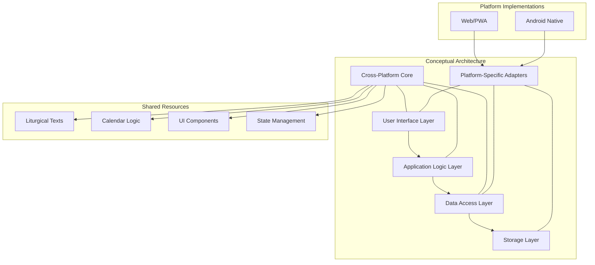

### 1.2 Core Principles

1. **Platform Agnosticism**: Core business logic must function identically across all platforms
2. **Dependency Injection**: Platform-specific implementations injected into core logic
3. **Single Source of Truth**: Shared data models and state management
4. **Progressive Enhancement**: Base functionality works everywhere, enhanced where supported
5. **Offline-First**: All critical functionality works without network connectivity

### 1.3 Architectural Patterns

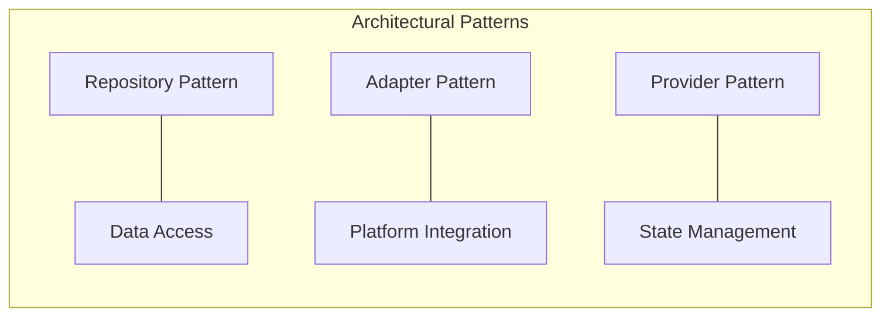

## 2. Detailed System Design

### 2.1 Module Structure

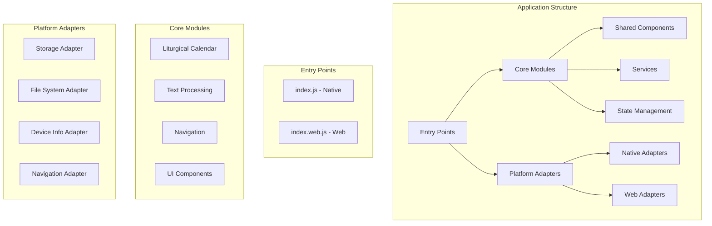

### 2.2 Data Model

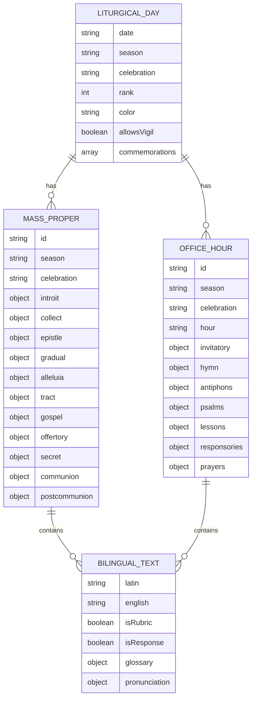

### 2.3 Component Hierarchy

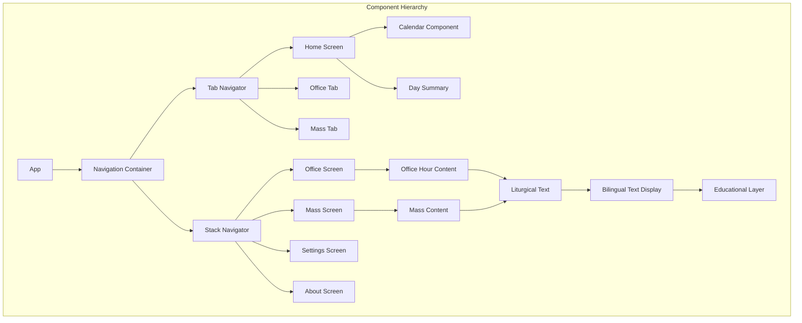

### 2.4 State Management

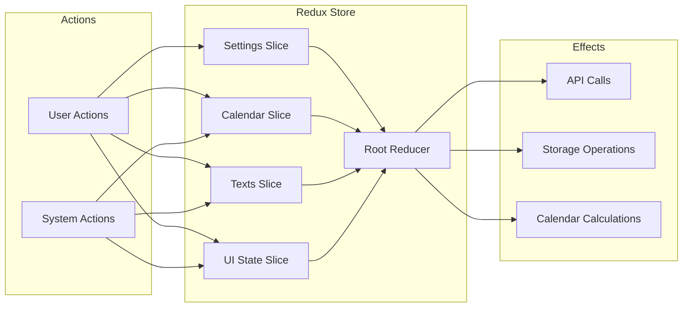

## 3. Platform-Specific Implementations

### 3.1 Storage Implementation

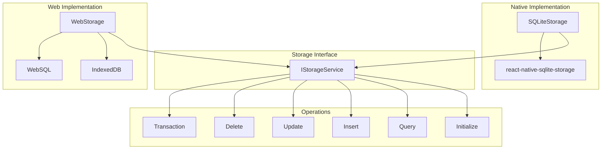

### 3.2 File System Implementation

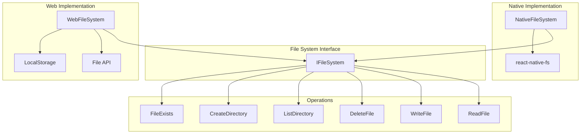

### 3.3 Device Information

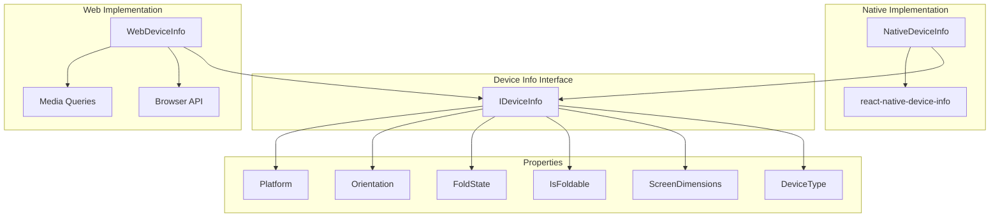

## 4. Implementation Sequence Diagram

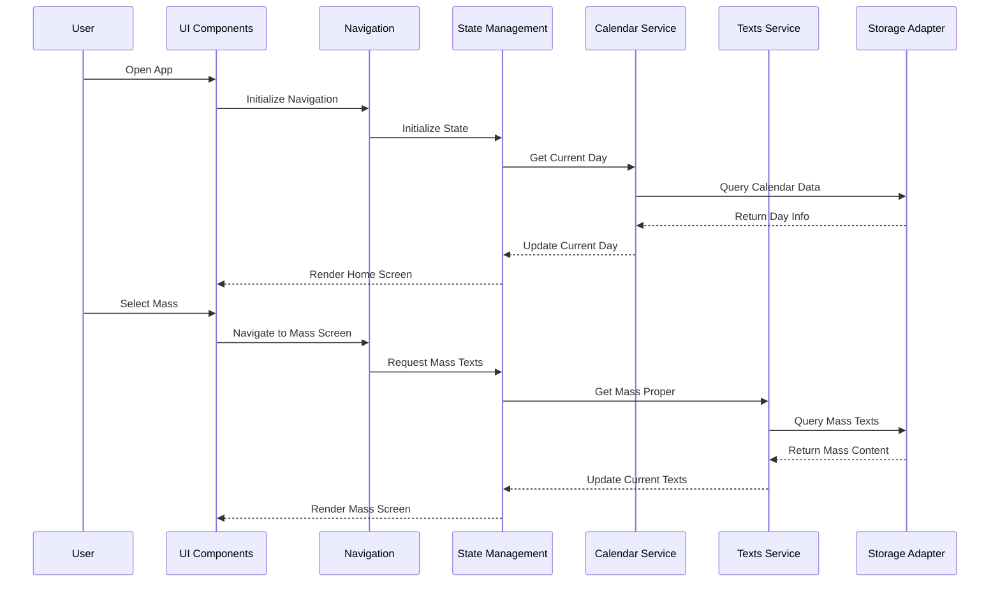

## 5. Migration Strategy

### 5.1 Data Migration Flow

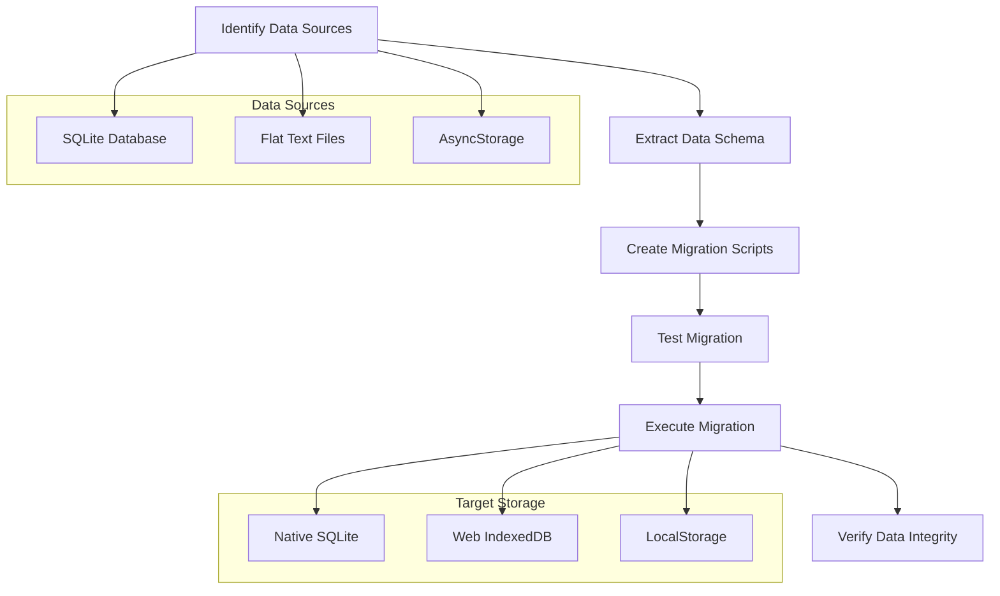

### 5.2 Code Migration Strategy

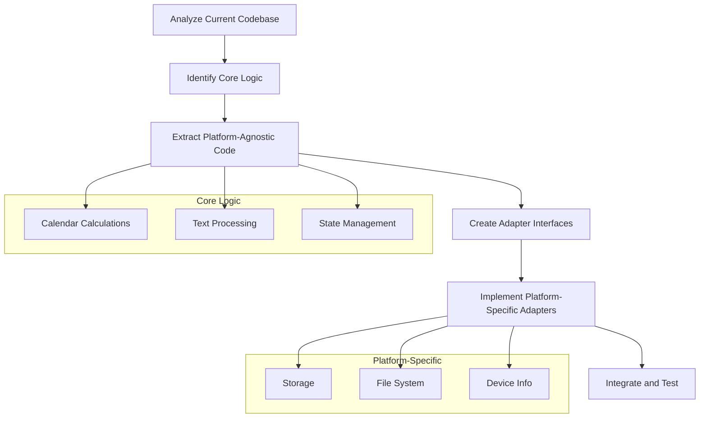

## 6. Technical Implementation Details

### 6.1 Database Schema

```sql
-- Liturgical Calendar Table
CREATE TABLE IF NOT EXISTS calendar_days (
  id INTEGER PRIMARY KEY AUTOINCREMENT,
  date TEXT NOT NULL,
  season TEXT NOT NULL,
  celebration TEXT,
  rank INTEGER NOT NULL,
  color TEXT NOT NULL,
  allows_vigil INTEGER NOT NULL,
  commemorations TEXT
);

-- Mass Texts Table
CREATE TABLE IF NOT EXISTS mass_texts (
  id INTEGER PRIMARY KEY AUTOINCREMENT,
  season TEXT NOT NULL,
  celebration TEXT,
  part TEXT NOT NULL,
  latin TEXT NOT NULL,
  english TEXT NOT NULL,
  is_rubric INTEGER DEFAULT 0,
  is_response INTEGER DEFAULT 0
);

-- Office Texts Table
CREATE TABLE IF NOT EXISTS office_texts (
  id INTEGER PRIMARY KEY AUTOINCREMENT,
  season TEXT NOT NULL,
  celebration TEXT,
  hour TEXT NOT NULL,
  part TEXT NOT NULL,
  latin TEXT NOT NULL,
  english TEXT NOT NULL,
  is_rubric INTEGER DEFAULT 0,
  is_response INTEGER DEFAULT 0
);

-- Glossary Table
CREATE TABLE IF NOT EXISTS glossary (
  id INTEGER PRIMARY KEY AUTOINCREMENT,
  term TEXT NOT NULL,
  definition TEXT NOT NULL,
  pronunciation TEXT,
  category TEXT NOT NULL
);
```
