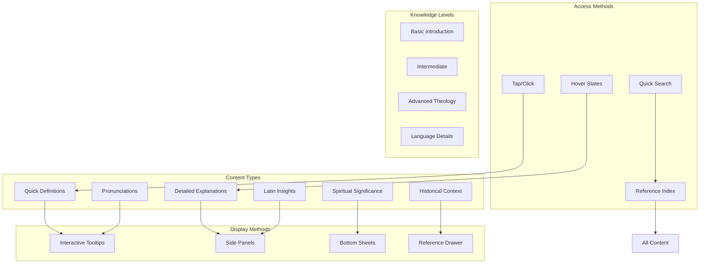
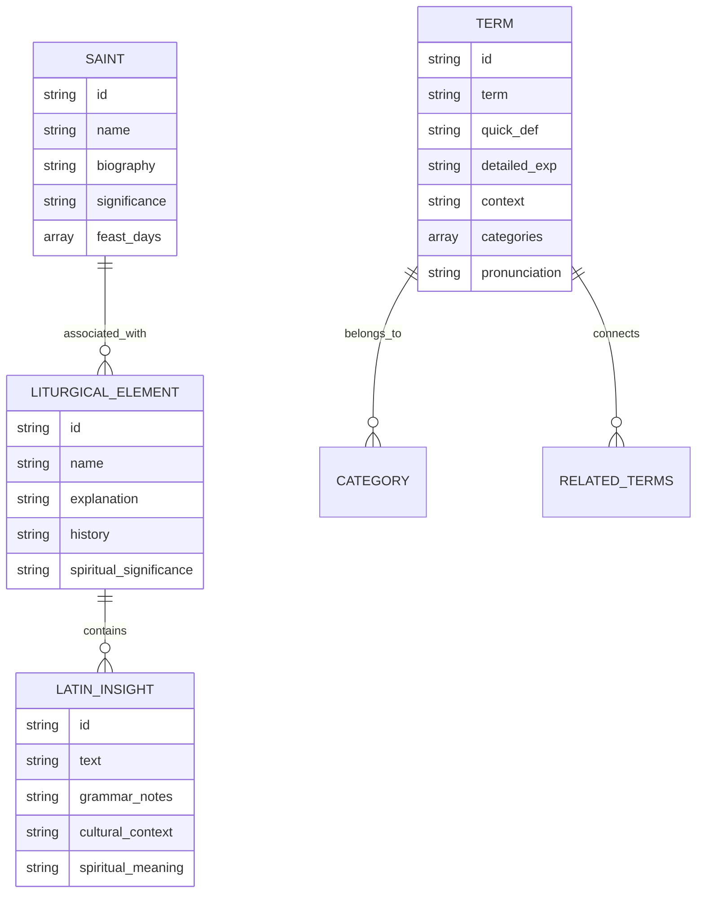
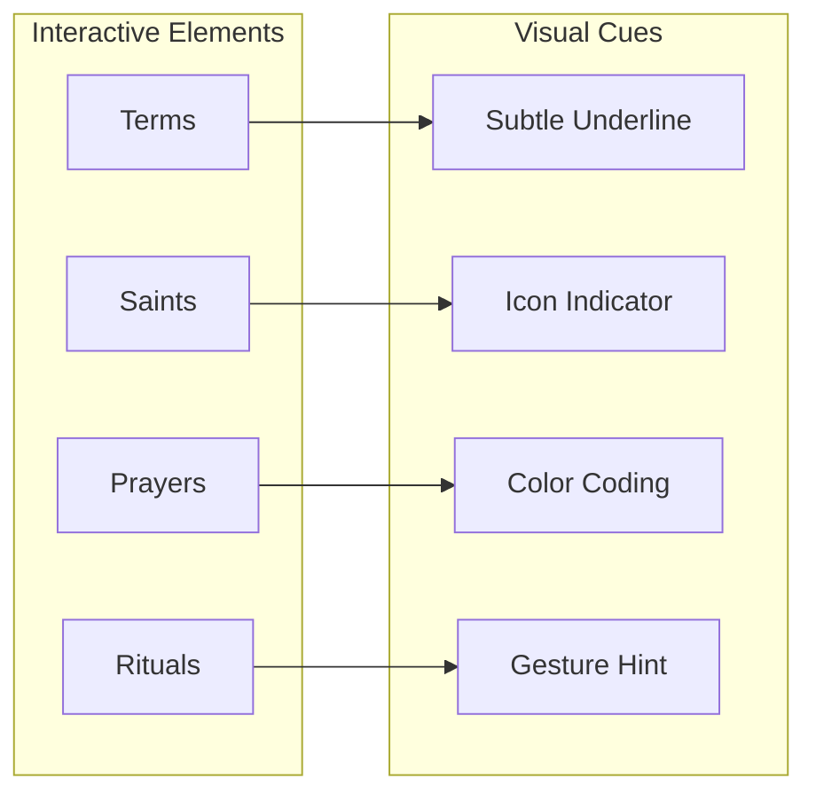

# Sanctissi-Missa - Modern Architecture

(C)2025 Robin L. M. Cheung, MBA
# Sanctissi Missa Architecture

## Repository Structure

This document outlines the architectural decisions and structure of the Sanctissi Missa project.

### Overview

The project is organized as a parent repository with two key submodules:

```
sanctissi-missa/
├── reference/                 # Original Divinum Officium (Perl)
├── typescript-app/           # Modern TypeScript Implementation
└── docs/                    # Project Documentation
```

### Design Decisions

#### 1. Parent Repository Pattern
- Main repository serves as an organizational wrapper
- Maintains clear separation between reference and implementation
- Provides centralized documentation and project management

#### 2. Submodule Structure
- **Reference Implementation** (`/reference`)
  - Original Divinum Officium Perl codebase
  - Used solely as functional reference
  - Maintains clear licensing boundaries
  
- **TypeScript Implementation** (`/typescript-app`)
  - Clean-room implementation in TypeScript/React Native
  - Modern architecture and development practices
  - Independent, non-derivative codebase

#### 3. Clean Room Implementation
- Complete separation from original codebase
- Independent development approach
- Modern architectural patterns
- TypeScript/React Native stack

#### 4. Documentation Strategy
- Centralized documentation in `/docs`
- Clear architectural guidelines
- Development standards and practices
- API documentation

## Implementation Details

### Technology Stack
- TypeScript
- React Native
- Modern development tools and practices

### Development Guidelines
1. Maintain strict separation between reference and implementation
2. Document all major architectural decisions
3. Follow modern development practices
4. Maintain comprehensive test coverage

## License and Attribution

Copyright (C)2025 Robin L. M. Cheung, MBA

All rights reserved.

This architecture ensures clear separation between the reference implementation and our modern rewrite, maintaining proper licensing boundaries while enabling efficient development.

## Educational Layer Architecture



## Educational Content Structure



## Interactive Elements Implementation

### Visual Indicators



## Educational Features Checklist

### 1. Content Accessibility

| Feature | Status | Rationale | Priority |
|---------|---------|-----------|-----------|
| Interactive Terms | 🔲 | Enable quick understanding of Latin terms | High |
| Saint Information | 🔲 | Provide context for feast days | High |
| Liturgical Explanations | 🔲 | Clarify ritual significance | High |
| Latin Insights | 🔲 | Bridge language understanding | High |

### 2. User Interface Elements

| Feature | Status | Rationale | Priority |
|---------|---------|-----------|-----------|
| Tooltip System | 🔲 | Quick access to definitions | High |
| Side Panel | 🔲 | Detailed explanations | High |
| Bottom Sheet | 🔲 | Mobile-friendly deep dives | High |
| Reference Drawer | 🔲 | Comprehensive resource access | Medium |

### 3. Learning Progression

| Feature | Status | Rationale | Priority |
|---------|---------|-----------|-----------|
| Basic Definitions | 🔲 | Entry-level understanding | High |
| Detailed Context | 🔲 | Deeper comprehension | Medium |
| Theological Insights | 🔲 | Advanced understanding | Medium |
| Pronunciation Guide | 🔲 | Proper Latin pronunciation | High |

## Technical Implementation

### Content Management

1. **Metadata System**
   - Term tagging
   - Difficulty levels
   - Related content links
   - Context markers

2. **Loading Strategy**
   - Progressive loading
   - Preload common terms
   - Background fetching
   - Offline availability

3. **Interaction Handling**
   - Touch/click detection
   - Gesture recognition
   - View state management
   - History tracking

## User Experience Guidelines

### Progressive Disclosure

1. **Level 1: Quick Access**
   - Brief definitions
   - Basic context
   - Essential pronunciation
   - Quick navigation

2. **Level 2: Detailed Information**
   - Historical background
   - Theological context
   - Latin grammar insights
   - Related references

3. **Level 3: Deep Understanding**
   - Scholarly resources
   - Cross-references
   - Theological implications
   - Cultural context

### Visual Design

1. **Interactive Indicators**
   - Subtle underlining for terms
   - Icon system for content types
   - Color coding for categories
   - Clear touch targets

2. **Content Display**
   - Clean, readable layout
   - Proper hierarchy
   - Consistent styling
   - Responsive design

## Performance Considerations

| Metric | Target | Rationale |
|--------|---------|-----------|
| Tooltip Display | < 100ms | Immediate feedback |
| Content Load | < 500ms | Smooth interaction |
| Search Response | < 200ms | Quick reference |
| Offline Access | 100% | Full functionality |

This educational layer enhances the user's understanding and appreciation of the Traditional Latin Mass and Divine Office while maintaining a focus on the primary liturgical content. The implementation prioritizes intuitive discovery and seamless learning without overwhelming the user.

[Previous content continues unchanged...]
