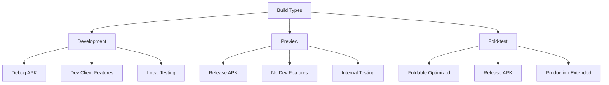

# Development Build Process

This document outlines the process for creating a development build of the Sanctissi Missa application for testing and debugging purposes.

## Prerequisites

- Node.js and npm installed
- Expo CLI (`eas-cli`) installed
- Android development environment configured
- Physical device or emulator for testing

## Build Types Available

The application supports three types of builds:



## Development Build Process

### 1. Environment Setup

```bash
# Install/update dependencies
npm install
```

Verify that all required tools are installed:
- Node.js
- npm
- eas-cli
- Android development tools

### 2. Pre-build Verification

Run the following checks to ensure code quality:

```bash
# TypeScript type checking
npm run type-check

# Linting
npm run lint

# Optional: Code formatting
npm run format
```

### 3. Build Process

1. Generate native code:
```bash
npm run prebuild
```

2. Create development build:
```bash
eas build -p android --profile development
```

This will:
- Create a debug APK
- Include development client features
- Enable debugging capabilities
- Configure for internal distribution

### 4. Verification

After the build completes:
1. Install the generated APK on your test device
2. Verify that development client features are working
3. Test debugging capabilities
4. Confirm hot reload functionality

## Build Configuration

The development build profile is configured in `eas.json`:

```json
{
  "development": {
    "developmentClient": true,
    "distribution": "internal",
    "android": {
      "gradleCommand": ":app:assembleDebug",
      "buildType": "apk"
    }
  }
}
```

## Troubleshooting

Common issues and solutions:

1. Build fails with dependency errors:
   - Run `npm install` to update dependencies
   - Clear metro cache: `expo start -c`

2. Android build issues:
   - Verify Android SDK installation
   - Check gradle configuration
   - Run `expo clean`

3. Development client not connecting:
   - Ensure device and development machine are on same network
   - Check metro bundler is running
   - Verify correct development server URL

## Additional Resources

- [Expo Development Build Documentation](https://docs.expo.dev/development/create-development-builds/)
- [EAS Build Documentation](https://docs.expo.dev/build/introduction/)
- [Android Development Setup](https://reactnative.dev/docs/environment-setup)