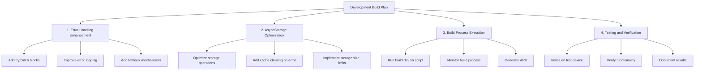

# Development Build Plan - April 7, 2025

## Overview

This document outlines the plan for proceeding with the development build of the Sanctissi-Missa application, addressing the AsyncStorage issue and ensuring proper functionality on foldable devices like the Z-Fold.

## Current Status Assessment

- AsyncStorage is already at version 1.21.0 in package.json, which should address the compatibility issue
- The build process documentation is in place (BUILD.md and BUILD-IMPLEMENTATION.md)
- Build scripts have been created (build-dev.sh and verify-dev-build.sh)
- The LiturgicalText component has been updated to display the Latin day name
- The app loads on Z-Fold devices but encounters errors when trying to load content

## Root Cause Analysis

Based on the code review, the issues when loading content on the Z-Fold are likely related to:

1. AsyncStorage operations in the PrerenderedContent and DataManager classes
2. Potential issues with the initialization process in the DataManager
3. Possible errors in the calendar data retrieval or rendering

## Implementation Plan

### Phase 1: Error Handling Enhancement

1. **Improve Error Handling in PrerenderedContent**
   - Add more robust try/catch blocks
   - Implement fallback mechanisms when content loading fails
   - Add detailed error logging

2. **Enhance DataManager Initialization**
   - Add recovery mechanism if initialization fails
   - Implement progressive loading to avoid overwhelming the device
   - Add timeout handling for long-running operations

### Phase 2: AsyncStorage Optimization

1. **Optimize Storage Operations**
   - Implement batch operations where possible
   - Add retry logic for failed storage operations
   - Implement storage size checks before saving large objects

2. **Add Cache Management**
   - Implement automatic cache clearing on error
   - Add manual cache clearing option in the UI
   - Set reasonable size limits for cached content

### Phase 3: Build Process Execution

1. **Prepare Environment**
   - Ensure all dependencies are installed
   - Verify EAS CLI configuration
   - Check for uncommitted changes

2. **Execute Build**
   - Run the build-dev.sh script
   - Monitor the build process for errors
   - Generate the development APK

### Phase 4: Testing and Verification

1. **Device Testing**
   - Install the APK on the Z-Fold device
   - Test the application on different screen configurations
   - Verify that content loads correctly

2. **Documentation**
   - Update the CHECKLIST-AsyncStorage-7apr2025.md with results
   - Document any remaining issues or limitations
   - Plan next steps based on testing results

## Success Criteria

- The development build (APK) is successfully generated
- The application installs and runs on the Z-Fold device
- Content loads correctly without errors
- The Latin day name displays properly in the UI
- AsyncStorage operations work reliably

## Fallback Plan

If issues persist after implementing the above plan:

1. Implement a simplified storage mechanism that doesn't rely on complex AsyncStorage operations
2. Reduce the amount of prerendered content to minimize storage requirements
3. Add a "safe mode" that disables prerendering and loads content on demand

## Next Steps After Successful Build

1. Comprehensive testing on various devices
2. Performance optimization for foldable devices
3. UI refinements for different screen configurations
4. Preparation for production build