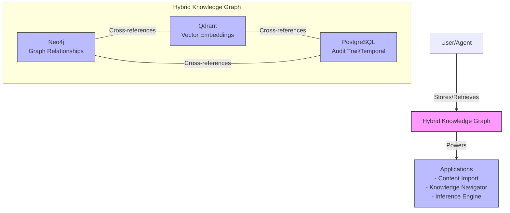
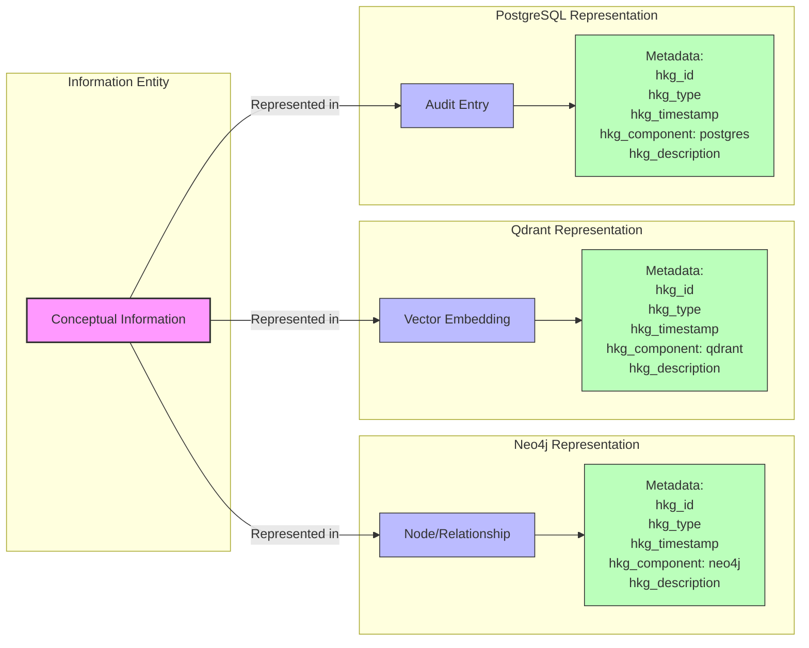
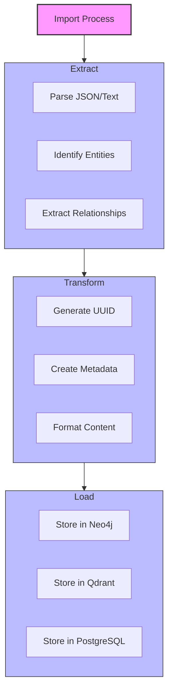

# Hybrid Knowledge Graph (hKG) Architecture

**Document ID:** c28e97ee-bf19-4cc6-bfe5-07d7d0cd92d3  
**Created:** April 7, 2025  
**Author:** Augment Agent  
**Version:** 1.0

## Overview

The hybrid Knowledge Graph (hKG) architecture integrates three complementary database systems to create a powerful knowledge representation framework. Each system provides a different perspective on the same information, enabling richer inference and cross-validation.

## Core Components



## Integration Pattern

The key to the hKG architecture is the consistent use of unique identifiers across all three systems, allowing for cross-referencing and unified querying.



## Unique ID Convention

Each piece of information in the hKG is assigned a unique identifier that ties together its representations across all three systems.

### ID Format

- **Format:** UUID v4
- **Example:** `c28e97ee-bf19-4cc6-bfe5-07d7d0cd92d3`

### Standard Metadata Fields

| Field | Description | Example |
|-------|-------------|---------|
| `hkg_id` | Unique identifier (UUID v4) | `c28e97ee-bf19-4cc6-bfe5-07d7d0cd92d3` |
| `hkg_type` | Type of information | `document`, `task`, `concept`, `pattern` |
| `hkg_timestamp` | Creation timestamp (ISO 8601) | `2025-04-07T11:35:00Z` |
| `hkg_component` | System identifier | `neo4j`, `qdrant`, `postgres` |
| `hkg_description` | Brief description | `Architecture document for hybrid Knowledge Graph` |

## Schema for External Content Import

The following schema can be used for importing content from external sources like ChatGPT:



### ChatGPT Import Schema

```json
{
  "source": {
    "type": "chatgpt",
    "version": "4.0",
    "conversation_id": "conversation_123456789",
    "timestamp": "2025-04-07T11:35:00Z"
  },
  "content": {
    "role": "assistant",
    "message": "The actual content from ChatGPT...",
    "tokens": 1024
  },
  "metadata": {
    "hkg_id": "c28e97ee-bf19-4cc6-bfe5-07d7d0cd92d3",
    "hkg_type": "conversation",
    "hkg_timestamp": "2025-04-07T11:35:00Z",
    "hkg_description": "ChatGPT conversation about hybrid Knowledge Graph",
    "tags": ["knowledge_graph", "architecture", "import"],
    "context": "User asked about knowledge graph architecture"
  },
  "entities": [
    {
      "name": "Knowledge Graph",
      "type": "concept",
      "mentions": [{"start": 10, "end": 25}]
    }
  ],
  "relationships": [
    {
      "from": "ChatGPT",
      "to": "Knowledge Graph",
      "type": "explains",
      "context": "Explanation of knowledge graph concepts"
    }
  ]
}
```

## Implementation Code

### Generate hKG ID

```javascript
/**
 * Generates a unique ID for hybrid Knowledge Graph integration
 * 
 * @param {string} type - The type of information (e.g., 'document', 'task', 'concept')
 * @param {string} description - Brief description of the information
 * @returns {Object} Object containing the ID and standard metadata
 */
function generateHKGID(type, description) {
  // Generate UUID v4
  const hkg_id = crypto.randomUUID();
  const timestamp = new Date().toISOString();
  
  return {
    hkg_id,
    hkg_type: type,
    hkg_timestamp: timestamp,
    hkg_description: description,
  };
}
```

### Store in hKG

```javascript
/**
 * Stores information across all three components of the hybrid Knowledge Graph
 * 
 * @param {string} type - The type of information
 * @param {string} description - Brief description of the information
 * @param {Object} neo4jData - Data to store in Neo4j
 * @param {Object} qdrantData - Data to store in Qdrant
 * @param {Object} postgresData - Data to store in PostgreSQL
 * @returns {string} The generated hkg_id
 */
async function storeInHKG(type, description, neo4jData, qdrantData, postgresData) {
  // Generate common metadata
  const metadata = generateHKGID(type, description);
  
  // Store in Neo4j
  const neo4jMetadata = { ...metadata, hkg_component: 'neo4j' };
  await storeInNeo4j(neo4jData, neo4jMetadata);
  
  // Store in Qdrant
  const qdrantMetadata = { ...metadata, hkg_component: 'qdrant' };
  await storeInQdrant(qdrantData, qdrantMetadata);
  
  // Store in PostgreSQL
  const postgresMetadata = { ...metadata, hkg_component: 'postgres' };
  await storeInPostgres(postgresData, postgresMetadata);
  
  return metadata.hkg_id;
}
```

## Benefits of the hKG Architecture

1. **Multiple Perspectives**: Each system provides a different view of the same information
2. **Cross-Validation**: Information can be validated across systems
3. **Rich Inference**: Relationships that aren't explicit in one system may be inferred from another
4. **Resilience**: Information is preserved even if one system fails
5. **Specialized Queries**: Each system excels at different types of queries

## Conclusion

The hybrid Knowledge Graph architecture provides a powerful framework for knowledge representation and retrieval. By maintaining consistent identifiers across Neo4j, Qdrant, and PostgreSQL, it enables rich cross-system inference and validation.
