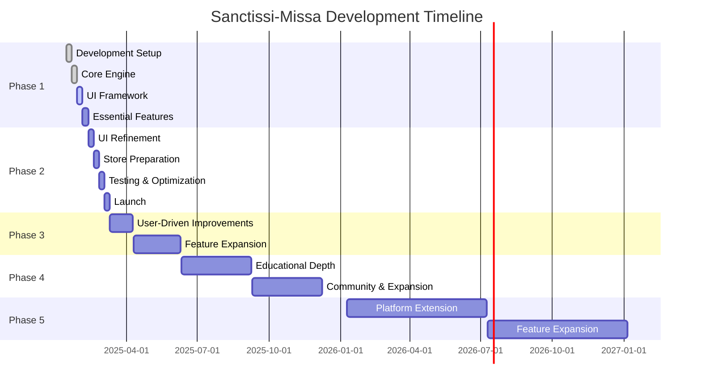

# Sanctissi-Missa - Development Roadmap

(C)2025 Robin L. M. Cheung, MBA. All rights reserved.

## Overview

This roadmap outlines the development strategy for the Sanctissi-Missa project, including short-term milestones, medium-term enhancements, and long-term vision. It serves as a strategic planning document that complements the more detailed implementation checklist.

## Phase 1: Core Implementation (Weeks 1-4)

### Objectives
- Establish solid technical foundation
- Implement essential liturgical functionality
- Create basic user interface
- Ensure offline functionality
- Set up development infrastructure

### Key Milestones

#### Week 1: Development Setup
- [X] Project initialization with React Native + Expo
- [X] TypeScript configuration
- [X] Development environment setup
- [X] Git repository initialization
- [ ] CI/CD pipeline configuration

#### Week 2: Core Engine
- [X] Calendar engine implementation
- [X] Liturgical date handling
- [X] Feast day system
- [X] Data layer (SQLite integration)
- [X] Offline storage solution

#### Week 3: UI Framework
- [X] Navigation system
- [X] Office/Mass selection screens
- [X] Settings interface
- [X] Dark/light mode
- [ ] Content rendering system

#### Week 4: Essential Features
- [ ] Basic educational features
- [ ] Simple annotations
- [ ] Bookmarking system
- [ ] Reading history
- [ ] Progress tracking

### Success Criteria
- Application successfully launches on Android devices
- Users can navigate between Mass and Office texts
- Calendar accurately calculates liturgical dates
- Content displays correctly in both Latin and English
- Application functions fully offline
- Dark/light mode switching works properly

## Phase 2: Polish and Store Preparation (Weeks 5-8)

### Objectives
- Enhance user experience
- Optimize performance
- Prepare for store submission
- Complete documentation
- Rigorous testing

### Key Milestones

#### Week 5: UI Refinement
- [ ] Navigation optimization
- [ ] Scrolling performance improvements
- [ ] Loading state implementations
- [ ] Visual design polish
- [ ] Animation additions

#### Week 6: Store Preparation
- [ ] Store assets creation
- [ ] Screenshots for various devices
- [ ] Feature graphic design
- [ ] Demo video production
- [ ] Documentation completion

#### Week 7: Testing & Optimization
- [ ] Comprehensive testing
- [ ] Performance optimization
- [ ] Device compatibility verification
- [ ] Offline functionality validation
- [ ] Battery usage optimization

#### Week 8: Launch
- [ ] Store submission preparation
- [ ] Analytics integration
- [ ] Crash reporting setup
- [ ] Support system establishment
- [ ] Initial release

### Success Criteria
- App Store and Google Play submission requirements met
- Performance metrics achieved:
  * App size < 50MB
  * Cold start < 2s
  * Content load < 1s
  * 100% offline support
- All critical bugs resolved
- High quality screenshots and store assets
- Complete user documentation

## Phase 3: Post-Launch Enhancements (Months 3-6)

### Objectives
- Respond to initial user feedback
- Add depth to educational features
- Enhance personalization options
- Improve performance further
- Expand platform support

### Key Milestones

#### Months 3-4: User-Driven Improvements
- [ ] Critical bug fixes based on user reports
- [ ] UI/UX improvements from feedback
- [ ] Performance optimization
- [ ] Enhanced educational features
- [ ] Advanced annotations system

#### Months 5-6: Feature Expansion
- [ ] Parish integration framework
- [ ] Video mass preparation
- [ ] Advanced bookmarking with categories
- [ ] Sharing capabilities
- [ ] Content export options
- [ ] iOS platform support

### Success Criteria
- User retention rate > 70%
- Average rating > 4.5 stars
- Crash-free sessions > 99.5%
- Daily active users growth trend
- Successful implementation of top 3 user-requested features
- Expansion to iOS platform

## Phase 4: Educational Enhancement (Months 7-12)

### Objectives
- Develop comprehensive educational layer
- Implement advanced Latin assistance
- Create immersive learning experience
- Build community features
- Expand content depth

### Key Milestones

#### Months 7-9: Educational Depth
- [ ] Comprehensive term definitions
- [ ] Historical context explanations
- [ ] Theological insights integration
- [ ] Latin pronunciation guides
- [ ] Interactive learning elements

#### Months 10-12: Community and Expansion
- [ ] User communities and sharing
- [ ] Prayer request integration
- [ ] Parish finder and integration
- [ ] Liturgical calendar events
- [ ] Content expansion beyond core texts

### Success Criteria
- Educational feature usage by > 60% of users
- Positive feedback on educational value
- Increased session duration
- Growth in daily/monthly active users
- Successful community engagement metrics

## Phase 5: Long-Term Vision (Year 2+)

### Objectives
- Platform expansion
- Advanced personalization
- Multimedia integration
- API for third-party integration
- Global language support

### Key Initiatives

#### Platform Extension
- [ ] Web application
- [ ] macOS/Windows desktop applications
- [ ] E-reader optimized versions
- [ ] Smart display integration

#### Feature Expansion
- [ ] Personalized liturgical assistant
- [ ] Audio recordings for pronunciations
- [ ] Video integration for ceremonies
- [ ] Virtual reality experiences
- [ ] Third-party API and integration options

#### Content Expansion
- [ ] Additional liturgical texts
- [ ] Expanded historical resources
- [ ] Scholarly references
- [ ] Multiple language support
- [ ] Regional variations

### Success Criteria
- Multi-platform availability
- Global user base
- Recognition as definitive digital resource for Traditional Latin Mass
- Sustainable user growth
- Stable, maintainable codebase

## Timeline Visualization

## Resource Allocation

| Phase | Development | Design | QA | Documentation | User Research |
|-------|-------------|--------|----|--------------|--------------------|
| 1     | 70%         | 15%    | 5% | 10%          | 0%                 |
| 2     | 40%         | 30%    | 20%| 10%          | 0%                 |
| 3     | 50%         | 20%    | 20%| 5%           | 5%                 |
| 4     | 45%         | 25%    | 15%| 10%          | 5%                 |
| 5     | 50%         | 20%    | 15%| 5%           | 10%                |

## Risk Assessment

| Risk | Impact | Probability | Mitigation |
|------|--------|-------------|------------|
| Development delays | High | Medium | Agile methodology with buffer periods |
| Technical debt | Medium | Medium | Regular refactoring, code reviews |
| User adoption challenges | High | Low | Beta testing, user feedback loops |
| Performance issues | Medium | Medium | Performance testing throughout development |
| Legal/licensing concerns | High | Low | Clean-room implementation, strict separation |

## Success Metrics

### Launch Metrics (Phase 2)
- Downloads: 1,000+ in first month
- Retention: 50%+ after one week
- Crash-free rate: 99%+
- Store rating: 4.0+

### Growth Metrics (Phase 3-4)
- Monthly Active Users: 20% growth month-over-month
- Retention: 70%+ after one month
- Feature engagement: 60%+ using educational features
- Store rating: 4.5+

### Long-term Metrics (Phase 5)
- Platform coverage: 4+ platforms
- Daily Active Users: 10,000+
- User satisfaction: 90%+ positive feedback
- Community engagement: 30%+ contributing content/feedback

## Conclusion

This roadmap provides a strategic vision for the Sanctissi-Missa project, from initial development through launch and long-term growth. It will be reviewed and updated quarterly to ensure alignment with user needs, technological advancements, and project goals. The immediate focus remains on completing Phase 1 and 2 to deliver a high-quality initial release on the Google Play Store within the 8-week timeline.