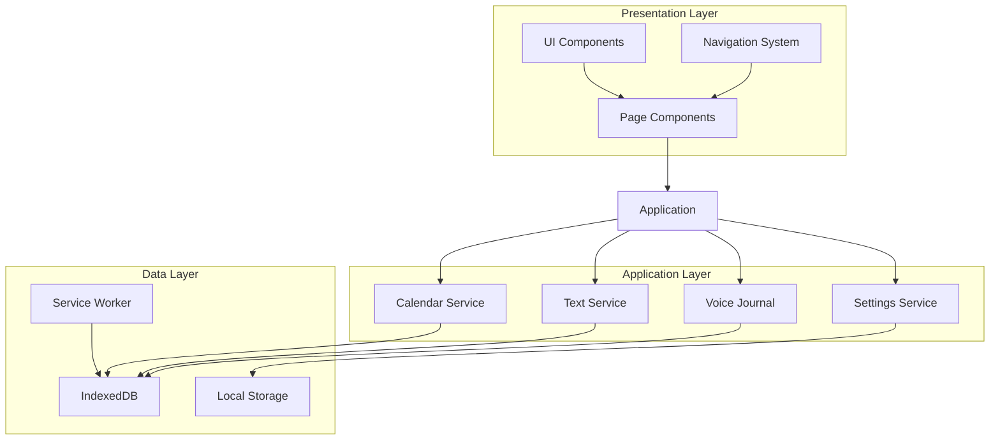
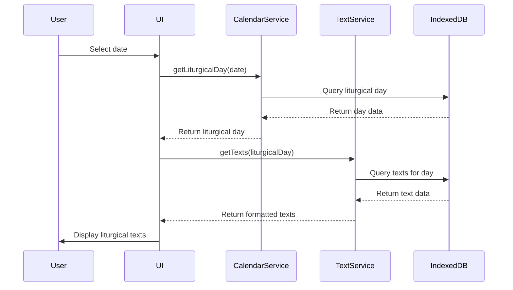

# SanctissiMissa - Web-First Architecture

(C)2025 Robin L. M. Cheung, MBA

## Overview

This document outlines the architectural approach for the web-first implementation of SanctissiMissa, focusing on creating a Progressive Web App (PWA) that provides access to traditional Latin liturgical texts across all devices.

## Web-First Approach Rationale

The web-first approach offers several advantages for the SanctissiMissa project:

1. **Cross-Platform Compatibility**: Immediate access on all devices with a web browser
2. **Faster Development Cycle**: Single codebase for all platforms
3. **Immediate Deployment**: No app store approval process
4. **Progressive Enhancement**: Start with core functionality and progressively add features
5. **Offline Capabilities**: Modern PWA features enable offline access to liturgical texts

## Technical Architecture



## Project Structure

```
src/
├── components/        # Reusable UI components
│   ├── calendar/      # Calendar-related components
│   ├── texts/         # Text display components
│   ├── prayers/       # Prayer components
│   └── common/        # Shared UI elements
├── hooks/             # Custom React hooks
├── services/          # Core application services
│   ├── calendar/      # Liturgical calendar logic
│   ├── database/      # IndexedDB implementation
│   ├── texts/         # Text processing and loading
│   └── voice/         # Voice recording and playback
├── models/            # TypeScript interfaces and types
├── pages/             # Page components
├── utils/             # Utility functions
└── assets/            # Static assets
```

## Core Services

### 1. Liturgical Calendar Service

The calendar service is the foundation of the application, responsible for:

- Calculating the liturgical year based on Easter date
- Determining the proper liturgical day for any given date
- Handling the complex precedence rules between feasts
- Managing the temporal and sanctoral cycles

```typescript
// Key interfaces
interface LiturgicalDay {
  date: string;
  season: string;
  celebration: string;
  rank: number;
  color: string;
  commemorations: string[];
  isHolyDay: boolean;
  isFeastDay: boolean;
}

interface LiturgicalSeason {
  id: string;
  name: string;
  startDate: string;
  endDate: string;
  color: string;
}
```

### 2. Text Service

The text service manages the liturgical texts:

- Loading appropriate texts for a given liturgical day
- Handling bilingual display (Latin/English)
- Managing text formatting and display options
- Supporting search functionality

```typescript
// Key interfaces
interface LiturgicalText {
  id: string;
  type: 'mass' | 'office' | 'devotion' | 'prayer';
  date?: string;
  season?: string;
  celebration?: string;
  part: string;
  latin: string;
  english: string;
  rubrics?: string;
  notes?: string;
}
```

### 3. Database Service

The database service provides:

- IndexedDB schema and access methods
- Data import and migration utilities
- Offline data synchronization
- Efficient query patterns for liturgical texts

### 4. Voice Journal Service

The voice journal service enables:

- Recording personal reflections on liturgical texts
- Organizing recordings by liturgical day or season
- Secure storage of personal recordings
- Optional transcription of voice to text

## Progressive Web App Features

### 1. Offline Functionality

- Service worker for caching liturgical texts
- IndexedDB for structured data storage
- Manifest file for home screen installation
- Background sync for journal entries

### 2. Responsive Design

- Mobile-first approach
- Adaptive layouts for different screen sizes
- Touch-optimized interface
- Support for foldable devices

### 3. Performance Optimization

- Code splitting for faster initial load
- Lazy loading of non-essential components
- Efficient data access patterns
- Optimized assets for mobile devices

## Data Flow Architecture



## Implementation Priorities

1. **Core Calendar Engine** - The foundation of the application
2. **Database Schema and Import** - Structure for liturgical texts
3. **Basic UI Components** - Essential interface elements
4. **Text Display System** - Rendering liturgical texts
5. **PWA Configuration** - Offline capabilities
6. **Voice Journal** - Personal reflection recordings

## Performance Targets

| Feature | Target | Measurement |
|---------|--------|-------------|
| Initial Load | < 2s | Time to interactive |
| Calendar Navigation | < 200ms | Time to display new day |
| Text Rendering | < 500ms | Time to display full text |
| Offline Availability | 100% | Core functionality without network |
| Voice Recording | < 100ms | Latency to start recording |

## Browser Compatibility

The application targets modern browsers with good PWA support:

- Chrome/Edge (full support)
- Firefox (good support)
- Safari (improving support)
- Mobile browsers (varies by platform)

## Conclusion

This web-first architecture provides a solid foundation for the SanctissiMissa project, enabling rapid development and deployment while ensuring a high-quality user experience across all devices. The progressive web app approach allows us to deliver core functionality quickly while progressively enhancing the application with more advanced features.
