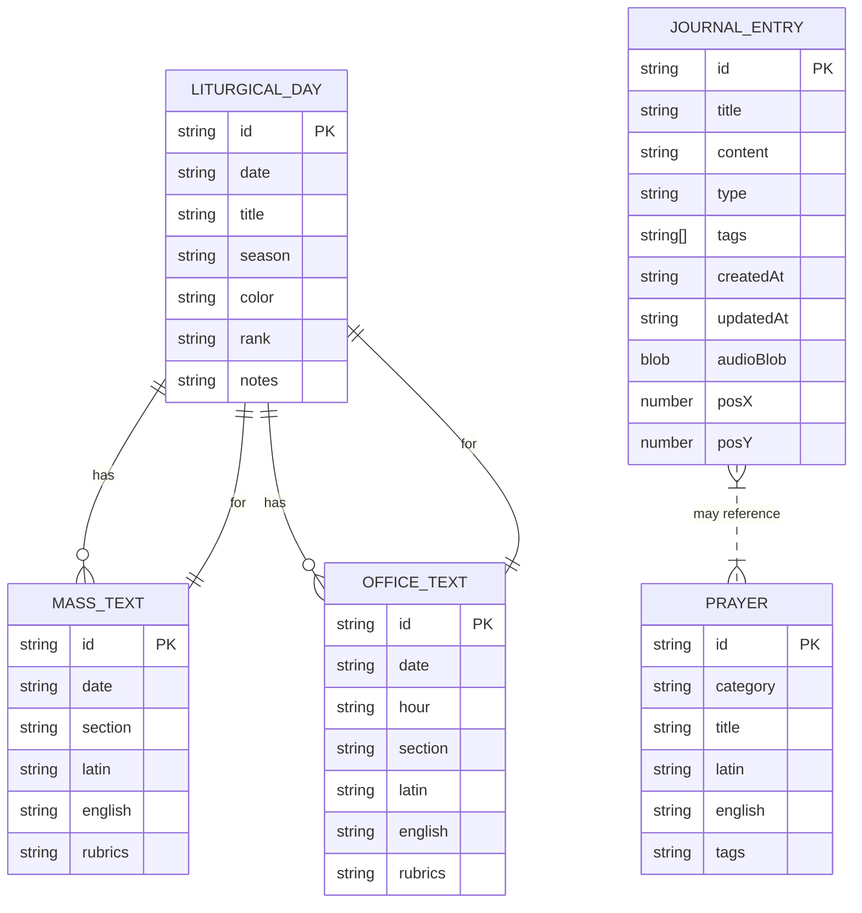

# Data Conversion: Flat Text to Relational Schema (ERD)

## Pre-Relational (Flat Text)
- **liturgical_days.txt:**  `date|title|season|color|rank|notes`
- **mass_texts.txt:**       `date|section|latin|english|rubrics`
- **office_texts.txt:**     `date|hour|section|latin|english|rubrics`
- **prayers.txt:**          `id|category|title|latin|english|tags`
- **journal_entries.txt:**  `id|title|content|type|tags|createdAt|updatedAt|audioBlob`

---

## Relational/IndexedDB (Current Schema)

---

**Legend:**
- Each box = an object store/table in IndexedDB.
- PK = Primary Key.
- Relationships show how Mass/Office texts are linked to liturgical days, and how journal entries may reference prayers.
